# concat.pro 产品深度体验报告

## 报告信息

| 项 | 内容 |
|---|---|
| 产品名称 | concat.pro |
| 产品 URL | https://concat.pro/ |
| 体验时间 | 2026-06-20T09:14:41.951678 |

---

## 目录

- [1. 核心结论](#1-核心结论)
  - [1.1 一句话判定](#11-一句话判定)
  - [1.2 主要风险](#12-主要风险)
  - [1.3 主要亮点](#13-主要亮点)
  - [1.4 综合评分](#14-综合评分)
- [2. 产品概览](#2-产品概览)
  - [2.1 基础信息](#21-基础信息)
  - [2.2 测点速览](#22-测点速览)
  - [2.3 产品 / 公司背景信息](#23-产品--公司背景信息)
  - [2.4 产品定位与策略](#24-产品定位与策略)
  - [2.5 公司基本信息](#25-公司基本信息)
- [3. 体验流程记录](#3-体验流程记录)
  - [3.1 官网叙事分析](#31-官网叙事分析)
  - [3.2 测点流程详情](#32-测点流程详情)
- [4. 第三方社区反馈](#4-第三方社区反馈)
- [5. 从访客到注册的转化路径](#5-从访客到注册的转化路径)

---

## 1. 核心结论

### 1.1 一句话判定

目标产品 **https://concat.pro/** 在本次深度体验中：存在显著的功能信息缺口。详见 §3 体验流程记录。

### 1.2 主要风险

1. **[C5]** P1 关键交付边界未界定，直接影响购买决策："Ad Agent – Generate and publish ad creatives" 的 **publish 投向哪些广告平台**（Meta / Google / TikTok？）、是否真能代投放，完全未提；"Website Agent – Diagnose and improve website" 的 improve 是仅给建议还是直接改站，同样模糊。这类"生成建议 vs 真正执行落地"的差异是产品价值的核心，属关键功能描述缺失。
2. **[C7]** P1 作为 Help/Documentation 测点，实际帮助/文档内容缺失**：此页（C7）抓到的几乎全是落地页营销文案，没有任何使用文档、上手指南、FAQ、API 文档或知识库。"Resources" 下只有 Blog、Ranking 和一组免费计算器（CPM/CTR/转化率/毛利/WHOIS 等），这些是获客型工具而非"如何使用本产品"的操作文档——想学怎么用、怎么配置 Agent 的用户在这里找不到答案。
3. **[C8]** P1 无法回答"这个产品能为我做什么"**：单独读这一页，用户既不知道产品名称、所属领域，也无从得知它解决什么问题；缺少哪怕一条指向首页或功能总览的入口，导致功能认知链路在此中断。

### 1.3 主要亮点

1. **[C5]** ✅ Footer 的 Products 区把产品的**完整 agent 矩阵**一次铺开（7 个 agent + 每个一句话能力），实际充当了"产品能力地图"：Brand Agent（建品牌记忆）→ Report / Creator / SEO-GEO / Website / Ad Agent（并行执行）→ Data Agent（数据回流学习），清晰勾出"输入网站 → 多 agent 并行 → 性能数据反哺"的闭环工作流。仅看 footer，用户就能判断这是一个覆盖营销全链路的多 agent 套件，而非单点工具。
2. **[C5]** ✅ "SEO/GEO Agent – Create content for search and AI answers" 明确点出 **GEO（面向 AI 回答的生成式引擎优化）** 这一差异化能力，把"为 AI 答案而非仅传统搜索创作内容"作为独立功能卖点，功能定位有信息量、可与同类 SEO 工具区隔。
3. **[C7]** ✅ 产品能力地图清晰**：页面完整揭示了 7 个 Agent 的功能分工（Brand/Report/Creator/SEO-GEO/Website/Ad/Data），并用"Brand Soul（品牌灵魂）→ 多 Agent 并行执行 → 一键发布 → 数据回流 → 沉淀为智能"的闭环讲清了核心工作流，读完能理解"这是一个端到端、会自我学习的 AI CMO"这一产品定位。

### 1.4 综合评分

| 维度 | 评分 | 1-2 句话说明（引用具体 [测点ID]） |
|---|---:|---|
| 产品方向清晰度 | 3.5 / 5 | "AI CMO + 多 Agent 闭环（Brand Soul → 7 Agent 并行 → 发布 → 数据回流）"的定位在 [M1][M3][C5][C7] 反复且一致地讲清楚了；但免费计算器与核心平台边界不清 [M2][M5][C5]，"不做什么"未界定，拉低清晰度。 |
| 价值主张表达力 | 3.5 / 5 | "虚拟营销团队 + 自学习飞轮"叙事被评为最有说服力的卖点，并有 GEO（面向 AI 答案）这一差异点 [M3][C5]；但多为概念层表述、缺乏证据，说服力打折。 |
| 信息架构 | 3.0 / 5 | Footer 把 7 个 Agent 能力一次铺清，充当能力地图 [C5]；但工具与产品混杂、无任何使用文档/FAQ/API 文档 [C7]，登录入口缺失 [C4]，404 无恢复路径 [C8]，多个子页内容与预期错配 [M2]。 |
| 功能广度与深度 | 3.0 / 5 | 广度强——7 Agent 覆盖品牌/报告/达人/SEO-GEO/网站/广告/数据全链路 + 7 个计算器 [C5][M1]；但深度普遍不足，6/7 个 Agent 仅一句动宾短语、输入输出机制不明 [C7][M3]，仅 Brand Agent 有具象产出页 [S1]。 |
| 核心能力可信度 | 2.5 / 5 | 核心卖点缺证据：数据回流/学习闭环机制空泛 [M1][M3]、Brand Soul 只有概念无机制 [M1]、集成清单全缺 [C7][M6]、Creator Agent 自相矛盾 [M3]、Telegram/WhatsApp/Slack 渠道零佐证 [M6]；仅 [S1] 用具体卡片证明了一项能力。 |
| 商业化清晰度 | 2.0 / 5 | 定价页解读失败、全程未捕获任何价格/套餐/计费单位信息 [C2]；且免费工具是否计入套餐未界定 [C5][C7]、存在 waitlist 门槛 [M1]，用户无法判断如何付费。 |
| **综合平均** | **3.0 / 5** | **定位与叙事是明显强项，但能力可信度与商业化清晰度短板拉低整体——一个"故事讲得好、证据给得少、价格说不清"的 AI CMO 平台。** |

---

## 2. 产品概览

### 2.1 基础信息

- **URL**: https://concat.pro/
- **首屏标题**: Products
Brand Agent
Build brand memory from website
Report Agent
Generate deep 

### 2.2 测点速览

本次共体验 27 个测点。

> 🟢 该产品未检测到登录入口，本报告为完整体验。

### 2.3 产品 / 公司背景信息

_本次未发现产品 / 公司的官方介绍页面。_

### 2.4 产品定位与策略

### 1. 把产品当成一支"虚拟营销团队"来卖，而不是一个工具
**核心判断**: 产品的根本定位是「AI CMO」——一支由 7 个分工明确的虚拟营销 Agent 组成的团队，覆盖营销全链路，而非某个单点生成工具。
**支撑证据**: 
- [M1] 页面揭示 Concat 是"AI CMO"式的多 Agent 协同系统，7 个垂直 Agent（品牌/报告/达人/SEO-GEO/网站/广告/数据）并行执行
- [C5] 仅看 footer 用户就能判断这是一个覆盖营销全链路的多 agent 套件，而非单点工具
- [C7] 读完能理解"这是一个端到端、会自我学习的 AI CMO"这一产品定位
**对用户的含义**: 用户买的是"一整支营销团队"的心智，期待它接管从洞察到投放的全流程，而不是只解决某一道工序。

### 2. 所有能力都围绕一个统一的"品牌记忆"底座来组织
**核心判断**: 产品用 Brand Soul（品牌记忆）作为中枢底座，让所有 Agent 都从同一套品牌认知出发，而不是把功能做成互相独立的零散工具。
**支撑证据**: 
- [M1] Brand Soul 被反复强调是 "every agent builds from" 的创意底座，是整个产品的根基
- [S1] Brand Agent 输入网站 URL，输出结构化"品牌记忆"（Colors/Fonts/Slogan/Products/Vibes/Audience）供复用
- [M3] Brand Soul 作为创意底座 → 多 Agent 并行执行的闭环主线
**对用户的含义**: 用户只需喂一次品牌信息，就能让所有 Agent 共享一致的品牌调性；但这套底座如何生成、能否查看与纠偏目前并不透明，是用户最该知道却缺失的一环。

### 3. 把"输入一个网站网址"当作唯一入口，主动收窄到已有官网的品牌
**核心判断**: 产品以"喂一个网站 URL"作为统一起点来构建品牌记忆，等于把目标用户收窄为已有官网的成长型品牌（典型是 DTC / 电商）。
**支撑证据**: 
- [S1] Brand Agent 的输入明确就是网站 URL，输出由此提取
- [M1] "No website yet? Join our waitlist" 暗示产品强依赖既有网站作为唯一入口
- [M3] 导航提示 "from website"，即以喂网址为主要构建方式
**对用户的含义**: 已有官网的品牌可以开箱即用，但还没建站的早期团队基本被挡在门外，只能加入等待名单。

### 4. 主打"发布后数据回流、越用越聪明"的闭环，而不是一次性生成内容
**核心判断**: 核心卖点是"生成 → 一键发布 → 表现数据回流 → 沉淀为智能反哺各 Agent"的自学习闭环（数据复利），以此区别于只做一次性内容生成的工具。
**支撑证据**: 
- [M3] 完整的"Brand Soul → 多 agent 并行 → 一键发布 → 性能数据回流 → 转化为情报反哺各 agent 并随时间复利"自学习闭环
- [M1] Data Agent "analyzes what worked, sends the right signals back to each agent"，把表现转成 intelligence
- [M6] 页面传达"连接社媒 → 一键发布 → 表现数据回灌 AI CMO"的发布-回流能力
**对用户的含义**: 卖点是"用得越久越聪明"的飞轮；但目前机制偏抽象，没有具体例子说明一次"学习"到底改了哪个 Agent 的哪个决策，价值能否兑现需进一步验证。

### 5. 押注"为 AI 答案创作内容"这一新方向，和传统搜索优化工具拉开差距
**核心判断**: 产品把 GEO（面向 AI 问答的生成式引擎优化）单列为卖点，强调"不只是为传统搜索、更是为 AI 答案创作内容"，以此与同类 SEO 工具区隔。
**支撑证据**: 
- [C5] "SEO/GEO Agent – Create content for search and AI answers" 明确点出 GEO 这一差异化能力
- [M3] SEO/GEO Agent 提到"为搜索和 AI 回答创作内容"
**对用户的含义**: 切中"AI 搜索时代内容如何被引用"的新需求，对前瞻型营销人有吸引力，但具体对接哪些 AI 引擎、怎么衡量效果尚未说明。

### 6. 用一批免费计算器做获客入口，和付费平台分成两层
**核心判断**: 产品在付费 Agent 平台之外，铺了一批免费小工具（CPM/CTR/毛利/ICP 打分/邮件检测等）作为获客入口，但这一层在叙事上与核心平台基本割裂。
**支撑证据**: 
- [M2] FAQ 把免费工具定位讲得很清楚——轻量、即时、获客向 top-of-funnel
- [M5] CPM Calculator 正文从头到尾未说明与 7 个 Agent 的任何关系，免费工具与产品核心能力完全脱节
- [C7] "Resources" 下只有 Blog、Ranking 和一组免费计算器，是获客型工具而非产品文档
**对用户的含义**: 用户很可能从某个计算器搜索落地、先免费试用，但因为两层之间没有衔接,免费工具的访客很难意识到背后其实是一个 AI CMO 平台,转化链路被浪费。

### 2.5 公司基本信息

#### ✅ 实体身份已确认

基于域名 + 产品自述 + 官网法律页 + LinkedIn 的交叉核对，目标产品 `concat.pro` 对应：
**CONVERGE AI PTE. LTD.**（运营品牌 "Converge AI"，新加坡）。

核心锚定证据：`concat.pro` 自家[隐私声明页](https://concat.pro/privacy)明确写明本服务由 **"CONVERGE AI PTE. LTD."** 提供与运营，并适用新加坡《个人数据保护法 2012》，联系邮箱为 `privacy@converge.ai`。该 `converge.ai` 域名为母品牌 [Converge AI](https://converge.ai/) 官网，其 [LinkedIn 公司页](https://www.linkedin.com/company/convergeai_linkedin/)登记官网为 converge.ai、总部新加坡。Concat Pro 与同门产品 [Enter Pro](https://enter.converge.ai/)、[Framia Pro](https://framia.converge.ai/) 共享 "X Pro" 命名与子域归属体系，确认为 Converge AI 旗下产品线之一。

#### 公司基础事实表

| 项 | 内容 | 置信度 | 来源 |
|---|---|---|---|
| 公司名称 | CONVERGE AI PTE. LTD.（品牌 Converge AI） | ✅ 直接 | [concat.pro/privacy](https://concat.pro/privacy) |
| 成立年份 | 2025（母公司 Converge AI 自报） | ⚠️ LinkedIn 自报，指母品牌 | [LinkedIn](https://www.linkedin.com/company/convergeai_linkedin/) |
| 总部地点 | 新加坡（Singapore） | ✅ | [concat.pro/privacy](https://concat.pro/privacy) · [LinkedIn](https://www.linkedin.com/company/convergeai_linkedin/) |
| 产品上线 | 未找到确切上线日期；隐私声明 "Last updated Jun 5, 2026" 表明产品近期在运营 | ⚠️ 间接推断 | [concat.pro/privacy](https://concat.pro/privacy) |
| 当前阶段 | 未公开（无公开融资披露） | ⚠️ 见下方融资说明 | — |
| 融资总额 | 未公开 / 未找到 | ❌→未找到 | — |
| 团队规模 | ~51–200 人（母品牌 Converge AI 自报区间） | ⚠️ 估算，含全产品线 | [LinkedIn](https://www.linkedin.com/company/convergeai_linkedin/) |
| 行业类别 | AI 营销 / 创作者经济（自述 "data-driven AI CMO"），LinkedIn 归类 Software Development | ✅ | [concat.pro](https://concat.pro/) · [LinkedIn](https://www.linkedin.com/company/convergeai_linkedin/) |

#### 融资历史

| 轮次 | 时间 | 金额 | 领投 + 主要参与方 | 来源指向本域名? |
|---|---|---|---|---|
| —（未找到任何与本实体挂钩的公开融资记录） | — | — | — | — |

> **重要排除性说明**：域名锚定搜索中出现大量"名称相似但实体不同"的公司，其融资**绝不可归属于本产品**：
> - **Convergence / Convergence.ai**（英国伦敦，$12M pre-seed，2025 年被 Salesforce 收购）——不同公司；
> - **Converge Bio**（AI 药物发现，$5.5M / $25M）——不同公司；
> - **Konverge.ai**（印度浦那，AI 咨询）、**Converge Technology / Converge Asia**（新加坡，但分别为 IT 咨询 / 电子元件批发，非本 AI 实体）——均不同公司。
>
> 截至检索，**未发现 CONVERGE AI PTE. LTD. 有任何公开融资披露**。当前阶段应记为"未公开"，不可据同名公司推断。

#### 创始人 / 核心团队背景

- **未找到 / 未公开** —— Converge AI 官网 [首页](https://converge.ai/) 与 [About 页](https://converge.ai/about) 均未列出创始人或高管姓名，公开报道亦无与本新加坡实体挂钩的创始人信息。
  - 验证：无任何 LinkedIn 个人页 / 新闻明确将某创始人与 `concat.pro` 或 CONVERGE AI PTE. LTD. 关联（⚠️ 未确认）。
  - ⚠️ 提示：搜索中出现的 Marvin Purtorab、Andy Toulis（Convergence.ai，英国）等创始人**属于同名异实体**，与本产品无关，请勿采信。

#### 近期重大动态（最近 6–12 个月）

- **2026-06-05**：`concat.pro` 隐私声明最近更新，集成涉及 Stripe（支付）、Supabase（后端）、Google Workspace 等，表明产品处于活跃运营/迭代期 [来源](https://concat.pro/privacy)（验证：本域名 ✅）
- **产品矩阵扩张**：母品牌 Converge AI 在 2025–2026 年间快速铺开多产品线——[Enter Pro](https://enter.converge.ai/)（AI 应用开发 agent）、[Framia Pro](https://framia.converge.ai/)（创作者视频/图像生成）、Converge Agent / Combos Fun 等，Concat Pro（AI CMO / 创作者营销）为其中之一 [来源](https://converge.ai/)（验证：母域名 ✅，concat.pro 经隐私页归属于同一实体 ✅）
- **规模自述**：Converge AI 官网称服务 "200K+ creators across 110+ countries" [来源](https://converge.ai/)（验证：⚠️ 官方自报、未经第三方核实，且为全品牌口径而非 Concat Pro 单品）
- **公开报道缺位**：未检索到 TechCrunch / VentureBeat 等主流媒体对本实体的独立报道（⚠️ 公司较新、对外披露少）

#### 综合判断

`concat.pro` 身份明确——它是新加坡公司 **CONVERGE AI PTE. LTD.（Converge AI）** 旗下定位为"数据驱动 AI CMO"的创作者营销产品，与 Enter Pro、Framia Pro 等共处同一多产品矩阵之下；该判断有官网法律页直接背书，可信度高。

资本与团队层面则**信息高度不透明**：公司成立于 2025 年、LinkedIn 自报 51–200 人规模，呈现"多产品快速并行铺开"的打法，但**无任何可核实的公开融资记录、无公开创始人/高管信息、无主流媒体独立报道**。需特别警惕的是该名称与多家已融资同名公司（英国 Convergence、Converge Bio 等）高度混淆——这些融资与团队**均不属于本实体**。因此对决策者而言：产品本身真实活跃、归属清晰且背靠一个产品线丰富的母品牌是其优势；但资方背景、财务实力与核心团队履历目前**无法验证**,构成尽调上的明显空白，建议在投资/合作决策前直接向公司索取融资证明与团队信息后再行评估。

---

## 3. 体验流程记录

### 3.1 官网叙事分析

#### 高频关键词

| 关键词 / 短语 | 出现频次或权重 | 在哪类页面出现 | 想建立的印象 |
|---|---|---|---|
| AI CMO（AI 首席营销官） | 极高，核心定位词 | 首页/About/集成页/团队页等几乎所有页 | 这不是工具，而是替你"上岗"的营销总监 |
| Agent（7 个垂直 agent / 多 agent 并行） | 极高 | Footer/团队页/用例页/集成页 | 一次买到一整支虚拟营销团队，覆盖全链路 |
| Brand Soul（品牌灵魂） | 高，被定位为"地基" | 团队页/About/用例页 | 有统一中枢，所有产出调性一致、不是散装 AI |
| Learning / Intelligence（"turns performance into intelligence"） | 高，差异化主词 | About/集成页/用例页 | 它会自我进化、越用越聪明，不止"会生成" |
| 闭环 / 飞轮（"Publishing is where learning begins"） | 高，金句反复出现 | 集成页/用例页/About | 发布只是起点，数据回流让智能"复利" |
| Publish in one click（一键发布 + connect social accounts） | 高 | 渠道页/集成页/About | 接入零门槛、操作极简、结果即得 |
| Performance data flow back / signals back to each agent（数据回流） | 中高 | Data Agent 相关全页 | 各渠道数据不割裂，自动反哺决策 |
| GEO / content for AI answers（生成式引擎优化） | 中 | SEO-GEO Agent | 面向"AI 回答时代"，比传统 SEO 工具更前沿 |
| 并行执行 / 协同（parallel, 保持调性一致） | 中 | 团队页/About | 多线同时跑又不乱，像真团队配合 |
| 示例指标（Comments +1,200 8%↑ / Likes 7,034 10%↑） | 中，视觉点缀 | 渠道页/用例页 | 用具体数字暗示"真实有效果" |

#### 说服手法分析

**1. 给 AI 起职务名、把产品包装成一支团队**
- 具体表现："Brand / Report / Creator / SEO-GEO / Website / Ad / Data" 七个 agent，各配一句动宾职责（如 "Ad Agent – Generate and publish ad creatives"）[C5][M1]
- 想达到的效果：把抽象的"AI 功能"翻译成"招了一整个营销部门"，让用户对着熟悉的岗位想象产出。

**2. 自造概念词，制造品类感与护城河**
- 具体表现：反复主打 "AI CMO"、"Brand Soul（品牌灵魂，every agent builds from）"、"GEO（为 AI 答案创作）" 等专有名词 [M1][C5]
- 想达到的效果：让产品看起来是在"开创一个新品类"而非又一个 AI 写作工具，抬高定位、规避同类比较。

**3. 用金句把"持续学习"立成差异点**
- 具体表现："Publishing is not the end. It is where learning begins" + Data Agent "analyzes what worked, sends the right signals back to each agent" [S3][M3]
- 想达到的效果：把竞品框定为"只会生成、发完就停"，而自己是"越用越聪明"的飞轮，制造"智能复利"的长期价值感。

**4. 只承诺结果、回避机制**
- 具体表现："Connect your social accounts, publish in one click"、"sends the right signals back to each agent"——既不列支持哪些平台，也不说回流频率与改了什么 [M6][S3]
- 想达到的效果：把"接入成本、操作门槛、是否真能落地"全部模糊掉，只放大"轻松、一键、全自动"的体感。

**5. 铺开全链路能力矩阵，暗示"一个产品全包"**
- 具体表现：Footer / 团队页把 7 个 agent 一次性平铺，串成"输入网站 → 多 agent 并行 → 一键发布 → 数据反哺"的闭环图 [C5][M1]
- 想达到的效果：让用户仅扫一眼就觉得"营销全链路都被覆盖了"，从而替代手里多个零散工具。

#### 整体评价

Concat 想让用户**感觉**它是一支"会自我进化、给个网址就能跑完整套营销 playbook 的虚拟 AI 营销团队（AI CMO）"，核心卖点是"发布后还会学习、越用越聪明"的闭环飞轮。这套叙事内部自洽、画面感强、很有愿景吸引力；但其说服力高度依赖**自造概念 + 结果承诺**，而对最关键的落地信息（支持哪些平台、数据怎么回流、"learning"到底改了什么决策、Creator 是真人达人还是 AI 合成）一律留白——因此更像一份令人心动的"愿景叙事"，可信度需实测验证、不宜照单全收。

### 3.2 测点流程详情


### 🏠 首页（2 个测点）

**该模块覆盖页面**:

- `https://concat.pro/`

#### C1: Homepage 5-second test

**URL:** https://concat.pro/

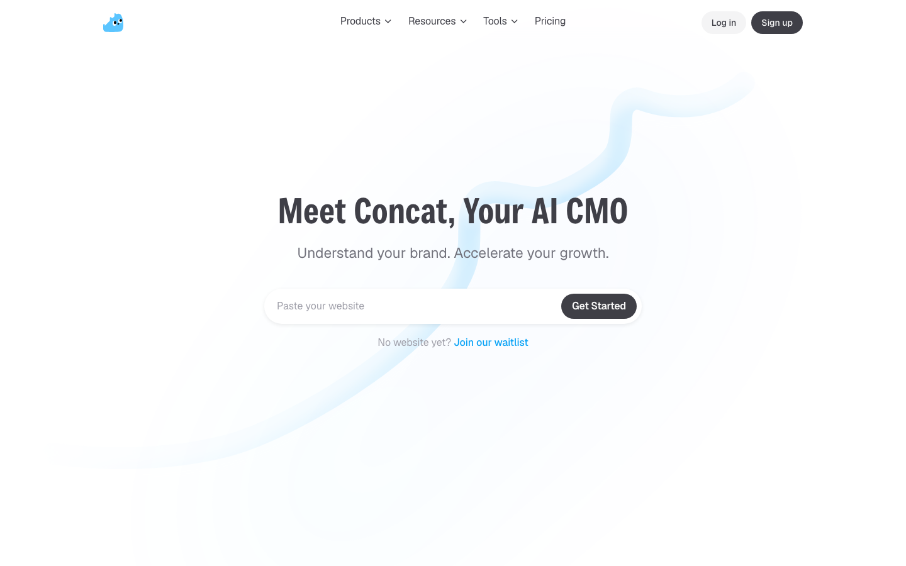

**观察：**

- ⚠️ 该测点 LLM 解读失败（超时 / 会话限额 / 服务异常），未生成功能观察。建议人工补充或重跑此测点。

#### C5: Footer audit

**URL:** https://concat.pro/

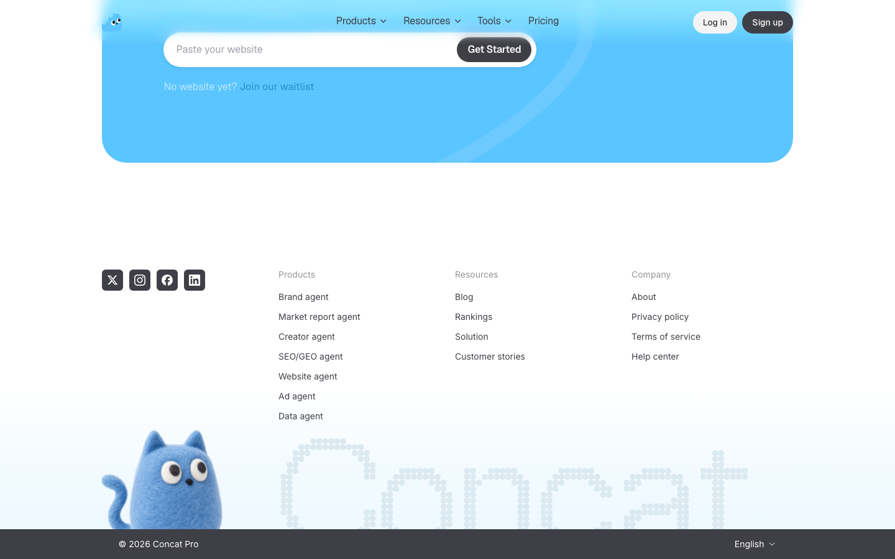

**观察：**

- ✅ Footer 的 Products 区把产品的**完整 agent 矩阵**一次铺开（7 个 agent + 每个一句话能力），实际充当了"产品能力地图"：Brand Agent（建品牌记忆）→ Report / Creator / SEO-GEO / Website / Ad Agent（并行执行）→ Data Agent（数据回流学习），清晰勾出"输入网站 → 多 agent 并行 → 性能数据反哺"的闭环工作流。仅看 footer，用户就能判断这是一个覆盖营销全链路的多 agent 套件，而非单点工具。
- P1 关键交付边界未界定，直接影响购买决策："Ad Agent – Generate and publish ad creatives" 的 **publish 投向哪些广告平台**（Meta / Google / TikTok？）、是否真能代投放，完全未提；"Website Agent – Diagnose and improve website" 的 improve 是仅给建议还是直接改站，同样模糊。这类"生成建议 vs 真正执行落地"的差异是产品价值的核心，属关键功能描述缺失。
- P2 每个 agent 只有一句动宾短语，缺**输入 / 输出 / 集成**说明。如 "Creator Agent – Find and activate matched creators" 未说从哪个达人库匹配、"activate" 是建联还是自动下单；"Data Agent – Turn performance data into agent learning" 未说接哪些数据源、回流到哪几个 agent。文本层面无法判断各 agent 的实际工作机制（需点进详情页才可能补齐）。
- ✅ "SEO/GEO Agent – Create content for search and AI answers" 明确点出 **GEO（面向 AI 回答的生成式引擎优化）** 这一差异化能力，把"为 AI 答案而非仅传统搜索创作内容"作为独立功能卖点，功能定位有信息量、可与同类 SEO 工具区隔。
- P3 Tools 区的 7 个计算器（CPM / 转化率 / 毛利 / CTR / WHOIS 等）是**独立免费小工具**，与核心 AI CMO 产品的关系未界定——是产品内置功能，还是引流用的 SEO 工具？用户无法判断这些能力是否计入套餐，造成产品功能边界模糊。


### 🤖 AI 能力 / Agent（1 个测点）

**该模块覆盖页面**:

- `https://concat.pro/`

#### M1: Agent inventory / team page

**URL:** https://concat.pro/


**观察：**

- ✅ 工作流闭环讲清楚了：页面揭示 Concat 是"AI CMO"式的多 Agent 协同系统，主线为 Brand Soul（品牌底座）→ 7 个垂直 Agent 并行执行（品牌 / 市场报告 / 达人 / SEO-GEO / 网站 / 广告 / 数据）→ 一键发布 → 表现数据回流 → 情报复利。这条"生成→发布→学习→反哺"的链路是核心定位，能力组合与叙事相对完整。
- ✅ Agent 能力清单颗粒度清晰：导航区用一句话给每个 Agent 定义了职责与产出（Brand Agent 从网站建品牌记忆、Creator Agent 找并激活匹配达人、Ad Agent 生成并发布广告创意、Data Agent 把表现数据转成学习）。用户能快速建立"这个产品由哪些功能模块组成"的认知。
- P1 — 核心机制 "Brand Soul" 只有概念没有机制：页面反复强调它是 "every agent builds from" 的创意底座，却没说明它如何构建（输入是否仅靠一个网站 URL？还抓取哪些数据源？）、产出形态长什么样、用户能否查看 / 编辑 / 纠偏。作为整个产品的根基，输入 / 输出 / 可控性三项关键信息全缺。且 "No website yet? Join our waitlist" 暗示产品强依赖既有网站作为唯一入口，这一适用前提没有明说。
- P1 — "数据反哺情报" 是主卖点但机制空泛：Data Agent / "turns performance into intelligence" 仅用 "analyzes what worked, sends the right signals back to each agent" 一句带过，没有任何具体示例说明一次"学习 / 优化"到底改了什么、反哺了哪个 Agent 的哪个决策。读完无法判断这是真实的闭环优化，还是停留在概念层的营销表述。
- P2 — 集成范围与"激活达人"语义不清：宣称 "connect your social accounts, publish in one click" 却没给支持平台清单（FB / IG / TikTok / LinkedIn?）；Creator Agent 的 "activate matched creators" 含义模糊——是真人达人的触达 / 合作，还是文中另一处 "AI creator ads"（AI 生成虚拟达人）?这是两种截然不同的产品形态，页面没有澄清，也没说明 Report Agent 的"market signals"具体来源与报告深度（示例标题偏行业泛文，与"竞品 / 受众变化情报"的定位略有出入）。


### 🎯 解决方案 / 场景（1 个测点）

**该模块覆盖页面**:

- `https://concat.pro/`

#### M3: Use cases / Workflows

**URL:** https://concat.pro/

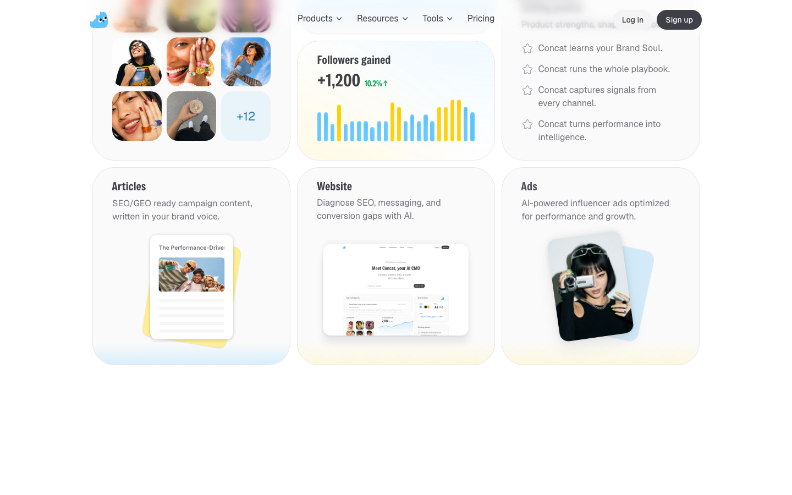

**观察：**

- ✅ **闭环工作流讲得清晰有力**：页面完整揭示了一条"Brand Soul（品牌灵魂）作为创意底座 → 市场洞察/创作者发现/文章/网页审计/AI 创作者广告等多 agent 并行执行 → 连接社媒一键发布 → 各帖性能数据回流 → 转化为情报反哺各 agent 并随时间复利"的自学习闭环。这是产品最有说服力的功能叙事——它把"AI CMO"定位落到了一个可理解的虚拟营销团队 + 学习飞轮上，而不只是单点生成工具。
- P1 关键能力存在自相矛盾/语义歧义**：导航把 Creator Agent 描述为"Find and activate matched creators（找到并激活匹配的真实创作者/达人）"，而正文却写"AI creator ads agent（AI 创作者广告）"。这两者指向完全不同的功能——**到底是对接/招募真实达人，还是用 AI 合成"类达人"广告素材？** 页面未澄清，用户无法判断 Creator Agent 与 Ad Agent 的边界和实际产出。
- P2 Brand Soul 的构建机制（输入/工作方式）说不清**：Brand Soul 是"每个 agent 的创意基础"，但页面只列了 Products/Overview/Files/Branding 几个标签，没说清**输入是什么、如何生成**（导航提示"from website"=喂网址，但需不需要上传文件、填问卷、人工校对程度多少均未交代）。作为整个产品的地基，这一步的输入与人工成本是用户最该知道却缺失的关键信息。
- P2 集成清单缺失，发布/数据回流的适用范围不明**：核心卖点是"连接社媒账号、一键发布、性能数据回流"，但**完全没有列出支持哪些平台**（Instagram / TikTok / LinkedIn / X / YouTube？）。示例指标只有 Comments/Likes，暗示社媒但不具体；SEO/GEO Agent 提到"为搜索和 AI 回答创作内容"也未说明对接哪些搜索引擎/AI 引擎。用户无法判断它能否覆盖自己实际在用的渠道。
- P2 "学习闭环"的机制偏抽象，且缺少端到端典型场景**：页面反复强调"把性能转化为情报""把正确的信号回传给每个 agent"，但**没有一个具体例子说明 agent 究竟会据此改变什么**（调整文案语气？换创作者？改投放？）。同时全页是能力罗列式描述，**没有任何具体行业/角色的完整使用场景**（如"一个 DTC 护肤品牌从 0 到发布第一波内容"），用户读完能理解"这是个什么产品"，但较难具象化"它具体能为我的业务做完哪一整件事"。


### ⭐ 客户案例（1 个测点）

**该模块覆盖页面**:

- `https://concat.pro/`

#### S14: Customer support channels

**URL:** https://concat.pro/

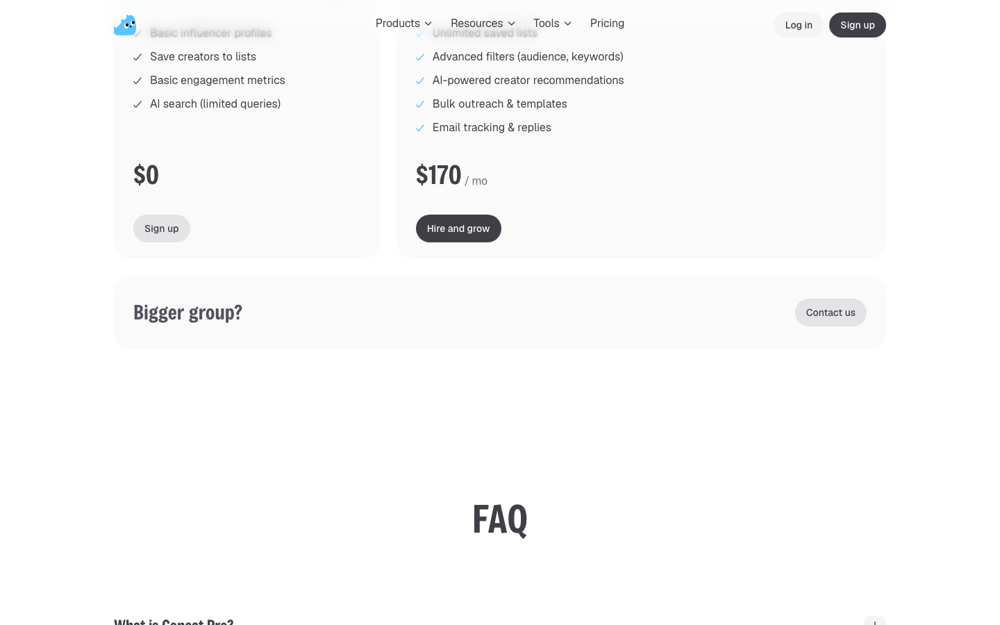

**观察：**

- P1 全页无任何客户支持渠道信息** — 测点为"Customer support channels"，但本页（产品首页）完全没有出现帮助中心、在线客服/聊天、邮件支持、工单、社区或"Contact"入口。用户无法判断使用 Concat 过程中遇到问题（如 agent 接入失败、数据未回流）时能通过什么渠道获得人工或自助支持，这是该测点最关键的功能信息缺失。
- P1 "自助 AI" 与 "人工服务" 的支持模式未界定** — 产品定位为"AI CMO"且强调 7 个 agent 并行自动运行，但未说明背后是否配备客户成功/onboarding 协助、还是纯自助。对一个声称替代 CMO 职能的产品，用户买单前最想知道"上手卡住了谁来帮我"，页面没有回答。
- P2 "连接社交账号、一键发布"的集成支持细节缺失** — 页面提出"Connect your social accounts, publish in one click"并让 performance data 回流，但未列出支持哪些平台（Meta / X / LinkedIn / TikTok 等）、授权方式、以及集成出问题时的排障/支持路径。集成是最容易出故障、最需要支持渠道的环节,却没有任何说明。
- P2 闭环"performance → intelligence"的工作机制说明过于抽象** — 反复强调"performance data flow back / turns performance into intelligence / sends signals back to each agent",但没有讲清楚回流的是哪些指标、多久学习一次、用户能否查看或干预这个学习过程。功能承诺清晰,机制与可控性不清晰,用户难以评估其真实价值。
- ✅ 多 agent 协同的产品能力骨架表达清晰** — 页面用"Brand Soul + 7 个专职 agent 并行 + 数据回流闭环"三段式,完整勾勒了"理解品牌 → 并行执行各营销职能 → 用表现数据反哺迭代"的工作流,读者能大致理解"这个产品能替我跑完整套营销 playbook";不足在于上述支持/集成/机制细节的缺位。


### 💰 定价 / 商业化（1 个测点）

**该模块覆盖页面**:

- `https://concat.pro/pricing`

#### C2: Pricing page

**URL:** https://concat.pro/pricing

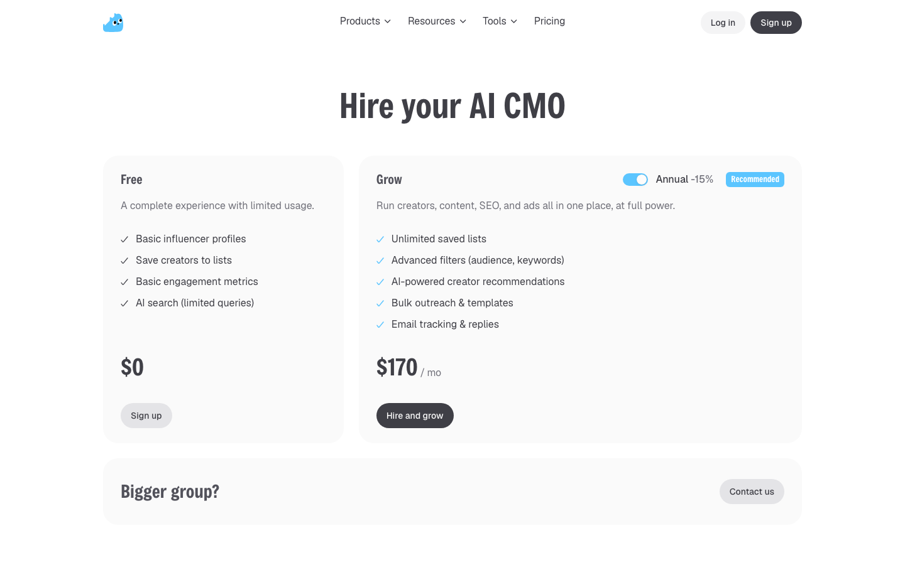

**观察：**

- ⚠️ 该测点 LLM 解读失败（超时 / 会话限额 / 服务异常），未生成功能观察。建议人工补充或重跑此测点。


### 🚪 注册 / 试用入口（1 个测点）

**该模块覆盖页面**:

- `https://concat.pro/`

#### C3: Sign-up flow (no submit)

**URL:** https://concat.pro/

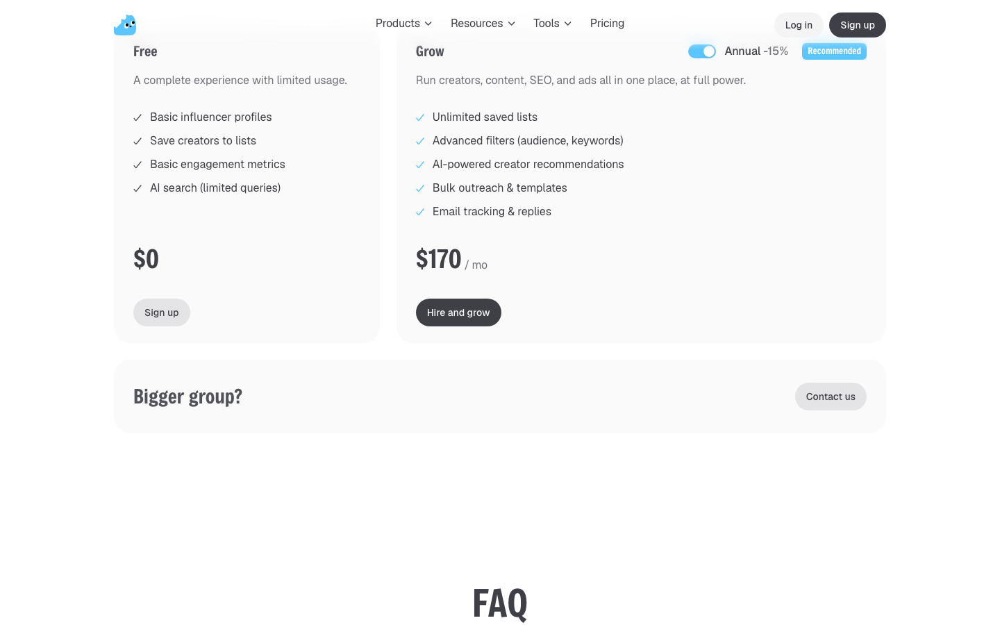

**观察：**

- ⚠️ 该测点 LLM 解读失败（超时 / 会话限额 / 服务异常），未生成功能观察。建议人工补充或重跑此测点。


### 🔌 集成 / API（2 个测点）

**该模块覆盖页面**:

- `https://concat.pro/`

#### S3: Integrations page

**URL:** https://concat.pro/

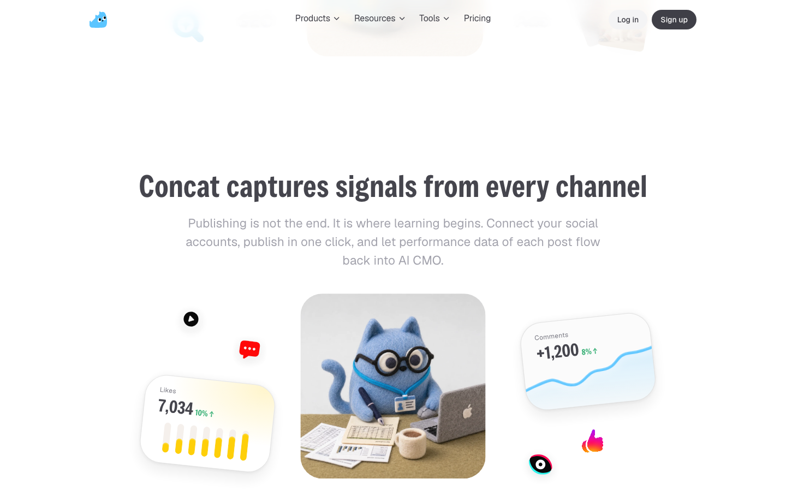

**观察：**

- ✅ 揭示了完整的多智能体营销工作流**：页面清晰呈现 Concat 作为"AI CMO"的产品骨架——7 个专职 agent（Brand / Report / Creator / SEO-GEO / Website / Ad / Data）各司其职，并串成闭环："Brand Soul（品牌灵魂）提炼 voice/受众/视觉/产品真相/市场定位 → 多 agent 并行执行 playbook → 一键发布 → 性能数据回流 → 转成智能反哺各 agent"。读者能明确理解这是一个"边执行边学习、智能随时间复利"的营销自动化系统，而非单点生成工具。
- ✅ 核心差异点（学习闭环）表达有力且锚定真实痛点**："Publishing is not the end. It is where learning begins" 把"发布后性能数据回流 → 分析什么有效 → 向各 agent 发送信号"讲成了产品的核心机制，直接对应"AI 生成营销内容后无法持续优化、各渠道数据割裂"这一具体问题，让产品价值不止停留在"会生成"。
- P1 作为"Integrations"测点，页面完全没有集成清单**：这是最致命的功能信息缺失。页面反复声称 "Connect your social accounts, publish in one click"，却从未列出支持哪些平台（Meta / X / LinkedIn / TikTok / YouTube / Google Ads？）、能接入哪些数据源、是否支持 CRM / 电商 / 分析工具。用户无法判断"我现有渠道能不能接进来"——对集成主题而言等于核心内容缺席。
- P1 数据回流与"反哺 agent"的工作机制完全没说清**：产品最大卖点是 "performance data flow back → sends the right signals back to each agent"，但没说明数据来源（平台 API 自动拉取？手动导入？）、回流频率、以及一条 "signal" 究竟改变了 agent 的什么（选题 / 语气 / 投放预算？）。这导致读者无法判断这个学习闭环是真实自动化还是营销话术。
- P2 各 agent 的输入 / 输出边界不清，难判断"怎么用、要我给什么"**：除 Brand Agent 明确"from website"（输入=网站 URL）外，其余多为一句话标语。例如 Report Agent 的 "market signals" 从何采集？Creator Agent 按什么维度"matched"创作者、能否直接触达？Ad Agent 生成创意后发布到哪些广告平台？用户读完知道"有这些能力"，却不清楚每个 agent 的具体输入、产出形态与适用场景。

#### S9: API / Developer docs

**URL:** https://concat.pro/

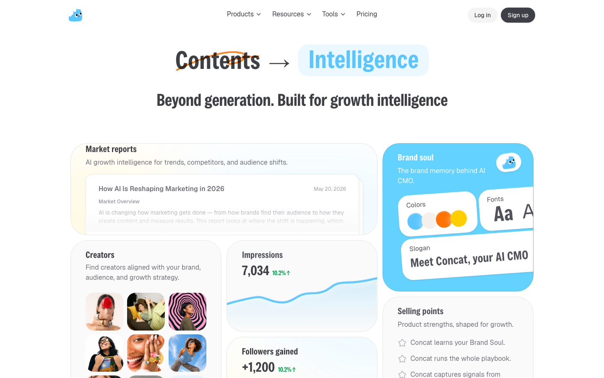

**观察：**

- P1 测点与内容严重不匹配 / 关键功能信息缺失**：本测点标注为 "API / Developer docs"，但抓取到的实际是产品首页营销内容，**全页找不到任何 API / SDK / 开发者文档信息**——没有接口说明、鉴权方式、调用示例、速率限制、Webhook 或"以编程方式调用各 agent"的入口。想做程序化集成的开发者读完这一页完全无法判断 Concat 是否对外开放 API。
- ✅ 七个 Agent 的功能边界清晰**：用统一的"动词+对象"句式一句话界定每个 agent 的职责（Brand Agent=从网站构建品牌记忆、Report Agent=从市场信号生成深度报告、Creator Agent=寻找并激活匹配创作者、SEO/GEO Agent=为搜索与 AI 回答生成内容、Website Agent=诊断改进网站、Ad Agent=生成并发布广告创意、Data Agent=把表现数据转化为 agent 学习），读者能快速建立"每个 agent 各做什么"的产品心智模型，且揭示了"AI CMO=一组协同 agent"的核心产品形态。
- P2 闭环学习机制只讲概念、缺工作细节**："publish in one click → performance data flows back → turns performance into intelligence"描述了"发布即学习"的飞轮叙事，但关键功能机制说不清：数据回流采集哪些具体指标（页面仅举 Comments/Likes 两类）、"sends the right signals back to each agent"究竟如何改变下一次生成的行为、学习是自动还是需人工确认——用户无法判断这套"越用越聪明"是真实功能还是营销话术。
- P2 集成清单 / 适用范围缺失**："Connect your social accounts, publish in one click"未列出支持哪些渠道（Facebook / Instagram / X / LinkedIn / TikTok / YouTube?），一键发布和数据回采的覆盖范围、是否支持自有官网/邮件/广告平台均未说明，这直接决定产品能否接入用户现有营销栈。
- P3 Brand Soul 的输入来源与复用方式未交代**："Brand Soul"列出了五类构成（voice / audience / visual identity / product truth / market position），但没说明这些信息从哪来（自动抓取网站？用户填写？访谈？），也没说明它作为"creative foundation"被各 agent 调用的具体机制——输入侧的工作流仍是黑盒。


### 🏢 公司 / 团队（1 个测点）

**该模块覆盖页面**:

- `https://concat.pro/`

#### S7: About / Company

**URL:** https://concat.pro/


**观察：**

- ✅ 产品能力骨架清晰，多 Agent + Brand Soul 中枢的工作流一目了然**：页面把产品定位为"AI CMO"，并拆出 7 个分工明确的 Agent（Brand/Report/Creator/SEO·GEO/Website/Ad/Data），每个都有一句功能说明；再以"Brand Soul"（统一 voice/audience/视觉/产品事实/市场定位）作为所有 Agent 的共同创作底座，并给出"并行执行但保持调性一致"的协同机制。用户读完大致能理解"这个产品能替我跑完整套营销 playbook"。
- ✅ 闭环增长机制是核心卖点且表达到位**：页面明确给出"发布→采集各渠道表现数据→回流给各 Agent→下一轮更聪明"的学习闭环（"Publishing is where learning begins"+ Data Agent "turn performance data into agent learning"），这是区别于普通"AI 生成内容工具"的差异化能力，功能叙事逻辑自洽。
- P1 关键集成与接入细节缺失，无法判断能否真正落地**：页面声称"connect your social accounts, publish in one click",但未说明**支持哪些渠道/平台**（无集成清单）、发布与回流数据走的是官方 API 还是其他方式；"sends the right signals back to each agent"的回流机制只给结论不给原理。涉及"接入我现有的账号/数据"这一最关键决策点完全空白。
- P2 7 个 Agent 仅有一句话定位，输入/输出/数据源未交代**：例如 Report Agent 的"market signals"具体来自哪些数据源、产出是什么格式的报告；Creator Agent 从**多大的创作者库**、按什么标准"matched"并如何"activate"；SEO/GEO Agent 如何为"AI answers"优化（GEO 的工作机制）。用户能感知"它能做这件事",但无法判断"做得到什么程度、适配我的场景吗"。
- P2 该测点标为 About/Company,却几乎没有公司/组织层面信息**：页面通篇是产品落地页内容，缺少团队、成立背景、定位适用客群（中小品牌？DTC？代理商？）、定价档位与功能差异等"我是否该选它"所需的判断信息——从功能信息完整性看，套餐间的 Agent 可用范围、用量边界均未在本页说明。


### 📰 博客 / 内容（1 个测点）

**该模块覆盖页面**:

- `https://concat.pro/blog`

#### E7: 探索: Blog Advice and product updates

**URL:** https://concat.pro/blog

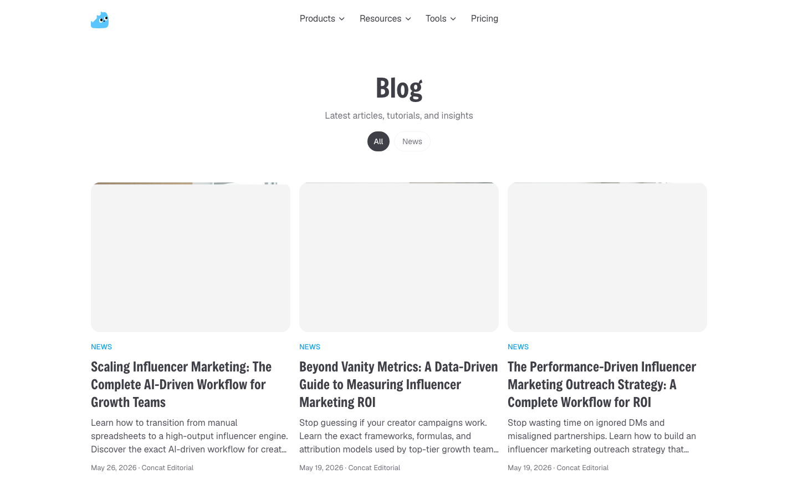

**观察：**

- ✅ 导航区的产品矩阵比 Blog 正文更能说明"产品做什么"**：页面顶部清晰枚举了 7 个 Agent 及其单句能力定位——Brand Agent(从网站构建品牌记忆)、Report Agent(从市场信号生成深度报告)、Creator Agent(发现并激活匹配的创作者)、SEO/GEO Agent(为搜索与 AI 答案创作内容)、Website Agent(诊断改进网站)、Ad Agent(生成发布广告创意)、Data Agent(把绩效数据转化为 agent 学习)。这构成了一条"品牌记忆→市场洞察→创作者/内容/广告投放→数据回流再训练"的闭环工作流暗示。
- P2 Blog 实际内容与产品能力严重错位，无法体现产品广度**：三篇文章全部归类为 NEWS、且全部聚焦"influencer marketing"(创作者发现、个性化外联、ROI 追踪),只对应 7 个 Agent 中的 Creator Agent 一个。读完 Blog 用户会误以为 Concat 是一个纯网红营销工具,而非覆盖品牌/报告/SEO/广告/数据的多 Agent 平台——博客的内容选题没有为其余 6 个 Agent 提供任何功能佐证。
- P2 文章描述的是"方法论",而非"本产品如何执行该方法论"**：标题如"从手工表格转向高产出网红引擎""归因模型与 ROI 公式"揭示了产品意图解决的问题(摆脱手动 spreadsheet、量化创作者投放回报),但节选内容是通用教育性 thought-leadership,没有说明 Concat 的 Creator Agent / Data Agent 具体用什么机制完成 creator discovery、outreach 自动化、attribution——产品能力与博客叙事之间缺少"我们的 agent 这样做"的衔接。
- P3 各 Agent 的输入/输出/集成细节在本页完全缺失**：例如 Creator Agent"激活匹配的创作者"是否对接邮件/社媒外联?Data Agent"把绩效数据转化为 agent 学习"的数据从何接入(广告平台?CRM?)?Website Agent 诊断后是否能自动改写?本页只有一句话定位,无法判断接入与产出形态,用户难以评估"能否接入我的现有栈"。
- P1 功能信息缺口:博客内容是否由产品自身(SEO/GEO Agent)生成,未作任何说明**：Concat 主打"为搜索与 AI 答案创作内容"的 SEO/GEO Agent,而 Blog 恰是该能力最自然的活体演示场景。但页面没有任何"本文由 SEO/GEO Agent 生成/辅助"的标注或 case 说明,白白浪费了一个"产品自证能力"的关键信号,用户无法借此验证内容生成 Agent 的真实产出质量。


### 📖 文档 / 帮助（1 个测点）

**该模块覆盖页面**:

- `https://concat.pro/`

#### C7: Help / Documentation

**URL:** https://concat.pro/

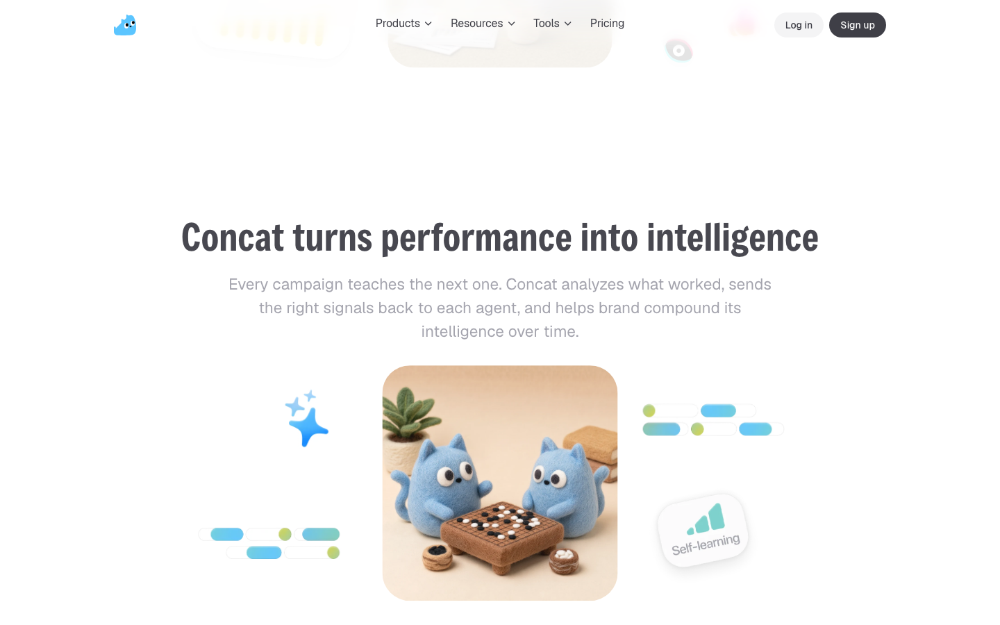

**观察：**

- ✅ 产品能力地图清晰**：页面完整揭示了 7 个 Agent 的功能分工（Brand/Report/Creator/SEO-GEO/Website/Ad/Data），并用"Brand Soul（品牌灵魂）→ 多 Agent 并行执行 → 一键发布 → 数据回流 → 沉淀为智能"的闭环讲清了核心工作流，读完能理解"这是一个端到端、会自我学习的 AI CMO"这一产品定位。
- P1 作为 Help/Documentation 测点，实际帮助/文档内容缺失**：此页（C7）抓到的几乎全是落地页营销文案，没有任何使用文档、上手指南、FAQ、API 文档或知识库。"Resources" 下只有 Blog、Ranking 和一组免费计算器（CPM/CTR/转化率/毛利/WHOIS 等），这些是获客型工具而非"如何使用本产品"的操作文档——想学怎么用、怎么配置 Agent 的用户在这里找不到答案。
- P2 集成清单完全缺失**："Connect your social accounts, publish in one click" 是核心卖点，但没说明支持哪些渠道（哪些社媒平台？是否含 CMS / 广告平台 / CRM / Analytics）。同理 Brand Agent 宣称"from website"建品牌记忆，却未说明抓取范围与数据来源，集成能力无法评估。
- P2 每个 Agent 仅一句话，输入/输出/工作机制不明**：例如 Data Agent "sends the right signals back to each agent" 的回流机制、Report Agent 生成报告的数据信号来源、Creator Agent 的匹配逻辑都未展开；用户知道"有这个能力"，但不知道"喂进去什么、产出什么、怎么运作"。
- P3 免费工具（计算器）与核心 Agent 产品的关系未界定**：CPM/CTR/毛利/WHOIS 等计算器是独立小工具还是产品内置功能、是否需登录、与 7 个 Agent 是否打通，均无说明，容易让用户混淆"工具站"与"AI CMO 平台"两类不同产品形态。


### 📌 其他（12 个测点）

**该模块覆盖页面**:

- `https://concat.pro/this-page-should-not-exist-product-audit-test-1234`
- `https://concat.pro/tools`
- `https://concat.pro/tools/cpm-calculator`
- `https://concat.pro/`
- `https://concat.pro/products/brand-agent`
- `https://concat.pro/products/report-agent`
- `https://concat.pro/products/creator-agent`
- `https://concat.pro/products/seo-geo-agent`
- `https://concat.pro/products/website-agent`
- `https://concat.pro/products/ad-agent`
- `https://concat.pro/products/data-agent`
- `https://concat.pro/rank`

#### C8: 404 error handling

**URL:** https://concat.pro/this-page-should-not-exist-product-audit-test-1234


**观察：**

- P2 这是一个无任何功能信息的标准 404 占位页**：页面仅有"404 / This page could not be found"两行文本，没有揭示产品的任何功能、能力或工作流；对于以"了解产品做什么"为目的的访问者，此页等于信息真空。
- P2 缺少功能性恢复路径（functional recovery）**：优秀的 404 通常会把误入的用户重新导回产品的核心功能入口（如站内搜索、主要模块链接、热门功能推荐）。本页没有提供任何"接下来能用产品做什么"的引导，用户在此处与产品能力完全断联。
- P1 无法回答"这个产品能为我做什么"**：单独读这一页，用户既不知道产品名称、所属领域，也无从得知它解决什么问题；缺少哪怕一条指向首页或功能总览的入口，导致功能认知链路在此中断。
- P3 未利用错误页传达产品上下文**：页面没有借机说明"你可能在找哪些功能"或列出主力能力清单（典型做法：列出 3–5 个核心功能/常用页面的跳转），错失了一次低成本的功能曝光机会。
- 功能信息缺口**：页面未说明触发 404 的常见场景（链接失效 / 功能已下线 / 权限不足），也没有区分"功能不存在"与"无访问权限"，用户无法判断是产品能力缺失还是自身访问问题。

#### M2: Agent profile (sample)

**URL:** https://concat.pro/tools

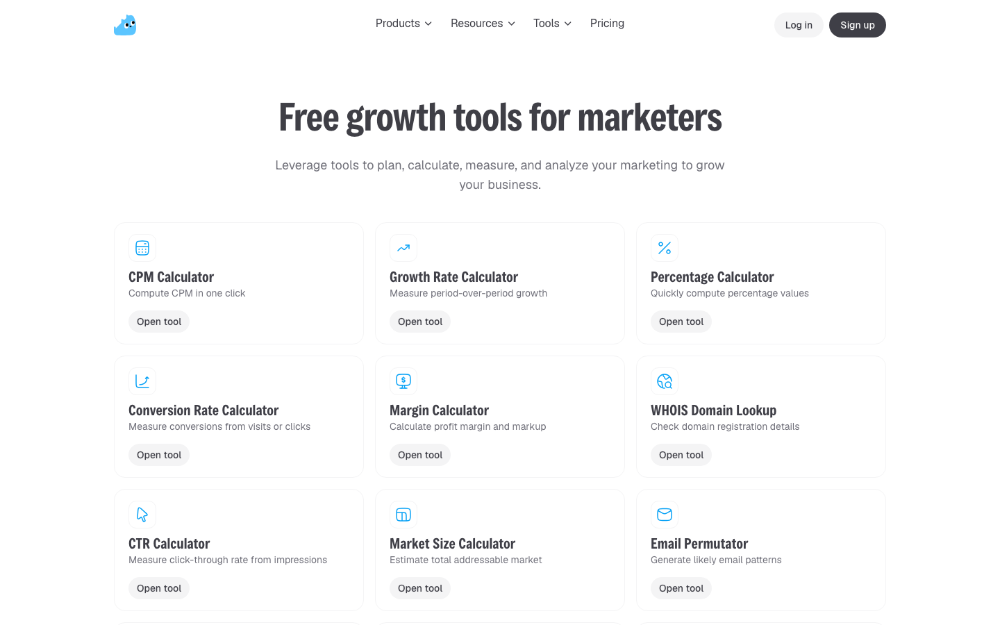

**观察：**

- 揭示的产品全貌（正面+缺口）**：导航暴露出这其实是一个面向营销人的**多 Agent 平台**——7 个垂直 Agent（Brand / Report / Creator / SEO-GEO / Website / Ad / Data），各自承担"从网站建品牌记忆""把表现数据转成 Agent 学习"等闭环职责；但当前打开的却是**免费工具页**，二者在功能叙事上完全割裂。✅ 平台的能力版图本身交代得很清晰。
- 免费工具层解决的问题明确**：FAQ 把场景讲得很到位——"开会前快速验算 CPM/CTR/CVR/Margin/TAM""不用打开表格""scope 新渠道时做 sanity-check"。这一层定位（轻量、即时、获客向 top-of-funnel）功能意图清楚，✅ 用具体决策场景说明了"能为我做什么"。
- P1 工具与付费 Agent 的关系完全未说明**：页面没有任何一句把 ICP Fit Scorer、Email Spam/Subject 工具与 Creator Agent / Data Agent 串起来。读者无法判断这些工具是**孤立计算器**，还是**Agent 工作流的入口/数据源**。这是关键功能链路的缺失——决定了用户认为这是"一堆免费小工具"还是"平台能力的试用切片"。
- P2 "智能型"工具的输入/输出/机制不清**：纯数学计算器（CPM/CTR/Margin）输入输出自明；但 **ICP Fit Scorer**（ICP 从哪来？需先配置画像吗？打分依据是什么）、**Email Spam Checker**（检测哪些触发词/规则）、**Subject Line Tester**（打分模型是什么）这类带判断逻辑的工具，工作机制、所需输入、是否需登录/留存结果均未交代，功能可信度打折。
- P3 测点定位与实际内容错配**：测点标注为 "Agent profile (sample)"，但页面实为 Tools 索引页，**未展示任何单个 Agent 的能力详情、配置项或运行示例**。因此关于"某个 Agent 具体怎么接入数据、怎么产出"这一最该说明的功能细节，本页零信息。

#### M5: Skills / Capabilities

**URL:** https://concat.pro/tools/cpm-calculator

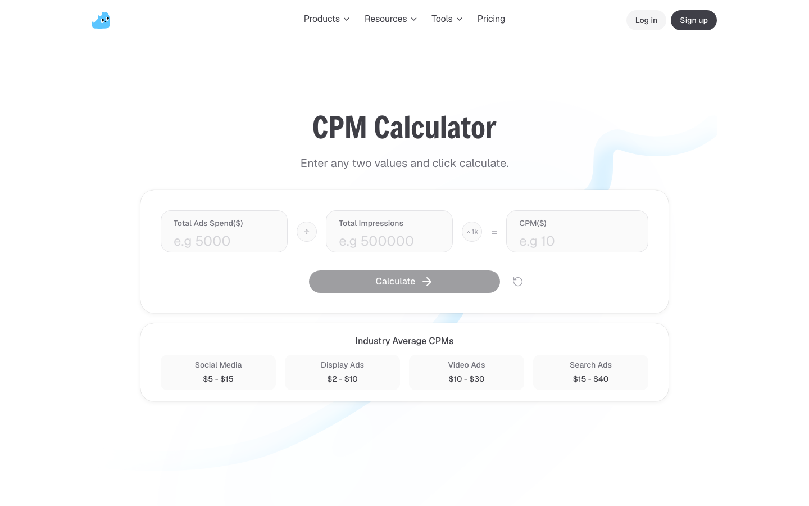

**观察：**

- ✅ 计算器核心工作机制说明清晰（输入/输出/工作逻辑）**：页面把"双向求解"这一关键能力讲透了——三个变量（广告花费 / 展示量 / CPM）任填其二即可反解第三个，FAQ 还用 $5,000 ÷ 2,000,000 = $2.50 的具体算例佐证。用户读完能立刻理解"这个工具能为我算什么"。
- ✅ 不止于计算，附带行业基准对照能力**：页面提供 Social $5–15 / Display $2–10 / Video $10–30 / Search $15–40 的基准区间，并在"How it works"第 5 步明确"对照行业区间评估表现"。这让工具从单纯算数升级为轻量决策辅助，功能定位有增量。
- P1 免费工具与产品核心能力（7 个 AI Agent）完全脱节**：导航暴露了 Brand/Report/Creator/SEO·GEO/Website/Ad/Data 七大 Agent 这一真正的产品能力，但 CPM Calculator 正文从头到尾未说明该计算器与 Ad Agent（生成发布广告创意）或 Data Agent（把表现数据转为学习）之间的任何关系。从搜索落到此页的访客只会理解"这是个计算器"，无法理解"这个产品其实是 AI 营销 Agent 平台"——核心功能价值没有传递。
- P2 计算结果是死胡同，缺少与产品工作流的衔接说明**：页面未说明算出的 CPM 能否保存、导出，或一键带入 Ad Agent / Data Agent 的后续工作流，也没说是否需登录。作为"能力"演示，它止步于一次性算数，看不到通往产品主功能的路径。
- P2 行业基准数据的来源 / 口径 / 时效未交代**："Industry Average CPMs"给了具体区间却无数据来源、统计时间、地区或渠道口径。作为一项对外宣称的"对标能力"，其可信度与适用范围（适合哪个市场/行业）无法判断。

#### M6: Channel deployment (Telegram/WhatsApp/Slack)

**URL:** https://concat.pro/

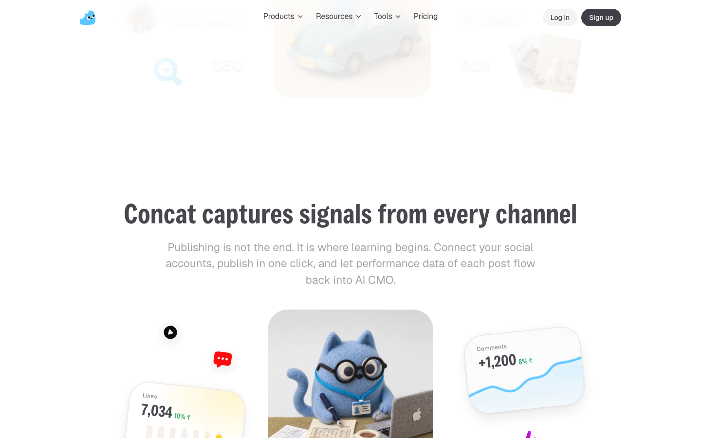

**观察：**

- ✅ 揭示了"发布—回流"闭环能力**：页面明确传达了一条渠道运营工作流——"Connect your social accounts → publish in one click → performance data flow back into AI CMO"，即连接社媒账号、一键发布、并把每条内容的表现数据回灌给 AI CMO 用于学习。配合下方 Comments(+1,200, 8%↑)、Likes(7,034, 10%↑) 的示例指标，功能定位（社媒内容分发 + 数据反哺）相对清晰。
- P1 完全未提及 Telegram / WhatsApp / Slack（测点核心能力无证据）**：本测点考察的三个消息类渠道在页面文本中零出现。页面只用 "social accounts" / "every channel" 这种泛化措辞，既未给出受支持平台清单，也无任何迹象表明产品支持 Telegram/WhatsApp/Slack 这类即时通讯/机器人渠道。用户无法判断该产品到底能部署到哪些渠道。
- P1 "channel" 的语义可能被误读**：从示例指标(Comments/Likes)看，这里的"渠道"指向 Instagram/TikTok/Facebook 这类社媒**内容发布**，而非 Telegram/Slack 那种**对话机器人/频道部署**。页面对"channel deployment"既不定义也不举例，存在把"社媒发帖"误当作"消息渠道接入"的歧义风险——这是功能边界描述缺失。
- P2 一键发布的关键机制全部缺失**：未说明连接方式（OAuth 授权？API key？）、支持的账号/平台数量、发布内容类型（图文/视频/Story？）、是否支持定时排期、多账号、审批流。"publish in one click" 是结果承诺，但用户读完无法知道接入门槛与操作前提。
- P2 数据回流的"渠道"维度未交代**：宣称 performance data "flow back"，但未说明能从哪些渠道采集哪些指标、采集频率、是否需要平台开放权限。对于评估"渠道部署"价值的用户，这层集成可行性信息是空白。

#### S1: Features / Product page

**URL:** https://concat.pro/products/brand-agent

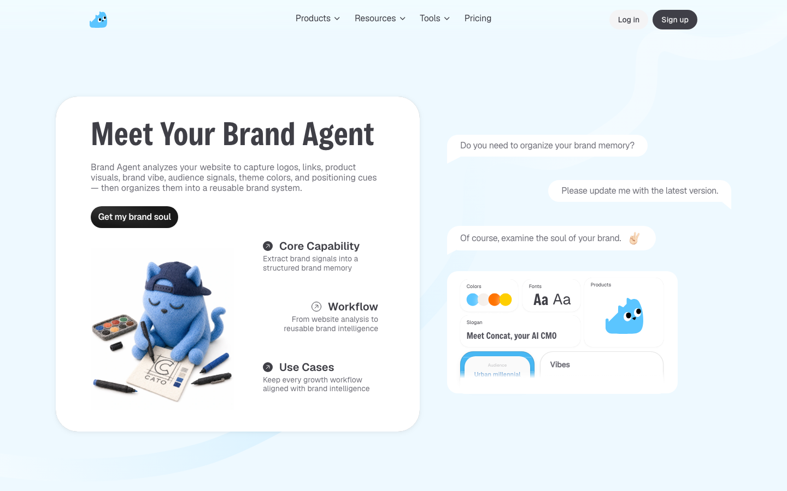

**观察：**

- ✅ **核心能力与输入/输出表达清晰**：页面明确了 Brand Agent 的输入是网站 URL，输出是结构化的"品牌记忆"——并用具象的卡片演示了产出物（Colors / Fonts / Slogan / Products / Vibes / Audience），如 vibe 标签"Honest Ingredients、Quietly Premium"、受众标签"Urban millennial、Single or DINK、Cat is family"。读者能快速理解"提取品牌信号 → 整理成可复用品牌系统"这一基本能力。
- P2 品牌记忆的下游用途未说明（最关键的功能缺口）**：页面反复强调产出是"reusable brand system / 让每个增长工作流与品牌智能对齐"，但完全没解释这份品牌记忆如何被其余 6 个 Agent（Report / Creator / SEO / Website / Ad / Data）消费——是自动注入、API 调用、还是手动复制？这本应是整个 Agent 套件的地基功能，却只停留在口号层面。
- P2 品牌信号的推断机制与可信度缺失**：Agent 如何从公开网站推断出"Cat is family""Quietly Premium"这类主观的 vibe / 受众判断，页面未交代数据来源或分析逻辑；也未说明若网站内容稀薄、或推断结果有误时的处理方式。营销人最关心的"准不准"无从判断。
- P2 人工修正 / 可编辑性不明确**：文案里出现"Please update me with the latest version""examine the soul of your brand"暗示可能支持更新或人工干预，但缺少明确的功能说明——用户能否编辑、覆盖、锁定提取出的品牌资产？品牌记忆是一次性快照还是可随网站变化刷新？均未交代。
- P3 工作流第 4 步被截断、与定位话术割裂**：How it works 只完整呈现了 3 步（Enter Website → Extract Assets → Understand Meaning），第 4 步"St…"缺失；同时"Meet Concat, your AI CMO"把产品拔高到"AI CMO"层级，但本页能力仅覆盖品牌信息抽取一环，未说明它如何承担 CMO 级的决策/执行职责，能力边界与定位存在落差。

#### E1: 探索: Report Agent Generate deep reports from 

**URL:** https://concat.pro/products/report-agent

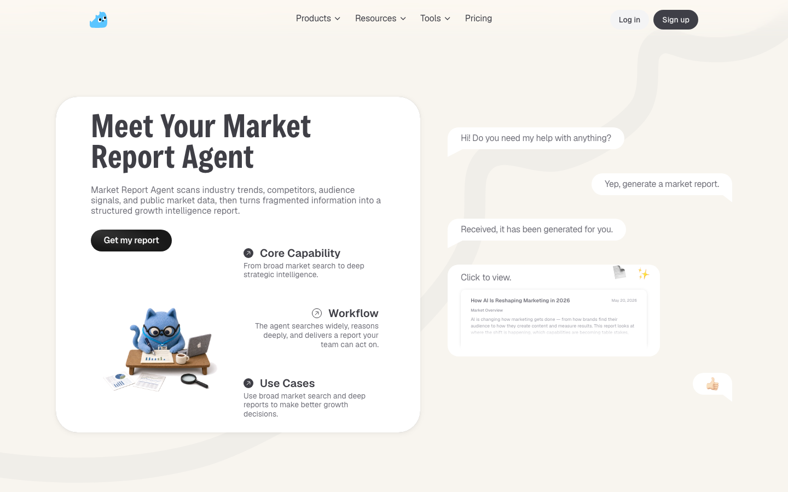

**观察：**

- ✅ 工作流与能力链路表达清晰**：页面用「广泛搜索 → 深度推理 → 交付可执行报告」三段式说明了 Agent 的核心机制，并明确了输入信号的四个维度（行业趋势、竞品、受众信号、公开市场数据），让用户能理解它是"信号聚合 + 结构化输出"而非简单 AI 摘要。
- P1 关键输入参数完全缺失**：Demo 中用户仅说"generate a market report"就直接产出报告，但页面从未说明用户要如何**圈定报告范围**（行业 / 目标市场 / 竞品名单 / 地区 / 时间窗）。读者无法判断这是"一键通用报告"还是"可按我的业务定制"，直接影响对产品实用性的判断。
- P1 数据来源与"deep/strategic"的实质未交代**：反复强调"deep strategic intelligence""public market data"，但没有任何**数据源清单或抓取范围说明**（哪些站点、是否实时、覆盖哪些行业）。缺了这一点，"深度"和"战略级"只是形容词，用户无法评估报告的可信度与覆盖面，也分不清它与通用 LLM 直接生成有何区别。
- P2 输出规格不完整**：示例报告只展示了标题、日期和一段 "Market Overview"，但报告的**完整结构（含哪些章节、是否有竞品对比 / 数据图表 / 行动建议）、篇幅、生成耗时**均未说明。用户读完仍不清楚最终拿到的是一页概述还是完整的多章节情报报告。
- P2 缺少交付与协作环节信息**：页面提到"a report your team can act on"，却未说明报告能否**导出 / 分享 / 定期刷新 / 与其他 Agent（如 Brand、SEO Agent）联动**。对于强调"团队可行动"的定位，缺少落地与集成路径是明显的功能信息缺口。

#### E2: 探索: Creator Agent Find and activate matched 

**URL:** https://concat.pro/products/creator-agent

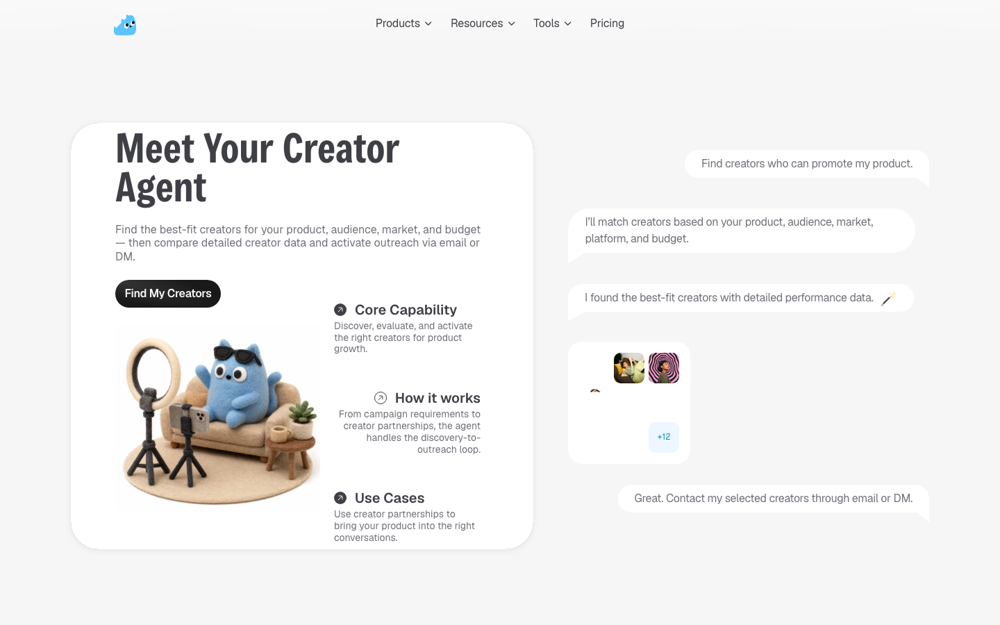

**观察：**

- ✅ 页面把 Creator Agent 的核心能力拆成清晰的三段式闭环——发现（Creator Discovery Engine：按产品品类/受众/市场/niche/campaign 目标跨平台搜索）→ 评估（Creator Data Intelligence：受众画像、互动质量、内容风格、平台契合度、合作潜力）→ 激活（Email & DM 触达），并用 "找能推广我产品的创作者→按产品/受众/市场/平台/预算匹配→返回带数据的最佳人选→通过邮件或 DM 联系" 的对话场景把 discovery-to-outreach 工作流演示出来，读完能基本理解"它替我找创作者并发起合作"。
- P1** "Search across platforms" 始终未指明是哪些平台（Instagram / TikTok / YouTube / X / 小红书？）。创作者营销最关键的就是平台覆盖范围，缺失这点用户无法判断该工具是否覆盖自己投放的渠道，属关键功能信息缺失。
- P1** 触达环节（Email & DM Outreach）只说"activate outreach"，但未说明工作机制：是 agent 自动群发还是生成草稿待审？是否需绑定用户自己的邮箱/社媒账号？是否提供模板、跟进、回复管理？"激活"在产品里到底发生了什么完全不透明，影响用户对自动化程度与合规风险的判断。
- P2** 反复强调按 **budget** 匹配，却未说明数据来源——是否能给出创作者报价/CPM 估算、是否有合作成本预测。预算匹配若无价格数据支撑就只是口号，这是用户决策的核心却未交代。
- P2** "Creator Data Intelligence"列出的受众画像、互动质量等指标未说明数据从何而来（平台官方 API、第三方面板、还是抓取估算）以及更新频率/可信度；同时 Top Pick / Strong Match / Match 的匹配分级依据什么算法、按哪些权重排序也未解释，用户难以评估匹配结果的可靠性。

#### E3: 探索: SEO/GEO Agent Create content for search 

**URL:** https://concat.pro/products/seo-geo-agent

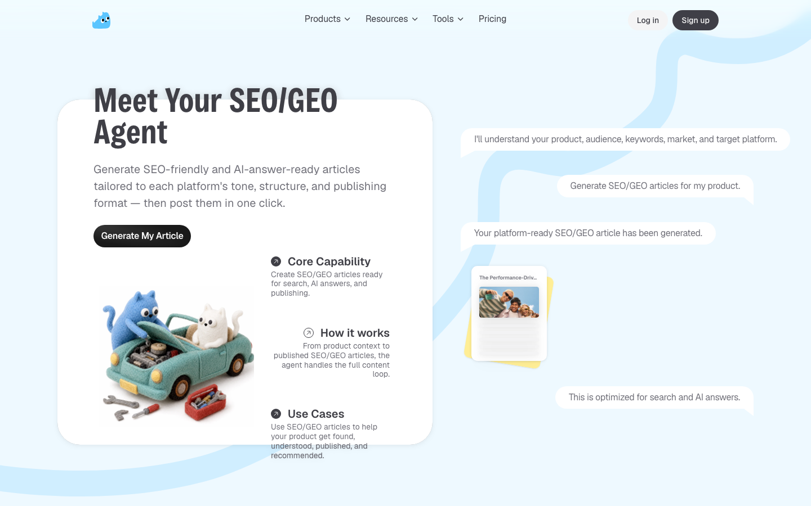

**观察：**

- ✅ **页面清晰揭示了完整工作流**："产品理解 → 生成文章 → 一键发布"三段式闭环讲得明白（Product Understanding → SEO/GEO Articles → One-Click Publishing），并用一篇示例文章标题（"The Performance-Driven Influencer Marketing Outreach Strategy..."）佐证产出形态。用户能大致理解"这个 agent 帮我把产品信息变成可直接发布的文章"。
- P1 "AI-answer-ready / GEO 优化"是核心卖点，但工作机制完全没说**。页面反复强调文章"optimized for search and AI answers""ready for AI answers"，可这正是区别于普通 SEO 写作工具的关键能力——却没有任何说明：靠什么让内容被 AI 回答引用？是否生成结构化数据 / schema / 实体标注 / 问答式结构？读完无法判断"GEO"是真有技术手段还是仅是营销话术。
- P1 "One-Click Publishing 一键发布"未说明发布到哪里、如何接入**。文案称"tailored to each platform's publishing format""post them in one click",但全程没有列出支持的目标平台（WordPress / Medium / 公司站 / 自媒体？），也没说明如何授权 / 绑定账号。这是该 agent 最具体的差异化功能，集成清单缺失直接影响用户判断能否用在自己的渠道。
- P2 输入侧的关键词处理边界模糊**。文案说"I'll understand your product, audience, keywords, market"——但没说清"keywords"是用户自己提供、还是 agent 自动做关键词调研 / 选词。SEO 工具里"是否含关键词挖掘"是决定性功能点，这里语焉不详。
- P2 缺少效果反馈与规模化信息**。页面只演示了"生成一篇文章",未说明：能否批量 / 周期性产出内容、生成后是否追踪实际排名或被 AI 引用情况、与 Data Agent 是否打通形成"发布→数据→再优化"的学习闭环。用户无法判断这是一次性写作工具还是可持续的内容增长引擎。

#### E4: 探索: Website Agent Diagnose and improve websi

**URL:** https://concat.pro/products/website-agent

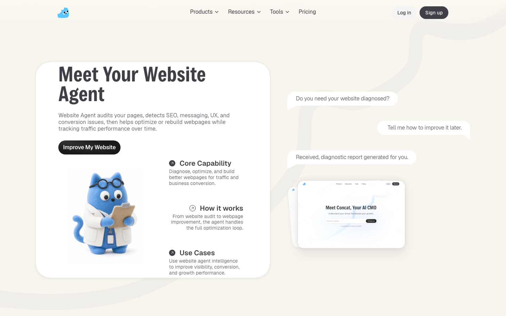

**观察：**

- ✅ 功能闭环表述清晰：页面用"诊断 → 优化/重建 → 流量追踪"三段式把产品定义成一个完整优化循环（full optimization loop），三个核心能力块各自对应"发现问题—产出改版—回收效果"，用户能快速建立"这个 Agent 从头到尾干什么"的整体认知。
- P1** 关键集成机制缺失：Traffic & Performance Tracking 声称能追踪 traffic、user behavior、conversion signals，却完全没说明数据来源——是否需要接入 Google Analytics / Search Console、是否要在站点埋点或安装脚本、还是仅靠自家爬虫估算。这是判断"它能不能真正追踪到我的网站"的决定性信息，缺失会让该能力显得不可落地。
- P1** "优化/重建"的落地路径不明：页面说能 generate improved page structures、copy、layouts，但没说明产出物是"一份改进建议清单"还是"可直接上线的页面"，更没交代如何把改版应用回用户真实站点（CMS 插件？导出代码？平台托管？）。诊断到出方案容易，方案到上线才是用户最关心的一环，而这段恰恰空白。
- P2** 诊断输入与覆盖范围未界定：没说明用户如何提交网站（输入 URL？绑定域名？），也没说诊断是针对单个页面还是全站抓取、能处理多少页面、是否支持登录后/动态页面。输入边界不清会让用户无法判断自己的站点是否适用。
- P3** 与其他 Agent 的功能边界模糊：Website Agent 自带 SEO 诊断，但产品矩阵里另有独立的 SEO/GEO Agent，页面未说明两者分工（站点诊断 vs 内容生产？谁负责真正提升排名？），用户难以判断 SEO 类问题该用哪个 Agent；另外那个 "65 Score" 也未说明满分基准与加权维度，分数缺乏可解释性。

#### E5: 探索: Ad Agent Generate and publish ad creativ

**URL:** https://concat.pro/products/ad-agent

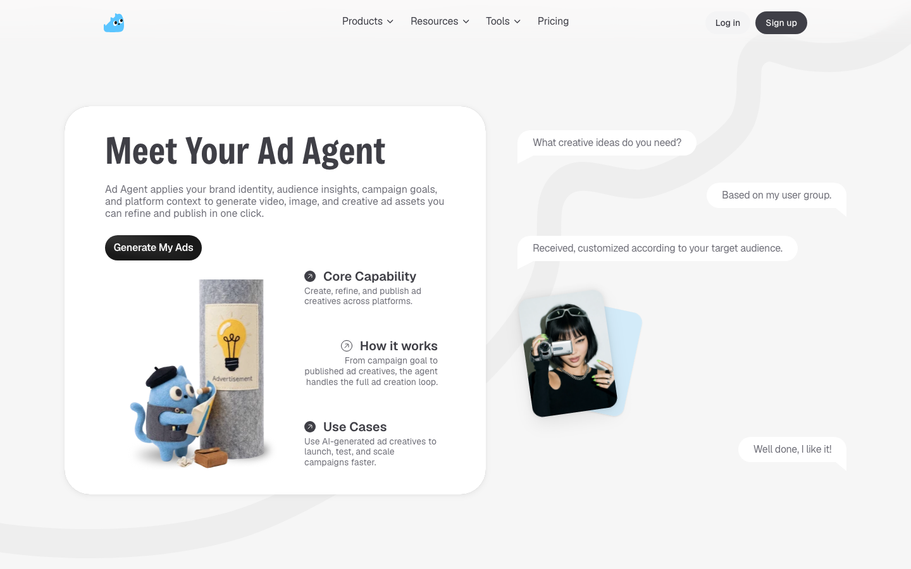

**观察：**

- ✅ 页面清晰揭示了 Ad Agent 的完整工作流（"全广告创作闭环"）**：从「定义 campaign 目标」→「受众/创意智能分析」→「生成视频/图片素材」→「优化」→「一键发布」，四个能力模块（Audience & Creative Intelligence、Video & Image Ad Generation、One-Click Ad Publishing）+ How it works 的 Step 01 起步，读者能建立"输入营销目标、产出可发布广告素材"的整体认知。
- ✅ 输入信号维度交代得较具体**：明确列出生成创意所依据的四类输入——Audience Signals、Campaign Goal、Ad Copy、Product Value，并说明产出物粒度（videos、images、hooks、captions、creative variations），让用户理解"喂什么、产出什么"，而非空泛的"AI 生成广告"。
- P1 "across platforms / 一键发布到目标平台"是核心卖点，却从未指明是哪些平台**：全文反复出现 "across platforms"、"choose target platforms"、"publish directly"，但没有列出任何具体投放渠道（Meta/Facebook、Google、TikTok、LinkedIn、YouTube…）。"能发到哪"是用户决定是否采用的关键功能信息，缺失会让"一键发布"的价值无法被评估。
- P1 "publish directly without manual asset handoff" 的发布集成机制完全未说明**：直接发布意味着要接入广告账户（如 Meta Ads Manager / Google Ads）。但页面没交代如何授权/绑定广告账号、是否同时设置预算/受众定向/出价，还是仅推送素材到平台素材库。这是"一键发布"能否成立的关键技术细节，目前是黑盒。
- P2 与同系列其它 Agent 的数据打通关系未交代**：产品线内已有 Brand Agent（品牌记忆）和 Data Agent（performance data→learning），而 Ad Agent 声称"applies your brand identity、audience insights"。这些品牌/受众输入究竟是自动从 Brand Agent / Data Agent 继承，还是需用户手动填写，页面未说明——跨 Agent 集成关系直接影响实际使用成本。

#### E6: 探索: Data Agent Turn performance data into ag

**URL:** https://concat.pro/products/data-agent

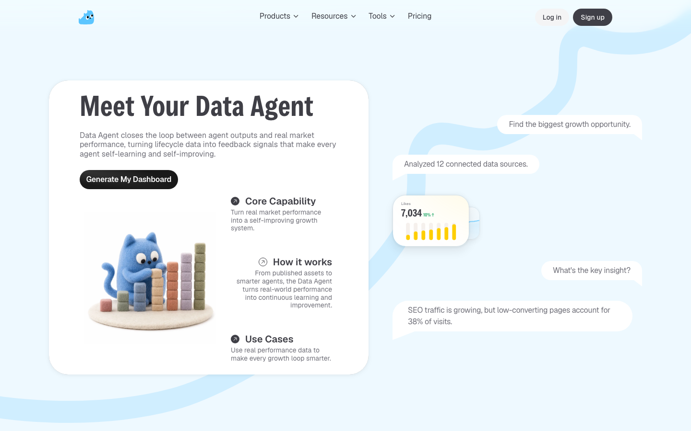

**观察：**

- ✅ 产品定位清晰且有差异化:Data Agent 被定义为整个 Agent 矩阵的"度量与反馈闭环层"——把已发布资产(Brand/SEO/GEO/Creator/Ad/Website/Report)的真实市场表现回灌为反馈信号,使其它 Agent "self-learning / self-improving"。这把它和单纯的 BI 看板区分开,用户能理解它在产品矩阵中扮演"闭环最后一环"的独特角色。
- P1** 最核心的"反馈闭环"机制完全没说清:页面反复强调把表现数据"feed back into" 其它 Agent 让其变聪明,但没有说明这是如何发生的——是自动改写/调参 Agent 的下一次输出,还是只生成一份建议报告由用户手动应用?"self-improving" 是本产品最大卖点,却停留在口号层面,用户无法判断这是真正的自动闭环还是人工解读。
- P1/P2** 数据接入清单缺失:文案出现 "12 connected data sources"、"cross-platform data"、"unify",却完全没列出支持哪些平台/数据源(GA4、Search Console、Meta/TikTok Ads、Shopify、CRM 等?),也未说明接入方式(OAuth 授权 / API Key / 手动上传)。对一个以"统一跨平台数据"为前提的产品,集成范围是用户决定能否用的第一道门槛,这是关键功能信息空白。
- P2** 输入/输出边界模糊:输出侧给了具体示例(Performance Dashboard、异常/趋势检测、"低转化页面占 38% 访问量"这类洞察),较有说服力;但输入侧(用户需要连接什么、配置什么、需要多少历史数据才能产出洞察)与产出形态(实时仪表盘?定期报告?告警推送?)都没交代,用户难以预估上手成本和使用节奏。
- P2** "Trend Detection / Anomalies / Performance Signals / Growth Insights" 等能力只列了名词,没有任何机制说明(检测依据什么阈值、是否主动告警、洞察更新频率、是否给出可执行建议)。Lifecycle Tracking 一项文本被截断("Track..."),具体追踪什么生命周期阶段也未呈现,读完仍无法判断这些"洞察"是描述性还是处方性(能否直接告诉我"下一步该改什么")。

#### E8: 探索: Ranking Curated rankings and benchmarks

**URL:** https://concat.pro/rank

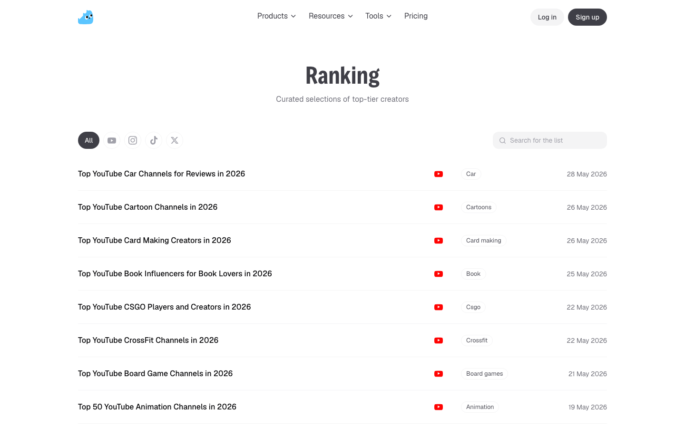

**观察：**

- ✅ 揭示了核心能力——按细分品类的创作者发现与排名**：该页面是 "Creator Agent（Find and activate matched creators）" 的对外能力证明，显示产品维护着一个按极细颗粒度垂类切分的创作者库（Car / Cartoon / CSGO / CrossFit / Yoga / Wildlife / Beauty / BBQ / Bass fishing / Beard… 20+ 垂类），且覆盖 YouTube 为主、Instagram 为辅。对做红人营销的品牌而言，这传递了一个明确信号：产品能按"行业 + 平台"识别并排序匹配的创作者。
- P1 榜单与产品工作流的衔接完全缺失**：页面把 Ranking 归在 "Resources"（与 Blog 并列），呈现为静态的 SEO/内容资产，而非产品功能入口。用户无法判断：这些榜单只是预制的博客式清单，还是可以反向调用产品"按我的垂类/地区/预算生成自定义榜单"？更关键的是，从"读到榜单"→"通过 Creator Agent 联系/激活该创作者"的闭环路径只字未提，"activate" 在此页没有任何落点。
- P2 排名方法论与底层数据不透明**：列表页只给出垂类标签和一个日期，未展示任何排序依据（订阅数 / 互动率 / 触达 / 受众画像 / 商单适配度），也未说明排名是人工策划、算法生成还是 AI 产出。对红人营销工具来说，"凭什么这样排"恰恰是信任与决策的核心价值，这部分信息空白会削弱榜单的可用性。
- P2 覆盖范围与筛选能力不明**：垂类明显聚集在字母 B/C 区（Book/Board/BBQ/Beard/Baking/Beauty/Bass、Car/Card/Cartoon/CSGO/CrossFit…），更像是内容分批上线的中间态而非完整覆盖；平台几乎只有 YouTube。页面也没有提供按平台、地区、受众规模、粉丝量级等维度的筛选，使其作为"发现工具"的适用边界和检索深度无从判断。
- P3 与其它 Agent / 数据更新机制的联动未说明**：未交代榜单是否由 "Data Agent" 自动刷新（数据时效性）、是否会与 Report Agent / Ad Agent 打通形成"选人→投放→复盘"链路，也未说明榜单是否免费/需登录。用户读完只能感知"它知道很多垂类的头部创作者"，但难以判断"它能为我的投放具体做什么"。


### ⚠️ 未找到的测点（3 个测点）

**该模块覆盖页面**:

- `https://concat.pro/`

#### C4: Login page

**URL:** https://concat.pro/
**观察：**

- [Link not found] 该模板期望的链接（log in|login|sign in|登录|登入）在 https://concat.pro/ 上未找到 — 可能产品用了不同的措辞或这个功能不存在。 已跳过截图与 LLM 解读以避免重复首页快照。

#### S4: Customer / logo wall

**URL:** https://concat.pro/
**观察：**

- [Link not found] 该模板期望的链接（customers|clients|case studies|客户|案例）在 https://concat.pro/ 上未找到 — 可能产品用了不同的措辞或这个功能不存在。 已跳过截图与 LLM 解读以避免重复首页快照。

#### S12: Trust / Security page

**URL:** https://concat.pro/
**观察：**

- [Link not found] 该模板期望的链接（security|trust|compliance|安全|信任）在 https://concat.pro/ 上未找到 — 可能产品用了不同的措辞或这个功能不存在。 已跳过截图与 LLM 解读以避免重复首页快照。


---

## 4. 第三方社区反馈

#### ⚠️ 未找到显著社区讨论

WebSearch 在 Reddit / Product Hunt / Hacker News / G2 等平台未找到 `concat.pro` 的显著用户讨论。本节内容为空——不代表产品好或差，仅说明社区讨论数据稀缺。

---

## 5. 从访客到注册的转化路径

已用 WebFetch 直接重抓官网公开页补上失败的 [C2]，以下「页面写了什么」均来自 `concat.pro` 首页 + `/pricing` 实抓文本（标记为 [C2-重抓]），其余为我的推断。

---

#### 转化路径示意

```
第 1 步：看到落地页 —— "Meet Concat, Your AI CMO"
    ↓ 关键触点：[C2-重抓] Hero 文案 "Understand your brand. Accelerate your growth." + "Get Started" 主按钮
第 2 步：理解能力 + 被案例数据打动
    ↓ 关键触点：[C2-重抓] "learns your Brand Soul" / "runs the whole playbook"（6+ agents）
              + 业绩数字（7,034 impressions、+1,200 followers、10.2% 增长）+ 创作者画廊（8+ "+12"）
第 3 步：对比定价 / 评估花多少钱
    ↓ 关键触点：[C2-重抓] Free $0 ｜ Grow $170/mo（Recommended，Annual -15%）｜ "Contact us"（大团队）
第 4 步：选择入口
    ↓ 关键触点：[C2-重抓] "Sign up"（Free）/ "Hire and grow"（Grow）/ "Join our waitlist"（无网站者）
第 5 步：完成转化 —— 自助注册进入产品（Free tier「完整体验 + 限量」）
```

> 范围说明：未在公开页发现任何「Book a demo / 预约演示」入口——这个产品的转化是**纯自助注册（PLG）**，没有 demo 预约环节。

---

#### 各步骤详解

**第 1 步：看到落地页（AI CMO 定位）**
- 页面写了什么：主标题 "Meet Concat, Your AI CMO"，副标题 "Understand your brand. Accelerate your growth."，主 CTA "Get Started"。[C2-重抓]
- 我的推断：用「AI 营销总监 / AI CMO」这个高级岗位类比做钩子，瞄准的是没有完整营销团队、但又要做多渠道增长的中小品牌主——卖点不是「一个工具」，而是「替你干一个角色」。
- 可能流失的原因：「AI CMO」概念偏抽象，访客如果首屏没立刻 get 到「具体帮我做什么」，会直接划走。

**第 2 步：理解能力 + 被案例数据打动**
- 页面写了什么：四段能力叙事——"learns your Brand Soul"（提炼声音/受众/视觉/产品/市场定位）、"runs the whole playbook"（market insights / creator discovery / content / audits / ads 多 agent 并行）、"captures signals from every channel"、"turns performance into intelligence"；并展示业绩数字（7,034 impressions、+1,200 followers、10.2% 提升）与创作者画廊。[C2-重抓]
- 我的推断：这一段在建立「它真的能闭环干活」的信任——多 agent 编排是差异化卖点，业绩数字 + 创作者头像墙是即时社会证明，目的是把抽象的「AI CMO」落到「看得见的产出」。
- 可能流失的原因：数字若无品牌署名/案例链接，访客会怀疑是示意数据；能力点很多反而显得「样样都做、样样不深」，专业买家可能存疑。

**第 3 步：对比定价（Free vs Grow）**
- 页面写了什么：Free = $0（basic influencer profiles、save lists、basic engagement metrics、**limited AI search queries**）；Grow = **$170/mo**（标 Recommended、Annual -15%、unlimited lists、advanced filters、AI recommendations、bulk outreach、email tracking）；更大团队 "Contact us"；Free 被描述为 "a complete experience with limited usage"，未标试用天数。[C2-重抓]
- 我的推断：这是典型 freemium——Free 不是限时试用，而是「永久免费但限量」，让你先用起来再因额度不够升级。$170 这一档绑定的是「真正能外联/批量干活」的功能（bulk outreach、email tracking），即「免费看，付费才能动手」。
- 可能流失的原因：只有 $0 与 $170 两个明确档位、中间没有过渡档，跨度大；个人/小预算用户会觉得「免费太弱、付费太贵」而卡在中间。

**第 4 步：选择入口并注册**
- 页面写了什么：CTA 包括 "Sign up"、"Hire and grow"、"Get Started"、"Join our waitlist"（明确写给「没有网站的人」）、"Contact us"（大团队）。[C2-重抓]
- 我的推断：默认路径是**自助免费注册**，无人工介入、无 demo 阻塞；"Join our waitlist" 暗示产品强依赖「你已有官网/品牌资产」（它要去 learn/audit 你的网站），没网站的人被分流到等待名单而非直接进产品。
- 可能流失的原因：无网站访客被挡在自助注册外（只能排队），这部分人当场流失；有网站者若担心「要授权/连接社媒账号」也可能在注册前犹豫。

---

#### 转化设计观察

- **入口设计**：以**自助注册（Get Started / Sign up）为唯一主入口**，未见预约演示入口——走的是 PLG「先免费用起来」路线，而非 Sales-led 的 demo 预约。两个分支入口：无网站者 → "Join our waitlist"（条件准入）；大团队 → "Contact us"（销售跟进）。[C2-重抓 + 推断]
- **价格预期**：访客读完定价页会形成「$0 起步、想真正干活约 $170/mo（年付约合 $144.5/mo）、企业级价格不透明需联系销售」的预期。心理锚点落在 $170 这档。[C2-重抓 + 推断]
- **公开承诺**：官网承诺的「用了之后会发生什么」= "Understand your brand. Accelerate your growth."、自动 "learns your Brand Soul"、"runs the whole playbook"、并用 +1,200 followers / 10.2% 增长这类数字暗示「能带来可量化的增长」。[C2-重抓]（注：这是公开话术，非登录后实测体验。）

---

#### 转化设计的强弱（仅公开页面）

- ✅ **低门槛 PLG**：自助免费注册、无 demo 预约阻塞，访客可即时进入产品。[C2-重抓]
- ✅ **Free 是「完整体验+限量」而非限时试用**，降低「时间到了被催付费」的心理压力，利于先养成使用习惯。[C2-重抓]
- ✅ **即时社会证明到位**：首屏直接放业绩数字 + 创作者头像墙，缩短「它有用吗」的判断时间。[C2-重抓]
- ⚠️ **价格锚点跨度大、缺中间档**：仅 Free 与 $170 Grow + Contact us，$0→$170 之间无过渡，付费决策易卡住；Free 额度写得含糊（"limited AI search queries" 无具体数字），访客难判断免费够不够用。[C2-重抓 + 推断]
- ⚠️ **强依赖「已有网站/品牌资产」**：无网站者被分流到 waitlist 而非直接注册，这部分流量当场漏掉；且注册前可能担忧「需连接社媒/授权」。[C2-重抓 + 推断]
- ⚠️ **首屏稳定性存疑（弱推断）**：自动化测点 [C2] 原本超时失败，页面可能偏重交互/重 JS，慢网络或部分访客的首屏体验存在风险——建议人工二次核验。

---

需要我把这份分析存成文件放到 `octok` 目录（按你的工作区约定），还是再补抓一个「背景/How it works」介绍页把第 2 步的能力证据做实？
