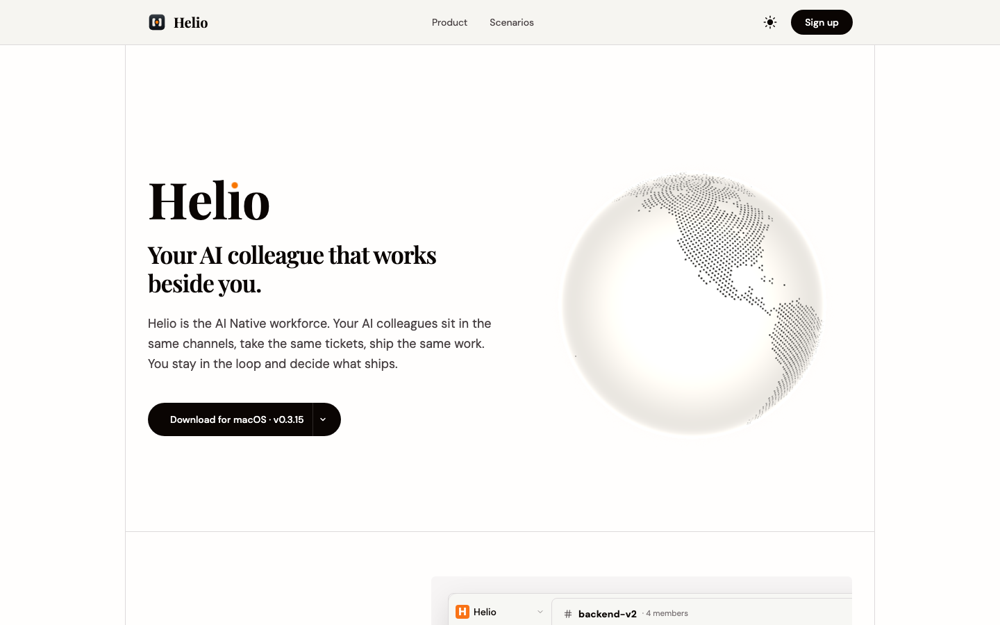
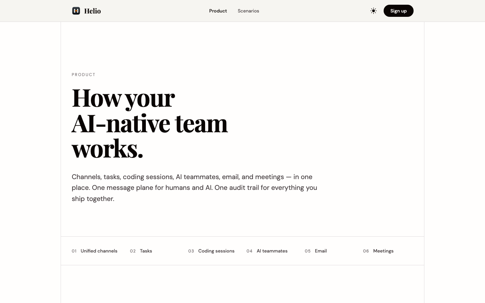
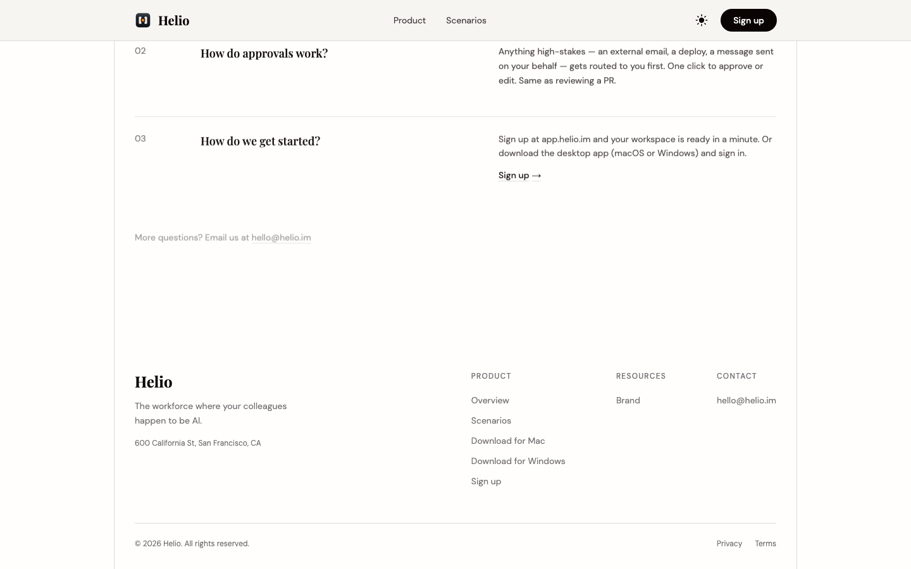
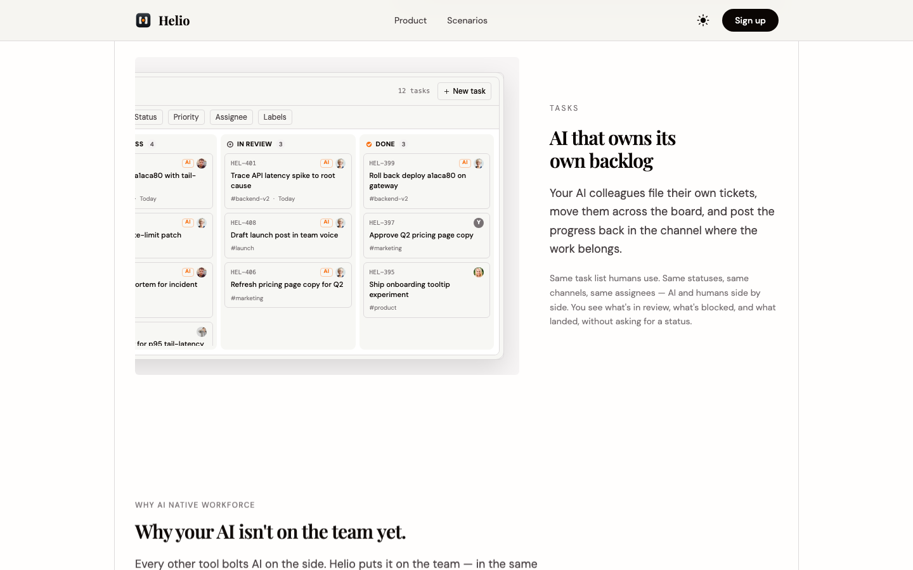
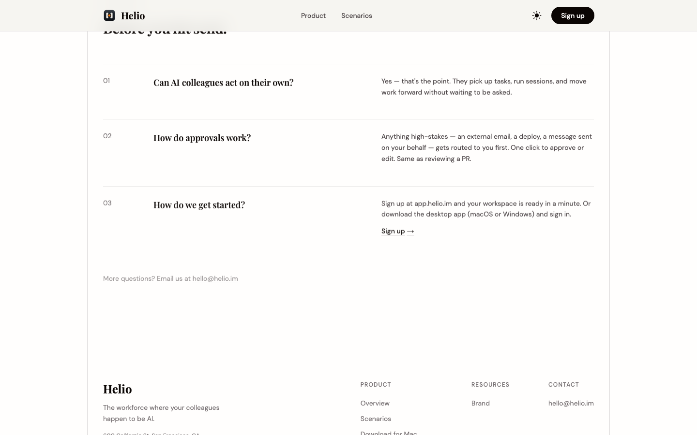
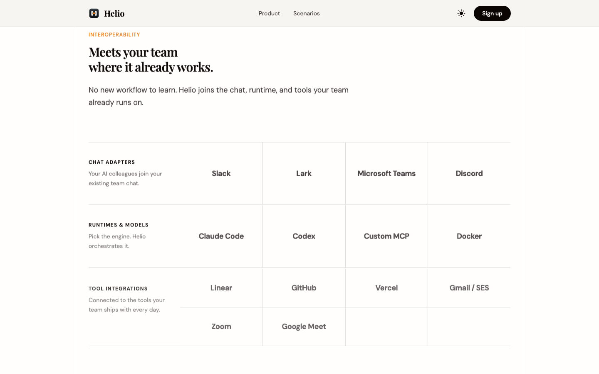
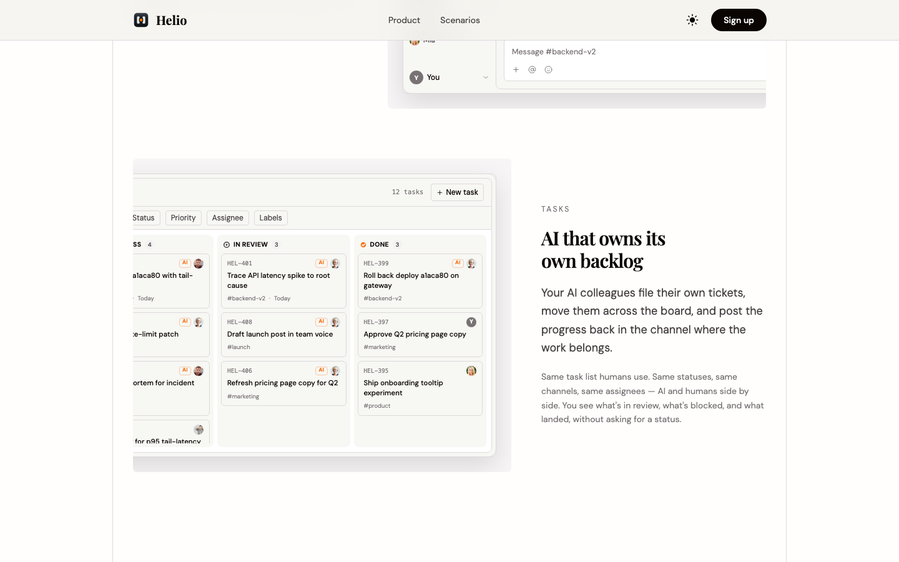
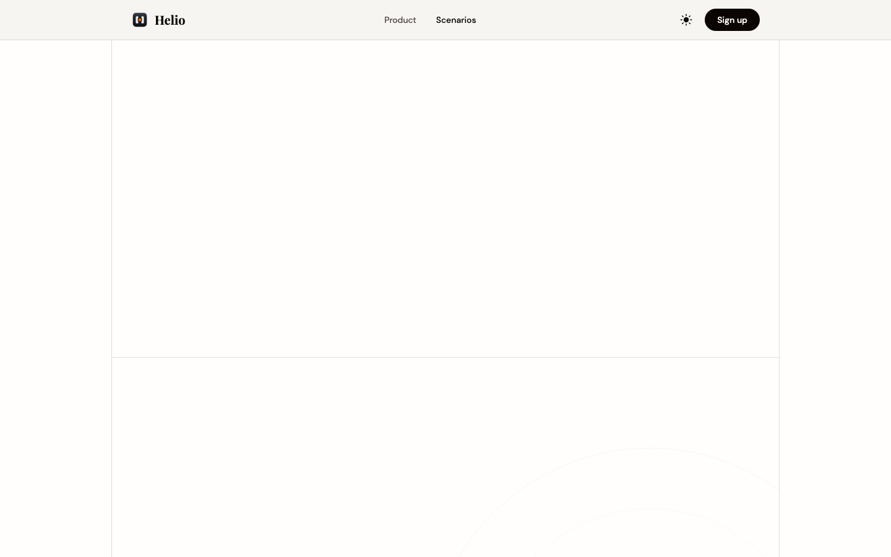
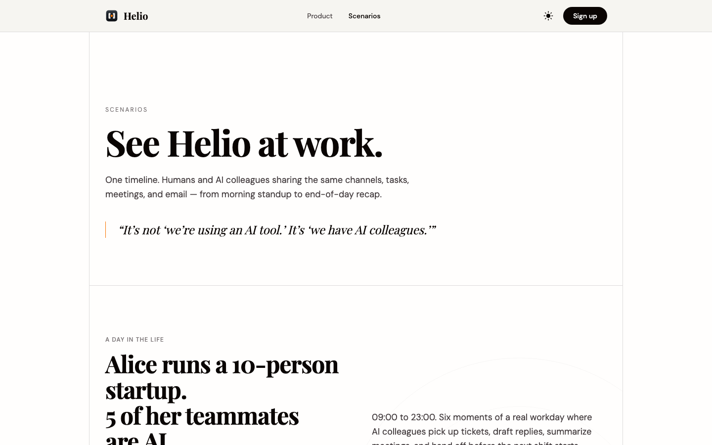
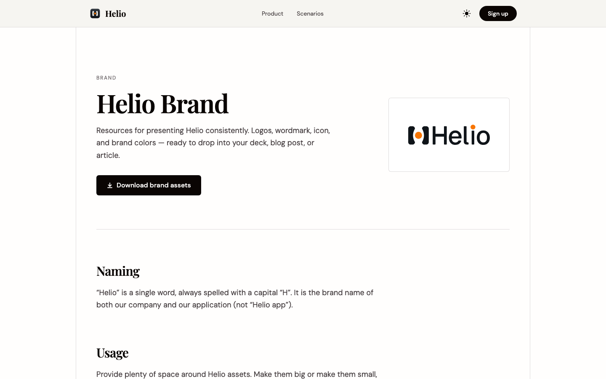

# www.helio.im 产品深度体验报告

## 报告信息

| 项 | 内容 |
|---|---|
| 产品名称 | www.helio.im |
| 产品 URL | https://www.helio.im/ |
| 体验时间 | 2026-05-29T22:48:28.993463 |

---

## 目录

- [1. 核心结论](#1-核心结论)
  - [1.1 一句话判定](#11-一句话判定)
  - [1.2 主要风险](#12-主要风险)
  - [1.3 主要亮点](#13-主要亮点)
  - [1.4 综合评分](#14-综合评分)
- [2. 产品概览](#2-产品概览)
  - [2.1 基础信息](#21-基础信息)
  - [2.2 测点速览](#22-测点速览)
  - [2.3 产品 / 公司背景信息](#23-产品--公司背景信息)
  - [2.4 产品定位与策略](#24-产品定位与策略)
  - [2.5 公司基本信息](#25-公司基本信息)
- [3. 体验流程记录](#3-体验流程记录)
  - [3.1 官网叙事分析](#31-官网叙事分析)
  - [3.2 测点流程详情](#32-测点流程详情)
- [4. 第三方社区反馈](#4-第三方社区反馈)
- [5. 从访客到注册的转化路径](#5-从访客到注册的转化路径)

---

## 1. 核心结论

### 1.1 一句话判定

目标产品 **https://www.helio.im/** 在本次深度体验中：存在显著的功能信息缺口。详见 §3 体验流程记录。

### 1.2 主要风险

1. **[C1]** P1 未说明 AI 如何接入真实系统**：页面演示 AI 能"rollback deploy a1aca80""trace API latency"，但完全没说这些动作如何对接真实的代码仓库 / CI/CD / 部署网关 / 监控（GitHub？PagerDuty？还是 Helio 自带网关）。读者无法判断 AI 是真能操作生产系统，还是 demo 内的模拟脚本——这是决定"产品能否真为我干活"的关键信息缺口。
2. **[C1]** P1 与现有工具栈的关系不明**：未交代 Helio 是要**替代** Slack/Linear 成为独立工作区，还是作为 AI 层**集成进**用户已有的 Slack、Linear、Jira。这直接决定采用成本和适用场景，页面只字未提集成清单。
3. **[C2]** P1 关键执行机制完全缺失:页面声称 AI 能"roll back deploy / ship auth rate-limit patch / trace latency spike",却完全没说明 AI 如何获得并执行对代码库、CI/CD、生产基础设施的访问权限、权限边界在哪、出错如何兜底。"它凭什么能真的改我的生产系统"是从"看起来酷"到"敢不敢用"之间最大的信息鸿沟。

### 1.3 主要亮点

1. **[C1]** ✅ 产品能力定位清晰**：页面用"AI Native workforce / 同坐一个频道、领同样的工单、交付同样的工作"把 Helio 的核心能力说明白了——它不是一个旁挂的聊天机器人，而是把 AI 同事（Ada、Hopper）嵌入到一套**类 Slack 频道 + 类 Linear 工单看板 + Calendar/Inbox** 的协作工作区里，AI 与人共用相同的状态（TODO/IN PROGRESS/IN REVIEW/DONE）、频道和 assignee。功能边界一眼可辨。
2. **[C1]** ✅ 用具体工作流演示了端到端能力**：incident 场景（发现 dashboard 宕机 → 定位到昨晚坏部署 → 回滚 → 通知受影响用户 → 写 postmortem 并把根因加进 backlog）配合工单看板上对应的 HEL-399 回滚、HEL-403 postmortem、HEL-402 roll-forward，完整展示了"AI 自己开单、自己流转、把进度发回频道"这一核心工作流，"AI that owns its own backlog"这一卖点被真实场景坐实。
3. **[C2]** ✅ 页面用一个完整的"生产事故处理"场景把抽象的"AI Native workforce"落到了可感知的端到端工作流:AI 同事(Ada/Hopper)自主发现 Dashboard 故障→定位为"昨晚的坏部署"→执行回滚→通知受影响用户→产出事故报告,人类只需一句"Thanks, good catch"。读者能直观理解 AI 不是聊天机器人,而是真正"接活、干活、交付"。

### 1.4 综合评分

| 维度 | 评分 | 1-2 句话说明（引用具体 [测点ID]） |
|---|---:|---|
| 产品方向清晰度 | 4.5 / 5 | 多个测点一致确认核心定位极清晰——AI 同事作为人类同级进驻统一工作区、共用同一套状态/频道/负责人 [C1][C4]，S1 用 6 个 PILLAR 把能力边界一刀切清并标注 LIVE TODAY [S1]；唯一模糊点是"替代还是集成现有工具栈"未交代 [C2][S3]。 |
| 价值主张表达力 | 4.0 / 5 | 用一个端到端生产事故闭环（发现→定位→回滚→通知→事故报告）把抽象的"AI Native workforce"落到可感知工作流，配合可交互 Live Demo 与"You decide what ships"的 human-in-the-loop 主张，卖点有力可感 [C1][C4][S3]；扣分因卖点可信度被"执行机制黑盒"拖累。 |
| 信息架构 | 2.5 / 5 | 顶部导航仅 Product/Scenarios/Sign up，缺 Pricing/Docs/Integrations/Security 入口 [C5]，且 Help/Docs、Use cases、Customers、Case studies、Blog 等页全部 [Link not found] [C7][S2][S4][S5][S6]，404 为框架默认页未产品化 [C8]；仅 S1 产品页本身组织良好。 |
| 功能广度与深度 | 3.5 / 5 | 广度足（6 大 pillar），Coding sessions 深度突出——披露持久化运行时、JuiceFS 挂载、Vault+KMS 信封加密、OpenFGA ACL，Tasks 讲透 atomic claim 与审批卡 [S1]；但 Email(05)/Meetings(06) 仅有标题零描述、AI teammates 章节被截断、"如何创建配置 AI 同事"缺失 [S1]。 |
| 核心能力可信度 | 2.5 / 5 | 几乎每个测点都提同一 P1：AI 如何真正接入并操作代码库/CI-CD/部署/监控完全是黑盒，无法区分真执行还是 demo 话术 [C1][C3][C4][S3]，且无客户 logo/案例/证言（均未找到）[S4][S5]；仅 S1 的工程级技术披露提供了部分可信支撑 [S1]。 |
| 商业化清晰度 | 1.0 / 5 | 名为 Pricing 的测点完全无任何定价信息——无套餐、无价格、无计费单位（按席位？按 AI 同事？按任务量？），买方首问"一个 AI 同事多少钱"完全未触及 [C2]，导航也无 Pricing 入口 [C5]。 |
| **综合平均** | **3.0 / 5** | **产品方向与价值主张表达堪称顶尖，但被"执行机制黑盒+零商业化信息+大量缺失页面"严重拖累，整体停留在"愿景清晰、落地与可信度待补"的合格线。** |

---

## 2. 产品概览

### 2.1 基础信息

- **URL**: https://www.helio.im/
- **首屏标题**: Helio
Product
Scenarios
Sign up
H
e
l
l
o
Your AI colleague that works beside yo

### 2.2 测点速览

本次共体验 20 个测点。

> ⚠️ **登录后内容未覆盖**——用户选择不登录，本报告仅为公开页范围；产品登录后的工作台 / 实际操作未在本报告内。

### 2.3 产品 / 公司背景信息

_本次未发现产品 / 公司的官方介绍页面。_

### 2.4 产品定位与策略

### 1. 把 AI 当成正式同事来用，而不是一个外挂的聊天工具
**核心判断**: Helio 把 AI 做成有名字、有头像、和人平级的"员工"（Ada、Hopper），让用户像派活给同事一样使用它。
**支撑证据**:
- [C1] 首页用 "AI Native workforce / 同坐一个频道、领同样的工单、交付同样的工作" 把 AI 定位成嵌入协作区的同事，而非旁挂机器人
- [C4] AI 同事作为"正式团队成员"进驻 Slack 式频道 + Linear 式任务板，可端到端处理工单
- [S1] 6 个 pillar 中专设 "AI teammates"，整体定位是"把 AI agent 当正式团队成员"的协作平台
**对用户的含义**: 用户的心智从"我去用一个工具"变成"我多了一个能接活的同事"，采用方式更接近招人而不是装软件。

### 2. 围绕一个统一工作台交付，而不是嵌进你现有的工具
**核心判断**: Helio 自带频道、任务板、邮件、日历、会议，是一个独立的协作工作区，而非挂在 Slack/Linear 上的 AI 插件。
**支撑证据**:
- [S1] 6 个 pillar（频道/任务/编程会话/AI 同事/邮件/会议）合起来约等于 Slack + Linear + Devin 的合体，是一整套自带平台
- [C2] 提供 "Download for macOS v0.3.15" 独立桌面应用，暗示是独立形态而非现有工具的扩展
- [C4][C5] 界面是自带的 Inbox / Tasks / Calendar / Channels 工作台
**对用户的含义**: 用 Helio 很可能意味着把团队协作迁移过来，而非给现有工具加一层 AI——绑定更深、采用成本也更高。

### 3. 让 AI 自己管理工作，人只保留"决定什么上线"的权力
**核心判断**: AI 自己开单、在看板上推进状态、把进度回贴频道并自主执行，而上线和敏感操作交给人审批。
**支撑证据**:
- [C1] AI 自己开单、自己流转、把进度发回频道，坐实 "AI that owns its own backlog"
- [S1] 明确 todo→in_progress→in_review→done 生命周期、atomic claim 防抢单、敏感操作走 human approval card、关闭任务为 human-only
- [S3] "Approve SOC2""Approve Q2 pricing" 等审批类任务派给 You，配合 "You stay in the loop and decide what ships"
**对用户的含义**: 用户得到的是一个能自主干活、但关键节点仍受控的协作者，既少了微管理又保住了把关权。

### 4. 让人和 AI 共用同一套工单与状态，而不是各开一个界面
**核心判断**: Helio 的差异化在于 AI 和人用完全相同的频道、工单、状态和负责人，落在同一条可追溯的轨道上。
**支撑证据**:
- [C1] AI 与人共用相同的 TODO/IN PROGRESS/IN REVIEW/DONE 状态、频道和 assignee
- [C3] 用 HEL-xxx 编号、#标签、AI/Y 头像区分主体，但全在同一套任务系统里流转
- [S1] 核心定位被概括为"人与 AI 共享同一消息平面 + 同一审计轨迹"
**对用户的含义**: 用户不必在"人的工具"和"AI 的工具"之间来回切换，所有工作和进度都汇在一处、可被审计。

### 5. 从工程研发场景切入，先把事故响应和写代码这类活做扎实
**核心判断**: 演示和最深入的能力披露都集中在 backend / infra / 事故响应 / 编程会话，工程是它的主战场。
**支撑证据**:
- [C5] 核心演示集中在 backend / infra / incidents 的事故闭环
- [S1] "Coding sessions" 披露持久化运行时（Claude Code / Codex）、JuiceFS 挂载、Vault + KMS 加密，深度远超普通落地页
- [C2][S3] AI 的动作是回滚部署、修尾延迟、ship rate-limit patch 等典型研发任务
**对用户的含义**: 工程团队能最快看懂它的价值；而看板里已出现的 #marketing / #product 等非工程岗位，能不能用、怎么用还不清楚。

### 6. 用深度技术细节建立"真能干活"的信任，却回避了集成和价格
**核心判断**: 它愿意把底层机制讲得很细来证明 AI 真能动手，却对"接哪些系统、怎么收费"全程留白。
**支撑证据**:
- [S1] 编程会话部分披露 JuiceFS、Vault + KMS 信封加密、OpenFGA ACL 等工程实现细节
- [C1][C3][C5][S3] 各测点反复指出：AI 如何接入真实代码库 / CI-CD / 监控去执行回滚，页面只字未提
- [C2] 名为 Pricing 的页面没有任何价格、套餐或计费单位（按席位？按 AI 数？按任务量？）
**对用户的含义**: 工程读者会相信"它技术上能干活"，但买家在"怎么落地、一个 AI 同事多少钱"上仍无从判断，决策被卡在最后一公里。

### 2.5 公司基本信息

#### ✅ 实体身份已确认（域名 ↔ 法律主体层面）

基于域名自家法律页面的交叉核对，目标产品 `helio.im` 的运营主体为：
**Lifecycle AI, LLC**（品牌名 / 产品名为 **Helio**）。

证据锚点（均直接锚链接到本域名）：
- 隐私政策与服务条款均明确署名运营主体为 "Lifecycle AI, LLC"，并标注品牌为 Helio、联系邮箱 `hello@helio.im` —— [helio.im/legal/privacy](https://www.helio.im/legal/privacy)、[helio.im/legal/terms](https://www.helio.im/legal/terms)
- 官网 footer 自我定义为 "the AI-native team workspace / AI Native workforce"，HQ 地址 600 California St, San Francisco —— [helio.im](https://www.helio.im/)

> ⚠️ **重名警告（务必区分，切勿混入下列任何一家的融资 / 团队 / 创始人数据）**：网络上以 "Helio / Helio AI / Helios" 命名的公司有多家，且**均不是**本目标 `helio.im`。详见本节末「重名实体甄别表」。

#### 公司基础事实表

| 项 | 内容 | 置信度 | 来源 |
|---|---|---|---|
| 公司名称 | Lifecycle AI, LLC（品牌：Helio） | ✅ 直接 | [privacy](https://www.helio.im/legal/privacy) / [terms](https://www.helio.im/legal/terms) |
| 成立年份 | 未公开（法律文件生效日 2026-05-15、官网 © 2026，⚠️ 间接提示主体较新，约 2025–2026，但无登记年份证据） | ⚠️ 间接 | [terms](https://www.helio.im/legal/terms) |
| 总部地点 | 运营地：600 California St, San Francisco, CA；注册地：Suite 201, 651 N Broad St, Middletown, New Castle, Delaware 19709 | ✅ 直接 | [helio.im](https://www.helio.im/) / [privacy](https://www.helio.im/legal/privacy) |
| 产品上线 | 未公开（产品已可用，`app.helio.im` 可注册、提供 macOS/Windows 桌面端；法律条款 2026-05-15 生效，⚠️ 提示近期上线） | ⚠️ 间接 | [helio.im/product](https://www.helio.im/product/) |
| 当前阶段 | 未公开（未检索到任何与本主体挂钩的融资轮次） | ❌→ 未找到 | — |
| 融资总额 | 未找到（公开报道中的 "Helio AI $1M Seed" 属另一家公司 helio-ai.com，**不计入**） | ❌→ 未找到 | — |
| 团队规模 | 未找到 | ❌→ 未找到 | — |
| 行业类别 | B2B SaaS — AI 原生团队协作工作空间 / "AI 同事"（channels、tasks、coding sessions、AI teammates、email、meetings 六大模块） | ✅ 直接 | [helio.im/product](https://www.helio.im/product/) |

#### 融资历史

| 轮次 | 时间 | 金额 | 领投 + 主要参与方 | 来源指向本域名? |
|---|---|---|---|---|
| —（未找到任何可与 `helio.im` / Lifecycle AI, LLC 显式挂钩的融资记录） | 未公开 | 未公开 | 未公开 | — |

> 说明：所有以域名锚定（`site:helio.im`、`"helio.im" funding`、`"Lifecycle AI, LLC"`）的搜索均未返回与本主体挂钩的融资公告、Crunchbase / PitchBook 主体页或新闻稿。该产品大概率处于早期 / 自筹或未披露阶段，亦可能融资信息尚未公开。

#### 创始人 / 核心团队背景

- **未找到** —— 官网、产品页、法律页面均未披露创始人或高管姓名；域名锚定搜索亦未找到任何 LinkedIn 个人页 / 新闻将某位创始人的 bio 链接到 `helio.im`。
  - 验证：公开检索到的 "Helio" 系创始人（如 Iako Jikia / Natia Kukhilava 等）均链接到 **helio-ai.com**（招聘平台），**与本域名无关**，不予采信。(⚠️ 主动排除)

#### 近期重大动态（最近 6–12 个月）

- 2026-05-15: 服务条款 / 隐私政策版本生效（运营主体 Lifecycle AI, LLC）[terms](https://www.helio.im/legal/terms)（验证：源自本域名 ✅）
- 近期（截至 2026-05）: 产品已开放注册 `app.helio.im`，提供 macOS / Windows 桌面客户端及 30 分钟 demo 预约 [helio.im/book-a-demo](https://www.helio.im/book-a-demo/)（验证：源自本域名 ✅）
- 未找到任何第三方媒体（TechCrunch / VentureBeat / Product Hunt 等）针对本主体的报道或上线 / 融资新闻。

#### 重名实体甄别表（均 ❌ 不是目标，仅供排除混淆）

| 候选实体 | 域名 | 主要业务 | 与 `helio.im` 的关系 | 来源 |
|---|---|---|---|---|
| Helio AI | helio-ai.com | AI 高频 / 一线招聘 agent，Tbilisi(格鲁吉亚)/Wilmington DE，CEO Iako Jikia，已融 $1.35M（$1M Seed + $350K pre-seed） | ❌ 名称相近但域名不同 | [finsmes](https://www.finsmes.com/2025/11/helio-ai-raises-1m-in-seed-funding.html) / [helio-ai.com](https://helio-ai.com/) |
| Helios（Proxi） | helios.sc | 面向公共政策 / 合规的 "AI 原生操作系统"，$4M Seed（Unusual Ventures 领投） | ❌ 不匹配 | [TechCrunch](https://techcrunch.com/2025/07/11/helios-wants-to-be-the-ai-operating-system-for-public-policy-professionals/) |
| Helios Artificial Intelligence | — | 食品 / 农业供应链 AI，$4.7M Seed，创始人 Francisco Martin-Rayo | ❌ 不匹配 | [The Packer](https://www.thepacker.com/news/industry/helios-ai-raises-4-7m-launches-ai-co-pilot-food-supply-chains) |
| Helio Genomics / Helio Home 等 | — | 基因检测 / 家居等，与 AI 协作工作空间无关 | ❌ 不匹配 | [PitchBook](https://pitchbook.com/profiles/company/297643-60) |

#### 综合判断

`helio.im` 的**主体身份在「域名 ↔ 法律实体」层面是确凿的**：运营方为美国特拉华注册、旧金山运营的 **Lifecycle AI, LLC**，产品定位为「AI 原生团队工作空间 / AI 同事」（让 AI 与人类在同一套 channels、任务看板、邮件、会议中并肩工作，外发动作保留人工审批闸门）。这是一个 2026 年前后才出现的早期产品 —— 已有可注册的 Web 端与桌面客户端、并主动开放 demo，说明处于早期商业化推广阶段。

但其**资本与团队画像几乎完全不透明**：未检索到任何可与该主体显式挂钩的融资轮次、投资方、创始人或团队规模数据。这既是该产品「新 + 低调」的客观反映，也是评估其持续性与执行力时的明显**信息短板**。需要特别强调的是，公开网络上高频出现的 "Helio AI $1M Seed / Iako Jikia / Tbilisi" 等信息属于另一家招聘 SaaS 公司（helio-ai.com），**与本目标无任何关系，已主动排除**，切勿据此误判其融资状况。建议人工补充以下任一线索后回填本节：该公司官方 LinkedIn / Crunchbase 主体页、创始人姓名、或任一引用 `helio.im` 的媒体报道 URL。

---

## 3. 体验流程记录

### 3.1 官网叙事分析

#### 高频关键词

| 关键词 / 短语 | 出现频次或权重 | 在哪类页面出现 | 想建立的印象 |
|---|---|---|---|
| AI 同事 / AI Native workforce / AI teammates（Ada、Hopper） | 极高，几乎每个测点必现 | 首页、产品页、登录/注册页、定价页 | 它不是工具或聊天机器人，而是和你平级的正式团队成员 |
| Same channels / same tickets / same task list humans use（同频道、同工单、同任务） | 极高，反复排比强调 | 首页、注册页、集成页、Footer | AI 不在你的工作流之外旁挂，而是"住"进你已有的协作方式里 |
| Owns its own backlog（自己开单、自己流转、回贴进度） | 高 | 首页、产品页、Blog 测点 | AI 能自我驱动、对工作负责，不用你盯着喂任务 |
| You stay in the loop / decide what ships（人在环、你决定上线） | 高 | 首页、定价页、集成页 | 自主但不失控，最终拍板权始终在你手里 |
| LIVE DEMO / LIVE TODAY | 中高 | 首页、产品页、登录页 | 这是真能跑的产品，不是 PPT 愿景 |
| TODO / IN PROGRESS / IN REVIEW / DONE + HEL-xxx 工单号 | 中高，视觉高频出现 | 全站看板演示 | 像 Linear 一样规范、可追溯、有问责 |
| Production incident / rollback / postmortem（事故闭环） | 中高，作为主叙事场景 | 首页、定价页、集成页 | AI 能扛最硬核、最高风险的真实工程活 |
| Human approval / Approve（SOC2、Q2 pricing） | 中 | 看板细节、集成页 | 有审批门控，企业级安全可控 |
| 6 个 PILLAR + JuiceFS / Vault / KMS / OpenFGA | 中（仅产品页深入） | 产品页 | 底层是认真做过工程的，技术可信 |

#### 说服手法分析

**1. 用一个完整真实场景代替抽象口号**
- 具体表现：通篇围绕一次生产事故展开——"发现 Dashboard 宕机 → 定位昨晚坏部署 → 回滚 → 通知受影响用户 → 写 postmortem 并把根因加进 backlog"，并以 "Thanks, good catch" [C2] 这样的真人口吻收尾。
- 想达到的效果：让读者在脑中"看到"AI 真的接活干活，比"提升团队效率"这类口号更可感、更难反驳。

**2. 给 AI 起人名，把它包装成同事而非软件**
- 具体表现：AI 不叫"助手"或"模型"，而叫 Ada、Hopper，和人类用同样的头像、assignee、DM、频道并排出现 [C1][C4]。
- 想达到的效果：触发拟人化认知，让用户默认它"像招了个人"，从而接受"AI 接管一块工作"这件事。

**3. 反复对标熟悉工具，降低理解门槛**
- 具体表现：界面与文案高度对齐 Slack（频道/DM）+ Linear（HEL- 工单、四态看板），并强调 "Same channels, same tickets, same task list humans use" [C3]。
- 想达到的效果：用户无需学习新范式，"哦这就是 Slack+Linear 里多了个会干活的同事"，心理迁移成本几乎为零。

**4. 先给自主、再给刹车，化解失控焦虑**
- 具体表现：一面演示 AI 未经询问就 "Roll back deploy a1aca80 on gateway" [S3]，一面用 "You stay in the loop and decide what ships" [C1] 兜底，并把 "Approve SOC2 auditor access" 等审批任务派给人类。
- 想达到的效果：既显得 AI 足够强（敢动生产），又安抚买方"最终还是我说了算"，把"敢不敢用"的门槛压低。

**5. 用"现在就能用"的标记和技术细节做可信度背书**
- 具体表现：可交互 Live Demo + 前三个 pillar 都标 "LIVE TODAY" [S1]，产品页进一步披露 JuiceFS 挂载、Vault+KMS 信封加密、OpenFGA ACL 等实现细节。
- 想达到的效果：把自己和满天飞的"AI agent 愿景稿"区隔开——暗示"别人在画饼，我们已经落地且工程扎实"。

#### 整体评价

它想让你感觉：Helio 不是又一个旁挂的 AI 助手，而是一支能住进你现有协作流、自己接活流转、敢碰生产系统、又始终听你最终发号施令的"AI 正式员工"。这套说法在"能干活"层面可信度偏高——场景演示、可交互 Demo、底层技术披露都做得扎实；但它系统性回避了最致命的一环：AI 究竟如何真正接入并操作代码仓库 / CI-CD / 生产系统，以及它与你现有 Slack/Linear/Jira 是替代还是同步。这个黑盒一天不打开，"AI 真替我干活"就始终停留在"看起来很可信的演示"而非"可验证的承诺"。

### 3.2 测点流程详情

### 🏠 首页（2 个测点）

**该模块覆盖页面**:

- `https://www.helio.im/`

#### C1: Homepage 5-second test

**URL:** https://www.helio.im/

**观察：**

- ✅ 产品能力定位清晰**：页面用"AI Native workforce / 同坐一个频道、领同样的工单、交付同样的工作"把 Helio 的核心能力说明白了——它不是一个旁挂的聊天机器人，而是把 AI 同事（Ada、Hopper）嵌入到一套**类 Slack 频道 + 类 Linear 工单看板 + Calendar/Inbox** 的协作工作区里，AI 与人共用相同的状态（TODO/IN PROGRESS/IN REVIEW/DONE）、频道和 assignee。功能边界一眼可辨。
- ✅ 用具体工作流演示了端到端能力**：incident 场景（发现 dashboard 宕机 → 定位到昨晚坏部署 → 回滚 → 通知受影响用户 → 写 postmortem 并把根因加进 backlog）配合工单看板上对应的 HEL-399 回滚、HEL-403 postmortem、HEL-402 roll-forward，完整展示了"AI 自己开单、自己流转、把进度发回频道"这一核心工作流，"AI that owns its own backlog"这一卖点被真实场景坐实。
- P1 未说明 AI 如何接入真实系统**：页面演示 AI 能"rollback deploy a1aca80""trace API latency"，但完全没说这些动作如何对接真实的代码仓库 / CI/CD / 部署网关 / 监控（GitHub？PagerDuty？还是 Helio 自带网关）。读者无法判断 AI 是真能操作生产系统，还是 demo 内的模拟脚本——这是决定"产品能否真为我干活"的关键信息缺口。
- P1 与现有工具栈的关系不明**：未交代 Helio 是要**替代** Slack/Linear 成为独立工作区，还是作为 AI 层**集成进**用户已有的 Slack、Linear、Jira。这直接决定采用成本和适用场景，页面只字未提集成清单。
- P2 "你决定什么上线"的把关机制缺细节**："You stay in the loop and decide what ships"是核心安全主张，但没说明审批是如何触发与执行的（哪些动作需人工 approve、IN REVIEW 是否=等人放行、AI 自主边界在哪）。看板里有"Approve SOC2 auditor access doc / Approve Q2 pricing"等人类审批项暗示了机制，但未明确规则。

#### C5: Footer audit

**URL:** https://www.helio.im/

**观察：**

- ✅ 页面用一个完整的生产事故闭环（发现 Dashboard 故障 → 定位到昨晚 bad deploy → 回滚 → 通知受影响用户 → 写事故报告并把根因加进 backlog）外加任务看板，清楚展示了产品核心能力：AI 同事能在频道里"接活"、自主建单/流转看板/回贴进度，人类只承担"决定什么上线"的把关角色。读完基本能理解"这产品能替我干什么"。
- P1** 关键工作机制缺失：演示只呈现了 AI 的**对话输出**（"Rolling back now"、"Incident report sent"），却完全没说明 AI 如何**真正执行动作**——回滚部署、加 p95 监控、给用户发通知背后接的是什么系统、走什么权限、调什么 API。用户无法判断这是真能动手干活，还是只是在聊天里"声称"自己干了。
- P2** 集成清单缺失：频道（#backend-v2 / #incidents / #infra）、工单（HEL- 前缀 + TODO/IN PROGRESS/IN REVIEW/DONE）形态酷似 Slack + Linear，但页面没交代这是 Helio 自带工作区，还是接入现有 Slack / GitHub / Linear / Jira / PagerDuty。文案强调"用人类同一份任务列表"，但"同一个系统"还是"双向同步"直接决定能否落地，未说明。
- P2** 顶部导航仅有 Product / Scenarios / Sign up，缺少 Pricing / Docs / Integrations / Security 等功能入口。对一个会"接 ticket、动生产部署"的产品，**可执行动作范围、权限边界、安全与审批机制**是最核心的功能疑问，却在信息架构里无处可查。
- P3** 适用场景偏工程侧：演示集中在 backend / infra / incidents，看板里虽出现 #marketing、#product、#launch、"Refresh pricing page copy"、"Draft launch post" 等标签暗示跨职能用途，但 AI 在非工程场景具体怎么完成（写文案、改定价页的输入输出与交付形式）未展开，跨职能能力边界不清。

### ✨ 产品功能 / 介绍（1 个测点）

**该模块覆盖页面**:

- `https://www.helio.im/product/`

#### S1: Features / Product page

**URL:** https://www.helio.im/product/

**观察：**

- ✅ 页面用 6 个 "PILLAR" 清晰拆出产品能力边界：统一频道(消息)、任务(工单流转)、编程会话(沙箱开发)、AI 同事(角色化 agent)、邮件、会议，核心定位 "人与 AI 共享同一消息平面 + 同一审计轨迹" 表达准确。读者能立刻判断这是"把 AI agent 当正式团队成员"的协作平台(≈ Slack + Linear + Devin 合体)，且每个 pillar 都标了 "LIVE TODAY" 让人区分愿景与已交付能力。
- ✅ "Coding sessions" 功能披露非常扎实，远超普通落地页：明确说明持久化运行时(Claude Code / Codex)、/workspaces 由 JuiceFS 挂载、/root 下 dotfiles 与 MCP 工具跨会话持久、密钥用 Vault + KMS 信封加密 + OpenFGA ACL。输入(工单)→机制(隔离会话、真实终端/文件系统)→输出(可审查 diff)链路清楚，工程读者能判断"它到底怎么干活、产物如何被审计"。
- ✅ "Tasks" 把 AI 自主工作流与问责机制讲透了：todo→in_progress→in_review→done 生命周期、atomic claim 防止两个 AI 抢同一任务、敏感操作走 human approval card、关闭任务为 human-only。直接回应了"如何让 AI 自主执行又不失控"这一真实痛点。
- P1**：两大 pillar "Email"(05) 与 "Meetings"(06) 在本页只有标题，零功能描述。读者无法判断邮件是"AI 代收发/起草"还是"邮件聚合进频道"，会议是"AI 参会纪要/转任务"还是"日程编排"，且未标注是否 LIVE TODAY(前三项都标了)，属于关键能力缺失。
- P1**：最核心卖点 "AI teammates" 章节内容被截断(仅剩编号 01 后无正文)，且全页未说明——如何创建/配置一个 AI 同事？背后用什么模型？除 Claude Code / Codex 外能否接入外部系统(CRM / 邮箱 / 日历 / 第三方 API)？工程/招聘/支持/运营各角色的能力差异是什么？用户读完仍不知"怎么让一个 AI 招聘同事真正开始干活"。

### ⭐ 客户案例（1 个测点）

**该模块覆盖页面**:

- `https://www.helio.im/`

#### S14: Customer support channels

**URL:** https://www.helio.im/

**观察：**

- P1（针对 S14 客服渠道）**：本页展示的是**内部团队协作频道**（#backend-v2、#incidents、#infra 等工程/事故频道），并非**面向外部客户的客服渠道**。整页未说明 Helio 如何接入真实客服入口（邮件、在线聊天、Zendesk/Intercom/Freshdesk 等工单系统）。唯一沾边的是事故场景中 Hopper "notify affected users / draft the incident report"——这属于内部事故沟通，而非客服工单处理。对想评估"AI 接管客服"场景的买家，本页无法给出答案。
- ✅ 核心能力演示清晰**：页面用 LIVE DEMO（点任意频道/成员、输入消息、AI 实时回复）+ 事故案例（Ada 定位坏部署→回滚→恢复，Hopper 通知用户并写报告）直观呈现了"AI 同事在频道里接活、推进、回报进度"的完整闭环，读者能快速理解产品在做什么。
- P2 集成 / 工作机制不明**：Demo 呈现的是一个自带 Inbox / Tasks / Calendar / 频道的独立应用。文案称 "sit in the same channels"、"same task list humans use"，却未说明这是**集成进现有工具**（Slack、Jira / Linear、GitHub）还是**自成一套的替代系统**；AI 究竟如何 "ship the same work"（写代码？提 PR？）也未交代——这是判断能否落地的关键信息缺口。
- P2 人机协作边界未细化**：宣称 "You stay in the loop and decide what ships"，任务板也出现 IN REVIEW 状态与人类审批项（HEL-410 批准 SOC2 文档）。但**何时升级给人、审批/交接如何触发与执行**没有说明，用户难以判断 AI 的自主程度与失控控制机制。
- P3 场景覆盖单一**：被完整演示的只有"工程生产事故"一个场景；任务板虽出现 #marketing、#product、#launch 等标签，但均无端到端示范。尤其对 S14 而言，缺少一个"AI 从接入到解决客户工单"的具体客服场景来支撑该能力主张。

### 💰 定价 / 商业化（1 个测点）

**该模块覆盖页面**:

- `https://www.helio.im/`

#### C2: Pricing page

**URL:** https://www.helio.im/

**观察：**

- ✅ 页面用一个完整的"生产事故处理"场景把抽象的"AI Native workforce"落到了可感知的端到端工作流:AI 同事(Ada/Hopper)自主发现 Dashboard 故障→定位为"昨晚的坏部署"→执行回滚→通知受影响用户→产出事故报告,人类只需一句"Thanks, good catch"。读者能直观理解 AI 不是聊天机器人,而是真正"接活、干活、交付"。
- ✅ 清晰揭示了差异化工作机制:AI 与人共用同一套任务系统(相同 status / channel / assignee),AI 自己开单(HEL-xxx)、自己在 TODO→IN PROGRESS→IN REVIEW→DONE 看板间流转、并把进度回贴到对应频道;配合"You decide what ships"与多条需人工 approve 的任务(HEL-410 SOC2、HEL-397 定价文案),说明这是 human-in-the-loop 协作模型而非全自动黑盒——"不用追问就能看到什么在审、什么落地"的价值点表达到位。
- P1 关键执行机制完全缺失:页面声称 AI 能"roll back deploy / ship auth rate-limit patch / trace latency spike",却完全没说明 AI 如何获得并执行对代码库、CI/CD、生产基础设施的访问权限、权限边界在哪、出错如何兜底。"它凭什么能真的改我的生产系统"是从"看起来酷"到"敢不敢用"之间最大的信息鸿沟。
- P1 集成模式不明:界面语义高度类似 Slack(频道 / DM)+ Linear(HEL- 工单),但"Download for macOS v0.3.15"又暗示是独立桌面应用。到底是接管 / 同步你现有的 Slack、Linear/Jira、GitHub,还是要求团队迁移到 Helio 自己的工作台?这直接决定落地成本,页面未给任何集成清单或答案。
- P1(针对 Pricing page 这一测点)名为定价页却无任何定价信息:节选中没有套餐、价格、计费单位(按席位?按 AI 同事数?按任务量?)或档位间的功能差异。对于一个"AI 增补 / 顶替人力"的产品,买方第一问题就是"一个 AI 同事多少钱、和招人怎么算账",此页完全未触及(若价格内容在节选之外的页面下方,需补充确认)。

### 🚪 注册 / 试用入口（1 个测点）

**该模块覆盖页面**:

- `https://www.helio.im/`

#### C3: Sign-up flow (no submit)

**URL:** https://www.helio.im/

**观察：**

- ✅ **核心能力表达清晰**：页面明确传达 Helio 的产品定位——AI 同事（Ada、Hopper）作为"人类同级"存在于统一工作区（频道 #backend-v2 / DM / 任务看板）中，并用一段具体的生产事故响应演示（发现坏部署→回滚→通知受影响用户→写事故报告）展示了 AI 实际"承接并完成工作"的工作流，比抽象口号更有说服力。
- ✅ **任务看板功能讲透了"解决什么问题"**：明确说明 AI 自己开 ticket、在 TODO/IN PROGRESS/IN REVIEW/DONE 之间流转、并把进度回贴到对应频道；解决的具体痛点是"无需追问就能看到什么在 review、什么阻塞、什么已交付"。AI 与人共用同一套状态/频道/负责人（HEL-xxx 编号、#标签、AI/Y 头像区分）这一机制描述得相当到位。
- P1**：未说明 AI 如何真正执行生产操作。演示里 Ada"回滚部署""修复尾延迟"，但页面完全没交代其工作机制——AI 是真的接入了代码仓库/CI-CD/监控系统去执行回滚，还是仅在聊天中模拟？输入（连接哪些系统/凭证）、输出（是否产出真实 PR/commit/运维动作）这一最关键的能力边界缺失，直接影响用户判断"它能不能真替我干活"。
- P2**：作为"注册流"测点，页面没有任何关于注册后能得到什么的功能信息——如何创建/配置一个 AI 同事、AI 的技能/权限由什么决定、团队席位与规模限制、定价档位。用户读完不知道"上手第一步要做什么"。
- P2**：集成范围不清。"Same channels, same tickets, same task list humans use"加上 macOS 客户端下载（v0.3.15），暗示 Helio 是一个独立替代型工作区，但它究竟是自带 IM+项目管理的封闭环境，还是能与现有 Slack / Linear / Jira / GitHub 双向同步，页面未给出集成清单，难以判断与现有团队工具链的契合度。

### 🔌 集成 / API（2 个测点）

**该模块覆盖页面**:

- `https://www.helio.im/`

#### S3: Integrations page

**URL:** https://www.helio.im/

**观察：**

- ✅ 核心能力演示清晰有力:页面通过一场"production incident"实景剧本 + 可交互 live demo,把产品能干什么讲透了——AI 同事(Ada/Hopper)与人同处一个工作区(Slack 式 channels + Linear 式任务板),能自主跑完"检测 Dashboard 故障→定位坏部署→回滚→通知受影响用户→写事故报告→把根因加进 backlog"的完整闭环。读完能明确建立"它能替我接管运维/事故响应这类活"的认知。
- ✅ "人在环"的协作模型用任务分配直观表达:任务板上"Approve SOC2 auditor access doc""Approve Q2 pricing page copy"等审批类任务明确 assign 给"You",执行类任务 assign 给 AI,配合"You stay in the loop and decide what ships"的文案——清楚传达了"AI 干活、人保留上线审批权"的功能边界。
- P1** 关键集成机制完全缺失(且本测点恰是 Integrations 页):demo 里 AI "Roll back deploy a1aca80 on gateway""Ship auth rate-limit patch",却完全没说明 AI 如何真正接入并操作底层系统——代码仓库、CI/CD、部署与监控工具具体是哪些、如何授权、回滚动作怎么执行。这是"AI 真能动手干活"还是"演示话术"的分水岭,作为集成页此处信息缺失最致命。
- P1** 与现有工具(Slack / Linear / Jira)的关系未交代:文案反复强调"Same task list humans use""same statuses, same channels, same assignees",但没说清 Helio 是一个要求团队迁移的全新独立工作区,还是双向同步 / 嵌入现有 Slack + Linear。这直接决定落地成本与采纳路径,却只字未提。
- P2** AI 的自主权限与护栏未说明:demo 中 AI 未经审批直接执行了生产环境回滚,但产品没解释自主边界(哪些动作可自动执行、哪些强制走审批)、权限范围、执行出错时的兜底机制,以及 AI 同事如何被配置 / 赋予角色与系统访问权——这些都是企业评估可用性与安全性的核心功能点。

#### S9: API / Developer docs

**URL:** https://www.helio.im/

**观察：**

- P1（关键功能描述缺失）**：测点定为「API / Developer docs」，但抓取到的整页内容是产品首页（AI 同事介绍 + 任务板演示），**没有任何 API 文档、SDK、endpoint、鉴权方式或开发者接入说明**。对开发者最核心的问题——「如何用代码接入 / 扩展 Helio，能否程序化创建任务或调用 AI 同事」——这一页完全无法回答。
- ✅（功能介绍清晰有力）**：页面清楚揭示了核心能力形态——AI 同事（Ada / Hopper）以「工位成员」身份进驻与人类共享的频道（#backend-v2 / #incidents / #infra）和任务板（TODO / IN PROGRESS / IN REVIEW / DONE，带优先级、负责人、标签、所属频道），并能**自主建单、在看板上流转状态、把进度回贴到对应频道**。本质是「Slack + Linear + 自主 AI agent」的组合，"AI that owns its own backlog" 这一卖点表达到位。
- ✅（用具体场景演示工作流）**：LIVE DEMO 用一个生产事故场景（仪表盘宕机 → 定位坏部署 → 回滚 → 通知受影响用户 → 写事故报告）端到端演示了 AI 自主处理工单的闭环，并反复强调 "you stay in the loop / decide what ships"，把「事故响应与工程杂务由谁来扛、人类如何保留控制权」这个问题讲清楚了。
- P1（关键工作机制缺失）**：页面让 AI 执行 "roll back deploy"、"ship auth rate-limit patch"、"trace API latency spike" 等真实工程动作，却**完全没说明 AI 究竟如何执行**——接入哪些 CI/CD、代码仓库、基础设施、监控系统？是真的改代码 / 触发发布，还是只产出建议供人执行？这是判断产品可用性的决定性细节，缺失会让人怀疑演示是「话术」还是「真能干活」。
- P2（功能信息不完整）**：集成边界与控制机制都没交代——产品以 macOS 桌面应用（v0.3.15，版本号显示仍是早期阶段）分发，但没说它是独立工作区还是接入已有的 Slack / GitHub / Jira / PagerDuty；"decide what ships" 背后的人类审批门、权限范围、AI 可执行动作的边界也未展开。此外演示几乎全在工程 / 事故场景，虽然任务里出现 #marketing / #product（写发布稿、刷新定价文案），但非工程角色的 AI 同事能力、以及不同角色 / 套餐的功能差异均未说明。

### 📰 博客 / 内容（1 个测点）

**该模块覆盖页面**:

- `https://www.helio.im/`

#### S6: Blog / Resources

**URL:** https://www.helio.im/

**观察：**

- P1 测点名为 "Blog / Resources" 但实际抓取到的是产品首页内容**（AI colleague / LIVE DEMO / Tasks 看板），页面中找不到任何博客文章、资源库、文档中心或案例库。对想深入了解产品的用户而言，缺少承载"集成指南 / 使用教程 / 更新日志 / 客户案例"的内容层，无法通过资源页进一步理解能力边界。
- ✅ 首页用具体事故场景把核心工作流讲清楚了**：LIVE DEMO 演示 Ada/Hopper 处理生产事故（定位坏部署→回滚→通知用户→出事故报告），配合 Tasks 看板的 TODO/IN PROGRESS/IN REVIEW/DONE 流转，清楚传达了"AI 同事与人同处一个频道、共用同一套任务系统、自行建单并推进"这一产品定位。
- P1 未说明 AI 同事如何接入真实系统**。Demo 中出现"回滚部署 a1aca80""加 p95 监控""发限流补丁"等动作，但页面完全没讲 Helio 接哪些工具（GitHub？CI/CD？监控告警？代码仓库权限如何授予），用户无法判断这些动作是真实执行还是仅演示文案。
- P2 缺少 AI 能力边界与人类管控机制的说明**。页面反复强调"You stay in the loop and decide what ships",但没说明如何给 AI 下指令、AI 可自主到什么程度、审批/护栏如何配置、哪些任务必须人工 review，关键的可控性信息缺失。
- P2 产品形态与可用范围信息不完整**。仅给出 "Download for macOS · v0.3.15",未说明是否有 Windows/Web 版、团队如何接入现有 Slack/Linear 工作流（还是必须迁移到 Helio 自带的频道+看板），也无定价/试用/接入门槛说明,用户难判断"能否在我现有工作流里用起来"。

### 🔑 登录入口（1 个测点）

**该模块覆盖页面**:

- `https://www.helio.im/`

#### C4: Login page

**URL:** https://www.helio.im/

**观察：**

- ✅ 页面非常具体地揭示了核心能力:AI 同事(Ada/Hopper)作为正式团队成员进驻"Slack 式频道 + Linear 式任务板",能端到端处理工单——演示完整呈现了一次生产事故闭环(发现 Dashboard 宕机 → 定位为昨夜坏部署 → 执行回滚 → 通知受影响用户 → 写事故报告并把根因入 backlog)。且不是空泛宣称,而用**可交互 Live Demo**(点频道/成员、输入消息 AI 实时回复)实证了工作流,读者能直观理解"产品在做什么"。
- ✅ 产品定位与解决的问题清晰:针对"AI 游离在人类既有协作流之外、需单独界面"的痛点,主张 AI 与人**同频道、同状态、同 assignee 并排工作**,并**自管 backlog**(自己开票、推进状态、回帖进度),让用户不必追问即可看到 in review/blocked/done。"You stay in the loop and decide what ships" 也点明人类保留发布决策权的边界。
- P1** 最关键的"AI 如何真正执行动作"的机制与集成完全缺失:演示里 AI 能"回滚部署 a1aca80""修 tail-latency",但页面只字未提 Helio 如何接入 GitHub / CI-CD / 部署系统 / 监控告警。整个价值主张依赖 AI 能在真实系统里采取行动,而落地机制(集成清单、调用权限、执行边界)是黑盒。
- P1** 工作区与现有工具的关系含糊:界面像一个自带的独立工作台(Inbox / Tasks / Calendar / Channels),却又宣称"humans 用的同一套任务列表与频道"。到底是**替换**现有 Slack+Linear+Jira,还是**插件式接入**它们?这直接决定迁移成本与适用场景,页面未澄清,易造成误解。
- P2** AI 同事的可配置性与自治边界未说明:Ada、Hopper 是预置角色还是用户可自建?能否按职能/技能定制、限定其可做与不可做的任务、设定"何时自动执行 vs 何时需人类审批"(任务板里"Approve SOC2 auditor access""Approve Q2 pricing copy"均派给人类 Y,暗示有审批门控却无规则解释)?此外定价、是否有 Web/非 macOS 端、单个 AI 的并发任务量、对非工程类工作(已出现 #marketing/#launch 标签)的胜任度均未提及。

### 📌 其他（4 个测点）

**该模块覆盖页面**:

- `https://www.helio.im/this-page-should-not-exist-product-audit-test-1234/`
- `https://www.helio.im/scenarios/`
- `https://www.helio.im/brand/`

#### C8: 404 error handling

**URL:** https://www.helio.im/this-page-should-not-exist-product-audit-test-1234/

**观察：**

- P2 404 页面未承担任何产品导航/恢复功能**：页面只有 "404 / This page could not be found." 两行文字，没有返回首页、站点搜索、热门功能入口或 sitemap 链接。从功能角度看，用户撞到失效链接后无法被引导回到任何可用功能模块，等于工作流被硬性中断。
- P2 错误页缺少产品自我说明能力**：这一页完全没有透露产品"能做什么"——既无核心功能入口、也无产品名称/价值描述。对通过外链或搜索引擎误入此页的潜在用户而言，无法借此页面理解该产品的任何能力，错失了一个低成本的功能曝光触点。
- P3 未提供失效内容的替代检索路径**：典型场景是文档/功能页改版后旧 URL 失效。成熟产品通常在 404 提供"你要找的可能是……"推荐、搜索框或最近更新入口；此页没有任何让用户自助定位目标功能的机制。
- P3 这是框架默认错误页，未做产品化定制**："This page could not be found." 是典型的 Next.js 默认 404 文案，说明产品未针对错误处理这一环节配置任何功能性内容（如客服/反馈入口、状态页链接、报错上报)。
- 功能信息缺口**：页面没说明失效是临时还是永久、是否有重定向规则、能否联系支持或反馈坏链——用户无从判断该问题是否会自行恢复，也无任何下一步功能动作可执行。

#### E1: 探索: Scenarios

**URL:** https://www.helio.im/scenarios/

**观察：**

- ✅ 清晰传达了核心产品形态**：页面用"一条时间线 + 人类与 AI 同事共享同一套 channels / tasks / meetings / email"把 Helio 定位讲透了——这不是单点 AI 工具，而是让多个有角色分工的 AI 同事（Ada 类幕僚长、AI Engineer、Recruiting/Meeting/Social AI）嵌入团队的协作空间。读完能明确"它要替我承担同事级的执行与协调工作"。
- ✅ 用具体工作流演示了能力闭环**：每个时点都给出"触发→动作→产出"的链条，例如 AI Engineer "看到 channel 里的 dashboard 需求→领取 ticket→开 coding session→产出 PR"，Recruiting AI "收到邮件→更新 task→设提醒→起草回复→生成审批卡片"。"approval card / 一键批准发送"的人类在环（human-in-loop）机制说明得最清楚，让人理解 AI 不是全自动黑箱。
- P1 大部分演示能力实际尚未可用，存在能力可得性误导**：六个时点中只有 09:00 Ada 与 10:30 AI Engineer 标注 LIVE TODAY，Recruiting AI 是 IN PREVIEW，而 Meeting AI、Social AI、以及晚间"private wiki 自学习"全是 COMING SOON。页面叙事把"现在能做"和"未来设想"混在同一条时间线里，用户极易误以为整套日常工作流都已可用——实际现在仅覆盖晨间简报、写代码出 PR 和事故响应。
- P1 关键集成与接入方式完全未交代**：AI Engineer 出 PR 接的是 GitHub/GitLab 还是自带仓库？Meeting AI "进会议室"支持 Zoom/Meet/Teams 哪些平台？Recruiting AI 读写的是 Gmail 还是 Outlook？Social AI 发到哪些社媒渠道？这些是判断"能不能接入我现有工具栈"的决定性信息，页面一概没提。
- P2 AI 同事的创建、配置与自治边界不清**：页面只展示了"AI 同事已经在干活"的结果，没说明如何创建/启用一个 AI 同事、能否自定义其角色与权限、它"主动领取 ticket"是真自治触发还是需人工派单、coding session 的自治程度（能否自行合并、是否必须人工 review）。用户无法判断落地时需要多少配置与监管成本。

#### E2: 探索: Scenarios

**URL:** https://www.helio.im/scenarios/

**观察：**

- ✅ 页面用"AI 同事"叙事清晰传达了产品定位:不是"用了一个 AI 工具",而是一组有明确角色分工的 AI 团队成员(ADA 运营总管 / AI Engineer 工程 / Recruiting AI 招聘 / Meeting AI 会议 / Social AI 社媒),与人类共享同一套 channels / tasks / meetings / email 时间线。"10 人团队、5 个是 AI"的具象设定让"产品能为我做什么"一目了然,功能演示有说服力。
- P1 功能成熟度标注(LIVE TODAY / IN PREVIEW / COMING SOON)虽诚实透明,但也暴露关键问题:6 个核心场景里只有 2 个(ADA 晨报、AI Engineer 写代码)是 LIVE TODAY,会议 AI、社媒 AI、ADA 私有 wiki 全部 COMING SOON——这条"a day in the life"完整工作流大部分尚不可用。用户若不细看标签,极易误以为整套能力已就绪。建议把"今日可买到的能力"与"路线图愿景"在结构上明确分层。
- P1 全程未说明任何外部集成,而这恰是判断"能否接入我自己工作流"的决定性信息。AI Engineer "opened a session、a PR will be ready"——接的是 GitHub/GitLab?支持什么语言栈?Recruiting AI 收发邮件——Gmail 还是 Outlook?Meeting AI 进会议——Zoom / Google Meet / Teams?Social AI 发帖——哪些平台?这些集成清单完全缺失。
- P2 "approval card / approval workflow"(人类一键审批 AI 草拟的邮件、社媒内容)是核心的 human-in-the-loop 机制,却只一笔带过:审批卡片里能看到什么?可否在审批前编辑?哪些动作必须人工审批、哪些 AI 可自主执行,是否能预设权限边界?这些工作机制未说明,而它直接关系到用户对"放手让 AI 干"的信任度。
- P3 ADA 的"private wiki / 把当天 durable lessons 写入、明天更懂团队"是有差异化的能力(AI 越用越贴合团队),但工作机制完全没讲——学什么、存在哪、是否每个 AI 各有 wiki、用户能否查看或编辑均无信息,目前更像概念而非可评估的功能点。

#### E3: 探索: Brand

**URL:** https://www.helio.im/brand/

**观察：**

- ✅ 页脚/导航暴露了一个明确的功能层事实：Helio 是**可下载的桌面应用**（同时提供 Download for Mac 与 Download for Windows），而非纯 Web 端产品——这是本页唯一可靠的产品形态信号，对判断"如何使用/在哪运行"有实际价值。
- 标语 "The workforce where your colleagues happen to be AI"（你的同事恰好是 AI 的工作团队）揭示了产品定位：**AI 数字员工 / AI 劳动力**类产品，主打"像同事一样协作的 AI"。但这是定位口号而非功能说明，读者无法从中得知 AI 同事具体能执行什么任务、如何分配工作、产出什么。
- 导航中的 **Scenarios（场景）** 项暗示产品采用"按使用场景"组织功能介绍的思路，是理解产品能力的关键入口——但本页未展开，真正的功能/工作流信息都在该页之外。
- P3（轻微，且属页面性质所限）**：本页本质是**品牌素材页**（Logo、字标、图标、品牌色、命名规范、使用授权），按设计就不承载产品功能信息。用户读完无法回答"这个产品能为我做什么"，但这对 Brand 页是合理的，不应按功能页标准苛责。
- 功能信息缺口**：全页没有任何关于 AI 同事的输入/输出、可对接的工具或数据源、协作/触发机制、适用岗位或团队规模的线索。要评估产品能力，必须转向 Overview 与 Scenarios 页——本页对"产品做什么"的审计贡献度极低。

### ⚠️ 未找到的测点（6 个测点）

**该模块覆盖页面**:

- `https://www.helio.im/`

#### C7: Help / Documentation

**URL:** https://www.helio.im/
**观察：**

- [Link not found] 该模板期望的链接（help|docs|documentation|support|帮助|文档）在 https://www.helio.im/ 上未找到 — 可能产品用了不同的措辞或这个功能不存在。 已跳过截图与 LLM 解读以避免重复首页快照。

#### S2: Use cases / Industry

**URL:** https://www.helio.im/
**观察：**

- [Link not found] 该模板期望的链接（use case|industries|solutions|应用场景|行业）在 https://www.helio.im/ 上未找到 — 可能产品用了不同的措辞或这个功能不存在。 已跳过截图与 LLM 解读以避免重复首页快照。

#### S4: Customer / logo wall

**URL:** https://www.helio.im/
**观察：**

- [Link not found] 该模板期望的链接（customers|clients|case studies|客户|案例）在 https://www.helio.im/ 上未找到 — 可能产品用了不同的措辞或这个功能不存在。 已跳过截图与 LLM 解读以避免重复首页快照。

#### S5: Case studies / Testimonials

**URL:** https://www.helio.im/
**观察：**

- [Link not found] 该模板期望的链接（case stud|testimonials|stories|案例|客户故事）在 https://www.helio.im/ 上未找到 — 可能产品用了不同的措辞或这个功能不存在。 已跳过截图与 LLM 解读以避免重复首页快照。

#### S7: About / Company

**URL:** https://www.helio.im/
**观察：**

- [Link not found] 该模板期望的链接（about|company|关于|公司）在 https://www.helio.im/ 上未找到 — 可能产品用了不同的措辞或这个功能不存在。 已跳过截图与 LLM 解读以避免重复首页快照。

#### S12: Trust / Security page

**URL:** https://www.helio.im/
**观察：**

- [Link not found] 该模板期望的链接（security|trust|compliance|安全|信任）在 https://www.helio.im/ 上未找到 — 可能产品用了不同的措辞或这个功能不存在。 已跳过截图与 LLM 解读以避免重复首页快照。

---

## 4. 第三方社区反馈

I searched all priority platforms with domain-anchored and concept-anchored queries, and verified each candidate rather than assuming:

- **Reddit** — no results for `helio.im` or the "AI colleague workspace" concept.
- **Product Hunt** — no page for helio.im; only namesakes (Helio music software, etc.) and *other* AI-coworker products (Cleo, Subspace, ChetakAI).
- **Hacker News** — confirmed **zero** via Algolia full-text *and* URL search (`nbHits:0`). The "Show HN: AI teammates" post was actually `acris.ai`, not helio.im.
- **G2 / Trustpilot / Capterra** — no helio.im reviews; results were unrelated Helios (red-light therapy, aquarium heaters, mobile carrier, `helio.app` UX research).
- I also confirmed the `$1M seed` "Helio AI" is a **separate** recruiting company (`helio-ai.com`), not this product. The only helio.im mention anywhere was a single TestingCatalog aggregator blurb on X restating the company's own marketing — not genuine user discussion.

This is the no-significant-discussion case, so the section is the minimal template:

#### ⚠️ 未找到显著社区讨论

WebSearch 在 Reddit / Product Hunt / Hacker News / G2 等平台未找到 `helio.im` 的显著用户讨论。本节内容为空——不代表产品好或差，仅说明社区讨论数据稀缺。

---

## 5. 从访客到注册的转化路径

⚠️ 本节 (§5 从访客到注册的转化路径) LLM 调用失败 — 可能是超时 / 会话限额 / 服务异常。
建议 session 重置后单独重跑 synthesis_pass，本节将自动补齐。
