# www.minerva.io 产品深度体验报告

## 报告信息

| 项 | 内容 |
|---|---|
| 产品名称 | www.minerva.io |
| 产品 URL | https://www.minerva.io/ |
| 体验时间 | 2026-06-20T08:42:50.074430 |

---

## 目录

- [1. 核心结论](#1-核心结论)
  - [1.1 一句话判定](#11-一句话判定)
  - [1.2 主要风险](#12-主要风险)
  - [1.3 主要亮点](#13-主要亮点)
  - [1.4 综合评分](#14-综合评分)
- [2. 产品概览](#2-产品概览)
  - [2.1 基础信息](#21-基础信息)
  - [2.2 测点速览](#22-测点速览)
  - [2.3 产品 / 公司背景信息](#23-产品--公司背景信息)
  - [2.4 产品定位与策略](#24-产品定位与策略)
  - [2.5 公司基本信息](#25-公司基本信息)
- [3. 体验流程记录](#3-体验流程记录)
  - [3.1 官网叙事分析](#31-官网叙事分析)
  - [3.2 测点流程详情](#32-测点流程详情)
- [4. 第三方社区反馈](#4-第三方社区反馈)
- [5. 从访客到注册的转化路径](#5-从访客到注册的转化路径)

---

## 1. 核心结论

### 1.1 一句话判定

目标产品 **https://www.minerva.io/** 在本次深度体验中：存在显著的功能信息缺口。详见 §3 体验流程记录。

### 1.2 主要风险

1. **[C1]** P1 三段式价值主张("understand → build campaigns → **measure and report on results**")中，第三段"衡量与报告结果"在页面上完全没有演示或佐证。demo 只覆盖前两段，归因/效果衡量/报表能力没有任何实例或机制说明，用户无法判断这块功能是否真实存在、如何运作。
2. **[C1]** P1 产品与实际广告平台/执行层的关系未界定：页面列出 Google Ads / Meta / Email / Direct Mail 并标注"CAMPAIGN ANALYSIS"，但看不出 Minerva 是只做"分析/推荐"，还是能"直接投放/执行"——会不会把受众和创意推送到我的广告账户？"agentic systems / delegating operational work to AI" 暗示有自主执行，可 demo 全是静态推荐结果，agent 到底自动做什么 vs. 只给建议，没有划清。
3. **[C2]** P1 多个核心功能术语零解释,用户无法判断"能为我做什么"**:`ADE`(Inbound integration across all sources with ADE)、`Golden Record Creation`、`Minerva Agents and proactive analytics`、`Minerva + 1P Person Search`、`User Events` 这些都是决定产品价值的关键能力,但全部只作为表格行项出现,既无展开说明也无示例。尤其 "Minerva agents" 作为 Enterprise 的核心卖点,完全没说明 agent 做什么、如何接入数据/CRM、是否自动执行营销动作。

### 1.3 主要亮点

1. **[C1]** ✅ 交互式 demo 把核心工作流的"理解受众 + 生成创意"两环讲得很具体：输入营销品类（Luxury Travel / Sports / 自定义）→ AI 输出带评分(94/100)、受众规模(1.78M)、平均财富($10.1M)的排序细分人群 → 再按渠道(Google Ads / Meta / Direct Mail / Email)给出 HOOK 文案和 CREATIVE BRIEF。输入→输出链路可感，用户能快速 get 到"产品能帮我做受众发现和创意构思"。
2. **[C2]** ✅ 页面清晰揭示了产品的核心能力栈与典型工作流**：从功能表可读出 Minerva 是一个"数据增强 + 受众管理 + 营销激活"平台——以 Person Search(查人)→ Bulk Enrichment(批量补全)→ Golden Record Creation(主数据合并)→ Export to CRM/Ad Platform/Direct Mail(多渠道激活) 构成完整链路,解决"打通自有客户数据并放大营销漏斗"的问题,功能定位比纯定价页给出的信息量更大。
3. **[C2]** ✅ RUM(Records Under Management)这一核心计量单位定义清楚**:明确说明是"在平台内管理、增强、激活的去重后的唯一个体",并与 credits(10,000 credits = 100 records)建立了换算关系,用户能理解自己到底在为"什么"付费,这是同类产品常缺失的关键说明。

### 1.4 综合评分

| 维度 | 评分 | 1-2 句话说明（引用具体 [测点ID]） |
|---|---:|---|
| 产品方向清晰度 | 3.5 / 5 | 核心工作流"找受众→出创意"通过交互式 demo 讲得清楚（[C1][M1][M5]），但边界模糊：定位 B2C 消费者营销却用 B2B 数据底座（[M2][M5]），且"只分析推荐"还是"直接投放执行/agent 自主到哪一步"始终未界定（[C1][M1]）。 |
| 价值主张表达力 | 4.0 / 5 | 输入→输出的可交互 demo（品类→带 Score/规模/财富的受众段→跨渠道创意）远比多数 SaaS 具体、可感（[C1][C5][M2]）；但三段式主张第三段"measure & report"零演示零佐证，说服力被打折（[C1][M1]）。 |
| 信息架构 | 2.5 / 5 | 站点偏薄：注册/登录/用例/帮助文档等模板预期入口均缺失或塌回首页（[C3][C4][M3][C7]），404 仅给"Go back home"无功能引导（[C8]）；仅导航 Platform/Customers/Pricing/API 与 Pricing 页组织尚清晰（[C8][C2]）。 |
| 功能广度与深度 | 3.0 / 5 | 广度可观——Pricing 页揭示查人→批量增强→Golden Record→多渠道导出的完整链路（[C2]），叠加创意生成与 API；但深度不足，ADE/Golden Record/Minerva Agents/User Events 等关键术语零解释（[C2]），API 暴露却无描述（[C5][C8]）。 |
| 核心能力可信度 | 3.5 / 5 | 数据底座可信度扎实：2.7 亿记录、1000+ 属性、2010 起每日更新、CCPA 合规 + 个体级画像 + Footer 安全合规报告（[M1][M2][C5]）；但 Score 94/100 与 Average Wealth 算法零定义（[C1][M2]）、agent 自主性与归因/报表能力无任何证据（[M1][M5]）。 |
| 商业化清晰度 | 3.5 / 5 | 计量单位 RUM 定义清晰并给出 credits 换算（10,000 credits=100 records），是同类常缺的关键说明（[C2]）；但套餐功能术语不解释、数据来源缺失致"10 Free Searches 值不值"无法判断，自助试用 vs Demo 能体验到哪层也未界定（[C2][C5]）。 |
| **综合平均** | **3.5 / 5** | **数据底座可信、demo 表达力强、RUM 计费清晰构成亮点，但信息架构偏薄、关键功能解释不足、"分析 vs 执行/agent 边界"留白，整体处于"合格偏上、潜力明显但需补全证据与动线"的水平。** |

---

## 2. 产品概览

### 2.1 基础信息

- **URL**: https://www.minerva.io/
- **首屏标题**: About
Our story and team
Blog & Media
News and announcements
Careers
Open roles 

### 2.2 测点速览

本次共体验 25 个测点。

> ⚠️ **登录后内容未覆盖**——用户选择不登录，本报告仅为公开页范围；产品登录后的工作台 / 实际操作未在本报告内。

### 2.3 产品 / 公司背景信息

共发现 **1** 个产品/公司的官方介绍页面：

#### B1: 背景 D1: SDK

**URL:** https://docs.minerva.io/sdk/introduction

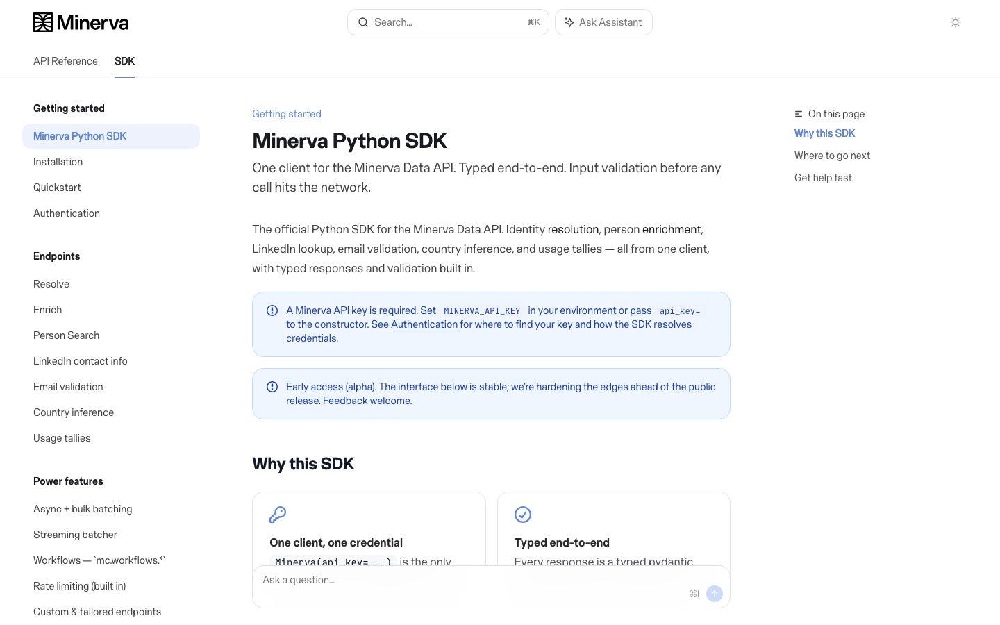

**背景信息：**

- ⚠️ 该背景介绍页 LLM 解读失败（超时 / 会话限额 / 服务异常），未生成结构化观察。


### 2.4 产品定位与策略

### 1. 它的根基是自有消费者数据库，卖的是数据加智能，而不是单纯的 AI 工具
**核心判断**: Minerva 的差异化护城河在专有消费者数据资产，AI 只是把这批数据变现的手段。
**支撑证据**:
- [M1] 反复强调数据底座：2.7 亿条记录、1000+ 属性、2010 年起每日更新、CCPA 合规，并能下钻到个体画像（Andy Wei，上东区，23 岁，初级销售）
- [C2] 功能栈以 Person Search → Bulk Enrichment → Golden Record Creation 为核心，本质是"查人 + 数据增强 + 主数据合并"
- [C5] 正文把 Enrichment / Standardization / since 2010 updated daily 当作"AI 为什么准"的工作机制来交代
**对用户的含义**: 你买的不是一个空模型，而是"接入一个现成的人群数据库 + 在其上的智能"，竞争力取决于这批数据是否覆盖你的客户、是否合规可用。

### 2. 面向营销负责人，主打把运营工作交给 AI 去做，而不是给一线投手提效
**核心判断**: 产品卖给决策层"减少人力、委派任务"，定位是替团队干活，而非给执行者做提效工具。
**支撑证据**:
- [C8] 全站核心定位文案为 "AI for marketing leaders"，公司名 Minerva BI
- [M1] 自称 "agentic systems / 把运营工作委派给 AI（delegating operational work to AI）"
- [M5] 把"把运营工作交给 AI"作为最核心卖点呈现
**对用户的含义**: 它的价值主张是"少招人/替代团队动作"，但 demo 全是一次性生成结果，AI 究竟能自主做到哪一步、哪里需要人审批，买家需要自行确认。

### 3. 目标是打通从受众发现到投放的完整营销链路，而不是只做洞察分析
**核心判断**: 它的野心是端到端营销平台，覆盖"找人 → 出创意 → 激活 → 衡量"，而非单点洞察工具。
**支撑证据**:
- [C2] 功能链路完整：Person Search → Bulk Enrichment → Golden Record → Export to CRM / Ad Platform / Direct Mail，构成"打通自有数据并放大漏斗"
- [C5] 首页演示从受众细分 → 跨渠道 Campaign Analysis → 创意产出（HOOK + Creative Brief）
- [M1] 三段式价值主张："理解客户 → 搭建 campaign → 衡量并汇报结果"
**对用户的含义**: 链路画得很大，但"激活/投放"和"衡量结果"两环在多处 P1 中都没被证明（始终分不清是分析建议还是真能投放），需自行确认它到底是"洞察工具"还是"执行系统"。

### 4. 按管理的去重人数（RUM）收费，把价格锚定在数据规模而非用量
**核心判断**: 计量单位是平台内管理的唯一个体数，付费随你的人群资产规模走，而不是按席位或对话次数。
**支撑证据**:
- [C2] 核心计量单位 RUM（Records Under Management）定义清楚：在平台内管理、增强、激活的去重唯一个体
- [C2] credits 与 records 建立明确换算（10,000 credits = 100 records），用户清楚自己在为"什么"付费
**对用户的含义**: 成本随你要管理/激活的受众规模增长，受众越大越贵——这是数据平台的定价逻辑，规模化前要先算清单位成本。

### 5. 自助试用与销售对接并行，真正的自主 AI 能力锁在企业版
**核心判断**: 用低门槛自助验证数据查询能力，但把高价值的自主 agent 留给企业销售层。
**支撑证据**:
- [C5] "Try Minerva"（自助试用）与 "Book a Demo"（销售对接）两条入口并存
- [C2] "10 Free Person Searches" 提供几乎零门槛的自助体验
- [C2] "Minerva Agents and proactive analytics" 被列为 Enterprise（企业版）的核心卖点
**对用户的含义**: 你能免费试到的只是"查人/数据"这一浅层能力，产品宣传的核心——自主 agent——需付费到企业层，说明它真正服务的是有预算的大客户。

### 2.5 公司基本信息

Entity identity confirmed: a news report links directly to `minerva.io` and the official footer (Minerva BI, Inc., Brooklyn NY) matches the press coverage (same founders, Brooklyn HQ, OpenAI collaboration). I have enough to write the section.

#### ✅ 实体身份已确认

基于域名 + 产品描述 + 新闻报道/官网交叉核对，目标产品 `minerva.io` 对应：**Minerva（法律实体：Minerva BI, Inc.）** —— 一家面向消费品牌营销负责人的 AI 营销平台。

交叉验证信号：
- ✅ 官网 footer 显式标注 "© 2026 Minerva BI, Inc."，地址 300 Kent Ave, Suite 305, Brooklyn, NY（[minerva.io](https://www.minerva.io/)）
- ✅ 融资报道正文超链接直接指向本域名 `minerva.io/?ref=...`（[The SaaS News](https://www.thesaasnews.com/news/minerva-raises-20m-seed/)）
- ✅ 报道描述的产品（统一第一方数据 + AI agent 营销工作流 + OpenAI 合作）、总部（Brooklyn, NY）与官网自述完全一致（[ppc.land](https://ppc.land/minerva-raises-20m-and-an-openai-deal-to-fix-marketers-broken-first-party-data/)）

#### 公司基础事实表

| 项 | 内容 | 置信度 | 来源 |
|---|---|---|---|
| 公司名称 | Minerva（法律实体 Minerva BI, Inc.） | ✅ 直接 | [minerva.io](https://www.minerva.io/) |
| 成立年份 | 约 2024 年（2026-06 公开亮相）；部分报道写 2026，存在分歧 | ⚠️ 来源不一致 | [ppc.land](https://ppc.land/minerva-raises-20m-and-an-openai-deal-to-fix-marketers-broken-first-party-data/) |
| 总部地点 | 美国纽约州 Brooklyn（300 Kent Ave, Suite 305） | ✅ 直接 | [minerva.io](https://www.minerva.io/) |
| 产品上线 | 2026 年 6 月 9 日正式公开发布 | ✅ 直接 | [BusinessWire](https://www.businesswire.com/news/home/20260609135497/en/) |
| 当前阶段 | Seed（种子轮，刚公开亮相） | ✅ 直接 | [The SaaS News](https://www.thesaasnews.com/news/minerva-raises-20m-seed/) |
| 融资总额 | $20M（单笔种子轮，截至目前唯一披露轮次） | ✅ 直接 | [Yahoo Finance / BusinessWire](https://finance.yahoo.com/sectors/technology/articles/minerva-launches-ai-platform-consumer-201500678.html) |
| 团队规模 | 未公开（早期阶段；上线即签约约 36 家客户） | ⚠️ 未披露 | [contentgrip](https://www.contentgrip.com/minerva-ai-consumer-marketing/) |
| 行业类别 | MarTech / AI 营销（消费品牌第一方数据 + Agentic AI 工作流） | ✅ 直接 | [minerva.io](https://www.minerva.io/) |

#### 融资历史

| 轮次 | 时间 | 金额 | 领投 + 主要参与方 | 来源指向本域名? |
|---|---|---|---|---|
| Seed | 2026-06-09 | $20M | The General Partnership、8VC、Lingotto Innovation、Topology Ventures、NBA Investments（并与 OpenAI 达成合作） | ✅（报道正文超链接到 minerva.io） |

> 注：截至检索时点，仅披露这一轮 $20M 种子轮，无更早或更晚轮次的公开记录。

#### 创始人 / 核心团队背景

三位联合创始人在加州大学伯克利分校（UC Berkeley）相识，早期均在金融行业起步：

- **Jackson Engles**（联合创始人 & CEO）— 曾任职于投行 Lazard；UC Berkeley。[LinkedIn](https://www.linkedin.com/in/jacksonengles/)
  - 验证：LinkedIn bio 标注 "co-founder & ceo of Minerva"，与本域名产品一致（✅）
- **Daniel Saedi**（联合创始人）— 曾任职于对冲基金 Bridgewater Associates；UC Berkeley。[ppc.land](https://ppc.land/minerva-raises-20m-and-an-openai-deal-to-fix-marketers-broken-first-party-data/)
  - 验证：见于发布报道的创始团队介绍（⚠️ 间接，个人页未单独核对）
- **Matthew Joseph**（联合创始人，多方报道指其负责技术 / CTO 角色）— 曾任职于对冲基金 Citadel；UC Berkeley。[ppc.land](https://ppc.land/minerva-raises-20m-and-an-openai-deal-to-fix-marketers-broken-first-party-data/)
  - 验证：见于发布报道的创始团队介绍（⚠️ 间接）

#### 近期重大动态（最近 6-12 个月）

- **2026-06-09**：Minerva 携 $20M 种子轮正式公开亮相，投资方包括 The General Partnership、8VC、Lingotto Innovation、Topology Ventures、NBA Investments [BusinessWire](https://www.businesswire.com/news/home/20260609135497/en/)（验证：官方新闻稿，✅）
- **2026-06-09**：同步宣布与 **OpenAI 合作**，平台两大 agent（Agentic Data Engineer / Agentic Data Scientist）构建于 GPT-5.5 之上，分别负责自动化数据建模 SQL 与自然语言生成预测模型 [ppc.land](https://ppc.land/minerva-raises-20m-and-an-openai-deal-to-fix-marketers-broken-first-party-data/)（验证：✅）
- **2026-06（上线即时）**：报道称发布时已**签约约 36 家（"three dozen"）客户**，早期成效披露为付费媒体 ROAS 提升约 3.4 倍、直邮 MQL 转化提升约 2.5 倍 [contentgrip](https://www.contentgrip.com/minerva-ai-consumer-marketing/)（验证：⚠️ 厂商提供数据，第三方未独立核实）
- **2026-06-09**：Axios 以独家形式报道该轮融资，归类为面向 MarTech 的企业软件交易 [Axios Pro](https://www.axios.com/pro/enterprise-software-deals/2026/06/09/martech-marketing-minerva-software)（验证：✅）

#### 综合判断

Minerva 是一家**极早期（种子轮刚刚浮出水面）**的 AI 营销初创，定位清晰：帮助消费品牌统一碎片化的第一方数据，并用 agent 自动化从数据准备、建模到投放、衡量的全链路营销工作流。其**资本与背书是当前最大亮点**——$20M 种子轮规模在种子阶段偏大，投资方阵容（8VC、The General Partnership、Lingotto、NBA Investments 等）以及与 OpenAI 的官方合作，给了它远超同期初创的资源与品牌信用；创始团队来自 Lazard / Bridgewater / Citadel 的金融数据背景，也契合"结构化数据 + 营销"的产品主张。

**短板与待观察点**：公司 2026 年 6 月才公开亮相，成立年份在不同来源间存在 2024 与 2026 的分歧，团队规模、留存与续费等运营数据尚未公开；"上线即 36 家客户、3.4x ROAS"等成效均为厂商自述，缺乏第三方独立验证。后续值得关注的方向包括：OpenAI 合作能否转化为产品壁垒、第一方数据 + agent 工作流在真实企业落地中的稳定性，以及在拥挤的 MarTech / CDP 赛道中的差异化与下一轮融资节奏。

---

## 3. 体验流程记录

### 3.1 官网叙事分析

#### 高频关键词

| 关键词 / 短语 | 出现频次 / 权重 | 在哪类页面出现 | 想建立的印象 |
|---|---|---|---|
| agentic systems / delegating operational work to AI（把运营交给 AI） | 极高（M1/M5/S1/首页反复出现） | 首页主张、能力页 | 这不是工具，是能替你干活的"AI 同事"，代表营销的未来形态 |
| 270M 记录 / 1000+ 属性 / 2010 起每日更新 / CCPA 合规 | 极高（几乎每个测点都出现） | 首页正文、页脚、能力页 | 智能背后有别人没有的专有数据护城河，"AI 为什么准"有据可依 |
| Score 94/100 / Average Wealth $10.1M / Audience Size 1.78M | 极高（demo 核心展示） | 首页交互 demo、受众页 | 输出是精确、可量化、可排序的，像数据科学而非拍脑袋 |
| Consumer Marketing（消费者营销） | 高 | 页头定位反复强调 | 我们专攻 C 端营销，垂直且专业 |
| understand → build campaigns → measure and report（三段式工作流） | 高 | 首页价值主张 | 覆盖"懂客户→建活动→看效果"的端到端闭环 |
| HOOK + CREATIVE BRIEF（钩子文案 + 创意简报） | 中高 | demo 输出环节 | 不止给人群，还直接给可用的创意成品 |
| Enrichment / Standardization（富化 / 标准化） | 中 | 数据底座说明 | 有专业的数据处理能力词，显得技术扎实 |
| 具名个人画像（Andy Wei，上东区，23 岁，初级销售） | 中 | demo、页脚信任区 | 数据能下钻到真实个体，颗粒度细到"看得见的人" |

#### 说服手法分析

**1. 用具体数字给一切背书**
- 具体表现："SCORE 94/100"、"AVERAGE WEALTH $10.1M"、"270M records、1000+ attributes"[M5/M2/M1]
- 想达到的效果：用精确到个位的数字制造"这是算法算出来的、不是感觉"的客观可信感——哪怕这些指标的算法口径从未解释。

**2. 给数据起真名（具名个体画像）**
- 具体表现："Andy Wei, Upper East Side, 23岁, Junior Sales Associate"、"Marcus Johnson, 高中篮球教练"[C5/C1]
- 想达到的效果：把抽象的"2.7 亿条记录"变成看得见摸得着的真人，让"我们真的懂消费者"这句空话有了实体支撑。

**3. 可交互 demo 当证据，让用户自己说服自己**
- 具体表现：选品类（Luxury Travel / Sports）→ 实时输出排序受众 + 创意 brief 的输入→输出链路[C1/M3/S1]
- 想达到的效果：不靠文案吹，让用户亲手跑一遍流程，"亲眼看到"产品能干活，比任何承诺都更有说服力。

**4. 数据护城河 + 合规叙事，先立权威**
- 具体表现："most comprehensive CCPA compliant through-time B2B... since 2010, updated daily"，并把 Security Report 常驻页脚[M5/C5]
- 想达到的效果：用"建得最早、最全、最合规"占据数据制高点，让买家相信壁垒来自数据资产而非可复制的功能。

**5. 把产品架在"未来工作方式"上**
- 具体表现："agentic systems / delegating operational work to AI"[M1/M5]
- 想达到的效果：把自己从"又一个营销工具"抬升为营销范式转变的代表，制造"不用就落后"的紧迫感。

#### 整体评价

它想让用户感觉自己是一个**建立在十多年专有消费者数据之上、能自主替营销人干活的"AI 营销代理"**——既有数据深度（具名个体、千属性），又有未来感（agentic）。可信度上，**"懂受众 + 出创意"前半段靠可交互 demo 和具体数据撑得相当扎实**；但**"自主执行/直接投放"和"衡量上报效果"的后半段只有口号没有演示，关键指标算法、数据接入方式、B2C 与 B2B 定位的矛盾均未解释**——属于"前半实、后半虚"的高完成度营销叙事。

### 3.2 测点流程详情


### 🏠 首页（2 个测点）

**该模块覆盖页面**:

- `https://www.minerva.io/`

#### C1: Homepage 5-second test

**URL:** https://www.minerva.io/

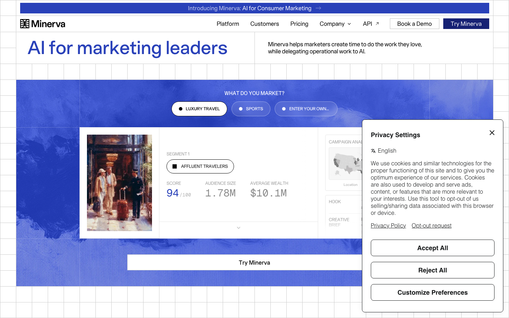

**观察：**

- ✅ 交互式 demo 把核心工作流的"理解受众 + 生成创意"两环讲得很具体：输入营销品类（Luxury Travel / Sports / 自定义）→ AI 输出带评分(94/100)、受众规模(1.78M)、平均财富($10.1M)的排序细分人群 → 再按渠道(Google Ads / Meta / Direct Mail / Email)给出 HOOK 文案和 CREATIVE BRIEF。输入→输出链路可感，用户能快速 get 到"产品能帮我做受众发现和创意构思"。
- P1 三段式价值主张("understand → build campaigns → **measure and report on results**")中，第三段"衡量与报告结果"在页面上完全没有演示或佐证。demo 只覆盖前两段，归因/效果衡量/报表能力没有任何实例或机制说明，用户无法判断这块功能是否真实存在、如何运作。
- P1 产品与实际广告平台/执行层的关系未界定：页面列出 Google Ads / Meta / Email / Direct Mail 并标注"CAMPAIGN ANALYSIS"，但看不出 Minerva 是只做"分析/推荐"，还是能"直接投放/执行"——会不会把受众和创意推送到我的广告账户？"agentic systems / delegating operational work to AI" 暗示有自主执行，可 demo 全是静态推荐结果，agent 到底自动做什么 vs. 只给建议，没有划清。
- P2 营销方自有数据/客户如何接入未交代：270M 记录、1000+ 属性是数据护城河，但不清楚产品是只基于 Minerva 自有人群库工作，还是能接入/丰富我的 CRM、first-party 受众。个人级画像(Marcus Johnson, 高中篮球教练)说明有人本级数据，但"如何把这些人匹配到我的现有客户 / 能否上传我的数据"这一关键集成点缺失。
- P3 两个关键输出指标 "SCORE 94/100" 与 "AVERAGE WEALTH" 缺少定义：评分衡量的是契合度、转化潜力还是受众质量？财富值如何估算、对定向意味着什么？指标很吸睛但没解释算法，影响用户对输出可信度的判断。

#### C5: Footer audit

**URL:** https://www.minerva.io/

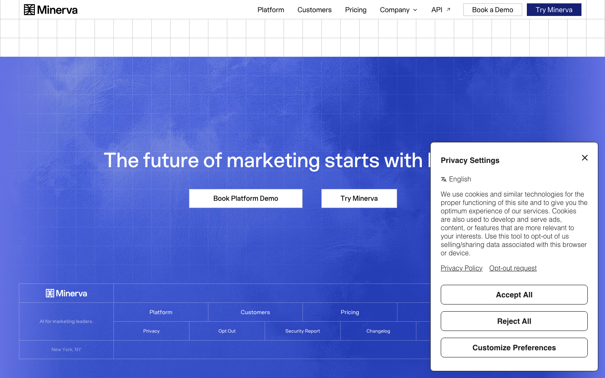

**观察：**

- ✅ 落地页用一条完整的"输入→输出"链路把核心能力讲透了**：用户选择营销品类（Luxury Travel / Sports / 自定义）作为输入，产品输出 ① 排序后的受众细分（带 Score、Audience Size、Average Wealth 三个量化指标）② 跨渠道 Campaign Analysis（Meta / Pinterest / Email / Influencer / Location / Engagement）③ 可直接用的创意（HOOK + CREATIVE BRIEF）。这清楚回答了"产品能为营销人做什么"——从受众发现到创意生成的 agentic 工作流。
- ✅ Footer 的 "Security Report / Security and compliance" + "Changelog / What's new" 是有效的功能性信任与成熟度信号**：考虑到产品处理消费者 PII（页面甚至展示了具名个人 "Andy Wei, Upper East Side, 23岁, Junior Sales Associate"），把合规/安全报告做成 footer 常驻入口，配合正文 "CCPA compliant、270M records、1000+ attributes、since 2010 updated daily" 的数据底座说明，向企业买家交代了"AI 为什么准"的工作机制（Enrichment + Standardization + through-time B2B2C 数据集）。
- P2 Footer 的 "API" 入口暴露了一项关键能力却零描述**：API 链接强烈暗示可编程访问（受众细分 / 数据 enrichment / 查询），但 footer 与本页都未说明 API 提供什么——是输出受众段、做数据富化、还是查询原始 profile？开发者/技术买家无法判断集成方式与适用场景。
- P1 缺失"激活/集成"这一最关键的功能闭环**：页面把 Meta / Pinterest / Email / Influencer 标为 "Campaign Analysis"，但没说明产品到底是**只做分析与建议**，还是能**把生成的受众段真正推送/对接到这些广告平台和 CRM 去投放**。这决定了它是"洞察工具"还是"端到端营销执行平台"，是买家最想确认却完全没交代的功能点。
- P3 "Try Minerva" 与 "Book a Demo" 两条入口并存，但未说明自助试用能体验到哪些功能**：footer/CTA 暗示存在自助试用通道（区别于需销售对接的 Demo），却没界定试用版可访问的数据范围、细分能力或 API——用户无法预判"免费试用"能验证到产品的哪一层能力。


### 🤖 AI 能力 / Agent（2 个测点）

**该模块覆盖页面**:

- `https://www.minerva.io/`

#### M1: Agent inventory / team page

**URL:** https://www.minerva.io/


**观察：**

- ✅ 页面通过交互式 demo 清晰演示了核心工作流：**输入营销品类（如 Luxury Travel）→ 输出排序后的受众细分**（Segment 1/2/3，每个带 SCORE 契合度、AUDIENCE SIZE 受众规模、AVERAGE WEALTH 平均财富）→ 再到 **CAMPAIGN ANALYSIS（跨 Google Ads/Meta/Direct Mail/Email 渠道）和创意产出（HOOK 广告钩子 + CREATIVE BRIEF 创意简报）**。这条"找人群→出创意"的链路展示得很具体，用户能直观理解产品能为营销人做什么。
- ✅ 数据底座的功能可信度交代得相当扎实：**2.7 亿条记录、1,000+ 属性、2010 年起每日更新、CCPA 合规**，并展示了个体级数据颗粒度（"Andy Wei，曼哈顿上东区，23 岁，初级销售"），配合 Enrichment（数据补全）与 Standardization（标准化）两项能力——明确传达了"产品的智能建立在专有消费者数据之上"这一差异化机制。
- P1 核心动作究竟是"分析"还是"投放执行"未说清**：CAMPAIGN ANALYSIS 罗列了 Google Ads/Meta/Email 等渠道并生成 HOOK 与创意简报，但没有说明 Minerva 是**直接对接并投放到这些广告平台（activation）**，还是仅输出建议供人工执行。这是营销人决定能否替代现有工作流的关键判断点，页面留白。
- P1 自称"agentic systems / 委派运营工作给 AI"，但未说明 agent 的自主边界**：demo 呈现的是一次性生成结果，看不出 AI agent 究竟能**自主完成哪些运营任务、是否持续运行、人需要在哪些环节介入审批**。"delegating operational work to AI" 这一核心卖点缺少可验证的功能描述支撑。
- P2 闭环的"measure and report on results"完全没有功能细节**：首页声称产品覆盖"理解客户→建活动→衡量并报告效果"三段，但前两段有 demo，第三段（效果归因、报表、ROI 衡量）零展示——用户无法判断这是真功能还是营销话术。

#### M2: Agent profile (sample)

**URL:** https://www.minerva.io/


**观察：**

- ✅ 页面用一条可交互的"输入→输出"链路清晰展示了核心工作流**：用户选择营销品类（奢华旅行 / 体育 / 自定义）→ AI 自动产出排序后的受众细分（如"Affluent Travelers / Family Trip Organizers / Romantic Getaway Seekers"，每个带 Score、Audience Size、Average Wealth）→ 再延伸到跨渠道 Campaign Analysis（Google Ads / Meta / Direct Mail / Email）并生成 Hook 文案与 Creative Brief。读完能直观理解产品"从找受众到出营销策略"的端到端能力。
- ✅ 数据底座的能力描述具体且有说服力**：明确给出"2.7 亿条记录、1000+ 属性、自 2010 年起每日更新、through-time、CCPA 合规"，并出现 Enrichment / Standardization 等能力词；个人级样本（Andy Wei，上东区，23 岁，Junior Sales Associate）进一步说明产品可下钻到**个体消费者画像**而非仅群体统计——这是对"AI understands your consumers"主张的有效功能佐证。
- P1 核心指标"Score 94/100"的定义完全缺失**：它是衡量受众与品牌的契合度、转化潜力，还是细分价值？这是整个 demo 输出里最显眼的决策数字，却无任何口径说明，用户无法判断该如何使用它——属于关键功能语义的误导风险。
- P1 "build campaigns / measure and report" 是建议还是执行未说清**：页面声称帮marketers"构建活动并衡量上报结果"，且列出了具体投放渠道，但没有说明 Minerva 是**只产出 Creative Brief/Hook 等建议**，还是能真正接入并推送/激活 Google Ads、Meta 等平台。这决定了它是"策略参谋"还是"投放执行系统"，是采购决策的核心功能边界。
- P2 集成 / 数据接入方式与 B2B↔消费者定位的矛盾未澄清**：产品定位是"Consumer Marketing"，但数据底座却描述为"comprehensive B2B"，二者关系（B2B 数据如何服务消费者营销、财富/收入数据来源与精度）没有解释；同时缺少与用户自有 CRM、广告账户、CDP 的对接说明——用户无法判断要接入什么数据、能否打通自家系统。


### ✨ 产品功能 / 介绍（1 个测点）

**该模块覆盖页面**:

- `https://www.minerva.io/`

#### S1: Features / Product page

**URL:** https://www.minerva.io/

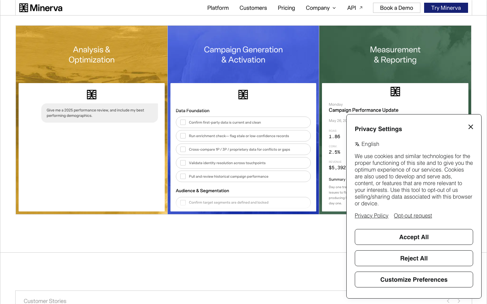

**观察：**

- ✅ **核心能力演示清晰（受众发现 + 创意生成）**：交互式 demo 把"输入→输出"闭环讲透了——输入营销品类（奢侈旅游/体育/自定义），输出多个排序受众分群，每个带匹配分数(94/100)、受众规模(1.78M)、平均财富($10.1M)，再进一步产出广告 HOOK 文案与 CREATIVE BRIEF 定位策略。用户能直观理解"喂进一个品类，拿到可执行的目标人群+创意方向"。
- ✅ **数据资产作为能力底座说明有力**：明确量化了底层数据——2.7 亿条记录、1000+ 属性、自 2010 起每日更新、CCPA 合规，且能下钻到个人级画像（如 Andy Wei：23 岁/男/初级销售/曼哈顿上东区，以及收入区间、城市、分数）。这把"AI 凭什么更准"落到了数据规模与粒度上，解决营销人"找谁/找得准不准"的信任问题。
- P2 三段工作流只演示了两段**：页面自述价值是"理解客户 → 搭建 campaign → 衡量并报告结果(measure and report on results)"，但全程只演示了前两段（细分+创意），第三段"衡量/归因/报告"没有任何功能细节、产出样例或界面证据，用户无法判断 Minerva 的效果度量能力到底是什么。
- P2 渠道环节"分析"还是"激活"含糊**：Campaign Analysis 列出 Google Ads / Meta / Direct Mail / Email / Location / Engagement，但没说明 Minerva 对这些渠道究竟做什么——仅给渠道级建议/创意，还是能直接对接广告平台投放(activation)？生成的受众分群能否导出、或一键推送到 Meta/Google 受众包？关键的"集成与激活"链路缺失，影响"我能不能真正用它跑投放"的判断。
- P2 定位与数据口径疑似冲突**：顶部主张"AI for Consumer Marketing"（消费者/B2C 营销），但数据描述却写"most comprehensive… through-time **B2B**"（且该句被截断）。产品到底服务 B2C 还是 B2B 目标人群、抑或两者兼顾，没有澄清——这是判断"是否适用于我的业务场景"的关键信息缺口。此外页面反复用"agentic systems / 代理系统"措辞，但除分群生成外，并未具体展示 AI agent 究竟能自主完成哪些动作。


### ⭐ 客户案例（3 个测点）

**该模块覆盖页面**:

- `https://www.minerva.io/customers`
- `https://www.minerva.io/`
- `https://www.minerva.io/customers/wander`

#### S4: Customer / logo wall

**URL:** https://www.minerva.io/customers

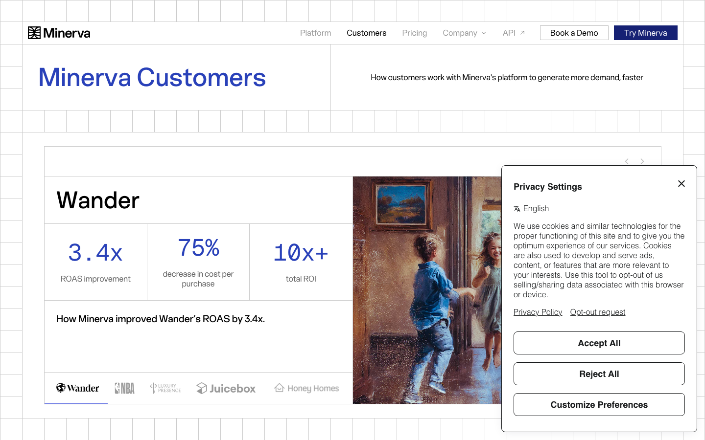

**观察：**

- ✅ 通过跨行业客户案例（NBA 粉丝互动、Luxury Presence 房产 CRM、Juicebox 招聘、Honey Homes 家政、Trust & Will 遗产规划）+ 具体指标（Wander ROAS 提升 3.4x、单次购买成本下降 75%、总 ROI 10x+），页面清晰传达了产品定位：一个面向营销负责人、以"更快生成更多需求（demand generation）"为目标的 AI 营销/投放效果平台，且适用面覆盖 B2C 与 B2B、多个垂直行业。
- ✅ Trust & Will 案例描述（"identify life events and deliver timely estate planning support"）是全页信息量最高的功能线索——它暗示了一项核心能力：**识别用户生命事件/信号 → 在恰当时机触发精准触达**，即基于信号的事件驱动型营销激活，而非泛投放。
- P1 严重：整页只呈现"结果"（ROAS、CPP、ROI、直邮回应率 2.5x），却完全没有说明 Minerva **靠什么机制达成这些结果**——产品的输入是什么（受众数据？广告账户？CRM？）、输出是什么（投放策略？创意？受众分群？自动化campaign？）、用户实际操作流程是怎样的。读者无法从本页判断"这个产品具体为我做什么、我要接入什么"。
- P2 中等：Juicebox 案例提到"agentic activation"、Honey Homes 提到"direct mail"，暗示产品同时覆盖**数字广告投放 + 直邮等多渠道**并带有 agent 能力，但页面既未给出支持的渠道清单，也未解释这个 "agent" 究竟自动执行哪些任务，能力边界模糊。
- P2 中等：作为 Customers 页，缺少**集成与数据接入信息**——这些客户是如何把自己的广告平台（Meta/Google）、CRM、第一方数据接入 Minerva 的，页面只字未提，潜在用户难以评估接入成本与可行性（功能细节需点进各案例详情页才可能补全，但本页本身留有缺口）。

#### S14: Customer support channels

**URL:** https://www.minerva.io/

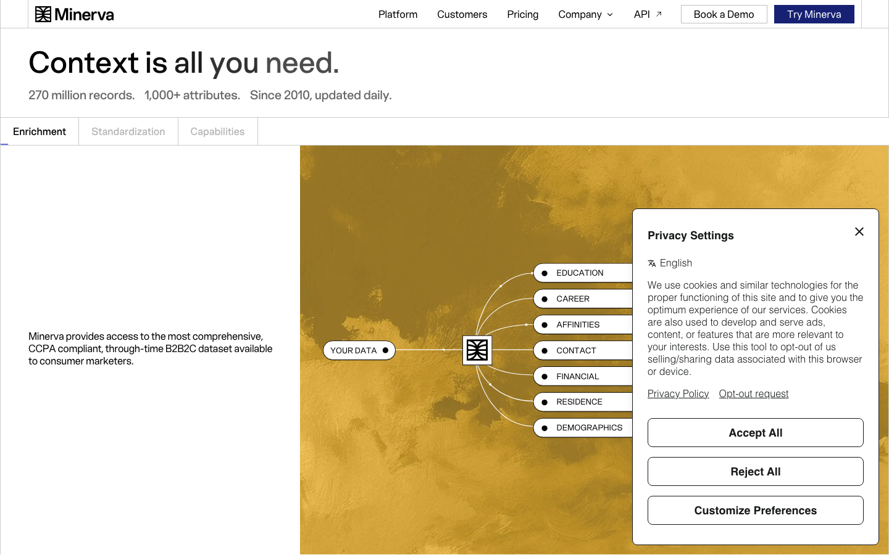

**观察：**

- ⚠️ 该测点 LLM 解读失败（超时 / 会话限额 / 服务异常），未生成功能观察。建议人工补充或重跑此测点。

#### E5: 探索: Wander

**URL:** https://www.minerva.io/customers/wander

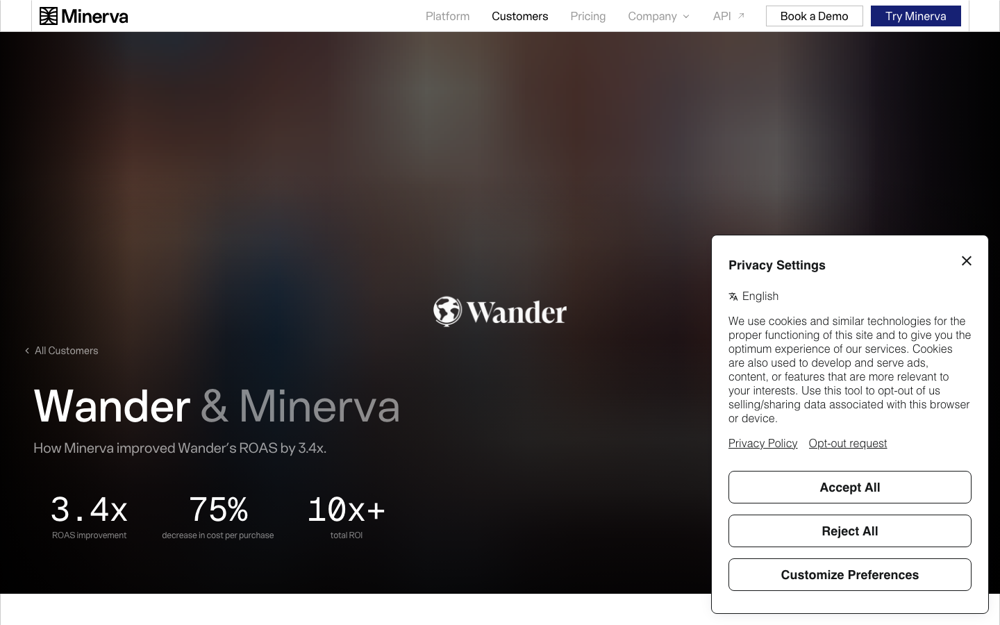

**观察：**

- ⚠️ 该测点 LLM 解读失败（超时 / 会话限额 / 服务异常），未生成功能观察。建议人工补充或重跑此测点。


### 💰 定价 / 商业化（1 个测点）

**该模块覆盖页面**:

- `https://www.minerva.io/pricing`

#### C2: Pricing page

**URL:** https://www.minerva.io/pricing

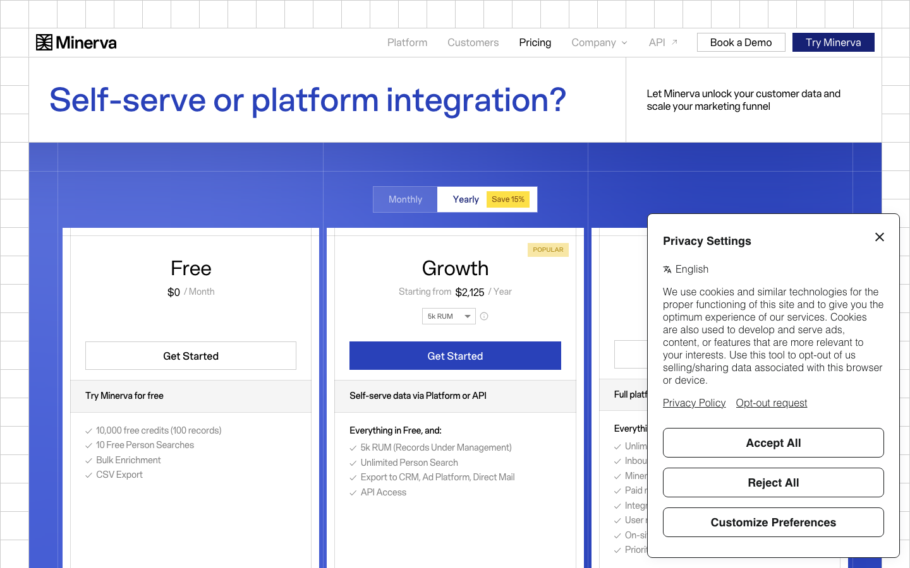

**观察：**

- ✅ 页面清晰揭示了产品的核心能力栈与典型工作流**：从功能表可读出 Minerva 是一个"数据增强 + 受众管理 + 营销激活"平台——以 Person Search(查人)→ Bulk Enrichment(批量补全)→ Golden Record Creation(主数据合并)→ Export to CRM/Ad Platform/Direct Mail(多渠道激活) 构成完整链路,解决"打通自有客户数据并放大营销漏斗"的问题,功能定位比纯定价页给出的信息量更大。
- ✅ RUM(Records Under Management)这一核心计量单位定义清楚**:明确说明是"在平台内管理、增强、激活的去重后的唯一个体",并与 credits(10,000 credits = 100 records)建立了换算关系,用户能理解自己到底在为"什么"付费,这是同类产品常缺失的关键说明。
- P1 多个核心功能术语零解释,用户无法判断"能为我做什么"**:`ADE`(Inbound integration across all sources with ADE)、`Golden Record Creation`、`Minerva Agents and proactive analytics`、`Minerva + 1P Person Search`、`User Events` 这些都是决定产品价值的关键能力,但全部只作为表格行项出现,既无展开说明也无示例。尤其 "Minerva agents" 作为 Enterprise 的核心卖点,完全没说明 agent 做什么、如何接入数据/CRM、是否自动执行营销动作。
- P1 数据来源与增强机制(产品价值的根基)完全缺失**:整个页面只讲"能 enrich / search person",但从未说明增强数据从哪来(自有数据库?第三方数据合作?公开数据?)、覆盖哪些字段(邮箱/电话/公司/意图信号?)、匹配准确率或合规口径如何。用户无法评估 "10 Free Person Searches" 究竟能查到什么、值不值得付费。
- P2 集成清单与激活渠道只有笼统标签,缺少具体支持列表**:"Export to CRM, Ad Platform, Direct Mail" / "CRM / CDP" / "Marketing Automation" 均无具体对接对象(如 Salesforce、HubSpot、Meta、Google Ads 等),用户无法确认自己的现有工具栈是否被支持——这是 B2B 数据平台采购的硬性判断点。


### 🔌 集成 / API（1 个测点）

**该模块覆盖页面**:

- `https://www.minerva.io/`

#### S3: Integrations page

**URL:** https://www.minerva.io/


**观察：**

- P1 名为"Integrations"页却无任何集成信息**：测点标注为 Integrations page，但全文未出现任何连接器清单、API 文档、CRM/广告平台对接说明。Google Ads、Meta、Direct Mail、Email 仅作为"CAMPAIGN ANALYSIS"的分析维度出现，完全没说明 Minerva 是**只读分析这些渠道**还是能**回写/同步/投放**到这些平台——产品最核心的"如何接入我现有的营销栈"这一问题在该页零解答。
- ✅ "WHAT DO YOU MARKET?" 交互完整演示了核心工作流**：输入一个营销品类（奢华旅行/体育/自定义）→ 输出 3 个排序的受众分群（每个带 Score、Audience Size、Average Wealth）→ 渠道级 Campaign Analysis → 自动生成 HOOK（广告钩子文案）和 CREATIVE BRIEF（创意简报）。这条"选品类→发现人群→渠道分析→产出创意"的链路用具体数字和成品文案讲清了产品到底能为营销人做什么。
- P2 数据底座说清了"有多少"，没说清"怎么用"**：270M 记录、1,000+ 属性、2010 年起每日更新、CCPA 合规、through-time B2B——数据规模与合规性表述有力，并把 Enrichment（数据增强）/ Standardization（标准化）列为独立能力。但缺少 Enrichment 的**输入/输出契约**：我喂什么进去（邮箱?手机号?公司域名?）、得到什么字段回来、匹配率多少，均未说明。
- P2 "agentic systems / 委托给 AI 做运营工作"是卖点却无机制**：页面反复强调 agentic、把 operational work 交给 AI，但未说明 agent **自主执行哪些具体任务、由什么触发、人类在哪一步介入审核**。读者只看到 AI 生成了一段 Creative Brief，无法判断 agent 的自动化边界到底在分析层、创意层还是投放执行层。
- P3 "measure and report on results" 是三大支柱之一却唯独没演示**：产品自述能力为"理解客户 / 搭建 campaign / 衡量并汇报结果"，前两项都有交互/样例支撑（分群、创意、个人画像如 Andy Wei），唯独**衡量与归因报告**没有任何示例或指标展示，用户无法判断其 measurement 能力的深度（是否做归因、增量、ROI 测算）。


### 🔒 安全 / 信任（1 个测点）

**该模块覆盖页面**:

- `https://www.minerva.io/`

#### S12: Trust / Security page

**URL:** https://www.minerva.io/

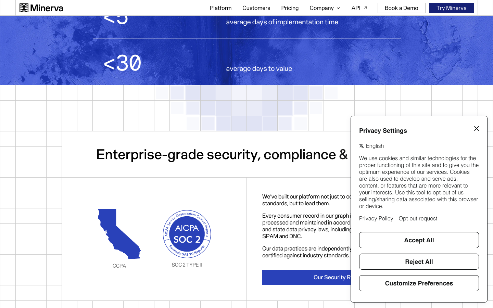

**观察：**

- ⚠️ 该测点 LLM 解读失败（超时 / 会话限额 / 服务异常），未生成功能观察。建议人工补充或重跑此测点。


### 🏢 公司 / 团队（1 个测点）

**该模块覆盖页面**:

- `https://www.minerva.io/company`

#### S7: About / Company

**URL:** https://www.minerva.io/company

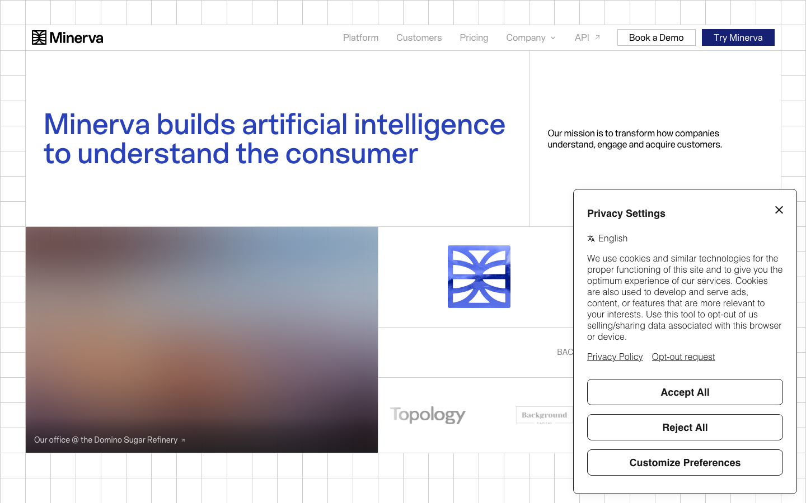

**观察：**

- ⚠️ 该测点 LLM 解读失败（超时 / 会话限额 / 服务异常），未生成功能观察。建议人工补充或重跑此测点。


### 📰 博客 / 内容（1 个测点）

**该模块覆盖页面**:

- `https://www.minerva.io/media`

#### E2: 探索: Blog & Media

**URL:** https://www.minerva.io/media

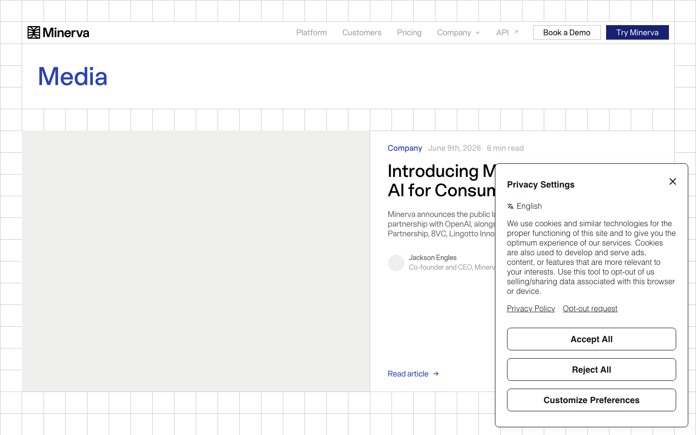

**观察：**

- ⚠️ 该测点 LLM 解读失败（超时 / 会话限额 / 服务异常），未生成功能观察。建议人工补充或重跑此测点。


### 📖 文档 / 帮助（1 个测点）

**该模块覆盖页面**:

- `https://www.minerva.io/`

#### C7: Help / Documentation

**URL:** https://www.minerva.io/

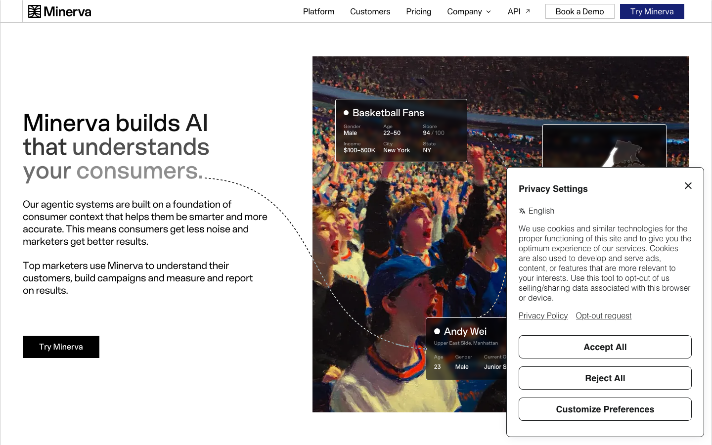

**观察：**

- P1 测点定位是「Help / 文档」，但抓取到的实际是公司首页 + 页脚导航（About / Blog / Careers / Security Report / Changelog），完全没有帮助中心、用户指南、知识库、FAQ 或操作文档。** 唯一沾边的功能入口是「Changelog — What's new in Minerva」（版本更新）和导航里的「API」，但页面没有展开任何使用说明。用户想「学会怎么用这个产品」时，在这一页得不到任何可操作信息。
- 页面间接揭示了产品的四大核心能力，但都以营销展示口吻呈现、而非文档化说明：① 受众分群（按 LUXURY TRAVEL / SPORTS 等品类输出多个 Segment，附 Score、Audience Size、Average Wealth）；② 跨渠道营销分析（Google Ads / Meta / Direct Mail / Email / Location / Engagement）；③ 创意生成（Hook 文案 + Creative Brief）；④ 消费者数据底座（270M 记录、1000+ 属性、2010 年起每日更新、CCPA 合规 B2B 数据）。** ✅ 从「能为我做什么」的角度，首页演示比绝大多数 SaaS 更具体——直接给出了一个可交互的 luxury travel 分群+创意 demo。
- P1 关键工作机制完全没有文档化：AI agent 如何接入用户自己的 CRM / 广告账户？分群 Score（94/100）和 Average Wealth（$10.1M）是怎么算出来的、数据从哪来？「Campaign Analysis」是只给建议还是能真正投放/回传效果？** 这些恰恰是文档/帮助页应当回答的核心问题，但在 C7 这一页没有任何说明,用户无法判断接入成本和真实工作流。
- P2 缺少面向开发者/集成的文档线索。** 导航有「API」入口，说明产品提供 API 能力，但本页没有 API 文档、字段说明、鉴权方式或数据接入清单（270M 记录 / 1000+ 属性具体是哪些属性也未列出），无法评估「Enrichment / Standardization」能力的实际可用范围。
- P3 功能差异与适用场景未说明。** 页面把 luxury travel、sports 等当作品类切换 demo，但没有说明这是「预置行业模板」还是「任意输入即可生成」（"ENTER YOUR OWN..." 暗示后者却未确认），也没有区分不同套餐/角色（marketing leader vs 执行）能用到哪些功能，读者难以对号入座。


### 📚 产品官方介绍（递归发现）（1 个测点）

**该模块覆盖页面**:

- `https://docs.minerva.io/sdk/introduction`

#### B1: 背景 D1: SDK

**URL:** https://docs.minerva.io/sdk/introduction


**观察：**

- ⚠️ 该背景介绍页 LLM 解读失败（超时 / 会话限额 / 服务异常），未生成结构化观察。


### 📌 其他（6 个测点）

**该模块覆盖页面**:

- `https://www.minerva.io/this-page-should-not-exist-product-audit-test-1234`
- `https://www.minerva.io/`
- `https://www.minerva.io/platform`
- `https://www.minerva.io/changelog`
- `chrome-error://chromewebdata/`

#### C8: 404 error handling

**URL:** https://www.minerva.io/this-page-should-not-exist-product-audit-test-1234

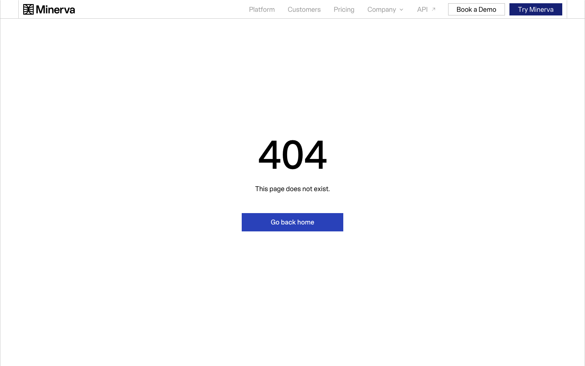

**观察：**

- ✅ 导航栏与页脚同时出现独立的「API」入口，揭示 Minerva 不只是封闭的 SaaS 界面，而是对外提供可编程的 API 能力——这是 404 这种边缘页面里唯一明确的功能性信号，暗示产品支持与外部系统集成/二次开发。
- P2 全站唯一的功能定位只有「AI for marketing leaders / The future of marketing starts with Minerva」+ 公司名「Minerva BI」，组合起来只能推断这是一款面向营销负责人的 AI 商业智能/分析类产品，但页面完全没有说明它具体分析什么(渠道数据? 投放? 受众?)、产出什么(报表? 洞察? 建议?),用户无法判断"它能为我做什么"。
- P2 404 的恢复路径只有一个「Go back home」回首页,没有针对性地把用户引导到核心功能入口(如直达 Platform 能力页、Pricing、或站内搜索)。从功能可达性看,这是一次"功能动线"的浪费——用户带着某个具体需求触发了 404,却被丢回最泛化的首页重新摸索。
- P3 导航把产品信息切成 Platform / Customers / Pricing / API 四块,但 404 页只暴露了标签名,没有任何子功能或能力清单的线索;读者无法从这一页推断 Platform 下究竟包含哪些模块或工作流。
- P1(信息缺口) 作为一个自称"AI for marketing"的产品,页面完全没有透露任何 AI 工作机制的关键点:输入是什么数据源、是否接入广告平台/CRM、AI 产出是自动洞察还是对话式问答、是否有 agent 自动执行营销动作。这些"这个 AI 到底怎么帮我干活"的核心问题,在可访问到的文本里全部缺失(注:404 页本不承载功能介绍,此缺口需在 Platform/API 等功能页核实)。

#### M5: Skills / Capabilities

**URL:** https://www.minerva.io/

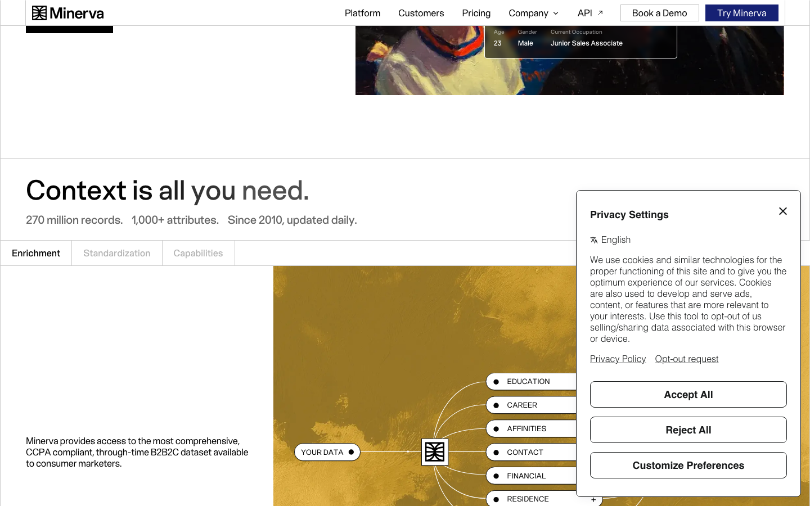

**观察：**

- ✅ 页面用交互式 demo 把核心能力讲得很具体：输入营销品类（豪华旅行/体育/自定义）→ 自动产出可量化的受众细分（如"富裕旅客"94/100 分、规模 1.78M、平均财富 $10.1M）→ 再到跨渠道 campaign 分析（Google Ads / Meta / Direct Mail / Email）并生成创意 brief 与 hook 文案，清晰演示了"从一个行业输入到可执行受众洞察+创意产出"的端到端工作流。
- ✅ 明确给出了产品定位的能力骨架——"理解客户 → 搭建 campaign → 衡量并汇报结果"三段式工作流，配合底层数据基础（270M 记录、1000+ 属性、2010 年起每日更新、含 Enrichment/Standardization），让用户理解这是"消费者数据 + 营销执行"的组合能力，而非单一功能点。
- P1 最核心的卖点"agentic systems / 把运营工作交给 AI"没有说清 agent 的自主程度与作用边界：它究竟只是分析推荐受众、生成创意，还是能真正接入并自动投放/优化 Google Ads、Meta 等渠道？分析结果如何回流到实际投放系统、是否需要人工执行——这一关键集成与工作机制完全缺失，用户无法判断"AI 能替我做到哪一步"。
- P1 产品定位自相矛盾：页头反复强调"AI for Consumer Marketing / 消费者营销（B2C）"，但页尾数据基础却写"most comprehensive CCPA compliant through-time **B2B**"。到底面向 B2C 消费者营销还是 B2B 数据，二者诉求和适用场景差异极大，读者难以判断该产品是否匹配自己的业务。
- P2 关键量化指标缺乏定义，削弱可信度判断：受众"Score 94/100"代表什么（匹配度？转化潜力？预算容量？）、"平均财富 $10.1M"如何测算、个人级画像（如"Andy Wei, 23 岁, 初级销售"）的字段来源与精度如何——均无解释；同时"measure and report on results"被列为三大能力之一，却没有任何衡量/归因/报表的示例，营销闭环的后半段成了功能空白。

#### M6: Channel deployment (Telegram/WhatsApp/Slack)

**URL:** https://www.minerva.io/

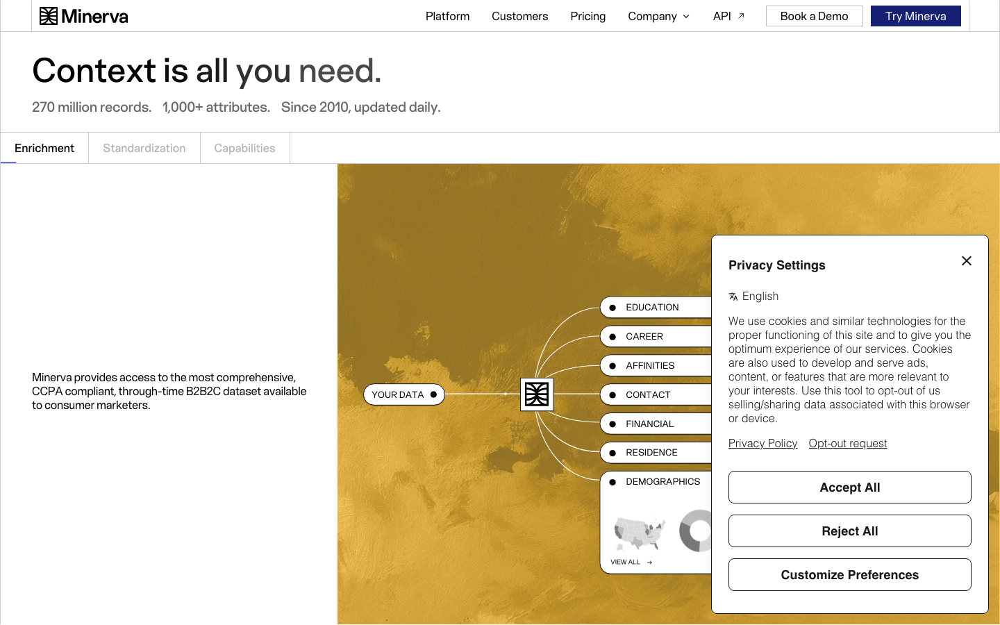

**观察：**

- P1 — M6 测点（Telegram/WhatsApp/Slack 渠道部署）在本页完全无体现**：页面出现的 "channels"（Google Ads、Meta、Direct Mail、Email、Location、Engagement）是**营销投放/触达分析渠道**，与"把 AI agent 部署到会话式消息平台（Telegram/WhatsApp/Slack）"是两个完全不同的概念。整页找不到任何关于 IM 渠道接入、Bot 部署或对话式触达的描述，无法判断 Minerva 是否具备该测点所要求的渠道能力——对 M6 而言这是关键功能信息的彻底缺失。
- ✅ 受众发现工作流的"输入→输出"演示清晰有力**：用户选定营销品类（LUXURY TRAVEL / SPORTS / 自定义输入），产品即输出排序后的受众 segment，每个带 Score(94/100)、Audience Size(1.78M)、Average Wealth($10.1M) 三个量化指标。把"我要营销什么"→"应该投给谁、这群人有多大价值"的核心能力做成了可交互 demo，功能价值一眼能懂。
- P2 — Campaign Analysis 只展示了创意产物，未界定"分析"与"执行"边界**：页面给出 HOOK 文案与 CREATIVE BRIEF（创意简报），并列出 Google Ads / Meta / Email 等渠道，但没说明产品是**仅输出各渠道的创意/投放建议（咨询型）**，还是能**直接对接并投放到这些渠道（执行型 agent）**。这恰是判断"它能替我做到哪一步"的关键，却没讲清。
- P2 — 数据底座很强，但"如何接入我自己的数据"缺失**：强调 2.7 亿条记录、1000+ 属性、2010 起每日更新、CCPA 合规，并提到 Enrichment / Standardization。但没说明营销方如何把自己的客户/CRM 数据接进来做 enrichment，也没交代匹配机制（怎样把我的客户对应到这 2.7 亿档案）。对评估实际可用性是重要缺口。
- P3 — 个体级画像能力被演示，但落地用法未说明**：示例直接给到个人级数据（"Andy Wei, Upper East Side, 23, Junior Sales Associate"），暗示可做 1:1 个体定位，但没说明这是用于个性化触达、名单导出，还是仅用于建模与受众放大，实际使用场景不清晰。

#### E1: 探索: Platform

**URL:** https://www.minerva.io/platform

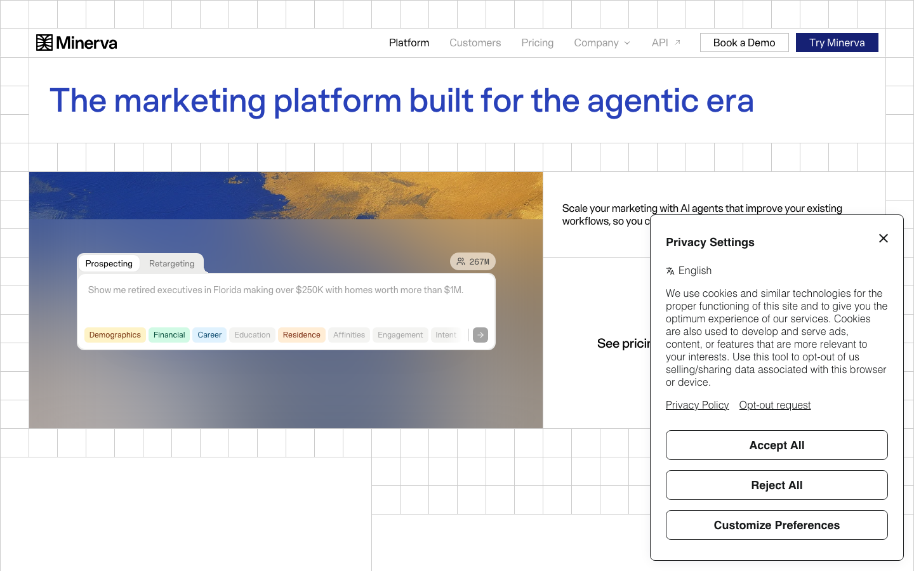

**观察：**

- ⚠️ 该测点 LLM 解读失败（超时 / 会话限额 / 服务异常），未生成功能观察。建议人工补充或重跑此测点。

#### E3: 探索: Changelog

**URL:** https://www.minerva.io/changelog

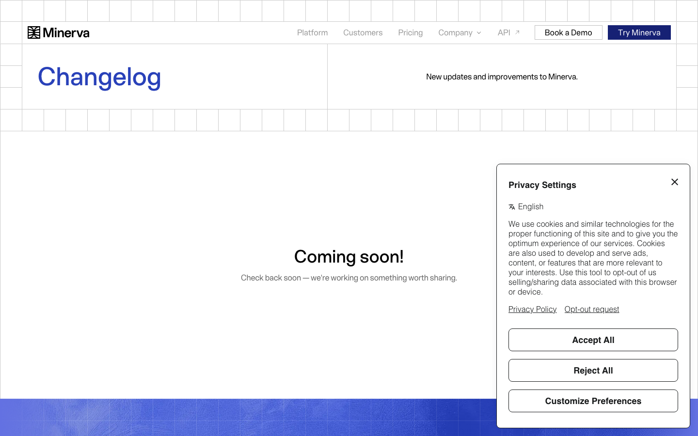

**观察：**

- ⚠️ 该测点 LLM 解读失败（超时 / 会话限额 / 服务异常），未生成功能观察。建议人工补充或重跑此测点。

#### E4: 探索: Book a Demo

**URL:** chrome-error://chromewebdata/


**观察：**

- ⚠️ 该测点 LLM 解读失败（超时 / 会话限额 / 服务异常），未生成功能观察。建议人工补充或重跑此测点。


### ⚠️ 未找到的测点（4 个测点）

**该模块覆盖页面**:

- `https://www.minerva.io/`
- `chrome-error://chromewebdata/`

#### C3: Sign-up flow (no submit)

**URL:** https://www.minerva.io/
**观察：**

- [Link not found] 该模板期望的链接（sign up|signup|get started|start free|注册|免费试用|开始）在 https://www.minerva.io/ 上未找到 — 可能产品用了不同的措辞或这个功能不存在。 已跳过截图与 LLM 解读以避免重复首页快照。

#### C4: Login page

**URL:** https://www.minerva.io/
**观察：**

- [Link not found] 该模板期望的链接（log in|login|sign in|登录|登入）在 https://www.minerva.io/ 上未找到 — 可能产品用了不同的措辞或这个功能不存在。 已跳过截图与 LLM 解读以避免重复首页快照。

#### M3: Use cases / Workflows

**URL:** https://www.minerva.io/
**观察：**

- [Link not found] 该模板期望的链接（use case|workflow|how it works|功能演示）在 https://www.minerva.io/ 上未找到 — 可能产品用了不同的措辞或这个功能不存在。 已跳过截图与 LLM 解读以避免重复首页快照。

#### S9: API / Developer docs

**URL:** chrome-error://chromewebdata/
**观察：**

- [Link not found] 该模板期望的链接（api|developer|docs.|开发者）在 https://www.minerva.io/ 上未找到 — 可能产品用了不同的措辞或这个功能不存在。 已跳过截图与 LLM 解读以避免重复首页快照。


---

## 4. 第三方社区反馈

#### ⚠️ 未找到显著社区讨论

WebSearch 在 Reddit / Product Hunt / Hacker News / G2 等平台未找到 `minerva.io` 的显著用户讨论。本节内容为空——不代表产品好或差，仅说明社区讨论数据稀缺。

---

## 5. 从访客到注册的转化路径

#### 转化路径示意

```
第 1 步：看到官网落地页
    ↓ 关键触点：本次仅有定价页 [C2] 测点；首页文案未在观察内，由"存在定价页"反推官网有落地页入口（推断）
第 2 步：进入定价页，用功能表评估"能为我做什么" [C2]
    ↓ 关键触点：功能表呈现 Person Search → Bulk Enrichment → Golden Record Creation → Export to CRM/Ad Platform/Direct Mail 完整链路 [C2]
第 3 步：理解计量单位与免费额度（RUM / credits / 10 Free Person Searches）[C2]
    ↓ 关键触点：RUM 明确定义为"去重后的唯一个体"、10,000 credits = 100 records、提供 10 Free Person Searches [C2]
第 4 步：在「自助免费试用」与「预约演示(Enterprise)」之间选入口
    ↓ 关键触点：自助层带免费额度；Enterprise 层以 Minerva agents + proactive analytics 为卖点，推断走 sales-led / book demo [C2]
第 5 步：完成转化 —— 注册领取免费 Person Search ／ 提交 Demo 申请
```

#### 各步骤详解

**第 1 步：看到官网落地页**
- 页面写了什么：本次观察只含定价页 [C2]，首页/落地页不在测点内；SDK 背景页 [B1] 解读失败，无可用观察。
- 我的推断：能跑到定价页，说明官网存在落地页与导航入口；落地页通常承担"一句话说清我是谁"，但此处无法证实其具体文案。
- 可能流失的原因：若落地页没把"打通自有客户数据 + 放大营销漏斗"讲清楚，访客根本到不了定价页就走了。

**第 2 步：进入定价页，用功能表评估能力**
- 页面写了什么：功能表可读出完整链路 Person Search → Bulk Enrichment → Golden Record Creation → Export to CRM/Ad Platform/Direct Mail [C2]。
- 我的推断：定价页在这里实际兼任了"产品介绍页"——访客是靠功能表判断"能为我做什么"，而不只是看价格。这是 Minerva 转化漏斗里信息密度最高的一页。
- 可能流失的原因：ADE / Golden Record / Minerva agents / User Events 等关键术语零解释 [C2]，访客看不懂价值；数据来源与字段覆盖完全缺失 [C2]，无法判断 enrich 出来的结果是否可信。

**第 3 步：理解计量单位与免费额度**
- 页面写了什么：RUM（去重唯一个体）定义清楚，10,000 credits = 100 records，并提供 10 Free Person Searches [C2]。
- 我的推断：Minerva 想用"透明计量 + 免费额度"化解 B2B 数据平台典型的"我到底在为什么付费"顾虑，把访客引向自助试用。
- 可能流失的原因：虽然知道"按 record 计费"，但因数据来源/字段/准确率缺失 [C2]，访客无法预估这 10 次免费搜索能查到什么，免费额度的吸引力被削弱。

**第 4 步：选择入口（自助 vs 预约演示）**
- 页面写了什么：存在带免费额度的自助层；Enterprise 层以 Minerva agents 与 proactive analytics 为核心卖点 [C2]。
- 我的推断：路径在此分叉——长尾/SMB 用 10 Free Person Searches 自助注册；需要 agents、批量、企业级集成的访客被引向"预约演示"由销售跟进（book demo / sales-led，推断）。
- 可能流失的原因：最强差异化卖点（Minerva agents）恰恰最不透明 [C2]，高价值访客在信息不足时就被推向 demo，容易犹豫或拖延。

**第 5 步：完成转化（注册 / 提交 Demo）**
- 页面写了什么：10 Free Person Searches 是明确的免费入口 [C2]（注册按钮具体文案不在测点内，推断为 "Get started / Start free" 类）。
- 我的推断：自助路径终点是注册账号领免费搜索，企业路径终点是提交 demo 表单——两条路都遵循"先体验/先沟通，后付费"。
- 可能流失的原因：集成清单只有笼统标签（CRM/CDP/Ad Platform）[C2]，B2B 采购者无法确认自己的工具栈被支持，可能在注册/提交前最后一刻放弃。

#### 转化设计观察

- **入口设计**：双轨——「自助免费试用（10 Free Person Searches）」+「企业预约演示（Minerva agents）」[C2]。推断 Minerva 用免费额度抓自助长尾、用 demo 抓高客单企业；中间"直接注册付费"则由 credits/RUM 的自助分层来承接，无需销售介入。
- **价格预期**：读完定价页，访客会形成"按管理的去重 record 数 / credits 计费"的心智 [C2]，并能算出 10,000 credits = 100 records 的单位成本；但因各档具体价位缺失（推断高阶/Enterprise 不标价、需 contact sales），访客只能判断"按量计费、企业级要谈"，无法自行估算总支出。
- **公开承诺**：官网话术承诺的是"把你自有客户数据打通、补全、合并成 Golden Record，再激活到 CRM / 广告平台 / 直邮"——即"放大你的营销漏斗" [C2]。这是**能力承诺**，并非登录后的真实体验。

#### 转化设计的强弱（仅公开页面）

- ✅ **RUM 计量透明** [C2]：明确"为去重后的唯一个体付费"，化解 B2B 数据平台常见的计费黑箱，利于信任与自助转化。
- ✅ **10 Free Person Searches 免费额度** [C2]：零成本自助入口，让访客先验证再付费，显著降低注册门槛。
- ⚠️ **数据来源/字段/准确率缺失** [C2]：访客无法预判免费搜索能返回什么，直接削弱免费额度与试用的说服力。
- ⚠️ **核心术语零解释（ADE / Golden Record / Minerva agents）** [C2]：最具差异化的卖点反而最不透明，高价值访客在转化前信息不足。
- ❌ **集成清单笼统** [C2]：未列具体对接对象（Salesforce / HubSpot / Meta / Google Ads 等），B2B 采购的硬性判断点缺失，可能成为注册 / 预约演示前的最后阻断。
