# www.omniwork.ai 产品深度体验报告

## 报告信息

| 项 | 内容 |
|---|---|
| 产品名称 | www.omniwork.ai |
| 产品 URL | https://www.omniwork.ai/ |
| 体验时间 | 2026-05-29T23:19:49.046071 |

---

## 目录

- [1. 核心结论](#1-核心结论)
  - [1.1 一句话判定](#11-一句话判定)
  - [1.2 主要风险](#12-主要风险)
  - [1.3 主要亮点](#13-主要亮点)
  - [1.4 综合评分](#14-综合评分)
- [2. 产品概览](#2-产品概览)
  - [2.1 基础信息](#21-基础信息)
  - [2.2 测点速览](#22-测点速览)
  - [2.3 产品 / 公司背景信息](#23-产品--公司背景信息)
  - [2.4 产品定位与策略](#24-产品定位与策略)
  - [2.5 公司基本信息](#25-公司基本信息)
- [3. 体验流程记录](#3-体验流程记录)
  - [3.1 官网叙事分析](#31-官网叙事分析)
  - [3.2 测点流程详情](#32-测点流程详情)
- [4. 第三方社区反馈](#4-第三方社区反馈)
- [5. 从访客到注册的转化路径](#5-从访客到注册的转化路径)

---

## 1. 核心结论

### 1.1 一句话判定

目标产品 **https://www.omniwork.ai/** 在本次深度体验中：存在显著的功能信息缺口。详见 §3 体验流程记录。

### 1.2 主要风险

1. **[C1]** P1** 集成与落地链路不清：demo 围绕 YouTube 账号增长、跟踪"已发布内容"，暗示要接入社交平台，但页面既没说①支持哪些平台，也没说②产品是直接代发/代运营，还是只产出草稿由用户自己发布。这直接决定了"它到底能替我做到哪一步"。
2. **[C2]** P1 严重：作为"Pricing page"，正文里完全没有任何定价信息**——没有套餐分层、价格、用量/额度上限，也没有各档位的功能差异说明。用户读完无法知道这个产品要花多少钱、每档包含什么能力。这是定价页最核心的功能信息，却整页缺失（展示的全是产品能力介绍，更像首页/功能页内容）。
3. **[C2]** P1 严重：Agent 与真实平台的集成机制完全未说明**。演示里出现了 YouTube 链接、"发布内容""追踪所有已发布内容"等动作，但页面从未解释 Agent 如何接入/授权/发布到/监控真实社媒账号（YouTube、TikTok 等）。这是判断"产品能否端到端跑通"的关键技术点，缺失会让人怀疑演示是否只是模拟。

### 1.3 主要亮点

1. **[C1]** ✅ 首页用一个具体场景把核心能力讲透了：「Account Growth Management（把账号涨到 1 万粉）」实时演示了多个 Expert Agent 协同——Trending-Content-Monitor 出跨平台趋势报告、Viral-Content-Reproduction 选爆款复刻、Trend-To-Post 写文案、Account-Monitoring-Expert 跟踪已发布内容表现，并给出可见交付物（趋势报告 HTML、文案 HTML、成片 MP4）。5 秒内能 get 到「这是一个把创意目标自动拆解、由多个 AI 专家代理执行并交付成品的系统」。
2. **[C2]** ✅ Account Growth Management 这个演示把"目标→交付"的多智能体编排机制讲清楚了**：用户输入一句自然语言目标（把账号涨到 1 万粉），编排器 Omni 自动拆解并调度多个专职 Agent——Trending-Content-Monitor 出趋势报告、Viral-Content-Reproduction 复刻爆款视频、Trend-To-Post 写文案、Account-Monitoring-Expert 持续追踪表现，且每个环节都产出可见的具体交付物（HTML 趋势报告、HTML 文案、MP4 视频）。工作机制和典型场景（创作者/社媒运营做内容生产+涨粉）传达得很到位。
3. **[C3]** ✅ 页面用一个完整场景（"把这个 YouTube 账号涨到 1 万粉"）演示了核心工作流：用户设定创意目标 → Omni 编排多个专家 Agent 协作（Trending-Content-Monitor 出趋势报告、Viral-Content-Reproduction 复刻爆款、Trend-To-Post 写文案、Account-Monitoring-Expert 跟踪表现）→ 实际产出跨平台趋势报告(HTML)、社媒文案(HTML)、成片(mp4)。"Agent OS for Creative Work"的定位与"从目标到交付"的编排能力被讲清楚了，读者能理解"产品能替我跑完整条内容生产链"。

### 1.4 综合评分

| 维度 | 评分 | 1-2 句话说明（引用具体 [测点ID]） |
|---|---:|---|
| 产品方向清晰度 | 3.5 / 5 | 定位「Agent OS for Creative Work」+「Goal to Delivery」清晰，account-growth 实例 5 秒内讲透核心形态 [C1][C5]；但能力边界模糊——只演示了社媒涨粉一个场景，"真人专家 vs 纯 AI" 也未交代 [S1][S2]。 |
| 价值主张表达力 | 4.0 / 5 | "设定目标→Omni 编排多个专家 Agent→产出可见交付物（趋势报告 HTML/文案 HTML/成片 MP4）"是有力且具体的差异化卖点，demo 把多智能体编排讲得很有说服力 [C1][S1]。 |
| 信息架构 | 2.0 / 5 | 子页面架构严重失效：Pricing/Integrations/Help 三页内容全是首页复刻 [C2][S3][C7]，Login/Use-cases 页根本不存在 [C4][S2]，404 为通用页且无找回导航 [C8]。 |
| 功能广度与深度 | 2.5 / 5 | Experts Market 列约 11 类 Agent + Workflows/Playbooks/Review gates，广度信号足 [C1][C3]；但除"账号增长"一个用例外几乎全是只给名词不给规格，Agent 输入/输出与编排机制均未展开 [C5][S1]。 |
| 核心能力可信度 | 2.0 / 5 | 虽有可见交付物作部分佐证 [C1]，但最核心的"接入/授权/代发布/监测真实社媒账号"实现路径整页缺失，令人怀疑 demo 是否仅为模拟，且无第三方/数据化证据 [C2][C5][S1][S3]。 |
| 商业化清晰度 | 1.0 / 5 | 名为 Pricing page 却完全没有任何价格、套餐分层、用量额度或计费单位 [C2]；仅"Try free / Get invite code"暗示门控，但免费档含什么、是否邀请制均不明 [C3]。 |
| **综合平均** | **2.5 / 5** | **概念与 demo 出彩、价值主张有力，但定价、集成、文档、子页面信息严重缺失，整体停留在"一支有力的首页演示"而非"可评估的完整产品"。** |

---

## 2. 产品概览

### 2.1 基础信息

- **URL**: https://www.omniwork.ai/
- **首屏标题**: Omniwork
Features
Cases
Pricing
Sign In
Get Started
Trusted by 10,000+ teams wor

### 2.2 测点速览

本次共体验 17 个测点。

> ⚠️ **登录后内容未覆盖**——用户选择不登录，本报告仅为公开页范围；产品登录后的工作台 / 实际操作未在本报告内。

### 2.3 产品 / 公司背景信息

_本次未发现产品 / 公司的官方介绍页面。_

### 2.4 产品定位与策略

### 1. 把 AI 当成一支可雇佣的专家团队来组织，而不是一堆独立工具
**核心判断**: 产品用"专家市场 + 拟人成员"的方式包装能力，让用户像组建/派活给团队一样使用，而不是面对一个个功能按钮或对话框。
**支撑证据**: 
- [C1] Experts Market 罗列约 11 个角色（FMV 游戏创作、视频剪辑、音乐制作、影片导演、配音、说唱歌手、内容洞察分析等），呈现为一个"专家代理市场"
- [S1] Agent 带 Certified / Available / In a meeting / On call 等拟人状态标签，像真实同事而非软件功能
- [C3] 目标被直接"派给"@Trending-Content-Monitor、@Trend-To-Post 等具体角色执行，用的是"把活分给人"的心智
**对用户的含义**: 用户不必自己学工具、拼流程，而是用"招团队、下指令"的方式就能上手，但也因此更难判断每个"专家"具体能干什么。

### 2. 核心卖点是一个统一编排器，负责从一句目标直接跑到成品
**核心判断**: 产品最主要的差异点不是单项能力，而是 Omni 这个编排层——它自动拆解目标、挑选并调度多个 Agent、串起整条交付链。
**支撑证据**: 
- [C1] 定位「Agent OS for Creative Work」+「Orchestration: Goal → Delivery」，由 Omni 协调合适的 Agent 规划/执行/交付
- [C2] 一句"涨到 1 万粉"被自动拆解并依次调度 Trending-Content-Monitor → Viral-Content-Reproduction → Trend-To-Post → Account-Monitoring-Expert
- [C5] 反复点名 Workflows / Playbooks / Review gates 三种编排机制，把"编排"而非"某个单点能力"摆在最显眼位置
**对用户的含义**: 用户买的是"一句话托管一整条创作流程"的承诺，而不是又一个需要自己手动串联的 AI 单品。

### 3. 用交得出手的成品来定义价值，而不是聊天问答
**核心判断**: 产品刻意把价值落在可见、可下载的交付物上，而非对话过程或建议文本。
**支撑证据**: 
- [C1] 每个环节都给出具体交付物：跨平台趋势报告 HTML、社媒文案 HTML、成片 MP4
- [S1] 多智能体协作的结果用"可见的具体文件"呈现，而不是一段回复
- [C2] 整页围绕"目标 → 交付"展开，落点始终是交付物
**对用户的含义**: 用户的预期被引导为"我会拿到能直接用的东西"，而不是"我要再花时间把 AI 的回答加工成成品"。

### 4. 愿景上号称全能创意系统，落地却只押注涨粉一个场景
**核心判断**: 产品在能力广度上铺得极宽，但全站只深入演示了"社媒账号增长"这一个用例，其余领域只有角色名、没有可信的成果链路。
**支撑证据**: 
- [C1] Experts Market 跨度极大（游戏制作、音乐制作、影视导演、配音、说唱、内容分析），暗示远不止社媒内容
- [S1] 但全站仅完整跑通"账号增长"一个用例，其他异构 Agent 能否组合成别的交付物连一句示例都没有
- [S2] 「Use cases / Industries」相关入口在站上根本找不到，行业/场景维度是缺位的
**对用户的含义**: 如果用户的需求正好是社媒涨粉，产品看起来很对路；偏离这个场景，就只能凭一串职业名自行猜测它到底能不能干。

### 5. 刻意不公开价格、文档和接入方式，走邀请制的受控放量
**核心判断**: 产品当前明显处于"愿景先行、受控放量"阶段——商业化与落地细节大面积留白，注册带邀请码门槛。
**支撑证据**: 
- [C2] 标称是 Pricing page，却整页没有任何价格、套餐分层或用量额度
- [C7] 站上完全没有帮助中心、使用文档、上手教程或 API 说明的入口
- [C3] 注册并列出现「Try Omniwork free」与「Get invite code」，疑似邀请码门控/候补；[C4] 连登录入口都找不到
**对用户的含义**: 用户现在无法自助判断"要花多少钱、现在能不能用、怎么接入"，更多是被引导留资观望，而非即刻试用决策。

### 6. 故意模糊"真人专家"还是"AI"，借专家光环建立信任
**核心判断**: 产品在"由顶尖真人专家构建"与"AI 自动执行"之间保持暧昧，用专家与拟人状态营造可信感，却回避了到底属于哪一类的归类。
**支撑证据**: 
- [S1] 主张「built on top-tier human expertise」，同时 Agent 又带 Certified / In a meeting / On call 等拟人状态，分不清是真人接单还是纯 AI
- [C5] 「In a meeting / On call」究竟代表真有并发占用排队，还是仅拟人化展示，从未解释
- [S3] 「基于顶尖人类专家构建」到底是真人在环参与、还是真人训练出的 AI，完全没说清
**对用户的含义**: 这种模糊既借来了"专家级质量"的信任感，也让用户无法预判交付的时效、成本和稳定性——是工具的即时性，还是众包平台的排队感，得自己赌。

### 2.5 公司基本信息

#### ✅ 实体身份已确认

基于域名 + 产品自我定义 + 创始人 LinkedIn 的交叉核对，目标产品 `omniwork.ai` 对应：
**Omniwork（"The Agent OS for Creative Work" / 创意工作的智能体操作系统）**

核心锚定证据：创始人 [Chaofan Ding（丁超凡）的 LinkedIn 个人页](https://cn.linkedin.com/in/chaofan-ding-416815349) 头衔**明确写为 "Founder @omniwork.ai"**，直接将本人与本域名挂钩；官网 [omniwork.ai](https://www.omniwork.ai/) footer 标注 "© 2026 Omniwork. All rights reserved."，第三方实测报道（[腾讯新闻](https://news.qq.com/rain/a/20260525A06L6400)、[53AI](https://www.53ai.com/news/MultimodalLargeModel/2026052582470.html)）也引用 `www.omniwork.ai` 为官方网址。

> ⚠️ 排除的同名/近名实体（**均非本目标**，其融资数据不得归属）：[Omni / omni.co](https://omni.co/blog/press-release-omni-series-c-funding)（企业 AI 分析平台，已 Series C 1.5B 估值）、[omni.day / OmniWork Group](https://www.crunchbase.com/organization/omniwork)（教练/私教 SaaS）、[OmniAI / getomni.ai（YC W24）](https://www.ycombinator.com/companies/omniai)（贷款 AI）——域名与业务均不同。

#### 公司基础事实表

| 项 | 内容 | 置信度 | 来源 |
|---|---|---|---|
| 公司名称 | Omniwork | ✅ 直接 | [官网](https://www.omniwork.ai/) / [创始人 LinkedIn](https://cn.linkedin.com/in/chaofan-ding-416815349) |
| 成立年份 | 未公开（官网版权标注为 2026，疑似 2025–2026 新成立） | ⚠️ 间接（版权年≠注册年） | [官网 footer](https://www.omniwork.ai/) |
| 总部地点 | 推断为中国·上海（产学合作方均为上海机构；创始人所属巨人网络总部在上海） | ⚠️ 推断 | [site:omniwork.ai 案例](https://www.omniwork.ai/) |
| 产品上线 | 截至 2026 年 5 月仍处**内测/邀请码**阶段，未正式公开发布 | ✅ 直接 | [腾讯实测 2026-05-25](https://news.qq.com/rain/a/20260525A06L6400) |
| 当前阶段 | 产品内测；融资阶段**未公开** | ⚠️ | 同上 |
| 融资总额 | 未找到 / 未公开 | ❌ 无可靠来源 | — |
| 团队规模 | 未找到 / 未公开 | ❌ 无可靠来源 | — |
| 行业类别 | AI Agent / 创意生产力（多智能体协作，覆盖内容、短剧/AI 影视、游戏、音乐创作） | ✅ 直接 | [官网](https://www.omniwork.ai/) |

**置信度图例**：✅ = 来源直接锚链接到 omniwork.ai ／ ⚠️ = 间接推断或来源不一致 ／ ❌ = 未找到，不臆造。

#### 融资历史

| 轮次 | 时间 | 金额 | 领投 + 主要参与方 | 来源指向本域名? |
|---|---|---|---|---|
| —（公开渠道未检索到任何与 `omniwork.ai` 显式挂钩的融资记录） | 未公开 | 未公开 | 未公开 | — |

> 说明：以 `"omniwork.ai" funding`、`天使轮/种子轮` 等域名锚定查询、以及 2026 年 AI 创投日报（[huxiu 2026-01-14](https://xiuxiu.huxiu.com/hxgpt_agent/fin_daily/2026-01-14.html)）核查，**均未发现 Omniwork 的公开融资披露**。检索到的融资金额（如 Omni $120M Series C）属上文已排除的同名公司，**不得归属本产品**。

#### 创始人 / 核心团队背景

- **Chaofan Ding（丁超凡）**（创始人 / Founder）— 本人 LinkedIn 头衔为 "Founder @omniwork.ai"；公开资料显示其为**巨人网络 AI 实验室负责人**，长期布局多模态、AI Agent 与 AI 原生游戏方向。[LinkedIn](https://cn.linkedin.com/in/chaofan-ding-416815349) ｜ [对话巨人网络 AI 实验室负责人丁超凡（2024-09）](https://news.qq.com/rain/a/20240921A066TZ00) ｜ [财联社同源报道](https://www.cls.cn/detail/1805141)
  - 验证：LinkedIn 个人页**直接链接到 `omniwork.ai`**（✅）；"巨人网络 AI 实验室负责人" 系来自其姓名全拼一致 + 同领域（创意/Agent/游戏）+ 同城（上海）的强匹配推断，但相关访谈本身未提及 omniwork.ai（⚠️）。
- **其余核心高管 / 团队成员**：未找到公开且能锚链接到本域名的资料（未公开）。

> ⚠️ 重要边界：**未检索到任何官方公告将 Omniwork 确认为「巨人网络旗下/孵化产品」**。目前仅能确认"创始人个人=巨人网络 AI 实验室负责人"，无法据此把巨人网络（A 股 002558）的上市主体地位或财务数据归属于 Omniwork。二者公司层面关系（独立创业 / 内部项目）仍待官方澄清。

#### 近期重大动态（最近 6–12 个月）

- **2026-05（约 5 月下旬）**：多家媒体发布 OmniWork 内测实测报道，产品以邀请码开放体验，主打"免费雇佣专家智能体团队"协作创作。[腾讯新闻 2026-05-25](https://news.qq.com/rain/a/20260525A06L6400) ／ [53AI](https://www.53ai.com/news/MultimodalLargeModel/2026052582470.html)（验证：均引用 omniwork.ai 官网 ✅）
- **产学合作（官网披露，时间未标注）**：与**上海戏剧学院**共建动漫短剧 / AI 影视方向 Expert（官网称获《三体》导演杨磊、作家刘慈欣相关支持）；与**上海音乐学院 AI 音乐治疗重点实验室**合作沉淀专业音乐创作技能。[site:omniwork.ai](https://www.omniwork.ai/)（验证：信息位于本域名官网 ✅；外部独立佐证 ⚠️ 有限）
- **2024-09**：创始人丁超凡以巨人网络 AI 实验室负责人身份公开发声，看好非线性开放世界、多模态与 AI Agent 方向——属产品问世前的背景脉络。[来源](https://news.qq.com/rain/a/20240921A066TZ00)（验证：未提及 omniwork.ai ⚠️ 仅背景）

#### 综合判断

Omniwork 是一款定位为"创意工作智能体操作系统（Agent OS for Creative Work）"的早期产品，截至 2026 年 5 月仍处于**邀请码内测**阶段，尚未正式公开发布，也**未见任何公开融资披露**。其最可靠的身份锚点是创始人 **Chaofan Ding（丁超凡）**——LinkedIn 明确自述为 omniwork.ai 创始人，且其公开身份为巨人网络 AI 实验室负责人，叠加上海戏剧学院、上海音乐学院等产学资源，构成本产品在**游戏/影视/音乐等创意内容垂类**上的差异化优势与资源背书。

短板与待核实点同样明显：公司注册主体、成立时间、团队规模、资本结构均未公开，且"是否隶属/脱胎于巨人网络"缺乏官方定性——**建议决策前向产品方直接核实公司主体与融资状态**，不要将同名公司（Omni、omni.day、OmniAI）的融资或上市数据误记到本产品名下。值得持续关注的方向：内测转公测的节奏、专家智能体（Expert）生态的扩张，以及巨人网络资源是否会以正式形式注入。

---

## 3. 体验流程记录

### 3.1 官网叙事分析

#### 高频关键词

| 关键词 / 短语 | 出现频次或权重 | 在哪类页面出现 | 想建立的印象 |
|---|---|---|---|
| Agent OS for Creative Work（创意工作的智能体操作系统） | 极高，几乎逢页必现 | 首页/功能页/定价页/集成页/帮助页 [C1][C2][C5][C7][S1][S3] | 这不是单点工具，而是操作系统级的平台 |
| Orchestration / Goal → Delivery（编排：从目标到交付） | 极高 | 首页/功能页/集成页 [C1][S1][S3] | 你只管下达目标，端到端的活我全自动包了 |
| Expert Agents / Experts Market（专家代理市场，约 11 类角色） | 高 | 首页/定价页/功能页 [C1][C2][S1] | 我手握一支门类齐全的专家团队，无所不能 |
| 拟人化 Agent 名（@Trending-Content-Monitor / @Viral-Content-Reproduction / @Trend-To-Post / @Account-Monitoring-Expert） | 高，每个演示都出现 | 全部演示页 [C1][C3][C5][S1] | 像真人团队一样分工、协作、各司其职 |
| built on top-tier human / creator expertise（基于顶尖人类专家构建） | 中高 | 首页/功能页/集成页 [C1][S1][S3] | 背后是真专家的专业度，产出靠谱 |
| Workflows / Playbooks / Review gates（工作流/剧本/审核闸口） | 中 | 编排区，多页复现 [C2][C5][S1][S3] | 系统化、可控、够企业级 |
| Agent 状态标签 Certified / Available / In a meeting / On call | 中 | 首页/功能页/集成页 [C4][C5][S1] | 真实团队感 + 质量背书 |
| 可见交付物：趋势报告 HTML / 文案 HTML / 成片 MP4 | 中 | 全部演示页 [C1][C3][S1] | 真出活、出实物，不是空谈 |
| or from your own workflows / your own team（也可用你自己的工作流自建） | 中低 | 首页/帮助页/功能页 [C1][C7][S1] | 可定制、可扩展，进阶团队也能用 |
| Try Omniwork free / Get invite code | 低 | 注册入口 [C3] | 既能免费试，又有内测稀缺感 |

#### 说服手法分析

**1. 把 AI 包装成真人团队（拟人化命名 + 拟人状态）**
- 具体表现：给每个 Agent 起人名并打上工作状态——「@Trending-Content-Monitor / @Viral-Content-Reproduction」「Certified / Available / In a meeting / On call」[C5][S1]
- 想达到的效果：让用户感觉自己雇的不是软件，而是一支会"开会、接单、忙线"的真实专家团队，天然更可信、更值钱。

**2. 单场景端到端闭环 + 实物交付物**
- 具体表现：用「把这个 YouTube 账号涨到 1 万粉」一个场景跑通全链路，并甩出可见产出——「跨平台趋势报告 HTML、社媒文案 HTML、成片 MP4」[C1][S1]
- 想达到的效果：把抽象的"多智能体编排"变成 5 秒就能看懂、且"真出了东西"的具体画面，绕过对机制的怀疑。

**3. 借真人专家为 AI 背书（刻意模糊人/机边界）**
- 具体表现：「built on top-tier human expertise」，配合 Agent 的 Certified、In a meeting 等拟人标签 [S1][S3]
- 想达到的效果：把真人专家的专业度转嫁给 AI 产出，让用户既享受"专家级品质"的安心，又不去深究到底是真人还是模型。

**4. 自造术语体系，营造"成熟平台"感**
- 具体表现：抛出「Agent OS」「Orchestration」「Workflows / Playbooks / Review gates」一整套自创概念，却只给名词不给定义 [C2][S3]
- 想达到的效果：用系统化、企业级的词汇堆出"这是个成熟操作系统级产品"的印象，即便机制完全没展开。

**5. 长清单堆叠暗示"无所不能"**
- 具体表现：Experts Market 滚动罗列约 11 类角色——「FMV Game Creator、Music Producer、影视导演、Voice Actor、Professional Rapper、Content Insights Analyst……」[C1][S2]
- 想达到的效果：用一长串跨度极大的职业名制造"覆盖面无边界"的错觉，尽管全站只深入演示了"涨粉"一个用例。

#### 整体评价

它想让你感觉自己拥有的是一套**操作系统级、能自动编排一支顶尖 AI 专家团队、从一句目标直达成品交付的成熟平台**——一个"开箱即用的 AI 创作公司"。但这套说法可信度中等偏"愿景演示"：演示场景具体可感是加分项，可所有决定能否真正落地的关键（如何授权接入社媒账号、是否真能代发布、是真人还是 AI、定价、自建怎么做）全部留白，更像精心编排的概念片而非可验证的产品事实。

### 3.2 测点流程详情

### 🏠 首页（2 个测点）

**该模块覆盖页面**:

- `https://www.omniwork.ai/`

#### C1: Homepage 5-second test

**URL:** https://www.omniwork.ai/

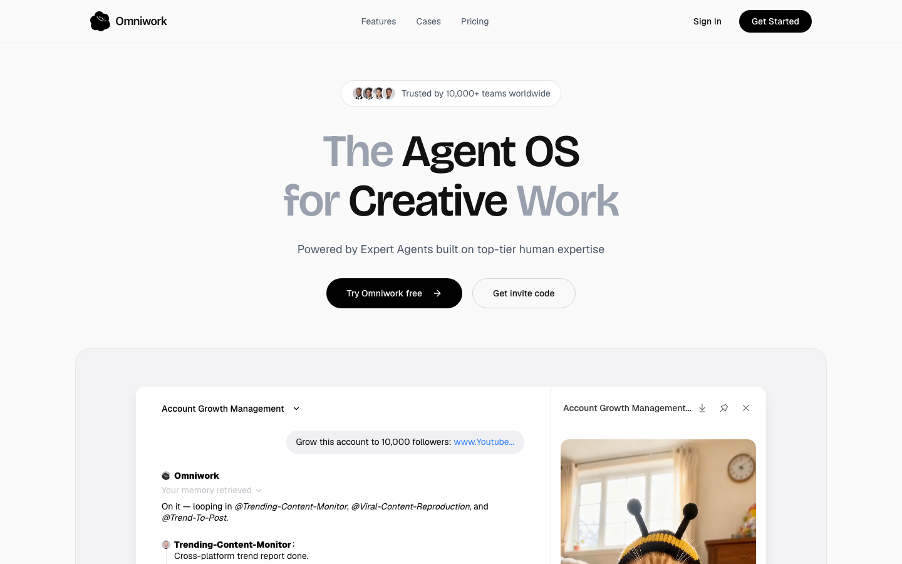

**观察：**

- ✅ 首页用一个具体场景把核心能力讲透了：「Account Growth Management（把账号涨到 1 万粉）」实时演示了多个 Expert Agent 协同——Trending-Content-Monitor 出跨平台趋势报告、Viral-Content-Reproduction 选爆款复刻、Trend-To-Post 写文案、Account-Monitoring-Expert 跟踪已发布内容表现，并给出可见交付物（趋势报告 HTML、文案 HTML、成片 MP4）。5 秒内能 get 到「这是一个把创意目标自动拆解、由多个 AI 专家代理执行并交付成品的系统」。
- 产品定位「Agent OS for Creative Work」+ Experts Market 揭示了一个"专家代理市场"模式，罗列约 11 个角色（FMV 游戏创作、视频剪辑、音乐制作、影片导演、配音、说唱歌手、内容洞察分析等），传达出能力覆盖面广。但 **P2**：每个 Agent 的能力边界未说明——需要什么输入、产出的具体物料/格式是什么（例如「FMV Game Creator」「Professional Rapper」到底交付什么），用户难以判断是否匹配自己的需求。
- 编排能力（Orchestration: Goal → Delivery，"设定创意目标，Omni 协调合适的 Agent 规划/执行/交付"）是产品最核心的差异点，并点名了 Workflows / Playbooks / Review gates 三种机制。但 **P1**：页面没解释编排究竟如何运作——系统按什么逻辑挑选 Agent、用户能否在中途审核或干预（"Review gates" 只出现名字、未展开），而这正是理解"自动化到什么程度、人要不要把关"的关键。
- P1** 集成与落地链路不清：demo 围绕 YouTube 账号增长、跟踪"已发布内容"，暗示要接入社交平台，但页面既没说①支持哪些平台，也没说②产品是直接代发/代运营，还是只产出草稿由用户自己发布。这直接决定了"它到底能替我做到哪一步"。
- "Built from top-tier creator expertise — or from your own workflows" 揭示了可基于自有工作流自建 Agent 的自定义能力，是面向进阶/团队用户的卖点；"Your memory retrieved" 也暗示有记忆/上下文沉淀功能。但 **P2/P3**：如何创建自定义 Agent/Workflow、需要哪些前置条件，以及"memory"具体存什么、怎样提升后续产出，均未说明。

#### C5: Footer audit

**URL:** https://www.omniwork.ai/

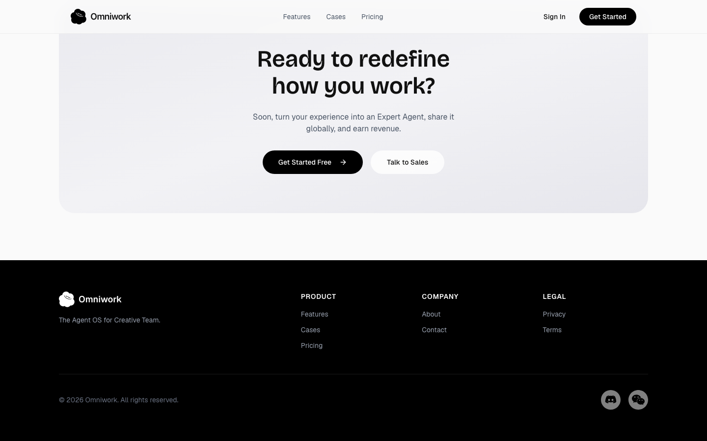

**观察：**

- ✅ 页面清晰揭示了核心产品形态**："Agent OS for Creative Work" + "Orchestrated from Goal to Delivery"，并用一个完整案例闭环演示了工作机制：用户设定目标（把账号涨到 1 万粉）→ Omni 自动调度 @Trending-Content-Monitor / @Viral-Content-Reproduction / @Trend-To-Post 多个 Agent 协同 → 产出可交付物（跨平台趋势报告 HTML、社媒文案 HTML、成片 mp4）。读完能理解"它能替我编排一支 AI 创作团队完成创作任务"。
- P1 关键集成/接入机制完全缺失**：案例里出现"Grow this account… www.Youtube…"，但全页没有任何说明 Agent 如何接入并操作用户的真实社媒账号（授权方式？是否真能代发布？支持哪些平台 YouTube/TikTok/IG？只读分析还是可写发布？）。这是该产品最核心的能力承诺，却没有交代实现路径，读者无法判断"涨粉"是真自动执行还是仅生成素材。
- P2 Experts Market 罗列了 11 个 Agent 但无功能规格**：FMV Game Creator、Professional Video Editor、Music Producer、Voice Actor、Professional Rapper 等被反复滚动展示，却没有任何一个说明其输入要求、输出格式、适用场景或能力边界。用户看到一长串职业名，仍不清楚每个 Agent 具体"吃什么、产出什么"。
- P2 "Workflows / Playbooks / Review gates" 三个机制名词只露出标题**：Review gates 暗示存在人工审核/卡点、Playbooks 暗示可复用流程模板，这些恰是区分"玩具 Demo"与"可托管生产"的关键功能，但页面未展开如何配置、谁来审、卡点如何放行。
- P3 Agent 状态语义（Certified / Available / In a meeting / On call）未解释功能含义**："Certified"是否代表质量/合规背书？"In a meeting / On call"是真有并发占用与排队，还是仅拟人化展示？这关系到产品是否有资源调度与可用性机制，应明确而非留给用户猜。

### ✨ 产品功能 / 介绍（1 个测点）

**该模块覆盖页面**:

- `https://www.omniwork.ai/`

#### S1: Features / Product page

**URL:** https://www.omniwork.ai/

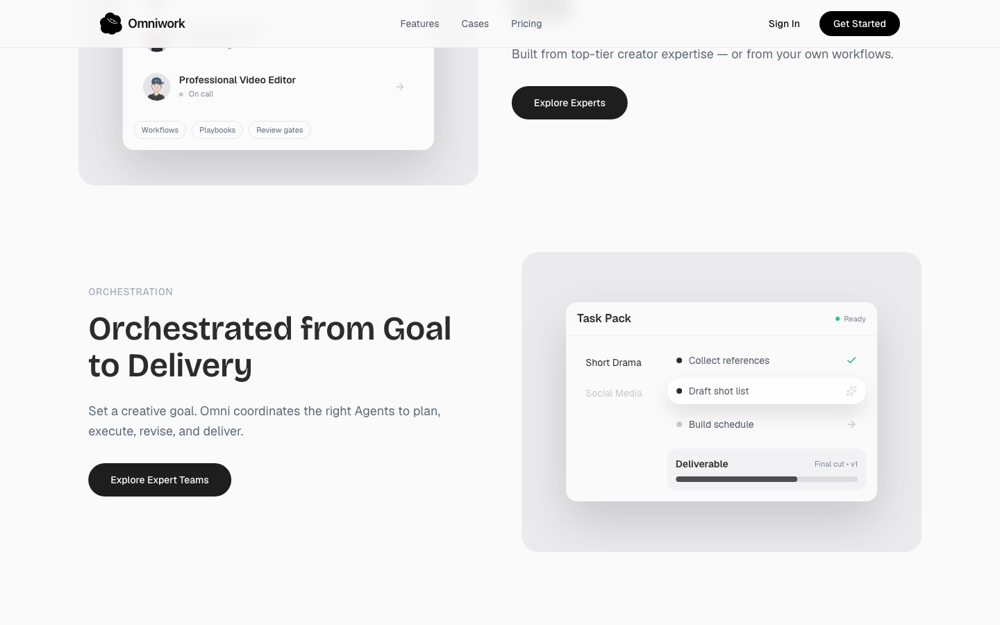

**观察：**

- ✅ 核心工作流闭环演示得很具体**：页面用"账号增长"一个真实场景，完整跑通了"设定目标 → Omni 编排 → 多个专家 Agent 协作 → 交付成果"的机制——用户给出目标（涨粉到 1 万），编排器自动拆解并调度 @Trending-Content-Monitor（出跨平台趋势报告）、@Viral-Content-Reproduction（选定可复刻爆款）、@Trend-To-Post（写文案）、@Account-Monitoring-Expert（追踪表现），且产出物是可见的具体文件（趋势报告 HTML、文案 HTML、成片 MP4）。读者能直观理解"多智能体编排"究竟如何运转，这是有力的功能展示。
- P1 「真人专家 vs 纯 AI」的产品边界含糊**：主张是"built on top-tier human expertise"，Agent 还带有 Certified / Available / In a meeting / On call 等拟人状态。但页面始终没讲清这些"专家"到底是真人接单、由人类专精训练出的 AI、还是人机混合——"In a meeting"是字面意义的真人在忙，还是纯状态隐喻？这直接决定了产品是 AI 工具还是众包专家平台，也决定了交付时效与成本预期，属关键功能信息缺失。
- P1 与真实平台的接入 / 自动发布机制完全未说明**：演示目标直指真实 YouTube 账号，且 @Account-Monitoring-Expert 声称在"tracking performance on all published content"，暗示产品会真正发布并监测内容。但页面没说：是否需要授权绑定用户社媒账号、是自动发布还是仅产出草稿待人工发布、监测数据来源是什么。对一个"账号增长"产品，能否真正打通发布与回流监测是最核心的功能点，却恰恰留白。
- P2 自建 Agent / Workflows / Playbooks / Review gates 的机制空泛**：页面称 Agent 可"built from your own workflows"，并罗列 Workflows、Playbooks、Review gates 三个能力词，但都只有名词、无解释——用户如何把自己的工作流沉淀成 Agent？Playbook 与 Workflow 有何区别？Review gate 是人工审核卡点还是自动质检？这些恰恰是区分"可定制平台"与"固定模板工具"的关键，缺少输入方式与示例。
- P2 能力广度只演示了单一场景**：Experts Market 列出的 Agent 跨度极大（FMV 游戏制作、音乐制作人、影视导演、配音演员、说唱歌手……），暗示远不止社媒涨粉，但全页仅深入展示了"账号增长"一个用例。读者无法判断这些异构 Agent 能否组合成其他完整交付（例如"产出一支带配乐和配音的短片"），其余场景的"目标→交付"链路连一句示例都没有。

### ⭐ 客户案例（2 个测点）

**该模块覆盖页面**:

- `https://www.omniwork.ai/`

#### S4: Customer / logo wall

**URL:** https://www.omniwork.ai/

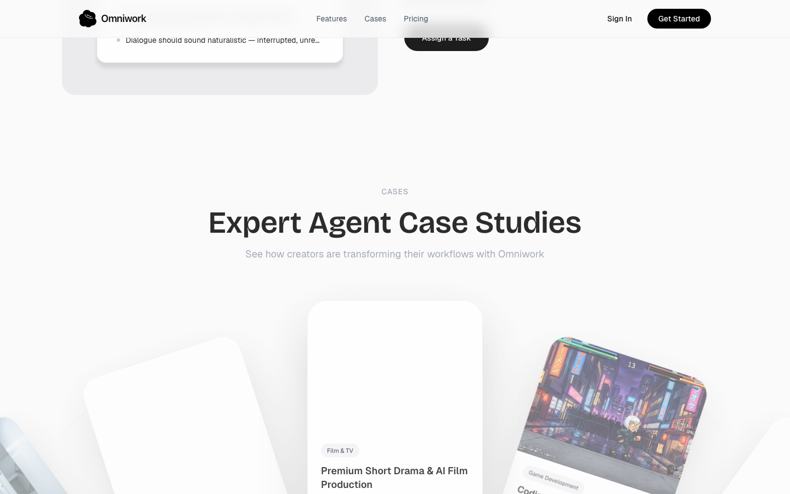

**观察：**

- ✅ 页面用一个完整的"账号增长"场景把核心能力讲清楚了：输入一个创意目标（把账号涨到 10,000 粉），系统自动编排多个专家 Agent 协作——Trending-Content-Monitor 出跨平台趋势报告 → Viral-Content-Reproduction 选定可复刻的爆款 → Trend-To-Post 产出文案 → Account-Monitoring-Expert 持续追踪已发布内容表现。这是一条"从目标到交付"的可见工作流，功能定位（Agent OS for Creative Work）传达有力。
- P2（S4 本测点核心问题）："Trusted by 10,000+ teams worldwide" 只是一个数字信任声明，没有任何真实客户 logo、名称、行业或团队类型。从功能角度看，它无法回答"哪类团队、为做什么任务在用 Omniwork"——既不能佐证适用场景，也无法让访客判断"我这种团队是否适用",信任背书与功能证据都偏空。
- P1：整个增长案例暗示了"发布到平台 + 追踪已发布内容表现"，但页面从未说明**集成哪些平台**（YouTube / TikTok / Instagram？）、Agent 是否真的代发布还是只产出草稿、以及如何接入用户的社交账号授权。这是判断"产品能否真正帮我运营账号"的关键功能点，完全缺失。
- P2：EXPERTS MARKET 列出了一长串专家 Agent 角色（视频剪辑、音乐制作、配音、Rapper、FMV 游戏制作等），揭示了"按角色调用专家能力"的市场化机制；但每个 Agent 的**输入 / 输出 / 调用方式 / 产物格式**都没说明（如"Professional Video Editor"吃什么素材、出什么成片规格），用户无法判断单个 Agent 的实际能力边界。
- P2：编排层提到 Workflows / Playbooks / Review gates 和 Agent 状态（Certified / Available / In a meeting / On call），暗示存在多 Agent 流水线 + 人工审核关卡 + 资源调度机制——这是有信息量的差异化能力，但"Review gates 何时触发、人如何介入、Playbook 是预置模板还是可自定义"均未解释，机制说明不完整。

#### S14: Customer support channels

**URL:** https://www.omniwork.ai/

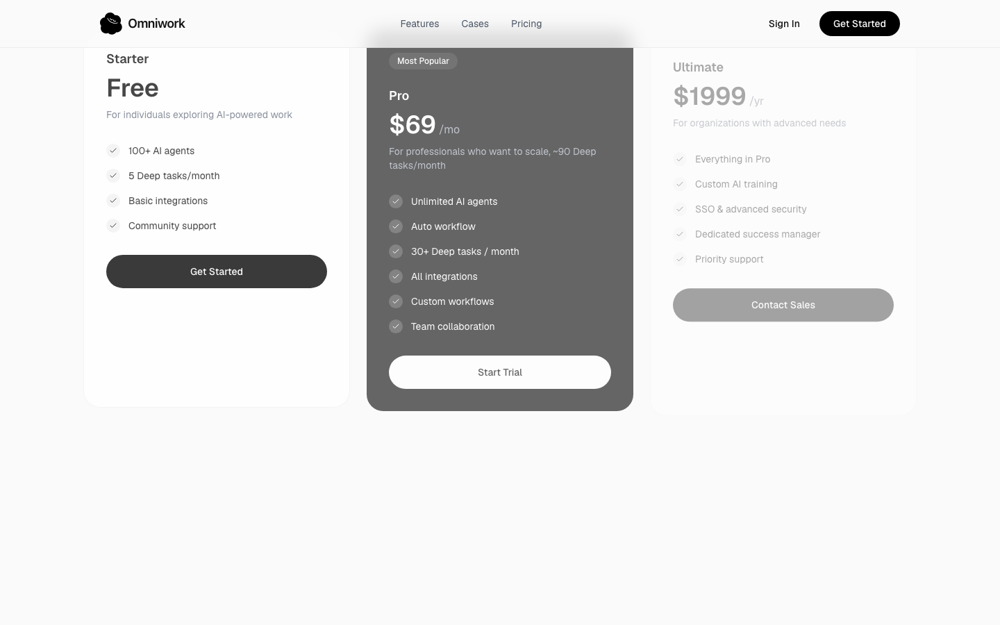

**观察：**

- P1 这一页(首页)完全没有暴露任何客服/支持渠道——既无 Help Center、文档、社区,也无在线客服、邮箱或联系入口,顶部导航仅有 Features / Cases / Pricing / Sign In / Get Started。对一个还需"邀请码"(Get invite code)、明显处于早期/受邀阶段的产品,用户遇到 Agent 跑错、产出不达预期时,从本页无法判断"出了问题该找谁",支持可达性是关键缺口。
- ✅ 用一个具体场景把核心工作流讲清楚了:用户下达创意目标("把这个账号涨到 1 万粉丝"),Omni 自动 looping in 多个专家智能体(Trending-Content-Monitor 出跨平台趋势报告 → Viral-Content-Reproduction 选定爆款复刻 → Trend-To-Post 写文案 → Account-Monitoring-Expert 持续追踪已发布内容表现),并产出 HTML 文档、社媒文案、MP4 等可交付物。"从目标到交付"的多智能体编排能力演示得直观可信。
- P2 编排机制只给了标签没给定义:Workflows / Playbooks / Review gates 三个关键概念并列出现,但未解释各自是什么、如何配置。尤其 "Review gates"(审核门)对创意类自动产出至关重要——是人工审核卡点、质量校验,还是发布前确认?完全没说,用户无法判断自动产出是否可控、能否在发布前介入。
- P1 产出的"接入与发布"链路没讲清:演示里 Agent 要监控趋势、复刻爆款、追踪账号表现,意味着必须接入 YouTube/TikTok 等社媒账号,但页面完全未说明如何授权账号、支持哪些平台、产出的文案/视频是直接自动发布还是仅生成草稿。这是该产品能否真正"替我运营账号"的核心机制,信息缺失会让用户对自动化边界产生误解。
- P2 "Expert Agents——From top creators, or your own team / 从顶级创作者获取,或用你自己的工作流构建"点出了"预置专家市场 + 自定义自建"的双向能力,这是有价值的卖点;但"用你自己的 workflow 构建 Agent"具体怎么做(录制操作?填表定义?上传 SOP?需要技术能力吗?)只字未提,自建路径的输入方式与门槛是想了解却看不到的关键点。

### 💰 定价 / 商业化（1 个测点）

**该模块覆盖页面**:

- `https://www.omniwork.ai/`

#### C2: Pricing page

**URL:** https://www.omniwork.ai/

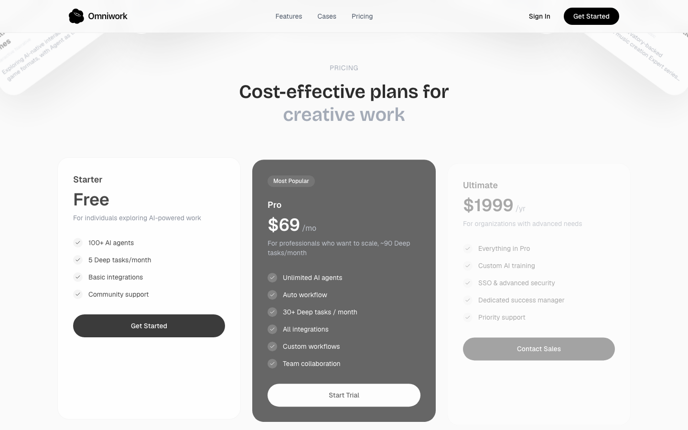

**观察：**

- ✅ Account Growth Management 这个演示把"目标→交付"的多智能体编排机制讲清楚了**：用户输入一句自然语言目标（把账号涨到 1 万粉），编排器 Omni 自动拆解并调度多个专职 Agent——Trending-Content-Monitor 出趋势报告、Viral-Content-Reproduction 复刻爆款视频、Trend-To-Post 写文案、Account-Monitoring-Expert 持续追踪表现，且每个环节都产出可见的具体交付物（HTML 趋势报告、HTML 文案、MP4 视频）。工作机制和典型场景（创作者/社媒运营做内容生产+涨粉）传达得很到位。
- P1 严重：作为"Pricing page"，正文里完全没有任何定价信息**——没有套餐分层、价格、用量/额度上限，也没有各档位的功能差异说明。用户读完无法知道这个产品要花多少钱、每档包含什么能力。这是定价页最核心的功能信息，却整页缺失（展示的全是产品能力介绍，更像首页/功能页内容）。
- P1 严重：Agent 与真实平台的集成机制完全未说明**。演示里出现了 YouTube 链接、"发布内容""追踪所有已发布内容"等动作，但页面从未解释 Agent 如何接入/授权/发布到/监控真实社媒账号（YouTube、TikTok 等）。这是判断"产品能否端到端跑通"的关键技术点，缺失会让人怀疑演示是否只是模拟。
- P2 中等：自定义能力与人审控制点只点名未解释**。页面出现"Built from your own workflows""Workflows / Playbooks / Review gates"，暗示用户可自建 Agent/工作流、并有人工审核闸口，但完全没说明怎么搭建自定义 Agent、Playbook 到底是什么、Review gate 如何插入人工确认。这些恰恰是企业用户最关心的可扩展性与可控性功能。
- P2 中等：Experts Market 列了约 11 类 Agent（FMV 游戏制作、音乐制作人、配音、影片导演、内容洞察分析等），覆盖面明显超出社媒内容，但每个 Agent 的输入/输出/能力边界都没有说明**。用户看到一长串职业名，却无法判断某个 Agent 具体能为自己的任务做什么、需要喂什么、产出什么格式,难以评估是否匹配自身需求。

### 🚪 注册 / 试用入口（1 个测点）

**该模块覆盖页面**:

- `https://www.omniwork.ai/`

#### C3: Sign-up flow (no submit)

**URL:** https://www.omniwork.ai/

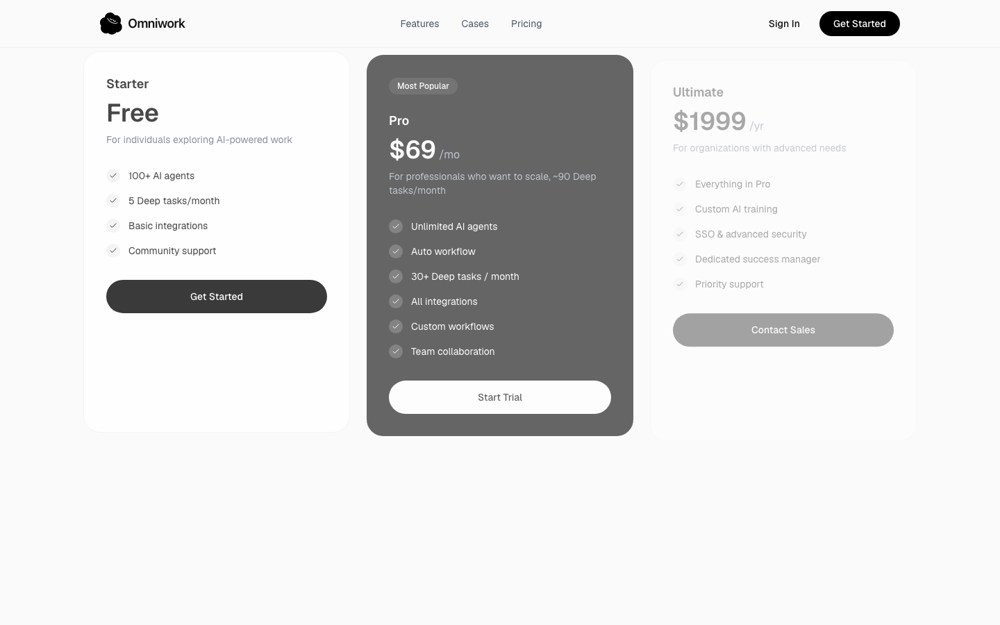

**观察：**

- ✅ 页面用一个完整场景（"把这个 YouTube 账号涨到 1 万粉"）演示了核心工作流：用户设定创意目标 → Omni 编排多个专家 Agent 协作（Trending-Content-Monitor 出趋势报告、Viral-Content-Reproduction 复刻爆款、Trend-To-Post 写文案、Account-Monitoring-Expert 跟踪表现）→ 实际产出跨平台趋势报告(HTML)、社媒文案(HTML)、成片(mp4)。"Agent OS for Creative Work"的定位与"从目标到交付"的编排能力被讲清楚了，读者能理解"产品能替我跑完整条内容生产链"。
- 产品能力点：提供"Experts Market"专家 Agent 市场（FMV Game Creator、Professional Video Editor、Music Producer、Content Insights Analyst、Voice Actor、Professional Rapper 等 11 类角色），并声明"Built from top-tier creator expertise — or from your own workflows"，即既可调用预置专家、也可用自有工作流自建 Agent。**P2** 但"如何把自己的 workflow 转成可用 Agent"的输入/机制完全没说明，自建能力只是一句话带过。
- P1** 关键执行机制缺失：演示中 Agent 被要求"grow this account: www.Youtube…"，但页面丝毫未说明 Agent 如何接入/授权用户的社媒账号、是否真能代为发布、覆盖哪些平台（YouTube/TikTok/IG…）。这是判断"产品能否真正替我执行而非只生成草稿"的核心，却无任何集成或授权说明。
- P1** 本测点（Sign-up flow）：入口同时出现"Try Omniwork free"与"Get invite code"两个并列 CTA，暗示注册可能是邀请码门控/候补制，但页面没说清是自助注册还是必须邀请、免费版包含哪些 Agent 与用量额度。用户读完无法判断"我现在能不能用、免费能用到什么程度"。
- P2** 编排与状态概念只给名词不给定义："Workflows / Playbooks / Review gates"三个编排要素，以及 Agent 状态标签（Certified / Available / In a meeting / On call）均无解释——Review gates 是否代表人工审核卡点、Playbooks 与 Workflows 的区别、Agent"开会/通话中"对可用性意味着什么（是否排队/占用），都未说明，影响对真实工作机制的理解。

### 🔌 集成 / API（2 个测点）

**该模块覆盖页面**:

- `https://www.omniwork.ai/`

#### S3: Integrations page

**URL:** https://www.omniwork.ai/

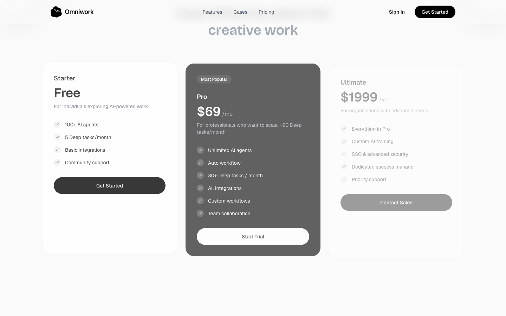

**观察：**

- ✅ 揭示了核心能力清晰有力：Omniwork 是面向创意工作的"Agent OS"——通过编排一组 Expert Agents(专家智能体)实现"从目标到交付"的自动化。"Account Growth Management"示例很有信息量:用户用自然语言下达目标("把这个 YouTube 账号涨到 1 万粉丝"),系统自动 loop in 多个 agent(趋势监控 → 爆款复刻 → 成稿),并产出可见交付物(跨平台趋势报告 HTML、社媒文案 HTML、成品 .mp4),最后由 Account-Monitoring-Expert 持续追踪表现——输入 / 工作机制 / 输出一条线讲清楚了。
- P1 严重:页面标称为 "Integrations page"(集成页),但正文里完全没有任何集成信息——未列出 Omniwork 接入了哪些平台 / 工具 / API(YouTube、TikTok、Instagram?哪些第三方服务?),也没说明如何连接账号、授权 / 连接机制、连接器清单。示例里提到 YouTube,却没有对应的集成说明,与页面定位严重不符,用户无法判断"我现有的账号 / 工具能否接进来"。
- P2 中等:Expert Agents 的工作机制语焉不详。除了名字和状态标签(Certified / Available / In a meeting / On call),"基于顶尖人类专家构建"具体指什么没讲清——是真人专家训练 / 调校了 agent,还是真人在环参与执行?另外 "or from your own workflows / your own team" 暗示可自建 agent,但自建的输入是什么、如何把"自己的 workflow"转化为一个 agent,完全没有说明。
- P2 中等:编排层(Orchestration)抛出了 Workflows / Playbooks / Review gates 三个机制,但只有标题、没有解释。Review gates(评审关卡)是人工审核节点还是自动校验?Playbooks 与 Workflows 有何区别?这些恰是该产品区别于普通单点 AI 工具的关键编排能力,却没有任何功能描述。
- P3 轻微:适用场景边界未明示。从 agent 清单(FMV 游戏制作、视频剪辑、音乐制作、说唱、配音、影视导演、内容洞察分析)看覆盖面很广,但示例只演示了"社媒涨粉"一个场景,用户难以判断这些差异极大的 agent 是否真能跨领域协同,以及非内容创作类目标(如商业 / 营销分析)是否同样适用。

#### S9: API / Developer docs

**URL:** https://www.omniwork.ai/

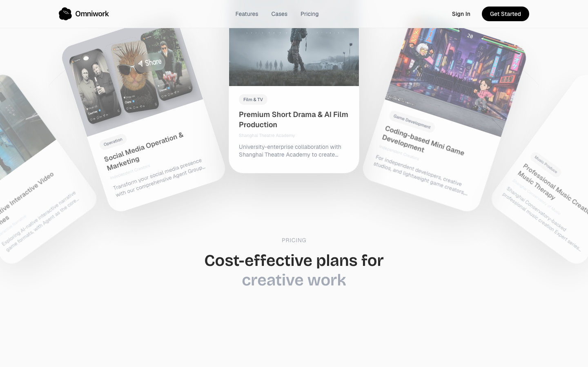

**观察：**

- P1（针对本测点 S9=API/Developer docs）**：页面通篇没有任何 API、SDK、Webhook 或开发者接入文档的踪迹——它是一张面向终端用户的产品落地页。作为"API / Developer docs"测点，最关键的功能信息（开发者如何以编程方式调用 Expert Agents、如何把编排能力嵌入自有系统、是否有 REST/接口/鉴权）完全缺失，无法回答"开发者能用它构建什么"。
- ✅ 核心能力表达清晰**：页面用一个可落地的场景（把 YouTube 账号涨到 1 万粉）完整演示了产品做什么——一个基于"Expert Agents"的创意工作编排系统。多智能体协作链路被具体展示：Trending-Content-Monitor 产出跨平台趋势报告 → Viral-Content-Reproduction 选定爆款 → Trend-To-Post 写文案 → Account-Monitoring-Expert 追踪发布后表现；输入（一句创意目标）和输出（HTML 趋势报告、社媒文案、mp4 成片）都有实例，用户能理解"它能替我跑完一整条创作流水线"。
- P2 编排机制只有标签没有定义**："Workflows / Playbooks / Review gates"三个编排概念仅以词条出现，未解释各自是什么、如何配置、如何区分。其中 Review gates（审核关卡）对创意交付质量最关键，但页面没说明它是人工审核还是自动质检、用户在哪个环节介入、能否自定义通过标准。
- P2 Agent 能力边界与自建机制不明**：EXPERTS MARKET 罗列了 11 类专家智能体（FMV Game Creator、Music Producer、Voice Actor 等），但每个 Agent 的具体能力范围、接受的输入 / 产出的格式、是否可任意组合都未说明。"Built from top-tier creator expertise — or from your own workflows"暗示支持自建专家，却完全没讲自建机制（无代码搭建？需上传作品/SOP 训练？还是录制工作流？），这是想用它复刻自有团队工作流的用户最想知道的关键点。
- P3 拟人化状态语义未交代功能影响**：Agent 的"Certified / Available / In a meeting / On call"状态是个有意思的设定，但没解释它对功能的实际意义——"In a meeting"的 Agent 是否当前不可调用、是否影响任务排队与交付时效，用户无法据此判断可用性。

### 🔒 安全 / 信任（1 个测点）

**该模块覆盖页面**:

- `https://www.omniwork.ai/`

#### S12: Trust / Security page

**URL:** https://www.omniwork.ai/

**观察：**

- ✅ 页面清晰揭示了核心能力——**面向创意工作的多 Agent 编排（Agent OS）**。用「把账号涨到 10,000 粉」这个目标做了完整链路演示：设定创意目标 → Omni 调度 Trending-Content-Monitor（出跨平台趋势报告）→ Viral-Content-Reproduction（选爆款复刻）→ Trend-To-Post（写文案）→ Account-Monitoring-Expert（监控已发布内容表现），并给出可见产物（趋势报告 HTML、文案 HTML、成片 mp4）。"从目标到交付"的工作机制和典型场景（创作者/团队的社媒增长流水线）传达得很到位。
- P1**：该测点标注为 **Trust / Security 页**，但抓取到的内容里**完全没有任何安全/信任的功能性信息**——没有说明 Agent 如何获得社媒平台（YouTube 等）的访问授权、凭证如何托管、数据存储与留存、权限范围、合规认证。对一个会**自主操作用户账号并自动发布内容**的产品，这是最关键的功能缺口；"Trusted by 10,000+ teams" 只是营销背书，不构成信任/安全能力说明。
- P1**：**集成与接入机制未交代**。示例里出现 "Grow this account: www.Youtube..."，但没说明用户是通过 OAuth 授权、粘贴凭证还是只读接入，也没有可对接平台/工具的集成清单。用户无法判断"接入我的账号需要交出什么权限、风险多大"——这恰恰是 Security 页本应回答的功能点。
- P2**：功能名词 **Review gates / Playbooks / Workflows 只列名未解释**。其中 Review gates 很可能是"人工审核闸口"（Agent 自动发布前的人在环控制），是信任场景的核心机制，但页面没说明用户保留多少审批/否决权、在哪一步介入。Playbooks 与 Workflows 的区别与作用同样缺失。
- P2**：自定义能力点到为止。"Built from top-tier creator expertise — or from your own workflows" 揭示了"既能用认证好的专家 Agent，也能基于自有工作流自建"，但**自建机制（如何把自己的工作流/专业经验"灌"成一个 Agent、需要什么输入格式）未做任何说明**；"Your memory retrieved" 暗示有持久化记忆，但记忆的范围与运作方式也未交代。

### 🏢 公司 / 团队（1 个测点）

**该模块覆盖页面**:

- `https://www.omniwork.ai/`

#### S7: About / Company

**URL:** https://www.omniwork.ai/

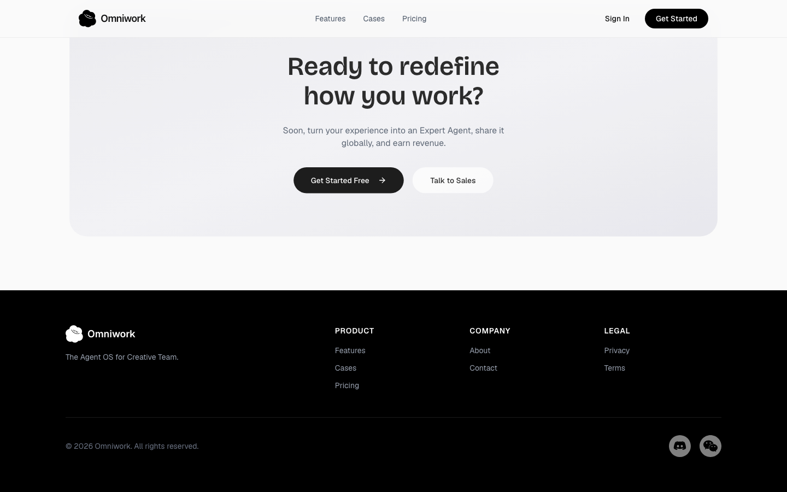

**观察：**

- ✅ 「Account Growth Management」演示完整呈现了核心工作流：用户输入一个创作目标（如"把这个 YouTube 账号涨到 10,000 粉丝"），系统自动调度多个 Expert Agent 协同——Trending-Content-Monitor 产出跨平台趋势报告、Viral-Content-Reproduction 选定可复刻的爆款、Trend-To-Post 写好文案、Account-Monitoring-Expert 持续追踪已发布内容表现，并交付 HTML 报告、文案文档与 MP4 成片。这是少见的"从目标到交付"端到端能力演示，读者基本能理解"产品能替我做什么"。
- 核心卖点是「Expert Agents built on top-tier human expertise」，但页面**完全没有说明"顶尖人类经验如何转化为一个 Agent"的机制**——是人设 prompt、微调模型、知识库，还是真人参与？这直接决定 Agent 能力的可信度与差异化。**P1 未说明专家经验注入 Agent 的工作机制**。
- 演示里 Agent 既"写好文案/做出成片"，又能"追踪所有已发布内容的表现"，强烈暗示与 YouTube 等社媒平台存在发布 / 数据集成，但**全程没有任何集成清单或对接平台范围**：能否自动发布？支持哪些平台？是只读监测还是可写操作（代发、回评）？**P1 缺少平台集成与自动发布能力的关键说明**。
- Orchestration 区块抛出 Workflows / Playbooks / Review gates 三个编排原语，**三者的定义、区别和使用方式都未解释**——尤其 "Review gates"（是否为人工审批卡点、谁来审、卡在哪一步）对创作交付质量非常关键，却只有名词没有内容。**P2 编排机制只给概念名词、缺少功能解释**。
- Experts Market 列出 11 类专家 Agent（FMV Game Creator、Video Editor、Music Producer、Voice Actor、Rapper 等），清晰传达了能力广度集中在**内容创作 / 社媒增长**赛道；同时强调可"from your own workflows / your own team"自建 Agent，但**自建 Agent 的输入、配置或训练方式完全未提**，用户无法判断把自有工作流变成 Agent 的门槛与路径。**P2 自定义 Expert Agent 的构建路径缺失**。

### 📰 博客 / 内容（1 个测点）

**该模块覆盖页面**:

- `https://www.omniwork.ai/`

#### S6: Blog / Resources

**URL:** https://www.omniwork.ai/

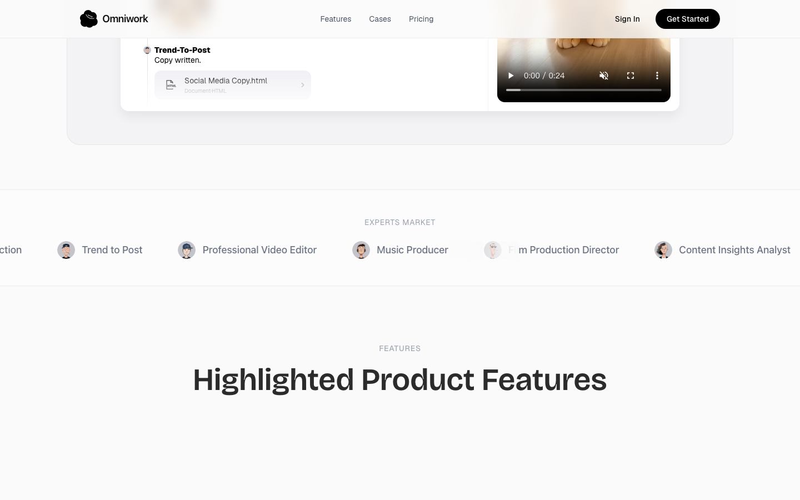

**观察：**

- ✅ 页面用一个完整场景讲清了核心能力：Omniwork 是"创意工作的 Agent OS"，用户只下一个目标（"把这个账号涨到 1 万粉"），系统自动编排多个专家 Agent 接力完成——Trending-Content-Monitor 出跨平台趋势报告 → Viral-Content-Reproduction 选爆款复刻 → Trend-To-Post 写文案 → Account-Monitoring-Expert 持续追踪表现，且每步都有可交付物（趋势报告 HTML、社媒文案 HTML、成片 .mp4）。"从目标到交付"的工作流被具体演示出来，功能价值传达有力。
- P1** 关键集成与"是否真的发布"未说明：示例里 Account-Monitoring-Expert 称"正在追踪所有已发布内容的表现"，暗示产品能直连真实社媒账号发布并回采数据，但页面完全没说支持哪些平台（YouTube/TikTok/IG?）、如何授权账号、是直接发布还是仅产出草稿。这是决定"它到底能不能替我运营账号"的核心功能点，却模糊处理。
- P2** "专家市场"商业/接入机制信息不完整：EXPERTS MARKET 列出 11 类预制 Agent（视频剪辑、音乐制作、配音、说唱、影视导演等），并称"来自顶尖创作者，或你自己的团队/工作流"，但未说明 Agent 如何计费、"Certified / Available / In a meeting / On call"状态代表什么、以及"用自己的工作流构建 Agent"具体怎么操作（输入什么、训练机制如何）。
- P2** 编排机制只有标签、缺乏解释：Workflows / Playbooks / Review gates 三个关键概念被并列展示，暗示存在人工审核关卡（human-in-the-loop），但 Playbook 与 Workflow 的区别、Review gates 在什么节点触发、用户如何介入审批均未说明，读者无法判断对产出的可控程度。
- P2** 作为 Blog / Resources 测点，页面实际抓取到的全是营销落地页内容，没有任何博客文章、案例库、帮助文档、教程或资源条目。想深入了解"各功能如何工作 / 上手指南 / 真实案例"的用户在此页找不到任何学习型内容——功能认知的纵深资源缺失。

### 📖 文档 / 帮助（1 个测点）

**该模块覆盖页面**:

- `https://www.omniwork.ai/`

#### C7: Help / Documentation

**URL:** https://www.omniwork.ai/

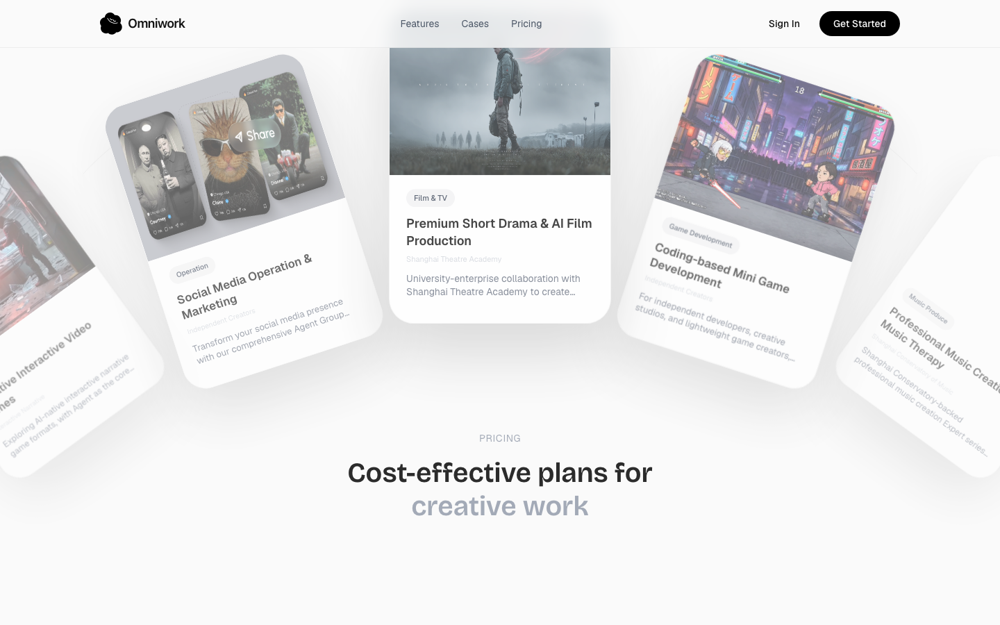

**观察：**

- P1**：该测点定位为 "Help / Documentation"，但抓取到的实际是营销首页——页面**完全没有出现任何帮助中心 / 使用文档 / 上手教程 / Agent 配置说明 / API 文档**的入口或内容。对想搞清"如何实际操作、如何接入账号、如何创建 Agent"的用户而言，这是关键功能信息的整体缺失，产品的可学习性 / 可上手性无从体现。
- ✅**：页面用一个端到端实例清晰演示了核心工作流——用户下达创意目标（"把这个账号涨到 1 万粉"），Omni 自动编排多个 Expert Agent（Trending-Content-Monitor 出跨平台趋势报告 → Viral-Content-Reproduction 选定可复刻爆款 → Trend-To-Post 产出文案 → Account-Monitoring-Expert 持续追踪表现），并给出 HTML 报告、文案、mp4 等具体产出物，让"产品能替我做什么"在场景层面相当直观。
- P2**：揭示了能力骨架（Expert Agents 市场 + Goal-to-Delivery 编排 + Workflows / Playbooks / Review gates），但关键机制未说明：Agent 如何**接入并操作用户的社媒账号**（YouTube/TikTok/Instagram 的授权方式）、"built on top-tier human expertise" 具体指什么、产出物如何回流到真实平台发布——这些是判断产品可用性的核心，恰恰是文档层应解释却缺失的部分。
- P2**：文案中 "or from your own workflows / your own team" 暗示支持**自建 Agent / 自定义工作流**，但完全没有说明如何创建、需要哪些输入、是脚本还是可视化编排。自建能力是这类产品的关键差异点，却没有任何说明或文档指引。
- P3**："Review gates""Playbooks" 等功能名词出现但无定义——用户无法判断 Review gates 是人工审核卡点还是自动质检、Playbook 与 Workflow 有何区别。此类功能术语应在文档/说明中给出明确定义。

### 📌 其他（2 个测点）

**该模块覆盖页面**:

- `https://www.omniwork.ai/this-page-should-not-exist-product-audit-test-1234`
- `https://www.omniwork.ai/`

#### C8: 404 error handling

**URL:** https://www.omniwork.ai/this-page-should-not-exist-product-audit-test-1234

**观察：**

- P2** 该 404 页面为完全通用的默认错误页（"This page could not be found." 是 Next.js 等框架的默认文案），未承载任何产品功能信息，对外不揭示产品的任何能力、工作流或集成点。
- P2** 功能找回机制缺失：页面没有提供搜索框、热门功能入口、站点地图或"返回首页/控制台"等引导，用户因死链或输错 URL 落到此页后，无法被重新导流回产品的核心功能区，等于中断了使用工作流。
- P3** 未做场景化补救——对于产品类站点，404 常被用来推荐相关功能模块、最近访问的工作区或文档入口；此页放弃了这一"顺带展示产品能做什么"的机会。
- P1（信息缺口）** 用户读完这一页完全无法理解"这个产品能为我做什么"：既没有产品名/定位，也没有任何功能线索或下一步行动指引，功能信息量为零。
- P3** 缺少错误后续支持信息(如"报告失效链接""联系支持""查看服务状态")，无法判断是页面迁移、权限问题还是功能下线，用户难以自助恢复到目标功能。

#### S5: Case studies / Testimonials

**URL:** https://www.omniwork.ai/

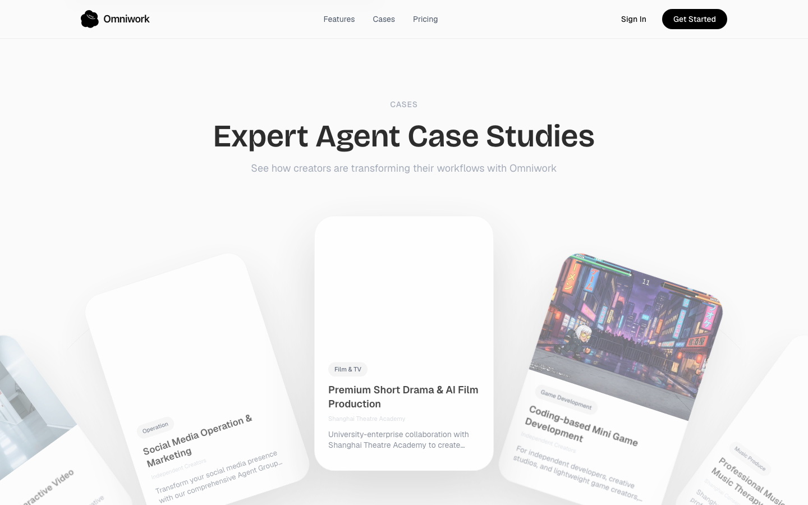

**观察：**

- ✅ 页面用一个完整端到端案例（"Account Growth Management"）演示了产品核心工作流：用户设一个目标（把账号涨到 1 万粉），Omni 编排器自动调度多个专家 agent 接力——Trending-Content-Monitor 出跨平台趋势报告、Viral-Content-Reproduction 选定要复刻的爆款、Trend-To-Post 写文案、Account-Monitoring-Expert 持续监测已发布内容表现，最终产出可交付物（趋势报告 HTML、社媒文案 HTML、成片 .mp4）。"输入目标→自动编排→具体产出"的链路清晰，读完能立刻理解"产品能替我把账号增长这件事跑完"。
- P1（针对 S5 案例/见证测点）：虽然打了"Trusted by 10,000+ teams worldwide"，但全页没有任何真实客户名称、用户引述（testimonial）或可量化结果。唯一的演示案例只展示了"流程跑完、文件生成"，却没说明这个账号最终是否真涨到 1 万粉、涨了多少、用了多久——作为"案例/见证"页，缺失最关键的成效证据，社会证明停留在口号层面，无法支撑"10,000+ teams"的可信度。
- P2 功能机制未说清：EXPERTS MARKET 列了十余种 agent（FMV Game Creator、Music Producer、Voice Actor、Film Production Director 等），但没解释"built on top-tier human expertise"具体如何把人类专家能力封装成 agent、"Certified"认证的标准是什么、每个 agent 的输入/输出边界各是什么。用户只看到一串名字，无法判断单个 agent 究竟能干什么、产出质量如何保证。
- P2 集成/发布环节缺失：案例中 Account-Monitoring-Expert "tracking performance on all published content" 暗示产品能发布并回收真实社媒数据，但页面始终没说明它接入了哪些平台（YouTube / TikTok / Instagram?）、是自动发布还是仅产出草稿、如何授权绑定账号。"涨粉"这一核心承诺所依赖的发布与数据回流机制完全没交代，是功能闭环上最大的空白。
- P3 agent 状态标识（Available / In a meeting / On call）做了拟人化展示，但功能含义不明——是并发受限、排队调度、还是按"出场"计费？这直接关系到用户能否同时调用多个 agent、成本如何计算，页面未作解释。

### ⚠️ 未找到的测点（2 个测点）

**该模块覆盖页面**:

- `https://www.omniwork.ai/`

#### C4: Login page

**URL:** https://www.omniwork.ai/
**观察：**

- [Link not found] 该模板期望的链接（log in|login|sign in|登录|登入）在 https://www.omniwork.ai/ 上未找到 — 可能产品用了不同的措辞或这个功能不存在。 已跳过截图与 LLM 解读以避免重复首页快照。

#### S2: Use cases / Industry

**URL:** https://www.omniwork.ai/
**观察：**

- [Link not found] 该模板期望的链接（use case|industries|solutions|应用场景|行业）在 https://www.omniwork.ai/ 上未找到 — 可能产品用了不同的措辞或这个功能不存在。 已跳过截图与 LLM 解读以避免重复首页快照。

---

## 4. 第三方社区反馈

#### ⚠️ 未找到显著社区讨论

WebSearch 在 Reddit / Product Hunt / Hacker News / G2 等平台未找到 `omniwork.ai` 的显著用户讨论。本节内容为空——不代表产品好或差，仅说明社区讨论数据稀缺。

---

## 5. 从访客到注册的转化路径

⚠️ 本节 (§5 从访客到注册的转化路径) LLM 调用失败 — 可能是超时 / 会话限额 / 服务异常。
建议 session 重置后单独重跑 synthesis_pass，本节将自动补齐。
