# ramp.com 产品深度体验报告

## 报告信息

| 项 | 内容 |
|---|---|
| 产品名称 | ramp.com |
| 产品 URL | https://ramp.com/ |
| 体验时间 | 2026-06-20T01:41:16.166864 |

---

## 目录

- [1. 核心结论](#1-核心结论)
  - [1.1 一句话判定](#11-一句话判定)
  - [1.2 主要风险](#12-主要风险)
  - [1.3 主要亮点](#13-主要亮点)
  - [1.4 综合评分](#14-综合评分)
- [2. 产品概览](#2-产品概览)
  - [2.1 基础信息](#21-基础信息)
  - [2.2 测点速览](#22-测点速览)
  - [2.3 产品 / 公司背景信息](#23-产品--公司背景信息)
  - [2.4 产品定位与策略](#24-产品定位与策略)
  - [2.5 公司基本信息](#25-公司基本信息)
- [3. 体验流程记录](#3-体验流程记录)
  - [3.1 官网叙事分析](#31-官网叙事分析)
  - [3.2 测点流程详情](#32-测点流程详情)
- [4. 第三方社区反馈](#4-第三方社区反馈)
- [5. 从访客到注册的转化路径](#5-从访客到注册的转化路径)

---

## 1. 核心结论

### 1.1 一句话判定

目标产品 **https://ramp.com/** 在本次深度体验中：存在显著的功能信息缺口。详见 §3 体验流程记录。

### 1.2 主要风险

1. **[C1]** P1 严重**: 首页完全未能加载，仅返回 "This page couldn't load / Reload to try again" 错误页，没有任何产品文案、功能模块或价值主张可供评估——5 秒测试的前提（用户能在 5 秒内判断"这产品是做什么的"）无法成立。
2. **[C1]** P1 严重**: 该错误页**零信息**揭示产品能力——既无产品名、品类（是 AI agent？SaaS 平台？工具？），也无核心功能/工作流线索，新访客无法判断"这个产品能为我做什么"。
3. **[C1]** P1 严重**: 解决的用户问题、输入/输出、典型使用场景、集成方式等**全部功能关键点缺失**，因为页面根本没有承载任何产品内容。

### 1.3 主要亮点

1. **[C2]** ✅ 页面以"功能矩阵"形式清晰揭示了 Ramp 是一个覆盖企业财务全流程的平台**，而非单一工具：企业卡（无限发卡+发卡管控）、差旅报销（订机票/酒店/租车、SMS/Slack 报销、自动收据匹配）、应付账款（OCR 发票提取、审批流、欺诈检查、ACH/卡/支票/电汇付款）、资金管理（投资账户生息）、会计自动化、预算报表、供应商管理。用户读完能理解"它能替我管钱的方方面面"。
2. **[C3]** ✅ 页面以"Cards, expenses, bill payments, and banking – in the blink of AI"清晰勾勒出 Ramp 的四大功能模块（公司卡 / 费用管理 / 账单支付 / 银行业务），并通过"One platform for your entire back office"明确定位为后台财务一体化平台，读者能快速理解产品覆盖范围。
3. **[C3]** ✅ 实时滚动指标（Receipts Processed / Accounting Fields Coded / Expenses Reviewed / Invoices Processed / Violations Classified / Spend Allocated）实质上把"AI agent 到底替我做哪些活"具象化了——收据识别、会计科目编码、费用审核、发票处理、违规分类、支出分配，这是对"infinite agents work 24/7"最有信息量的功能注脚。

### 1.4 综合评分

| 维度 | 评分 | 1-2 句话说明（引用具体 [测点ID]） |
|---|---:|---|
| 产品方向清晰度 | 4.0 / 5 | [C3] 用"Cards, expenses, bill payments, and banking – in the blink of AI / One platform for your entire back office"一句话锁定"后台财务一体化平台"，[B1][B2] 官方亦明确为"spend management / financial operations platform"，定位清晰；但 [C3][C5][S2] 反复出现的"Stack by Ramp"与主产品边界、以及 Agents/Policy Agents/Ramp Intelligence 三个并列 AI 概念始终未区分，扣分。 |
| 价值主张表达力 | 4.5 / 5 | [S1] 以量化方式表达核心能力（合规支出 98% 自动同步、发票 OCR 99%、月末关账快 3 天），[C3][C5] 实时滚动指标把"AI 替我干什么"具象化，[B2] 用"3 万客户省 20 亿美元/2000 万小时"与 [B3]"反积分、把钱留在账上"的差异化叙事背书，卖点有力可信；[B2] 该口径被自注为"估算非保证"略减分。 |
| 信息架构 | 3.5 / 5 | [C2] 套餐以"All the features of Free, and:"增量叠加、并明确标注 Procurement 为付费 Add-on，[C8] 404 被设计成能力地图+恢复入口，组织清晰；但 [C7] 完全无帮助中心/文档/API 入口、[C4] 连 login/登录 链接都未找到、[S1] 仅有碎片化 changelog 而缺统一功能总览，发现性缺口明显。 |
| 功能广度与深度 | 4.0 / 5 | [S1][C8][C2] 覆盖卡、报销、应付、采购、差旅、资金、记账自动化、多实体/全球乃至免费工具与 AI Token 管控，广度同类顶尖；但深度不均——[S1] 部分功能讲透了痛点+指标，而 [C5][S2][S3] 的 Banking 扫款机制、AI 工作机制、200+ 集成清单、AI Token Spend Management 等关键点仅有标签/口号，深度拉低评分。 |
| 核心能力可信度 | 3.5 / 5 | [C3][C5][S2] 实时动作计数器 + [S3] 具名客户证言（Sara Mauskopf/SVB 痛点）+ [B2] 3 万客户规模与 [B1]"How Ramp makes money"透明度构成可信社会证明；但主打的 AI 能力（"learns from 70,000 others""flows money to highest return"）在 [C2][C5][C7][S2] 被多次标为 P1——只有结果口号、无机制/输入/人工复核/可审计说明，作为涉资金合规产品的核心能力证据不足。 |
| 商业化清晰度 | 4.5 / 5 | [C2] Free/Plus($15/user)/Enterprise 三档分层、增量呈现且 Add-on 边界清楚，[B3] 进一步给出计费单位（Bill Pay 按方式分档：ACH $0.59/电汇 $15/SWIFT $20、无补卡费/滞纳金/利息、用户与卡不限）与 Treasury 收益率，[B1] 甚至公开盈利模式，定价方式与计费单位高度透明。 |
| **综合平均** | **4.0 / 5** | **Ramp 是品类顶尖的一体化支出/财务运营平台：方向、价值主张、定价表达均属优秀，但其最核心卖点"AI 自动化"的工作机制与集成清单始终是黑箱（多处 P1），是把整体评分压在 4.0 而非更高的关键短板。** |

---

## 2. 产品概览

### 2.1 基础信息

- **URL**: https://ramp.com/
- **首屏标题**: This page couldn’t load

Reload to try again, or go back.

Reload
Back

### 2.2 测点速览

本次共体验 31 个测点。

> ⚠️ **登录后内容未覆盖**——用户选择不登录，本报告仅为公开页范围；产品登录后的工作台 / 实际操作未在本报告内。

### 2.3 产品 / 公司背景信息

共发现 **6** 个产品/公司的官方介绍页面：

#### B1: 背景 D1: Overview of Ramp

**URL:** https://support.ramp.com/get-started-with-ramp/overview-of-ramp/

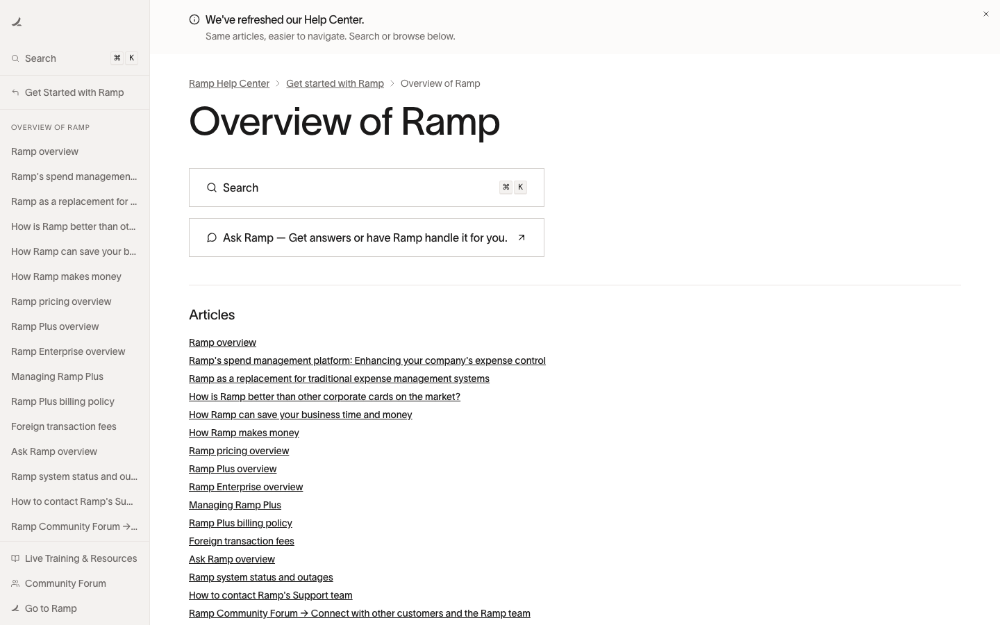

**背景信息：**

- ✅ **产品一句话定义**：页面将 Ramp 定位为「spend management platform」(支出管理平台)，配套副标题原文 "Ramp's spend management platform: Enhancing your company's expense control"，并明确叙述其角色是「a replacement for traditional expense management systems」(传统费用管理系统的替代品)。核心定义清晰——这是一个面向企业的支出/费用管控平台。
- ✅ **核心功能能力（从文章标题推断）**：① 企业支出/费用管控 (expense control)；② 公司卡 (corporate cards，标题 "How is Ramp better than other corporate cards")；③ Ask Ramp——AI 助手能力，原文 "Ask Ramp — Get answers or have Ramp handle it for you"；④ 定价/计费体系 (Ramp Plus、Ramp Enterprise 分层)；⑤ 跨境交易处理 (Foreign transaction fees)。
- ✅ **目标用户与场景**：明确面向企业 (company / your business)，典型场景是替换原有费用报销/管理系统、统一管控公司开支与公司卡。多处用 "save your business time and money" 强调对企业在时间与成本上的价值主张。
- ✅ **差异化主张**：页面设有专门对比性文章 "How is Ramp better than other corporate cards on the market?" 与 "Ramp as a replacement for traditional expense management systems"，核心叙事是「比传统费用系统/同类公司卡更好、更省钱省时」。罕见地还公开了 "How Ramp makes money"(Ramp 如何赚钱) 这一商业模式透明化叙事。
- ✅ **关键术语 / 概念**：
- Ramp Plus** — 付费增强档 (有独立的 overview、billing policy、管理指南)。

#### B2: 背景 D2: Ramp overview

**URL:** https://support.ramp.com/ramp-overview/

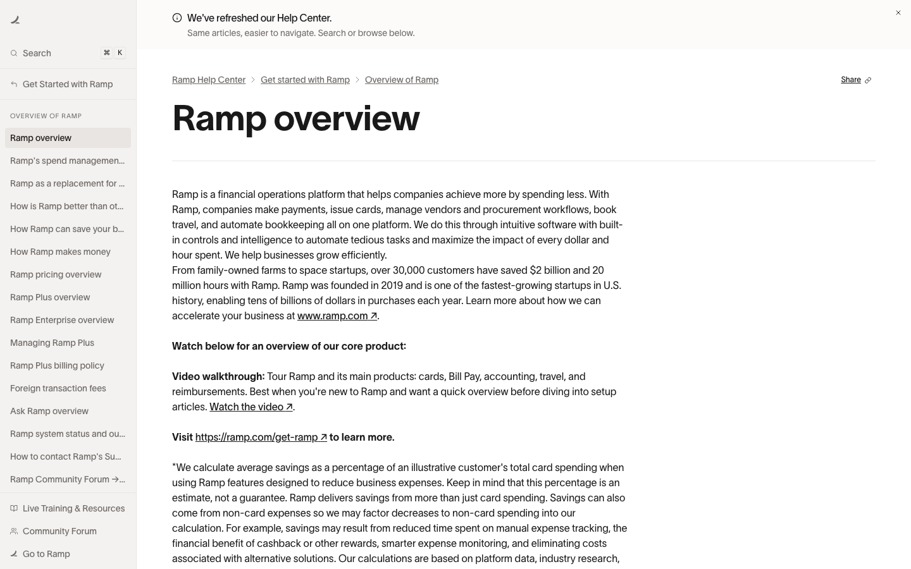

**背景信息：**

- ✅ **一句话定义清晰**：页面正文开宗明义地把 Ramp 定义为 "a financial operations platform that helps companies achieve more by spending less"（帮助企业"花得更少、成就更多"的财务运营平台），侧边栏副标题进一步补充为 "spend management platform: Enhancing your company's expense control"（强化企业费用管控的支出管理平台）。定义与品牌叙事高度一致。
- ✅ **核心功能能力一站式罗列**：正文明确该平台在"一个平台上"覆盖五大能力——支付（make payments）、发卡（issue cards）、供应商与采购流程管理（manage vendors and procurement workflows）、差旅预订（book travel）、自动化记账（automate bookkeeping）；视频导览又将主力产品归纳为 cards、Bill Pay、accounting、travel、reimbursements。
- ✅ **差异化主张与品牌叙事鲜明**：核心叙事是"用更少的钱办更多的事"，强调 "intuitive software with built-in controls and intelligence to automate tedious tasks and maximize the impact of every dollar and hour spent"（内置管控+智能、自动化繁琐任务、最大化每一分钱和每一小时的价值）；并用规模化成果背书——3 万+ 客户累计省下 20 亿美元、2000 万小时，2019 年成立、"美国史上增长最快的初创公司之一"。侧栏文章标题（"作为传统费控系统的替代品""比其他公司卡更好"）显示其明确对标传统费用管理软件与公司信用卡。
- ✅ **目标用户跨度极广**：用 "from family-owned farms to space startups"（从家族农场到航天初创）这一对比强调客户行业/规模的多样性，典型场景为希望"高效成长（grow efficiently）"、控制并优化各类支出的企业。
- P3 **专有术语只在侧边栏出现、正文未释义**：导航中可见 Ask Ramp、Ramp Plus、Ramp Enterprise、Bill Pay、Foreign transaction fees 等专有名词，但本页正文均未解释含义与边界——例如 "Ask Ramp" 是否为 AI 助手、Plus 与 Enterprise 的分层差异，读者只能靠点进各自子页才能理解。
- P3 **理解缺口集中在"商业模式"与"智能含金量"**：正文反复出现 "intelligence / automate" 等表述，但未具体说明 AI/智能能力到底做什么；"How Ramp makes money""Ramp pricing overview" 等关键信息仅以链接形式存在、本页不展开。此外 20 亿美元/2000 万小时的节省口径在长篇脚注中被定性为"估算、非保证"（基于平台数据、行业研究与客户调研测算），实际可达成度需用户自行判断。

#### B3: 背景 D2: Ramp pricing overview

**URL:** https://support.ramp.com/ramp-pricing-overview/

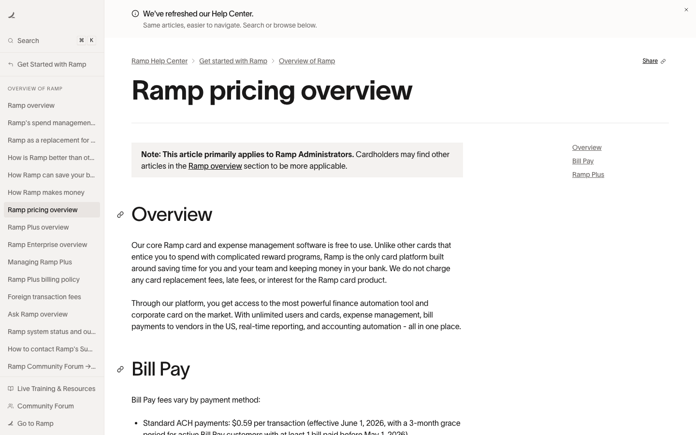

**背景信息：**

- ✅ **产品一句话定义**：页面把 Ramp 定位为「spend management platform」（支出管理平台），并用原文强调其差异化身份——"Ramp is the only card platform built around saving time for you and your team and keeping money in your bank"（唯一以"为团队省时、把钱留在账上"为核心设计的卡片平台），且"core Ramp card and expense management software is free to use"（核心卡片与费用管理软件免费）。
- ✅ **核心功能能力**：页面明确列出的能力包括——① 公司卡（Ramp card，无补卡费/滞纳金/利息）；② 费用管理（expense management）；③ 对美国供应商的账单支付（Bill Pay）；④ 实时报表（real-time reporting）；⑤ 记账自动化（accounting automation）；并以 "unlimited users and cards"（用户与卡片数量不限）作为卖点。
- ✅ **差异化叙事**：核心叙事是"反积分/反诱导消费"——"Unlike other cards that entice you to spend with complicated reward programs"（不像其他靠复杂积分诱导消费的卡），把价值主张从"返现奖励"转向"省时 + 省钱"；并通过免费核心产品 + 不收补卡费/滞纳金/利息进一步强化"帮你省钱"的品牌主张。
- ✅ **关键术语 / 概念**：页面引入多个 Ramp 专有概念——**Bill Pay**（按支付方式分档计费的账单支付，如标准 ACH $0.59/笔、电汇 $15/笔、国际 SWIFT $20/笔）；**Ramp Checking Account**（Ramp 支票账户，从中付款可豁免 ACH、标准支票、当日 ACH、境内电汇、SWIFT 等手续费）；**Ramp Plus**（面向"scaling, global business"的高级套餐）；**Procure-to-Pay / Multi-currency / Multi-entity / Advanced approvals**（采购到付款、多币种、多实体、高级审批等进阶能力）。
- ✅ **目标用户与场景**：页面顶部声明"This article primarily applies to Ramp Administrators"（主要面向 Ramp 管理员），持卡人（Cardholders）被引导去看其他文章；Bill Pay/Ramp Plus 的设计指向有供应商付款、跨币种/多实体需求的"scaling, global business"（成长中的全球化企业）。
- P3 **理解缺口**：① 页面名为"pricing overview"，但只详细给出 **Bill Pay** 各档手续费，**Ramp Plus / Ramp Enterprise 的具体价格完全缺失**（Plus 段落只列功能、以"..and more"截断）；② 既然核心产品免费，**Ramp 究竟靠什么赚钱**在本页未解释（仅在导航中另有"How Ramp makes money"文章）；③ Bill Pay 标准 ACH/支票的新资费写明"effective June 1, 2026"并对 5 月 1 日前的老客户给 3 个月宽限期，但**宽限期到期后的具体计费起点**表述较绕，读者不易一眼算清自己何时开始被收费。

#### B4: 背景 D2: Ramp Plus overview

**URL:** https://support.ramp.com/ramp-plus-overview/

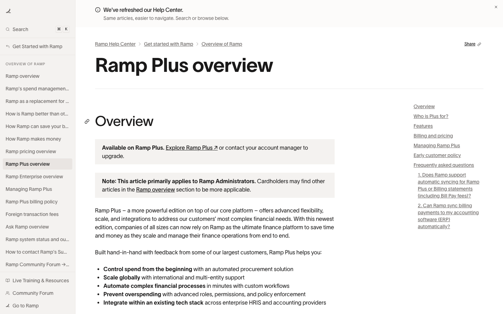

**背景信息：**

- ✅ **产品一句话定义**：页面将其定义为"核心平台之上的更强大版本"——原文"Ramp Plus – a more powerful edition on top of our core platform – offers advanced flexibility, scale, and integrations to address our customers' most complex financial needs"，并把 Ramp 整体定位为"the ultimate finance platform"（端到端的财务运营平台，帮助企业边扩张边省时省钱）。
- ✅ **核心功能能力**（页面明确列出的 5 项 Plus 增强）：①自动化采购方案（automated procurement，从源头管控支出）；②全球化扩展，支持国际化与多实体（international and multi-entity support）；③自定义工作流（custom workflows，几分钟内自动化复杂财务流程）；④高级角色/权限/政策执行（防止超支）；⑤跨企业级 HRIS 与会计系统的集成。
- ✅ **目标用户与场景**：明确标注"This article primarily applies to Ramp Administrators"（主要面向管理员，非持卡人），定位为有"最复杂、最深度财务需求"的成长型与成熟型企业（growing and established businesses），并强调是"hand-in-hand with feedback from some of our largest customers"共建——暗示偏中大型客户。
- ✅ **差异化主张 / 商业叙事**：核心叙事是"可选升级（optional upgrade）+ 随时可逆"——原文"At any time, you can choose whether to continue with the Plus plan or switch back to the free version"，并强调"highest ROI possible"。差异化锚点是 Plus 相对免费核心版的灵活性、定制化与高级能力，而非与外部竞品的横向对比。
- ✅ **关键术语 / 概念**："edition（版本）"是核心概念——存在 free 核心版、Ramp Plus、Ramp Enterprise 三档分层；"multi-entity support（多实体支持）"指跨法律实体/子公司的财务管理；导航另出现"Ask Ramp""Bill Pay"等术语，但本页未展开。
- P3 **理解缺口**：①页面通篇是抽象价值主张，**没有任何具体功能清单或定价数字**，两处关键信息都甩到外链（"see our pricing page" / "Learn more here"），读完仍不知道 Plus 究竟包含哪些功能、多少钱；②"Who is Plus for?"一节内容空泛，未给出企业规模/营收/员工数等可判断的门槛；③**Plus 与 Enterprise 的边界完全未说明**，用户无法判断自己该选哪一档；④FAQ 仅围绕"账单/Bill Pay 费用能否自动同步到 ERP"，与正文的采购/工作流卖点脱节，未补足主要疑问。

#### B5: 背景 D2: Ramp Enterprise overview

**URL:** https://support.ramp.com/ramp-enterprise-overview/

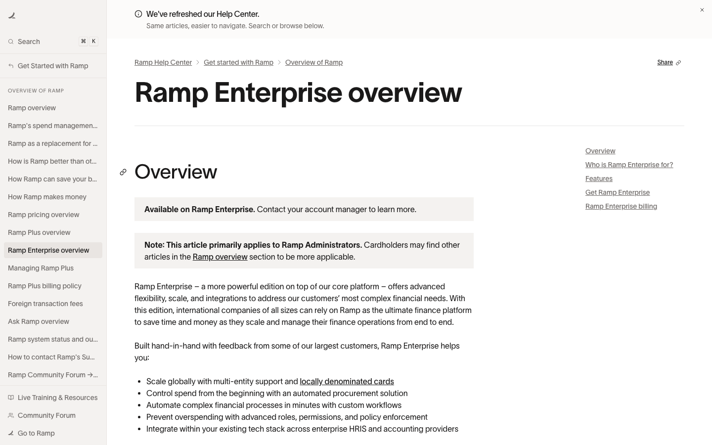

**背景信息：**

- ✅ **产品定义（引用原文）**：页面把 Ramp Enterprise 定义为"a more powerful edition on top of our core platform"，在核心支出管理平台之上提供"advanced flexibility, scale, and integrations to address our customers' most complex financial needs"，目标是让国际化公司"rely on Ramp as the ultimate finance platform... manage their finance operations from end to end"——即面向复杂财务场景的企业级增强版。
- ✅ **核心功能能力（页面列出 5 项）**：① 多实体支持 + 本地币种卡（multi-entity support and locally denominated cards）做全球化扩展；② 自动化采购方案（automated procurement solution）从源头管控支出；③ 自定义工作流（custom workflows）自动化复杂财务流程；④ 高级角色/权限/政策强制执行（advanced roles, permissions, and policy enforcement）防止超支；⑤ 与企业级 HRIS 和会计系统的集成（HRIS and accounting providers）。
- ✅ **目标用户与场景**：明确面向"global companies needing increasingly advanced solutions to address your most complex finance needs"，定位"growing and established businesses"（成长型与成熟型企业）。页面顶部 Note 还指出本文主要面向 **Ramp Administrators（管理员）**，持卡人应看其他文章——即面向财务/管理决策角色而非普通用户。
- ✅ **商业模式 / 计费**：差异化叙事偏"企业增强版 + 销售驱动"——以年度订阅（annual subscription basis）售卖，按用户计费（per-user pricing），需联系 Sales Team / account manager 开通，区别于其母平台对外宣传的免费/自助核心产品。
- P3 **差异化主张较弱且抽象**：与同类企业卡/费控产品的差异主要靠"more flexibility, customization, advanced capabilities""built hand-in-hand with feedback from our largest customers"等定性话术支撑，缺少与竞品的具体对比或量化 ROI 证据（仅笼统称"highest ROI possible"）。
- P3 **理解缺口**：页面对关键问题语焉不详——① Enterprise 与基础版/Ramp Plus 的功能边界和具体差异未列出，被一句"see our pricing page for a full breakdown"打发；② per-user 具体价格、最低席位、合约条款均缺失；③ "automated procurement"/"custom workflows"等能力只有名词没有运作机制说明；④ 计费段落原文被截断（"all users with internal r..."），无法判断哪些用户计入收费口径。

#### B6: 背景 D2: Ask Ramp overview

**URL:** https://support.ramp.com/ask-ramp-overview/

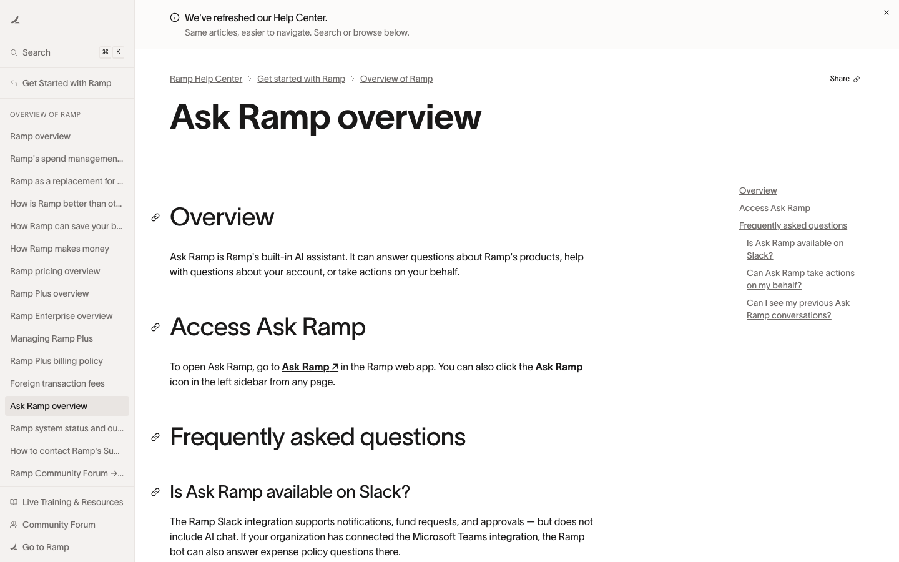

**背景信息：**

- ✅ **产品一句话定义清晰**：页面对 Ask Ramp 的定位非常明确——"Ask Ramp is Ramp's built-in AI assistant. It can answer questions about Ramp's products, help with questions about your account, or take actions on your behalf."（Ramp 内置的 AI 助手）。同时从面包屑/侧栏可知母产品 Ramp 是一个 "spend management platform"（支出管理平台），Ask Ramp 是其中的 AI 能力模块。
- ✅ **核心能力可归纳为 4 项**：① 回答 Ramp 产品相关问题；② 回答用户自己账户相关的问题；③ 代用户执行操作（明确举例 "approving requests or updating transactions" 审批请求、更新交易）；④ 保存并可回看历史对话（含对话名称、日期、最新消息，可查看完整记录）。入口为 Ramp Web 应用内的 Ask Ramp 页面及左侧边栏图标。
- ✅ **覆盖渠道边界交代明确**：页面专门澄清了集成可用性——Slack 集成仅支持通知、资金请求、审批，**不含 AI 对话**；只有接入 Microsoft Teams 集成的组织，Ramp bot 才能在 Teams 内回答**费用政策类**问题。这对"在哪用 / 用不到什么"是有用的边界信息。
- ✅ **隐私与可见性有一句关键约束**：历史对话"只能看到自己发起的会话，其他用户的会话不可见"（"You can only see conversations you started — other users' conversations are not visible."），属于多用户场景下的权限说明。
- ✅ **目标用户与场景隐含但合理**：面向使用 Ramp 平台的企业员工 / 审批人，典型场景是边用边问（任意页面侧边栏唤起）、让 AI 代办审批与交易更新、查询自己账户与产品用法。
- P3 差异化叙事缺失**：页面只做功能性说明，没有任何与其他企业 AI 助手 / 竞品的差异化主张，也未点出品牌核心叙事（如"自动化省钱"这一 Ramp 主线），仅一句"built-in AI assistant"作为定位。


### 2.4 产品定位与策略

### 1. 把卡、报销、付款、采购、差旅、记账、银行打包成一个后台财务平台，而不是卖单点工具
**核心判断**: Ramp 主动把自己定位成"管理企业整个后台财务"的一体化平台，用一个工作台收口过去要靠多套软件分别完成的活。
**支撑证据**:
- [C3] 首页用 "One platform for your entire back office" 明确定位为后台财务一体化平台，覆盖公司卡 / 费用 / 账单支付 / 银行四大模块
- [C2] 定价页以"功能矩阵"形式铺开企业卡、差旅报销、应付账款、资金管理、会计自动化、采购等全流程能力
- [B2] 官方介绍把它定义为 "financial operations platform"，在一个平台上做支付、发卡、供应商采购、差旅、自动记账
**对用户的含义**: 用户买的是"用一套系统替掉多套财务工具"的整合价值，而不是某一个孤立功能，决策门槛和迁移成本都更接近"换平台"而非"加个工具"。

### 2. 把 AI 当成"7×24 替你干活的员工"来交付，并用实时动作计数器把它具象化
**核心判断**: Ramp 不把 AI 讲成一个对话框或助手，而是讲成一支不停工作的"agent 团队"，用滚动计数器展示它实际替人完成了哪些动作。
**支撑证据**:
- [C3] 首页用 "infinite agents work 24/7" 配实时滚动指标（收据处理 / 会计科目编码 / 费用审核 / 发票处理 / 违规分类 / 支出分配），把抽象 AI 落到具体任务
- [S2] 页面用一组动态计数器（Receipts Processed / Accounting Fields Coded / Total AI Actions）把"AI 操作系统"量化成可计量的工作量
- [C5] footer 同样用 agent 指标标签拆解"AI 具体干哪些活"，并配 Policy Agents、Ramp Intelligence 等命名
**对用户的含义**: 用户被引导按"它能替我省掉多少人工"来理解和评估产品，而不是按"它是个多聪明的助手"；但代价是机制不透明——你看得到产出，看不到它如何接入数据、是否需人工复核。

### 3. 核心软件免费，靠增值套餐和金融/交易服务赚钱，并主动公开"怎么赚钱"
**核心判断**: Ramp 把公司卡和费用管理做成免费入口，把收入挪到付费套餐、账单支付手续费和资金生息等金融环节上，且不回避披露商业模式。
**支撑证据**:
- [B3] 明确 "core Ramp card and expense management software is free to use"，收入来自 Bill Pay 分档计费（ACH $0.59、电汇 $15、国际 SWIFT $20）等
- [C2] 套餐以增量叠加呈现（Free → Plus $15/user），采购模块作为付费 Add-on 单列
- [B1] 官方专门设有 "How Ramp makes money" 一文，把商业模式透明化
**对用户的含义**: 用户可以零成本起步，但真正有价值的自动化和金融能力在付费档与交易费里——需要看清"免费"到底能用到哪一步、规模化后实际成本落在哪。

### 4. 价值主张反着传统公司卡来：不靠返现诱导消费，而是主打"帮你少花钱、把钱留在账上"
**核心判断**: Ramp 刻意把自己和"用复杂积分鼓励你多刷"的传统公司卡区隔开，价值主张定在省钱省时而非消费奖励。
**支撑证据**:
- [B3] 原文 "Unlike other cards that entice you to spend with complicated reward programs"，强调"为团队省时、把钱留在账上"
- [B1] 专门设有对比文章 "How is Ramp better than other corporate cards" 和"作为传统费控系统的替代品"
- [B2] 核心叙事是"用更少的钱办更多的事"，内置管控 + 智能自动化繁琐任务
**对用户的含义**: Ramp 把自己卖给"想控制和压缩开支"的财务负责人，而不是"想薅返现"的用钱人——目标客户和竞品在动机上是反向筛选的。

### 5. 不止做费控，而是借多银行连接和资金生息，往"企业资金中枢"延伸
**核心判断**: Ramp 正从"记录和管控支出"向"持有、调度企业资金"扩张，想成为企业放钱和动钱的那一层，而不只是看账的软件。
**支撑证据**:
- [S3] 通过 80+ 银行连接聚合企业散落各行的账户，统一管理卡 / ACH / 国际电汇，并以 SVB 式"单一银行套牢"痛点切入
- [C2] 资金管理给出投资账户 4.24%、FDIC 账户 2%、无手续费/无最低存款的收益承诺
- [S2] 首页喊出 "Banking that flows money to the highest return"，把资金自动流向高收益作为强承诺
**对用户的含义**: 接入越深，Ramp 越接近你的"主账户"而非旁路工具——好处是现金管理一处收口，但也意味着资金托管、流动性、合规等关键机制必须问清楚，否则是把钱交给一个边界没说明白的角色。

### 6. 两条并行产品线 + 免费小工具：既直接面向企业，也专门面向会计师事务所获客
**核心判断**: Ramp 用主平台覆盖各行业各规模的企业，同时单开 "Stack by Ramp" 面向会计师事务所，并用一批免费独立工具做获客漏斗。
**支撑证据**:
- [C3] "Stack by Ramp" 被反复强调为"面向会计师事务所的 AI 操作系统"，与面向 7 万家企业的主产品形成两条并行线
- [B2] 用 "from family-owned farms to space startups" 强调主产品目标用户横跨全行业、全规模
- [C8] 404 页暴露 "Free Growth Tools"（投资人数据库、发票生成器、费用分类器等），把免费工具当作获客入口
**对用户的含义**: 不同身份的用户（企业财务团队 vs. 会计事务所）其实对应不同的入口和产品，选型前要先确认自己该走哪条线——而页面目前没把两者的边界和适用对象讲清楚。

### 2.5 公司基本信息

#### ✅ 实体身份已确认

基于域名 + 产品描述 + Wikipedia/Crunchbase/媒体报道的交叉核对，目标产品 `ramp.com` 对应：
**Ramp Business Corporation**（业内常称 Ramp / Crunchbase 实体名 "Ramp Financial"）。

域名锚定证据：
- [Wikipedia 公司词条 infobox](https://en.wikipedia.org/wiki/Ramp_(company)) 的官网字段逐字记录为 **"ramp.com"**，与目标域名完全一致；
- [Crunchbase 公司主页 (organization/ramp-financial)](https://www.crunchbase.com/organization/ramp-financial) 与 [TechCrunch 报道](https://techcrunch.com/2026/06/04/ramp-raises-750m-at-44b-valuation-as-investors-hunger-for-fintechs-with-an-ai-story/) 描述的「corporate card / spend management / financial operations platform」与本域名页面自述（"spend management platform"、"financial operations platform"、公司卡、Bill Pay、Ask Ramp AI 助手）高度吻合，确认为同一实体。

#### 公司基础事实表

| 项 | 内容 | 置信度 | 来源 |
|---|---|---|---|
| 公司名称 | Ramp Business Corporation（"Ramp"） | ✅ 直接 | [Wikipedia](https://en.wikipedia.org/wiki/Ramp_(company)) |
| 成立年份 | 2019 年 3 月创立 | ✅ | [Wikipedia](https://en.wikipedia.org/wiki/Ramp_(company)) / [Contrary Research](https://research.contrary.com/company/ramp) |
| 总部地点 | 美国 纽约市 (New York City) | ✅ | [Wikipedia](https://en.wikipedia.org/wiki/Ramp_(company)) |
| 产品上线 | 2020 年 2 月正式发布公司卡产品 | ✅ | [Wikipedia](https://en.wikipedia.org/wiki/Ramp_(company)) |
| 当前阶段 | 私有 / 后期成长期，已至 **Series F**（未上市独角兽） | ✅ | [PRNewswire](https://www.prnewswire.com/news-releases/ramp-raises-series-f-at-44-billion-valuation-302791103.html) |
| 融资总额 | 累计股权融资 **超 $3B**，最新估值 **$44B** | ✅ | [TechCrunch](https://techcrunch.com/2026/06/04/ramp-raises-750m-at-44b-valuation-as-investors-hunger-for-fintechs-with-an-ai-story/) / [CNBC](https://www.cnbc.com/2026/06/04/ramp-valuation-funding-ai-spend.html) |
| 团队规模 | ~2,700–3,700 人（来源差异大；2024 年约 1,100 人，2025-26 高速扩张） | ⚠️ 估算不一 | [Revelio Labs](https://www.reveliolabs.com/companies/ramp-business/employees/) / [PitchBook](https://pitchbook.com/profiles/company/277837-93) |
| 行业类别 | 金融科技 (Fintech) — 企业支出管理 / 财务运营平台 | ✅ | [Wikipedia](https://en.wikipedia.org/wiki/Ramp_(company)) |

**置信度图例**：✅ = 来源直接锚链接到 ramp.com / ⚠️ = 间接推断或来源不一致

#### 融资历史

| 轮次 | 时间 | 金额 | 估值 | 领投 + 主要参与方 | 来源指向本域名? |
|---|---|---|---|---|---|
| Series A | 2020-02 | ~$15M | — | Founders Fund | ✅ |
| 跟投 (扩展) | 2020-12 | $30M | — | — | ⚠️ |
| Series B | 2021-04 | $115M | $1.6B | — | ✅ |
| Series C | 2021-08 | $300M | $3.9B | — | ✅ |
| Series D | 2023-08 | $300M | $5.8B | — | ✅ |
| Series D-2 | 2024-06 | $150M | $7.65B | — | ✅ |
| Series E | 2025-06 | $200M | $16B | Founders Fund（第 5 次领投），Thrive、D1、General Catalyst、GIC、ICONIQ Growth、Khosla 等 | ✅ [PRNewswire](https://www.prnewswire.com/news-releases/ramp-raises-200m-series-e-at-16b-valuation-as-companies-of-all-sizes-choose-ai-powered-finance-platform-302483377.html) |
| 扩展轮 (E-2) | 2025-07 | $500M | $22.5B | ICONIQ Capital；距 $16B 仅 45 天 | ✅ [TechCrunch](https://techcrunch.com/2025/07/30/ramp-hits-22-5b-valuation-just-45-days-after-reaching-16b/) |
| 扩展轮 (E-III) | 2025-11 | $300M | $32B | Lightspeed；Alpha Wave、Bessemer 等新进 | ✅ [Tech Startups](https://techstartups.com/2025/11/17/ramp-hits-32b-valuation-with-new-300m-funding-round-as-investors-double-down-on-autonomous-finance/) |
| **Series F** | **2026-06-04** | **$750M** | **$44B** | ICONIQ、GIC、Ontario Teachers' 共同领投；新进 Goldman Sachs Alternatives、D.E. Shaw、Morgan Stanley IM、Insight Partners 等 | ✅ [PRNewswire](https://www.prnewswire.com/news-releases/ramp-raises-series-f-at-44-billion-valuation-302791103.html) |

#### 创始人 / 核心团队背景

- **Eric Glyman**（联合创始人 & CEO）— 哈佛大学校友；曾联合创办比价 App **Paribus**，2016 年被 Capital One 收购；离开 Capital One 后于 2019 年 3 月创立 Ramp。[来源](https://research.contrary.com/company/ramp)
  - 验证：[Wikipedia](https://en.wikipedia.org/wiki/Ramp_(company)) 与 [TechCrunch](https://techcrunch.com/2026/06/04/ramp-raises-750m-at-44b-valuation-as-investors-hunger-for-fintechs-with-an-ai-story/) 均将其作为 ramp.com 公司 CEO 报道（✅）
- **Karim Atiyeh**（联合创始人 & CTO）— 哈佛大学校友，与 Glyman 同窗；Paribus 联合创始人（2014）。[来源](https://en.wikipedia.org/wiki/Ramp_(company))
  - 验证：Wikipedia / TechCrunch 报道明确归属于 Ramp（✅）
- **Gene Lee**（联合创始人）— 曾任 Paribus 软件工程师，后在 Capital One 与两位创始人共事，2019 年共同创立 Ramp。[来源](https://research.contrary.com/company/ramp)
  - 验证：见于 Ramp 创始故事报道（⚠️ 公开个人资料较少）

#### 近期重大动态（最近 6-12 个月）

- **2026-06-04**：完成 **Series F $750M**，估值升至 **$44B**，资金用于加速 AI 能力投入；公司称 2026 年 3 月总采购额同比增长约 170%，为三年来最快。[CNBC](https://www.cnbc.com/2026/06/04/ramp-valuation-funding-ai-spend.html) / [TechCrunch](https://techcrunch.com/2026/06/04/ramp-raises-750m-at-44b-valuation-as-investors-hunger-for-fintechs-with-an-ai-story/)（✅ 报道直接指向 ramp.com）
- **2025-11-17**：$300M 融资，估值 $32B，投资人押注「autonomous finance（自主财务）」叙事；公司披露年化营收破 $10 亿、5 万+ 客户、年采购额 $1000 亿+。[Tech Startups](https://techstartups.com/2025/11/17/ramp-hits-32b-valuation-with-new-300m-funding-round-as-investors-double-down-on-autonomous-finance/)（✅）
- **2025-07-30**：估值在 45 天内从 $16B 跳升至 $22.5B（ICONIQ 领投 $500M 扩展轮）。[TechCrunch](https://techcrunch.com/2025/07/30/ramp-hits-22-5b-valuation-just-45-days-after-reaching-16b/)（✅）
- **2025**：发布可与主流会计平台深度集成的增强版公司卡；持续强化 AI 助手 **Ask Ramp**，对外主打「AI-powered finance / 零接触财务 (zero-touch finance)」定位。[PYMNTS](https://www.pymnts.com/news/b2b-payments/2025/ramp-launches-enhanced-corporate-cards-that-integrate-with-accounting-platforms/)（✅）

#### 综合判断

Ramp 是一家身份高度明确、资本与商业化均处于头部梯队的美国金融科技公司：成立仅约 7 年，已从单一公司卡产品扩展为覆盖发卡、Bill Pay、费用报销、采购、差旅、记账自动化的一体化「支出 / 财务运营平台」，并在 2026 年 6 月以 Series F、**$44B 估值、累计股权融资超 $3B** 跻身全球最高估值私有 fintech 之列。其资本优势极为突出——投资方阵容横跨顶级 VC（Founders Fund、Sequoia、Khosla）、成长基金（ICONIQ、Lightspeed、General Catalyst）与主权 / 机构资本（GIC、Ontario Teachers'、Goldman、Morgan Stanley），且 12 个月内连续多轮、估值阶梯式跃升，反映出强劲的营收增速（年化营收破 $10 亿、采购额同比约 +170%）。

短板与关注点：① 估值上行极快（一年内 $13B→$44B），对增长持续性与盈利质量的预期被显著抬高，存在估值回调风险；② 团队规模各来源口径差异大（~2,700–3,700 人），扩张速度快可能带来组织与执行压力。值得重点关注的方向是其押注的「autonomous finance / AI-powered finance」战略——Ask Ramp 等 AI 能力能否从「省时省钱」叙事真正转化为可量化的自动化财务闭环，将是决定其能否支撑 $44B 估值的核心变量。

---

## 3. 体验流程记录

### 3.1 官网叙事分析

#### 高频关键词

| 关键词 / 短语 | 出现频次或权重 | 在哪类页面出现 | 想建立的印象 |
|---|---|---|---|
| AI agent / Policy Agents / Ramp Intelligence / Infinite agents 24/7 | 极高（几乎每页） | 首页、用例页、文档、博客、关于页 [C3][C5][C7][S2][S6] | 这是一支 7×24 不知疲倦、还会"学习"的 AI 劳动力，不只是软件 |
| spend management platform / financial operations platform / 一体化后台财务平台 | 极高（定义级） | 注册流、官方文档、概览 [C3][B1][B2] | 一个平台搞定卡 / 报销 / 付款 / 采购 / 记账 / 银行，覆盖"整个后台" |
| spend less, close faster, finance smarter / save time and money / 省时省钱 | 极高 | 客户墙、定价、文档 [S4][B1][B2][B3] | 用了就能少花钱、快关账——价值主张一句话记住 |
| 实时计数器（Receipts Processed / Fields Coded / Expenses Reviewed…） | 高 | 首页、用例页、文档、博客 [C3][C5][C7][S2][S6] | 把抽象 AI 变成"看得见、数得清"的具体劳动量 |
| 70,000+ 客户 / $12B 省下 / 27M 小时 / 98%–99% 准确率 | 高 | 客户墙、关于页、功能页 [S4][S7][S1][B2] | 已被海量企业验证、规模化可信、效果可量化 |
| 200+ Integrations | 中高（反复出现） | 注册流、用例页、文档、博客 [C3][C5][C7][S6] | 能无缝接入你现有工具栈（但从不给清单） |
| Banking that flows money to the highest return | 中 | 首页、用例页、博客 [C5][S2][S6] | 钱放着也能自动增值，理财不用操心 |
| in the blink of AI / Switch in days, not months | 中 | 注册流、博客 [C3][S6] | 快、轻、无痛——上手和见效都极快 |
| replacement for traditional… / better than other corporate cards / Unlike other cards | 中 | 官方文档、定价 [B1][B3] | 我们不是又一张卡，是来取代旧体系的 |
| Stack by Ramp — AI operating system for accounting firms | 中 | 注册流、用例页 [C3][S2] | 连会计师事务所都有专属 AI 操作系统，纵深够深 |

#### 说服手法分析

**1. 把 AI 当成会干活的"人"来包装**
- 具体表现："Infinite agents work 24/7"、"Policy Agents — AI that learns from your team / 70,000 others"，并给 AI 起名 Ask Ramp、Ramp Intelligence、procurement agent [C5][S2][C7]
- 想达到的效果：让用户觉得买的不是一套软件，而是一支永不下班、越用越懂你的"数字员工团队"。

**2. 用实时滚动计数器把抽象 AI 变成可数的劳动**
- 具体表现：首页常驻 "Receipts Processed / Accounting Fields Coded / Expenses Reviewed / Violations Classified / Total AI Actions" 一组动态计数 [C3][S2][S6]
- 想达到的效果：避开"AI 到底干啥"的质疑，用不断跳动的数字制造"它此刻正在替成千上万人干活"的现场感和繁忙感。

**3. 量化结果与名企背书层层堆叠**
- 具体表现："Perplexity 省 1,670 小时"、"Vanta 关账快 3 天"、"Eight Sleep 省 $2.8M"、"70,000+ 客户、$12B 省下、月末关账快 3 天、99% 准确率" [S4][S7][S1]
- 想达到的效果：用具体到个位的数字 + 可识别的明星客户，把"省钱省时"从口号变成"已被验证的事实"。

**4. 先否定旧体系和同类，占据道德/理性高地**
- 具体表现："a replacement for traditional expense management systems"、"How is Ramp better than other corporate cards"、"Unlike other cards that entice you to spend with complicated reward programs" [B1][B3]
- 想达到的效果：把竞品塑造成"靠积分诱导你乱花钱的旧玩意儿"，反衬自己是"帮你省钱"的新物种，顺势完成价值观站队。

**5. 给结果开强承诺、对机制留白**
- 具体表现："Banking that flows money to the highest return"、"AI that learns from your team"、"in the blink of AI" 等只给结果不给原理；多处核心承诺（资金扫款机制、是否 FDIC、AI 如何学习与纠偏）一律省略，banking 仅留一个 `*` 星号 [C5][S2][S6]
- 想达到的效果：用朗朗上口的结果型口号制造"轻松、自动、稳赚"的体感，同时回避会暴露限制和门槛的机制细节。

#### 整体评价

Ramp 想让用户感觉它是"一个 AI 帮你打理整个后台财务、越用越聪明、还被 7 万家公司验证过省钱"的一体化平台——主打"轻松、自动、省钱"的安全感。这套说法在**结果层面可信度高**（名企、量化指标、规模数据都很扎实），但**机制层面几乎是黑箱**（AI 怎么学、银行怎么生息、200+ 集成有哪些、谁来人工兜底全部缺失），且关键数字被官方脚注定性为"估算、非保证"——所以它更像一份打磨精良的信心叙事，可信但需要用户自己去补"怎么做到的"这一环。

### 3.2 测点流程详情


### 🏠 首页（1 个测点）

**该模块覆盖页面**:

- `https://ramp.com/`

#### C5: Footer audit

**URL:** https://ramp.com/

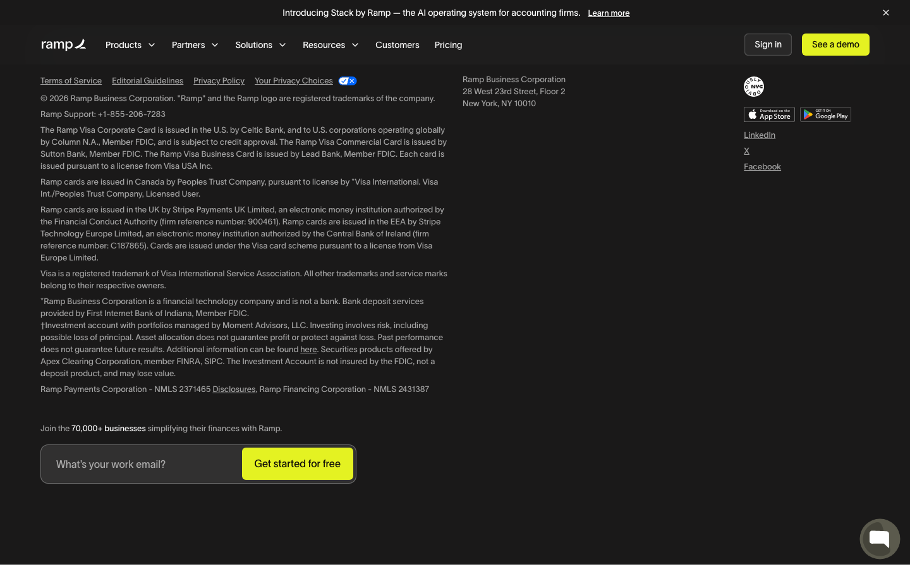

**观察：**

- ✅ 页面清晰勾勒出 Ramp 的核心能力矩阵——企业卡与费用管理、Procure-to-Pay（采购到付款）、账单/发票处理、银行账户，以及覆盖其上的 AI agent 层（Policy Agents、Ramp Intelligence）。读完能大致理解"这是一个一站式后台财务运营平台 + AI 自动化"。
- ✅ 那一长串 agent 指标标签（RECEIPTS PROCESSED / ACCOUNTING FIELDS CODED / EXPENSES REVIEWED / SPEND ALLOCATED / INVOICES PROCESSED / VIOLATIONS CLASSIFIED）实际是对"AI agent 具体干哪些活"的功能拆解，比抽象的"AI 自动化"更有信息量——明确点出了收据处理、会计科目编码、违规分类等具体任务类型，并用 Perplexity Controller、Specialized Accounting 等真实场景（月末对账、收据催收、大数据集手工编码）佐证解决的痛点。
- P1** 关键工作机制缺失：核心卖点如 Policy Agents"AI that learns from your team / 70,000 others"、Banking"flows money to the highest return"只给了结果性口号，完全没说**输入是什么、如何学习、收益如何产生**（是否扫余额到高息账户？依据什么策略？人类如何介入审核？），用户无法判断 agent 的可靠性与自己的接入成本。
- P2** "200+ Integrations to the tools you already use"只给数量，没有任何**集成清单或代表性工具**（会计系统？ERP？银行？HR？），而集成范围恰恰决定该产品能否落地到用户现有工作流——这是采购决策的关键功能信息，却被一笔带过。
- P2** 产品边界含糊：页面同时推 "Ramp"（面向 7 万家公司）与 "Stack by Ramp—AI operating system for **accounting firms**"两条线，但未说明 Stack 与主产品在**功能/适用对象上的差异**，会计师事务所用户读完不清楚自己该用哪个、Stack 具体能自动化事务所的哪些工作流。


### ✨ 产品功能 / 介绍（1 个测点）

**该模块覆盖页面**:

- `https://ramp.com/product-releases`

#### S1: Features / Product page

**URL:** https://ramp.com/product-releases

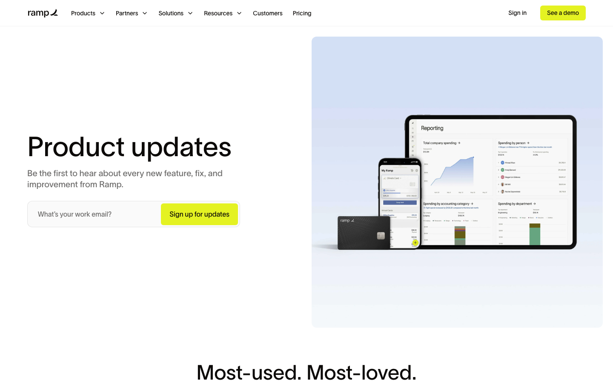

**观察：**

- ✅ **功能广度清晰**：页面用 16 个更新分类（Corporate Cards、Accounts Payable、Expense Management、Procurement、Travel、Treasury、Accounting Automation、Vendor Management 等）勾勒出 Ramp 是一个覆盖"公司卡 + 应付账款 + 报销 + 采购 + 差旅 + 资金管理 + 会计自动化"的全栈企业支出平台，产品边界一目了然，读者能快速判断它属于哪类产品。
- ✅ **核心能力用量化价值表达**：三个"最常用"功能都把"做什么 + 解决什么痛点 + 量化指标"讲清楚了——经常性合规支出自动同步 ERP（98% 准确率，实现"持续关账、月底不堆积"）、预算 vs 实际实时追踪（替代电子表格，统一看 T&E/AP/采购/PO 的每一笔花费影响）、发票行项 OCR 自动编码（99% 准确率，"几秒处理上千张发票"）。痛点—能力对应明确。
- P1 关键集成与工作机制缺口**：反复出现 "auto-sync to **your ERP**" 却始终没说明到底支持哪些 ERP（NetSuite / QuickBooks / Sage / Xero？），这是会计自动化类产品的决策关键点；同时 "in-policy spend"（合规支出）的策略如何配置、98% 自动同步的剩余 2% 如何人工兜底纠错，都未交代工作机制。
- P2 这是"更新日志"而非"功能总览"**：页面本质是 product changelog（按时间线列出波兰/丹麦/瑞典本地卡、Bill Pay 部分付款等增量更新），新用户很难从碎片化的发布条目里拼出"产品整体能为我做什么"的完整能力图景，缺少一个把核心工作流串起来的功能概览入口。
- P3 功能的套餐/适用门槛标注不系统**：部分功能有明确适用条件（如本地卡与报销仅限 Enterprise 客户、且需在波兰/丹麦/瑞典设有当地法律实体），但 changelog 条目并未统一标注各功能归属哪个套餐（虽存在 "Plus" 分类标签），读者难以判断不同套餐之间的功能差异和自己能用到哪些。


### 🎯 解决方案 / 场景（1 个测点）

**该模块覆盖页面**:

- `https://ramp.com/`

#### S2: Use cases / Industry

**URL:** https://ramp.com/

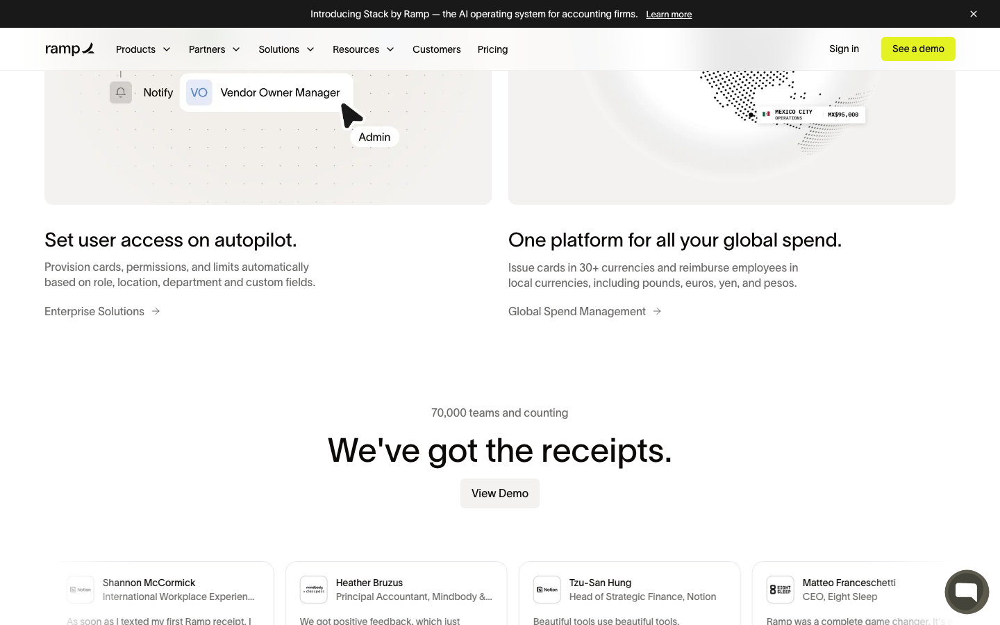

**观察：**

- ✅ 产品能力边界清晰**：页面明确传达 Ramp 是覆盖"整个后台办公"的一体化平台，五大功能模块（Cards & Expenses 卡片/费用、Procure to pay 采购到付款、Accounting automation 记账自动化、Banking 资金理财、200+ 集成）各有一句价值主张并配 arrow 进入二级页，用户读完能大致回答"它能为我做什么"——管账、报销、付款、对账、资金管理一站式。
- ✅ 用"AI agent 实际产出"量化能力**：页面用一组动态计数器（Receipts Processed / Accounting Fields Coded / Expenses Reviewed / Spend Allocated / Invoices Processed / Violations Classified / Total AI Actions）把抽象的"AI 操作系统"落到具体可计量的工作任务上，比单纯喊"AI 驱动"更能说明 agent 究竟替人做了哪些环节，工作机制可感知。
- P1 核心卖点 Banking 的工作机制完全没说清**："Banking that flows money to the highest return"（资金自动流向最高收益）是一个涉及钱的强承诺，但页面既未说明是货币基金/高息账户/扫款机制，也未提收益率、是否 FDIC 保障、资金可动用性，且标题处 banking 带星号（*）暗示有重大限定条款却未在节选展示——对一个金融产品而言，这是关键功能描述的缺失/潜在误导。
- P1 "Stack by Ramp"（面向会计师事务所的 AI 操作系统）与主产品的功能关系不明**：页面把 Stack 放在顶部 banner 又在中部重复推介，但没有说明它与主平台 Ramp 是同一产品的行业版、独立产品、还是面向事务所代客户做账的工具集。会计师事务所用户无法判断 Stack 具体自动化哪些事务所工作流（多客户账套管理？批量对账？），定位与功能边界模糊。
- P2 "Agents / Policy Agents / Ramp Intelligence" 三个 AI 概念缺乏功能区分**：页面同时出现 "Infinite agents 24/7"、"Policy Agents（从你的团队学习、且被 7 万家公司训练过）"、"Ramp Intelligence" 三个名词，但没有说清它们各自负责什么、是否同一套引擎的不同包装、Policy Agents 如何"学习"（基于历史编辑？规则配置？）以及它实际能自动批准/拦截哪类违规。AI 能力是主打卖点，却停留在概念层。


### ⭐ 客户案例（2 个测点）

**该模块覆盖页面**:

- `https://ramp.com/customers`
- `https://ramp.com/`

#### S4: Customer / logo wall

**URL:** https://ramp.com/customers

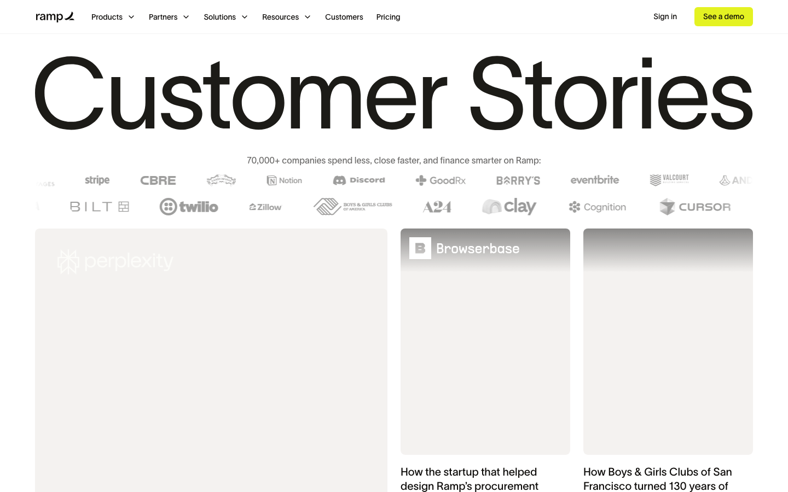

**观察：**

- ✅ 页面用一句话锚定了产品的核心 jobs-to-be-done——"spend less, close faster, finance smarter"，并用客户量化结果反复印证（Perplexity 省 1,670 小时、Vanta 关账快 3 天/对账快 90%、Eight Sleep 省 $2.8M）。读者能快速建立"这是一套帮财务省钱+加速关账+自动化的平台"的功能心智，价值主张层面是清晰有力的。
- P2 产品的具体功能模块全靠客户故事"侧写"暴露：从文案可反推出 **procure-to-pay 自动化 / procurement agent、Spend Programs、自动会计编码(coding)、自动对账(reconciliation)、跨国 spend management** 等能力，但这些都是作为"结果背景"一笔带过，页面本身没有任何模块级的功能说明。读者只能拼凑能力地图，无法确认产品边界。
- P1 关键 AI/自动化能力只有"名词"没有"机制"。例如"the startup that helped design Ramp's procurement agent automated its own procure-to-pay"——procurement agent 到底自动化了采购流程中的哪些环节（审批？询价？下单？对账？）、输入输出是什么、需不需要人工介入，完全没说明；"automated coding"也未说明是按什么规则给交易打会计科目。对想评估"这能替我做什么具体动作"的用户，这是核心功能描述缺失。
- P2 集成能力被客户证言反向点出却未落地。Michael Litwin 的"there was no integration, everything was manual"暗示 Ramp 的核心卖点之一是与现有系统集成+替代手工，但页面没有任何集成清单（ERP/会计软件/HRIS 等），也没说明"unified global spend management across 10+ countries"依赖哪些本地化/多币种/合规能力。想验证"能否接入我现有财务栈"的读者无法判断。
- P3 指标全部是"省时间/省钱"的结果型 KPI（hours reclaimed、savings、faster close），却没有与具体功能做映射——读者知道"用了能省钱"，但不知道"是哪个功能省的、靠什么省的"。补一句"由 X 功能实现"即可把营销数字转化为功能证据。此外不同行业/规模标签（SMB/MID-SIZE/ENTERPRISE、Nonprofit/Public Sector）展示了适用面广，但未说明各段位在功能上的差异。

#### S14: Customer support channels

**URL:** https://ramp.com/

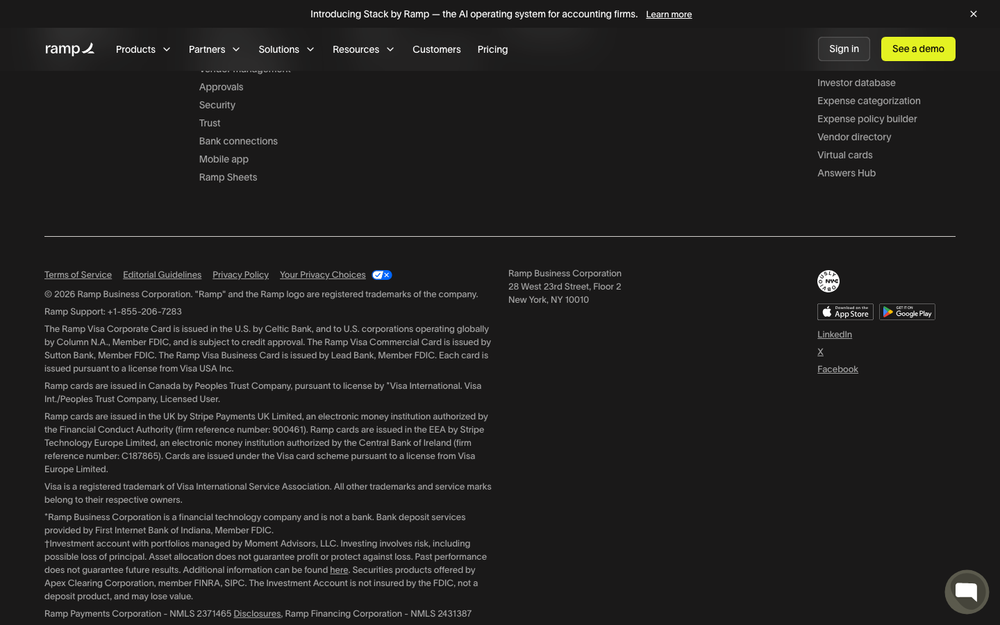

**观察：**

- ✅ 页面把产品**核心能力**讲得很清楚（卡片/报销、Bill Pay 付款、Banking、200+ 集成、24/7 AI agents），但针对本测点 **Customer support channels（客服/支持渠道）**，这一首页几乎**零信息**——没有任何关于"买了之后怎么获得帮助"的内容。
- P1 严重**：全页未出现任何**客户支持入口**——无在线客服/Live Chat、电话、支持邮箱、帮助中心(Help Center)、工单系统或 SLA。可见的交互入口全是销售/获客性质（"See a demo""Sign in""Get started for free""View Demo"），用户无法判断出现问题时通过什么渠道、多快能得到响应。
- P2 中等（易误导）**：页面高频出现的 "Infinite agents that work 24/7""Policy Agents""Ramp Intelligence" 容易被读成"7×24 在线客服"，但实际这些 AI agent 是替**用户自己的财务团队**干活（处理收据、编码会计字段、审报销），**不是 Ramp 的客服支持**。"agents"含义与"support"混淆，需消歧。
- P2 中等**：宣传 "Switch in days, not months"（几天完成迁移切换）隐含有**实施/迁移支持**，但页面完全没说明这种切换由谁支持——是否有 onboarding 团队、专属客户成功经理(CSM)、迁移协助渠道，全部缺失。
- P2 功能信息缺口**：关于支持体系的关键问题页面均未回答——不同套餐(Plus/Enterprise 等)是否对应不同**支持等级**、是否有专属客户经理、是否提供**自助文档/社区论坛**、支持的响应时效与覆盖时区。要评估 S14，需进入其官网 Support/Help Center 或定价页才能取得实际信息。


### 💰 定价 / 商业化（1 个测点）

**该模块覆盖页面**:

- `https://ramp.com/pricing`

#### C2: Pricing page

**URL:** https://ramp.com/pricing

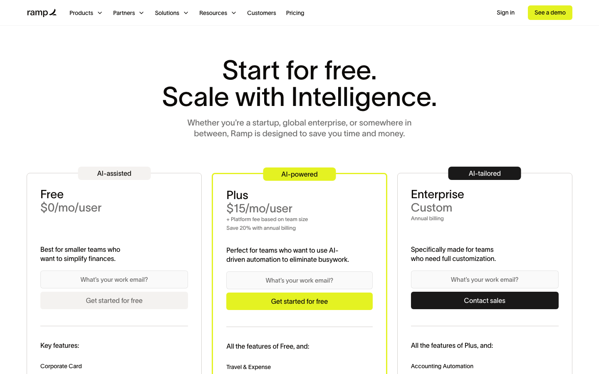

**观察：**

- ✅ 页面以"功能矩阵"形式清晰揭示了 Ramp 是一个覆盖企业财务全流程的平台**，而非单一工具：企业卡（无限发卡+发卡管控）、差旅报销（订机票/酒店/租车、SMS/Slack 报销、自动收据匹配）、应付账款（OCR 发票提取、审批流、欺诈检查、ACH/卡/支票/电汇付款）、资金管理（投资账户生息）、会计自动化、预算报表、供应商管理。用户读完能理解"它能替我管钱的方方面面"。
- P1 全平台的核心卖点是"AI 驱动自动化消除繁琐工作"，但页面始终没说明 AI 的工作机制与边界。** 罗列了"AI 编码每个字段""AI 审批建议""AI 驱动供应商合规审查""AI 费用审查"等能力，却未说明：AI 自动编码的准确率/可纠错性、是否需要人工复核、"AI 审批建议"是建议还是自动执行、AI 的训练数据/输入来源是什么。这是付费升级（Free→Plus，$15/user）的主要理由，却恰恰是功能描述最模糊的部分。
- P2 集成清单不完整，且只给了会计软件。** 仅列出 QuickBooks/Xero（Free）和 NetSuite/Sage Intacct（Plus）"and more"，没有说明是否支持 ERP、HRIS、CRM、银行直连，也未提及是否开放 API/Webhook 供自建系统对接。对评估"能否接入我现有的财务/IT 栈"的用户，关键信息缺失。
- P2 资金管理（Treasury）功能只给了收益率，未说明工作机制与适用前提。** "投资账户 4.24%、FDIC 账户 2%、无手续费/无最低存款/无转账上限"是有吸引力的能力陈述，但没说明资金如何托管、流动性（取款时效）、收益是否浮动、是否有合格账户/地区限制——用户无法判断这是否适用于自己的现金管理场景。
- P3 套餐间的功能差异呈现为"All the features of Free, and:"的增量叠加，逻辑清晰**，且明确标注了 Procurement（采购）是 Plus/Enterprise 的付费 Add-on（含意向审批流、自动 PO、与 Ramp PO 的三方匹配），避免了用户误以为采购模块包含在基础套餐内——功能归属边界交代到位。


### 🚪 注册 / 试用入口（1 个测点）

**该模块覆盖页面**:

- `https://ramp.com/`

#### C3: Sign-up flow (no submit)

**URL:** https://ramp.com/

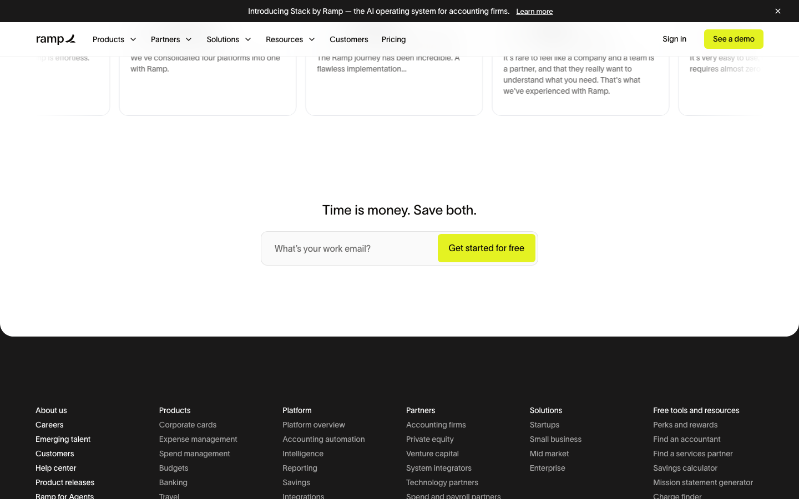

**观察：**

- ✅ 页面以"Cards, expenses, bill payments, and banking – in the blink of AI"清晰勾勒出 Ramp 的四大功能模块（公司卡 / 费用管理 / 账单支付 / 银行业务），并通过"One platform for your entire back office"明确定位为后台财务一体化平台，读者能快速理解产品覆盖范围。
- ✅ 实时滚动指标（Receipts Processed / Accounting Fields Coded / Expenses Reviewed / Invoices Processed / Violations Classified / Spend Allocated）实质上把"AI agent 到底替我做哪些活"具象化了——收据识别、会计科目编码、费用审核、发票处理、违规分类、支出分配，这是对"infinite agents work 24/7"最有信息量的功能注脚。
- P2 注册入口（Email + Get started for free）完全没说明**注册后会发生什么**：是否需要绑定企业银行账户 / 接入会计系统才能用？免费版能体验哪些 agent 功能？开户是否有企业资质或美国主体要求（页面 banking 带 *脚注但正文未解释）？这对决定是否留邮箱的用户是关键功能缺口。
- P2 "200+ Integrations to the tools you already use"是核心卖点（决定能否接入现有 ERP / 会计软件 / HR 系统），但仅给了数字，未列出任一具体集成对象（如 QuickBooks、NetSuite、Slack 等），用户无法判断自家工具栈是否被支持——而这往往是 SaaS 选型的硬门槛。
- P2 "Stack by Ramp"被反复强调为"面向会计师事务所的 AI 操作系统"，与主产品（面向 70,000 家企业的支出管理）形成两条并行的功能线，但页面没说明二者关系：Stack 是独立产品、附加模块还是同一平台的事务所版本？不同受众（企业财务团队 vs. 会计事务所）该走哪条注册路径并不清楚。


### 🔒 安全 / 信任（1 个测点）

**该模块覆盖页面**:

- `https://ramp.com/security`

#### S12: Trust / Security page

**URL:** https://ramp.com/security


**观察：**

- ✅ 安全能力按"全流程节点"分层呈现得很清晰：页面把产品安全拆成登录（SSO+MFA）、支付（虚拟卡+卡控制）、监控（24/7 风控）、数据（加密）、合规（SOC 2 Type II / PCI）五块，对应"员工入职→发卡→管理财务数据"的链路，读者能理解 Ramp 是一个把安全内建进企业财务/发卡/支出管理全流程的平台。
- P1 核心差异化功能"虚拟卡 + 精确卡控制防盗刷"的工作机制完全没说明：所谓 "precise controls" 究竟是单一商户绑定、限额、品类限制还是有效期中的哪些组合？"存进受保护的密码管理器"是 Ramp 自带能力还是集成第三方（如 1Password）？输入/配置方式、生效逻辑均缺失，读者无法判断这功能实际怎么用。
- P2 访问治理只覆盖"登录"一层：SSO 集成对象点名了 Okta/Google/Microsoft Azure 且强调对每个用户强制 MFA（这点输入/集成说得很具体），但完全没提 SCIM 自动配置/离职注销、角色权限(RBAC)、审批分级等企业级身份治理——而这些对财务系统恰恰是关键能力，缺口明显。
- P2 "24/7 监控 + 业界最低欺诈损失 + 世界级风控团队"全是定性宣称，缺机制与可验证细节：如何检测异常、是否自动冻结卡片、误报如何处理、"industry-low" 对标的基准是什么，均未交代，更接近营销话术而非可评估的功能描述。
- P2 数据/合规信息止于口号级：加密只写 "at rest and in motion / multiple ways"，未给加密标准（如 AES-256、TLS 版本）、密钥管理或数据驻留(region)；合规仅列 SOC 2 Type II 与 PCI，缺 GDPR/CCPA、审计日志、数据驻留等企业采购高频问项。想深入核验安全的用户被默认引向单独的 "Trust" 页，但本页未说明 Security 与 Trust 两个入口的分工关系。


### 🏢 公司 / 团队（1 个测点）

**该模块覆盖页面**:

- `https://ramp.com/about-us`

#### S7: About / Company

**URL:** https://ramp.com/about-us


**观察：**

- P2** 页面停留在公司叙事层（使命/价值观/媒体报道），仅通过"top-rated finance, expense, and card software"这一句间接透露产品三大类目（财务管理、报销、企业卡），但通篇没有任何一项具体功能或工作机制的描述——读者无法从本页判断产品究竟"靠什么"帮人省钱省时。
- ✅** 用四个量化结果有力佐证了产品成效与能力边界：27M+ 小时节省、$12B+ 为客户节省、70,000+ 客户、200+ 国家支持；其中"200+ Countries supported"间接揭示了多币种/全球化报销与支付的适用范围，是本页含金量最高的功能性信号。
- P1** 媒体引语出现"Ramp Investors Add Funding as Company Expands, Plans AI Agents"，暗示产品正向 AI 自动化演进，但页面完全未说明这些 AI agent 做什么、自动化哪些财务工作流、如何接入现有系统——对最想了解"AI 能力"的用户构成关键功能信息缺口。
- P3** 客户证言按 SMB / Mid-Market / Enterprise 分层，并点名"accountants"与"FP&A teams"两类角色，间接说明产品覆盖会计对账与 FP&A 规划场景；但仅是角色与规模标签，未说明不同规模/角色对应的功能差异。
- P2** 功能信息缺口明显：全页未提及任何集成（ERP / 会计软件 / 银行）、数据输入输出形式、或套餐功能范围。作为 About 页可以理解其定位偏品牌叙事，但除一个泛泛的"See our product"入口外，没有给出通往"这个产品能为我做什么"的具体指引。


### 👥 招聘（1 个测点）

**该模块覆盖页面**:

- `https://ramp.com/careers`

#### E3: 探索: Careers

**URL:** https://ramp.com/careers


**观察：**

- ✅ 招聘页通过员工成就侧写**意外拼出了产品的核心能力图谱**：企业卡返现（"card payable bills into millions in cashback"）、消灭报销单（"killed expense reports"）、收据规模化处理（"600,000 receipts"）、多币种结算（"Shipped GBP currency"）、客户批量 onboarding（"Onboarded 950 new customers"）——读者能反推出这是一个企业支出 / 费用管理平台（Ramp），覆盖企业卡、报销、账单支付、对账几大场景。
- P1 这些功能信号全是单句结果陈述，零工作机制**：只说"消灭了报销单""把卡账单变成返现"，但完全没讲**怎么做到的**——报销如何自动化？返现比例 / 规则是什么？收据是 OCR 自动识别还是人工？输入输出、触发条件、对账逻辑一概空白。读者知道"产品能省掉报销"，但不知道"它具体替我做哪几步"。
- P2 大量 AI agent 描述混淆了"内部研发文化"与"产品交付能力"**："agents that power our entire GTM team""debugging agent""agents that run their own lead-gen""AI spreadsheet editor"——绝大多数是 Ramp **自用的内部工具 / 销售 agent**，而非客户能买到的产品功能。唯一指向产品的 "AI agent that applied for its own credit card" 也只是炫技式一句话，潜在客户无法判断自己实际能用到哪些 AI 能力。
- P2 缺少把碎片能力串成工作流的说明**：页面罗列了卡、返现、报销、收据、多币种等孤立点，但没有任何一句把它们连成一条端到端财务流程（如"刷卡→自动抓收据→自动归类→自动对账→月底无需报销"）。用户读完只能感知"这家公司很能打"，却拼不出一条完整的产品使用路径。
- P3 功能边界 / 适用对象 / 集成完全缺位**（招聘页性质所限，可接受但仍是信息缺口）：没有说明适用企业规模、支持哪些会计 / ERP 集成、与银行账户如何打通、国际市场覆盖范围（仅一句 "Launched our first International market"）。想了解"我的公司能否接入、和现有财务系统是否兼容"的读者，需跳转到产品页才能获得答案。


### 📰 博客 / 内容（1 个测点）

**该模块覆盖页面**:

- `https://ramp.com/`

#### S6: Blog / Resources

**URL:** https://ramp.com/

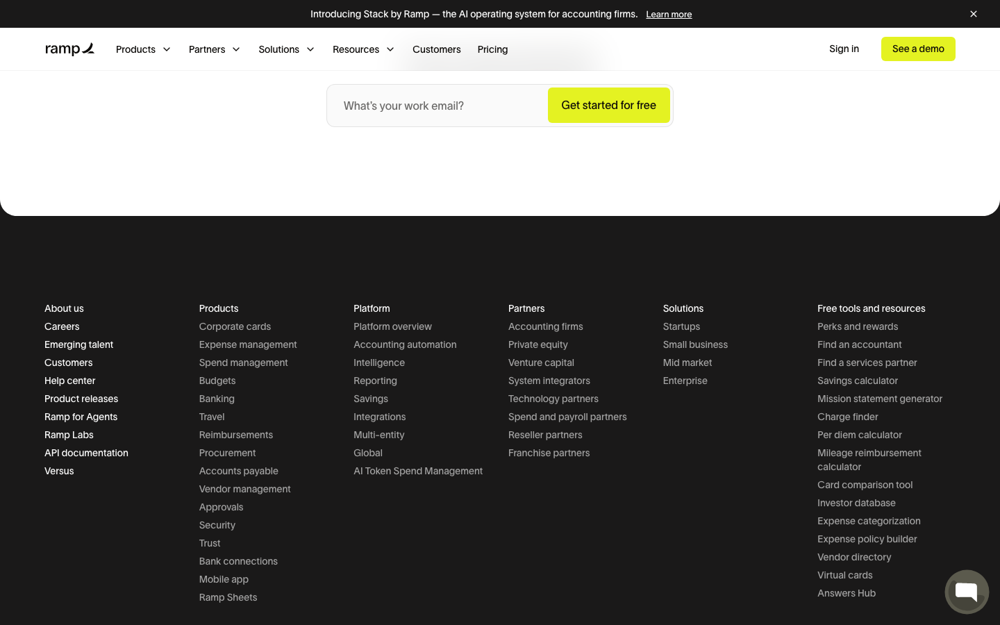

**观察：**

- ✅ 页面清晰勾勒出 Ramp 的产品全貌：它不是单点工具，而是覆盖**企业卡 / 费用报销 / 账单支付(AP) / 采购到付款(procure-to-pay) / 会计自动化 / 资金银行**的一体化后台财务平台，再叠加一层 **AI agent**（Policy Agents、Ramp Intelligence、面向会计师事务所的 Stack）。顶部那组实时计数器（处理收据数 / 已编码会计字段 / 审核费用 / 分类违规 / AI 总动作数）把"agent 到底干什么活"用具体动作量化呈现，比空喊"AI 驱动"更能说明能力边界。
- ✅ 解决的问题与场景表达到位：明确指向**月末关账的繁琐、追收据、手工编码大量交易、追审批**等财务/会计团队的真实痛点（"eliminates month-end madness""without chasing approvals""40hrs saved a month"），并用 Perplexity 控制人、会计事务所等真实角色背书使用场景。读者能快速判断"这是给财务团队和会计事务所减负的产品"。
- P1** 三个 AI 子产品（**Policy Agents / Ramp Intelligence / Stack**）功能边界与关系完全没说清——它们是同一引擎的不同包装、还是各自独立的模块？分别面向谁（企业内部 vs 会计师事务所）？"AI that learns from your team"具体学什么、如何配置与纠偏，输入/输出是什么，页面只给了口号，无机制说明。用户难以理解自己该用哪个、能得到什么。
- P1** "Banking that flows money to the highest return"是核心功能点却语焉不详：Ramp 自己是不是银行？资金由哪家合作银行托管、是否 FDIC 保险、"flows to highest return"是货币基金/扫款机制还是自动理财？正文标题里"banking*"带星号脚注却未展示免责说明——恰恰是这个金融功能最关键的合规与机制细节被省略了。
- P2** 多处功能细节缺口：① 宣称 **200+ 集成**但无清单，看不出是否覆盖自家 ERP/会计系统（QuickBooks、NetSuite 等）；② "Switch in days, not months"未说明迁移/导入的实际工作机制；③ agent 的**权限、审批控制、人工兜底**等治理细节缺失，财务场景中这通常是采购决策的关键问题。


### 📖 文档 / 帮助（1 个测点）

**该模块覆盖页面**:

- `https://ramp.com/`

#### C7: Help / Documentation

**URL:** https://ramp.com/

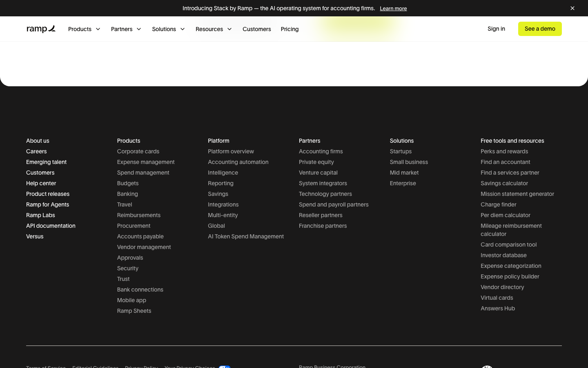

**观察：**

- P1（测点核心缺口）** 本测点为 Help / Documentation，但抓取到的实为营销首页：页面**完全没有暴露帮助中心 / 知识库 / 产品文档 / API 文档 / 上手指南 / 支持入口**。对一个面向财务/会计专业用户、且涉及银行与合规的复杂产品，"如何接入、如何上手、如何排障"这类功能性文档的缺位，是判断"产品能否真正用起来"的关键信息缺失。
- P1** AI agent 的**工作机制是黑箱**。页面反复强调 agent "7×24 工作""从你的团队学习""由 70,000 家公司训练过"，并用实时计数器展示 agent 执行的动作（收据处理、会计字段编码、费用审核、支出分配、发票处理、违规分类），但**完全没说明 agent 如何接入企业数据、需要什么输入、决策是否需人工复核、能否被覆盖或审计**。对资金/合规场景，缺少机制与可控性说明属严重功能描述缺失。
- ✅** 以"AI 操作系统"框架清晰勾勒出**核心功能矩阵**——卡片与费用、采购到付款（procure-to-pay）、会计自动化、资金/银行管理，并把抽象的"AI"落到具体可感的 agent 动作清单上，配合"month-end close 快 3 天"的结果指标，让读者能快速理解"这个产品大致能替我干哪些活"。
- P2** "200+ Integrations" 只给数量、不给清单，**未列出具体集成对象（ERP / 会计软件 / HRIS / 银行 / 报销工具等）**。而 procure-to-pay 与会计自动化的实际可用性高度依赖能否接入用户现有工具栈，读者无法判断自己的系统是否被支持。
- P3** "Stack by Ramp（面向会计师事务所的 AI 操作系统）"与主产品 Ramp、以及 "Ramp Intelligence""Policy Agents" 等命名**并列出现但功能边界与适用对象未区分**；同时 Banking 带星号（`banking*`）暗示有合规/前置限制却未就近说明，功能适用范围不够清楚。


### 📚 产品官方介绍（递归发现）（6 个测点）

**该模块覆盖页面**:

- `https://support.ramp.com/get-started-with-ramp/overview-of-ramp/`
- `https://support.ramp.com/ramp-overview/`
- `https://support.ramp.com/ramp-pricing-overview/`
- `https://support.ramp.com/ramp-plus-overview/`
- `https://support.ramp.com/ramp-enterprise-overview/`
- `https://support.ramp.com/ask-ramp-overview/`

#### B1: 背景 D1: Overview of Ramp

**URL:** https://support.ramp.com/get-started-with-ramp/overview-of-ramp/


**观察：**

- ✅ **产品一句话定义**：页面将 Ramp 定位为「spend management platform」(支出管理平台)，配套副标题原文 "Ramp's spend management platform: Enhancing your company's expense control"，并明确叙述其角色是「a replacement for traditional expense management systems」(传统费用管理系统的替代品)。核心定义清晰——这是一个面向企业的支出/费用管控平台。
- ✅ **核心功能能力（从文章标题推断）**：① 企业支出/费用管控 (expense control)；② 公司卡 (corporate cards，标题 "How is Ramp better than other corporate cards")；③ Ask Ramp——AI 助手能力，原文 "Ask Ramp — Get answers or have Ramp handle it for you"；④ 定价/计费体系 (Ramp Plus、Ramp Enterprise 分层)；⑤ 跨境交易处理 (Foreign transaction fees)。
- ✅ **目标用户与场景**：明确面向企业 (company / your business)，典型场景是替换原有费用报销/管理系统、统一管控公司开支与公司卡。多处用 "save your business time and money" 强调对企业在时间与成本上的价值主张。
- ✅ **差异化主张**：页面设有专门对比性文章 "How is Ramp better than other corporate cards on the market?" 与 "Ramp as a replacement for traditional expense management systems"，核心叙事是「比传统费用系统/同类公司卡更好、更省钱省时」。罕见地还公开了 "How Ramp makes money"(Ramp 如何赚钱) 这一商业模式透明化叙事。
- ✅ **关键术语 / 概念**：
- Ramp Plus** — 付费增强档 (有独立的 overview、billing policy、管理指南)。

#### B2: 背景 D2: Ramp overview

**URL:** https://support.ramp.com/ramp-overview/


**观察：**

- ✅ **一句话定义清晰**：页面正文开宗明义地把 Ramp 定义为 "a financial operations platform that helps companies achieve more by spending less"（帮助企业"花得更少、成就更多"的财务运营平台），侧边栏副标题进一步补充为 "spend management platform: Enhancing your company's expense control"（强化企业费用管控的支出管理平台）。定义与品牌叙事高度一致。
- ✅ **核心功能能力一站式罗列**：正文明确该平台在"一个平台上"覆盖五大能力——支付（make payments）、发卡（issue cards）、供应商与采购流程管理（manage vendors and procurement workflows）、差旅预订（book travel）、自动化记账（automate bookkeeping）；视频导览又将主力产品归纳为 cards、Bill Pay、accounting、travel、reimbursements。
- ✅ **差异化主张与品牌叙事鲜明**：核心叙事是"用更少的钱办更多的事"，强调 "intuitive software with built-in controls and intelligence to automate tedious tasks and maximize the impact of every dollar and hour spent"（内置管控+智能、自动化繁琐任务、最大化每一分钱和每一小时的价值）；并用规模化成果背书——3 万+ 客户累计省下 20 亿美元、2000 万小时，2019 年成立、"美国史上增长最快的初创公司之一"。侧栏文章标题（"作为传统费控系统的替代品""比其他公司卡更好"）显示其明确对标传统费用管理软件与公司信用卡。
- ✅ **目标用户跨度极广**：用 "from family-owned farms to space startups"（从家族农场到航天初创）这一对比强调客户行业/规模的多样性，典型场景为希望"高效成长（grow efficiently）"、控制并优化各类支出的企业。
- P3 **专有术语只在侧边栏出现、正文未释义**：导航中可见 Ask Ramp、Ramp Plus、Ramp Enterprise、Bill Pay、Foreign transaction fees 等专有名词，但本页正文均未解释含义与边界——例如 "Ask Ramp" 是否为 AI 助手、Plus 与 Enterprise 的分层差异，读者只能靠点进各自子页才能理解。
- P3 **理解缺口集中在"商业模式"与"智能含金量"**：正文反复出现 "intelligence / automate" 等表述，但未具体说明 AI/智能能力到底做什么；"How Ramp makes money""Ramp pricing overview" 等关键信息仅以链接形式存在、本页不展开。此外 20 亿美元/2000 万小时的节省口径在长篇脚注中被定性为"估算、非保证"（基于平台数据、行业研究与客户调研测算），实际可达成度需用户自行判断。

#### B3: 背景 D2: Ramp pricing overview

**URL:** https://support.ramp.com/ramp-pricing-overview/


**观察：**

- ✅ **产品一句话定义**：页面把 Ramp 定位为「spend management platform」（支出管理平台），并用原文强调其差异化身份——"Ramp is the only card platform built around saving time for you and your team and keeping money in your bank"（唯一以"为团队省时、把钱留在账上"为核心设计的卡片平台），且"core Ramp card and expense management software is free to use"（核心卡片与费用管理软件免费）。
- ✅ **核心功能能力**：页面明确列出的能力包括——① 公司卡（Ramp card，无补卡费/滞纳金/利息）；② 费用管理（expense management）；③ 对美国供应商的账单支付（Bill Pay）；④ 实时报表（real-time reporting）；⑤ 记账自动化（accounting automation）；并以 "unlimited users and cards"（用户与卡片数量不限）作为卖点。
- ✅ **差异化叙事**：核心叙事是"反积分/反诱导消费"——"Unlike other cards that entice you to spend with complicated reward programs"（不像其他靠复杂积分诱导消费的卡），把价值主张从"返现奖励"转向"省时 + 省钱"；并通过免费核心产品 + 不收补卡费/滞纳金/利息进一步强化"帮你省钱"的品牌主张。
- ✅ **关键术语 / 概念**：页面引入多个 Ramp 专有概念——**Bill Pay**（按支付方式分档计费的账单支付，如标准 ACH $0.59/笔、电汇 $15/笔、国际 SWIFT $20/笔）；**Ramp Checking Account**（Ramp 支票账户，从中付款可豁免 ACH、标准支票、当日 ACH、境内电汇、SWIFT 等手续费）；**Ramp Plus**（面向"scaling, global business"的高级套餐）；**Procure-to-Pay / Multi-currency / Multi-entity / Advanced approvals**（采购到付款、多币种、多实体、高级审批等进阶能力）。
- ✅ **目标用户与场景**：页面顶部声明"This article primarily applies to Ramp Administrators"（主要面向 Ramp 管理员），持卡人（Cardholders）被引导去看其他文章；Bill Pay/Ramp Plus 的设计指向有供应商付款、跨币种/多实体需求的"scaling, global business"（成长中的全球化企业）。
- P3 **理解缺口**：① 页面名为"pricing overview"，但只详细给出 **Bill Pay** 各档手续费，**Ramp Plus / Ramp Enterprise 的具体价格完全缺失**（Plus 段落只列功能、以"..and more"截断）；② 既然核心产品免费，**Ramp 究竟靠什么赚钱**在本页未解释（仅在导航中另有"How Ramp makes money"文章）；③ Bill Pay 标准 ACH/支票的新资费写明"effective June 1, 2026"并对 5 月 1 日前的老客户给 3 个月宽限期，但**宽限期到期后的具体计费起点**表述较绕，读者不易一眼算清自己何时开始被收费。

#### B4: 背景 D2: Ramp Plus overview

**URL:** https://support.ramp.com/ramp-plus-overview/


**观察：**

- ✅ **产品一句话定义**：页面将其定义为"核心平台之上的更强大版本"——原文"Ramp Plus – a more powerful edition on top of our core platform – offers advanced flexibility, scale, and integrations to address our customers' most complex financial needs"，并把 Ramp 整体定位为"the ultimate finance platform"（端到端的财务运营平台，帮助企业边扩张边省时省钱）。
- ✅ **核心功能能力**（页面明确列出的 5 项 Plus 增强）：①自动化采购方案（automated procurement，从源头管控支出）；②全球化扩展，支持国际化与多实体（international and multi-entity support）；③自定义工作流（custom workflows，几分钟内自动化复杂财务流程）；④高级角色/权限/政策执行（防止超支）；⑤跨企业级 HRIS 与会计系统的集成。
- ✅ **目标用户与场景**：明确标注"This article primarily applies to Ramp Administrators"（主要面向管理员，非持卡人），定位为有"最复杂、最深度财务需求"的成长型与成熟型企业（growing and established businesses），并强调是"hand-in-hand with feedback from some of our largest customers"共建——暗示偏中大型客户。
- ✅ **差异化主张 / 商业叙事**：核心叙事是"可选升级（optional upgrade）+ 随时可逆"——原文"At any time, you can choose whether to continue with the Plus plan or switch back to the free version"，并强调"highest ROI possible"。差异化锚点是 Plus 相对免费核心版的灵活性、定制化与高级能力，而非与外部竞品的横向对比。
- ✅ **关键术语 / 概念**："edition（版本）"是核心概念——存在 free 核心版、Ramp Plus、Ramp Enterprise 三档分层；"multi-entity support（多实体支持）"指跨法律实体/子公司的财务管理；导航另出现"Ask Ramp""Bill Pay"等术语，但本页未展开。
- P3 **理解缺口**：①页面通篇是抽象价值主张，**没有任何具体功能清单或定价数字**，两处关键信息都甩到外链（"see our pricing page" / "Learn more here"），读完仍不知道 Plus 究竟包含哪些功能、多少钱；②"Who is Plus for?"一节内容空泛，未给出企业规模/营收/员工数等可判断的门槛；③**Plus 与 Enterprise 的边界完全未说明**，用户无法判断自己该选哪一档；④FAQ 仅围绕"账单/Bill Pay 费用能否自动同步到 ERP"，与正文的采购/工作流卖点脱节，未补足主要疑问。

#### B5: 背景 D2: Ramp Enterprise overview

**URL:** https://support.ramp.com/ramp-enterprise-overview/


**观察：**

- ✅ **产品定义（引用原文）**：页面把 Ramp Enterprise 定义为"a more powerful edition on top of our core platform"，在核心支出管理平台之上提供"advanced flexibility, scale, and integrations to address our customers' most complex financial needs"，目标是让国际化公司"rely on Ramp as the ultimate finance platform... manage their finance operations from end to end"——即面向复杂财务场景的企业级增强版。
- ✅ **核心功能能力（页面列出 5 项）**：① 多实体支持 + 本地币种卡（multi-entity support and locally denominated cards）做全球化扩展；② 自动化采购方案（automated procurement solution）从源头管控支出；③ 自定义工作流（custom workflows）自动化复杂财务流程；④ 高级角色/权限/政策强制执行（advanced roles, permissions, and policy enforcement）防止超支；⑤ 与企业级 HRIS 和会计系统的集成（HRIS and accounting providers）。
- ✅ **目标用户与场景**：明确面向"global companies needing increasingly advanced solutions to address your most complex finance needs"，定位"growing and established businesses"（成长型与成熟型企业）。页面顶部 Note 还指出本文主要面向 **Ramp Administrators（管理员）**，持卡人应看其他文章——即面向财务/管理决策角色而非普通用户。
- ✅ **商业模式 / 计费**：差异化叙事偏"企业增强版 + 销售驱动"——以年度订阅（annual subscription basis）售卖，按用户计费（per-user pricing），需联系 Sales Team / account manager 开通，区别于其母平台对外宣传的免费/自助核心产品。
- P3 **差异化主张较弱且抽象**：与同类企业卡/费控产品的差异主要靠"more flexibility, customization, advanced capabilities""built hand-in-hand with feedback from our largest customers"等定性话术支撑，缺少与竞品的具体对比或量化 ROI 证据（仅笼统称"highest ROI possible"）。
- P3 **理解缺口**：页面对关键问题语焉不详——① Enterprise 与基础版/Ramp Plus 的功能边界和具体差异未列出，被一句"see our pricing page for a full breakdown"打发；② per-user 具体价格、最低席位、合约条款均缺失；③ "automated procurement"/"custom workflows"等能力只有名词没有运作机制说明；④ 计费段落原文被截断（"all users with internal r..."），无法判断哪些用户计入收费口径。

#### B6: 背景 D2: Ask Ramp overview

**URL:** https://support.ramp.com/ask-ramp-overview/


**观察：**

- ✅ **产品一句话定义清晰**：页面对 Ask Ramp 的定位非常明确——"Ask Ramp is Ramp's built-in AI assistant. It can answer questions about Ramp's products, help with questions about your account, or take actions on your behalf."（Ramp 内置的 AI 助手）。同时从面包屑/侧栏可知母产品 Ramp 是一个 "spend management platform"（支出管理平台），Ask Ramp 是其中的 AI 能力模块。
- ✅ **核心能力可归纳为 4 项**：① 回答 Ramp 产品相关问题；② 回答用户自己账户相关的问题；③ 代用户执行操作（明确举例 "approving requests or updating transactions" 审批请求、更新交易）；④ 保存并可回看历史对话（含对话名称、日期、最新消息，可查看完整记录）。入口为 Ramp Web 应用内的 Ask Ramp 页面及左侧边栏图标。
- ✅ **覆盖渠道边界交代明确**：页面专门澄清了集成可用性——Slack 集成仅支持通知、资金请求、审批，**不含 AI 对话**；只有接入 Microsoft Teams 集成的组织，Ramp bot 才能在 Teams 内回答**费用政策类**问题。这对"在哪用 / 用不到什么"是有用的边界信息。
- ✅ **隐私与可见性有一句关键约束**：历史对话"只能看到自己发起的会话，其他用户的会话不可见"（"You can only see conversations you started — other users' conversations are not visible."），属于多用户场景下的权限说明。
- ✅ **目标用户与场景隐含但合理**：面向使用 Ramp 平台的企业员工 / 审批人，典型场景是边用边问（任意页面侧边栏唤起）、让 AI 代办审批与交易更新、查询自己账户与产品用法。
- P3 差异化叙事缺失**：页面只做功能性说明，没有任何与其他企业 AI 助手 / 竞品的差异化主张，也未点出品牌核心叙事（如"自动化省钱"这一 Ramp 主线），仅一句"built-in AI assistant"作为定位。


### 📌 其他（11 个测点）

**该模块覆盖页面**:

- `https://ramp.com//`
- `https://ramp.com/this-page-should-not-exist-product-audit-test-1234`
- `https://ramp.com/bank-connections`
- `https://ramp.com/vc-partnerships`
- `https://ramp.com/stack`
- `https://ramp.com/see-a-demo`
- `https://ramp.com/emerging-talent`
- `https://ramp.com/versus`
- `https://ramp.com/products`
- `https://ramp.com/corporate-cards`
- `https://ramp.com/expense-management`

#### C1: Homepage 5-second test

**URL:** https://ramp.com//


**观察：**

- P1 严重**: 首页完全未能加载，仅返回 "This page couldn't load / Reload to try again" 错误页，没有任何产品文案、功能模块或价值主张可供评估——5 秒测试的前提（用户能在 5 秒内判断"这产品是做什么的"）无法成立。
- P1 严重**: 该错误页**零信息**揭示产品能力——既无产品名、品类（是 AI agent？SaaS 平台？工具？），也无核心功能/工作流线索，新访客无法判断"这个产品能为我做什么"。
- P1 严重**: 解决的用户问题、输入/输出、典型使用场景、集成方式等**全部功能关键点缺失**，因为页面根本没有承载任何产品内容。
- 功能信息缺口（全量）**: 想了解的所有功能点（产品定位、核心能力、目标用户、工作机制、集成清单、套餐功能差异）页面均未提供；当前状态下无法产出有效的功能层观察。
- 建议**: 此测点数据无效，需排查首页可用性（域名/路由/渲染失败或反爬拦截），加载成功后重新采集页面文本再做功能审计——否则 C1 结论应标记为"页面不可用，待重测"，不可据此对产品功能下任何判断。

#### C8: 404 error handling

**URL:** https://ramp.com/this-page-should-not-exist-product-audit-test-1234

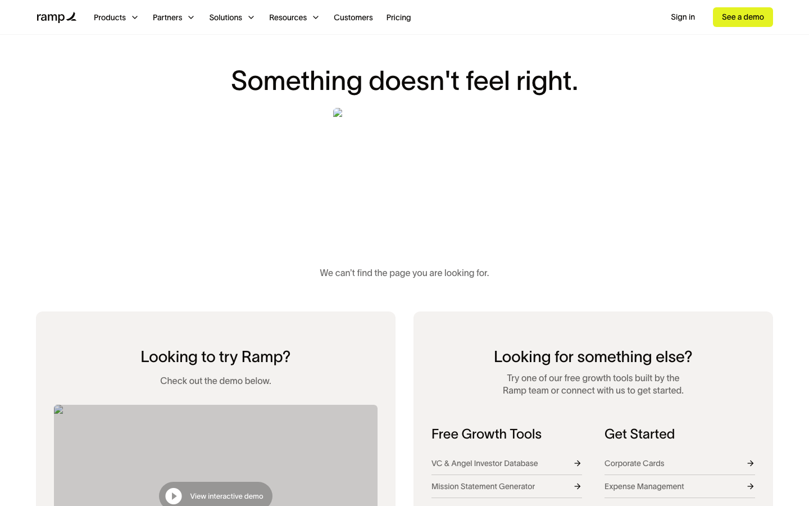

**观察：**

- ✅ 这个 404 页本质上被设计成**产品导航 + 重新激活的兜底入口**而非死胡同:它一次性铺开了 Ramp 的核心能力地图(Corporate Cards / Expense Management / Accounts Payable / Seamless Accounting / Ramp Intelligence)并给出"View interactive demo"作为恢复路径,让误入的用户能直接跳进相关产品入口或看演示——错误恢复工作流在功能层做得到位。
- P2 页面暴露了 Ramp 的一类独立功能——"Free Growth Tools"(VC & Angel Investor Database、Mission Statement Generator、Card Comparison Tool、Invoice Generator、Business Expense Classifier),说明它把免费独立工具当作获客漏斗的真实产品。但此处只给了工具名 + 箭头,完全没有交代每个工具的**输入/输出、适用对象、工作机制**,用户无法判断"点进去能得到什么"。
- P1 footer 透露出几个信息量最大却完全未解释的 AI 能力:**Ramp Intelligence、AI Token Spend Management、Ramp for Agents、Ramp Labs**。其中"AI Token Spend Management"暗示一个新颖的差异化能力(对 LLM/AI token 消耗的追踪与管控),但落到这页的用户只看到一个标签,看不到其**机制、接入方式、覆盖范围**——这是该产品最值得说清却最缺失的功能点。
- P3 从 footer 的产品分类(Corporate cards / Spend management / Budgets / Banking / Travel / Reimbursements / Procurement / Vendor management / Approvals / Accounting automation / Multi-entity / Global 等)可推断 Ramp 是一个覆盖卡、报销、应付、采购、差旅、银行、记账自动化的**一体化支出运营平台**,而非单点工具。404 访客能感知到"广度",但感知不到任何"深度"或各模块如何协同。
- P2 针对 404 这个具体职责,恢复手段仅限于**策展式链接 + 演示**,没有站内搜索框、也没有"你是不是要找…/相似页面"的智能跳转。对一个工具/资源繁多的站点来说,误点了被移动的深层链接(如某个已迁移的工具页)的用户无法回到原本想找的目标——恢复工作流并不完整。

#### S3: Integrations page

**URL:** https://ramp.com/bank-connections


**观察：**

- ✅ 页面清晰传达了核心能力 = "多银行账户聚合 + 支付集中化"**：通过 80+ 银行连接，把企业散落在不同银行的账户接入 Ramp，统一管理 corporate card、ACH、国际电汇三类支付，并提供合并后的现金流视图。"diversify funds / centralize payments / manage cash flow" 三段把能力拆成了可理解的工作流，读者能快速 get 到"产品帮我把多家银行的钱和支付收口到一处"。
- ✅ 用真实场景锚定了要解决的问题（银行集中度风险）**：Sara Mauskopf 的引述直接点出 SVB 式痛点——"所有金融服务（含卡）被锁死在单一 provider"，Ramp 的解法是接入多个银行伙伴 + 单平台合并视图。这是把抽象的"diversify funds"翻译成具体使用场景的有力一笔，让目标用户（被单一银行套牢的财务负责人）立刻对号入座。
- P1 关键工作机制未说明：连接后 Ramp 对外部账户到底是"只读看"还是"可发起支付"**。文案同时出现"make faster payments""centralize all payments""automated payments"，但从未交代 Ramp 是通过何种方式（Plaid 聚合？银行 API？）接入，以及能否真正从连接的外部账户直接划款、还是仅做可视化与对账。这是决定"产品能为我做什么"的核心功能边界，缺失会让人误判产品是支付执行工具还是看板工具。
- P2 "80+ 银行连接"缺具体清单与覆盖范围**：通篇强调"wherever you bank / preferred partners"，却没有列出支持哪些银行、referral program 网络里有哪些合作方、是否覆盖非美国银行（既然提到 international wires）。对一个主打"无论你在哪家银行"的页面，可连接银行名单恰恰是用户最想验证的功能事实。
- P2 "bank referral program"作为独立能力定义模糊**：页面把"通过 Ramp 优先转介、快速安全开新银行账户"列为首要卡片，但没说明 priority referrals 具体意味着什么（更快审批？专属客服？费用如何？谁来开户）。它与"连接已有账户"是两条不同的工作流，混在一起容易让用户分不清哪些是"现有功能"、哪些是"需另行加入的项目"。

#### S9: API / Developer docs

**URL:** https://ramp.com/vc-partnerships


**观察：**

- P1 测点与页面内容严重错位**：S9 标称为 "API / Developer docs"，但实际页面是「VC & 加速器合作伙伴计划」营销页，全文零出现 API / SDK / 开发者文档 / 集成端点 / 技术接入任何字样。以"了解 Ramp 开发者能力 / 能否程序化对接"为目的访问本页的读者，将得不到任何信息——无法判断 Ramp 是否开放 API、有无 webhook、能否自动同步数据。
- P2 通过合作方视角间接暴露了产品能力，但全是泛词**：页面列举了 Ramp 核心能力——支出管控(spend controls)、实时告警(real-time alerts)、工作流自动化、现金流可视化、信用额度、AI 省钱洞察(AI-powered savings insights)。这些勾勒出"现代财务平台"轮廓，但全部停留在能力名词层，没有任何"输入什么 / 输出什么 / 怎么运作"的机制说明，读者无法判断每项能力的实际深度与边界。
- P2 唯一的合作方专属功能 "Advisor Console" 描述过浅**："Advisor Console for cross-portfolio benchmarking and spend analysis"（跨投资组合的支出基准对标与分析）是本页最有信息量、也是面向 VC/加速器的差异化功能点，却仅一句话带过。未说明它展示哪些指标、数据来源、被投企业是否需授权数据共享、能否导出——合作方读完仍不知道这个 console 究竟能给出什么决策依据。
- ✅ "为谁解决什么问题"定位清晰**：页面清楚交代了价值对象与场景——为 VC/加速器提供对被投企业现金流的可视化、为创始人节省行政工作流时间、为机构带来 underwriting 加速与折扣定价；典型场景（机构把被投企业批量引入 Ramp）表达明确，合作动机站得住。
- P3 被投企业实际拿到的功能增益未说明**：页面反复强调 "discounted pricing / scaled platform pricing / sign-on bonus"，但只讲了价格和返佣，未说明经 partner 渠道进入的 portfolio 公司在**产品功能层**是否与普通用户有别（是否解锁额外模块、更高信用额度、专属支持）——读者只能理解到"更便宜",无法判断功能是否也更强。

#### E1: 探索: Learn more

**URL:** https://ramp.com/stack


**观察：**

- ✅ **核心能力呈现具体、可信**：页面清晰揭示了产品的本质——让 AI 代理端到端承接真实财务工作（对账 reconciliations、计提/摊销 schedules、月度报告），范围明确写为"from workbook to ledger"，并给出了三个可识别的客户化场景（project-based spending、deferred revenue recognition、custom vendor rules）。读者能形成"AI 替我跑月结闭账"的明确预期，而非空泛的"AI 赋能"。
- ✅ **集成能力与差异化卖点说清了"读写双向"**：明确产品可"push, pull, read, and write"跨 QuickBooks、Google Drive、spreadsheets、bank feeds，强调能回写台账而非只读取——这是会计自动化里关键的功能边界，表述到位。同时"并发运行多个 agent""closes up to 60% faster / 9x faster schedules"把价值量化到了具体工作流。
- P1 产品/代理命名前后不一致，造成功能主体混淆**：通篇产品名为 **Stack**，但功能描述段却写成"**Ramp** comes with accounting expertise built in""**Ramp** learns each preference once"。读者无法判断 Ramp 是 Stack 内置的 AI 代理名、是另一产品、还是文案错误，直接动摇了"到底是谁在帮我干活"这一最核心的功能认知。
- P2 核心概念 agents / skills / routines 反复出现却从未定义或区分**：页面要求用户"run your agents concurrently, refine your skills, build routines",但三者的关系、各自的输入输出、如何创建与配置完全没说明。用户读完知道"有这些东西",却不知道一个 agent 具体怎么被指派任务、skill 与 routine 边界在哪、需不需要写规则或脚本。
- P2 关键功能缺口：集成清单不完整 + 人工复核/准确性机制缺失**。①集成只列举到"and beyond",未给完整连接器清单,使用 NetSuite / Xero / Sage 等其他台账的事务所无法判断是否适用;②客户证言提到"spending time reviewing work",暗示存在人工复核环节,但 AI 产出如何被校验、审批、纠错的工作机制完全没有交代——对会计这种高准确性场景,这是用户最想知道却没说的功能关键点。

#### E2: 探索: See a demo

**URL:** https://ramp.com/see-a-demo

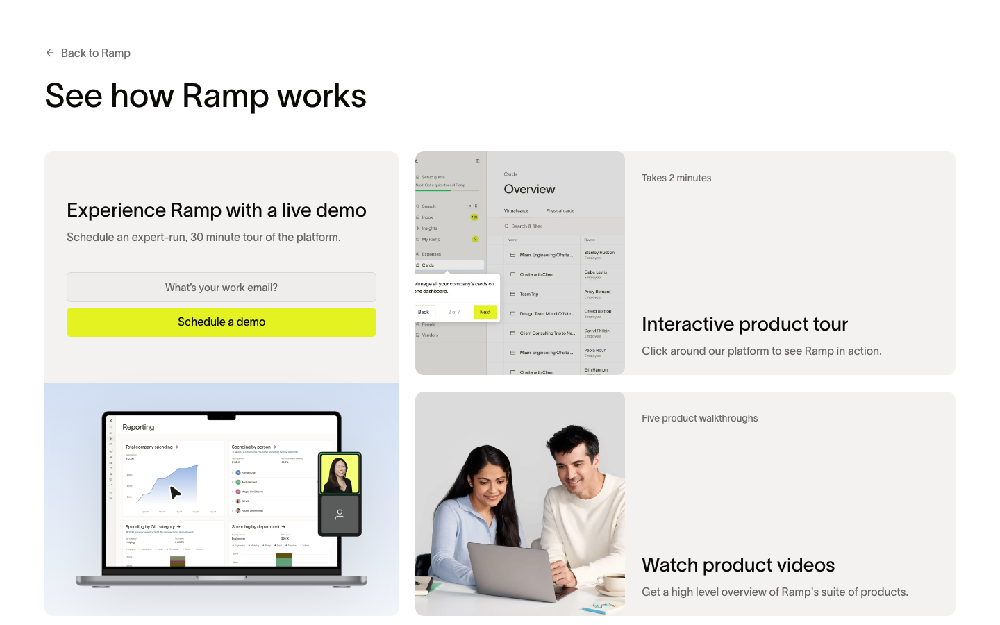

**观察：**

- 页面揭示的是"产品学习/试用入口"而非产品能力本身**：它提供三条递进的了解路径——专家带领的 30 分钟实时 Demo（仅需填邮箱预约）、可自助点击的交互式产品导览（Interactive product tour）、以及产品概览视频。这反映 Ramp 是一个**多模块平台**（"suite of products"、"Five product walkthroughs"），复杂到需要三种学习方式来覆盖不同评估深度。✅ 区分了"有人引导"与"自助探索"两种获取信息的工作流，覆盖不同购买阶段的用户。
- P1 关键功能完全缺位**：整页没有说明 Ramp **到底做什么**——没有提及任何具体产品（如企业卡、费用报销、应付账款、差旅、对账等）。用户读完只知道"有个值得看的产品套件"，但无法回答"这个产品能为我做什么"。作为产品功能层，这一页几乎是零功能信息的"中转页"。
- P2 "Five product walkthroughs / suite of products" 未列清单**：宣称有五个产品导览、一整套产品，却不点名是哪五个、覆盖哪些业务场景，用户无法据此判断是否匹配自己的需求（比如是费用管理还是企业支付）。
- P2 交互式导览的机制与门槛不明**：未说明 "Interactive product tour" 是否需要注册/登录、点击的是真实环境还是录制式沙盒、大概覆盖哪些功能点；同样视频"high level overview"也未说明时长与主题，用户难以预估投入产出。
- 功能信息缺口**：缺少**目标用户/适用场景**说明（面向 SMB 还是 Enterprise？财务团队还是 CFO？），也没有把三种探索方式与"想解决什么问题"挂钩——例如"想看报销自动化就看 X 导览"。这使页面停留在引流层，未承担任何功能解释职责。

#### E4: 探索: Emerging talent

**URL:** https://ramp.com/emerging-talent


**观察：**

- P1 页面定位错位，几乎不揭示核心产品能力**：这是一个面向实习生的招聘页（Emerging Talent / Rampling），通篇是"实习体验、导师制、往届感言"。读者读完无法回答"Ramp 这个产品能为我（作为财务/企业用户）做什么"——核心的公司卡、费用管理、报销、Bill Pay 等主营功能完全没有功能层面的解释。作为"产品功能"测点，信息密度极低。
- ✅ Slack 集成的功能描述具体、动作清晰**：明确列出了输入/动作链路——"request, review, and issue spend without leaving Slack"（在 Slack 内发起、审批、发放支出），并说明了机制"take action on important spend alerts" + "stream company-wide transactions"（实时推送支出告警、广播全公司交易流）。输入（支出申请/告警）、输出（审批与发放动作、交易流）、集成对象（Slack API）都交代到位，是全页唯一讲清楚工作流的功能点。
- P2 Chrome 扩展功能颗粒度过粗**：只说"find your card info, submit receipt, and receive helpful tips"（查卡号、提交收据、获取提示），但没说明工作机制——收据是自动 OCR 识别匹配交易还是手动上传？"helpful tips"指什么（合规提醒？省钱建议？）？适用场景（哪些网站/结账页生效）也未提。读者无法判断这个扩展在实际报销/对账流程里到底替代了哪一步。
- P2 Vision Pro 案例易被误读为产品功能**：文中"built a functional proof-of-content visualizing Ramp funds on the Apple Vision Pro"实为实习生的概念验证原型（proof-of-concept），并非可用的产品能力。在"产品功能"语境下与真实功能（Slack/Chrome）混排，未加"原型/非正式发布"标注，可能让读者误以为 Ramp 提供 Vision Pro 端的资金可视化能力。
- P3 顺带暴露但未展开的功能线索**：行文中提到"Bill Pay x Cohere team"，间接透露 Ramp 有 Bill Pay（账单支付）产品线及与 Cohere 的某种集成，但零功能说明——既未讲 Bill Pay 做什么，也未讲 Cohere（AI 能力？）如何嵌入支出/账单流程，留下明显的功能信息缺口。

#### E5: 探索: Versus

**URL:** https://ramp.com/versus

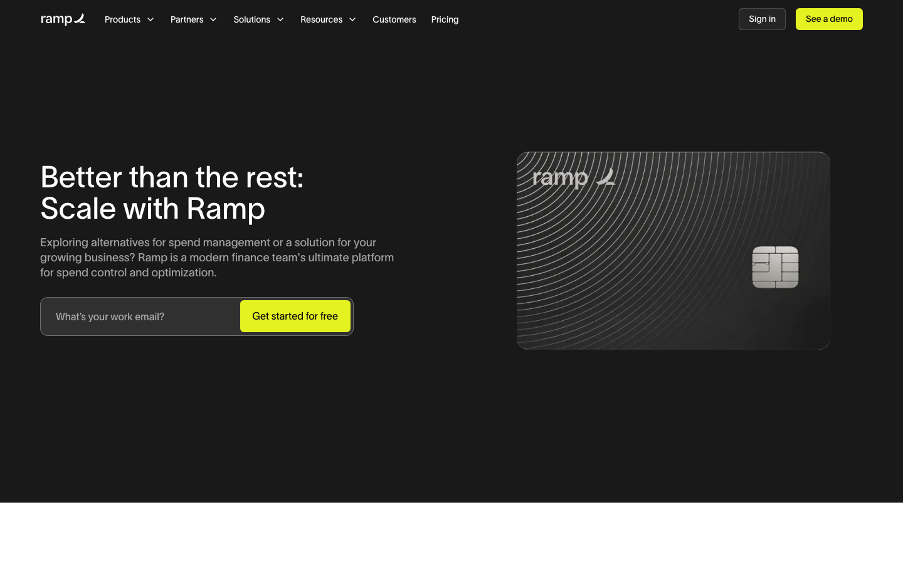

**观察：**

- ✅ 竞品对比矩阵覆盖 28 个对手，间接勾勒出 Ramp 的功能边界与"整合替代"定位：对手横跨传统银行卡（Amex/Chase/Citi/BofA/Wells Fargo/Capital One）、支出管理 fintech（Brex/Divvy/Airbase/Navan/Mesh）、费用报销（Expensify/SAP Concur）、应付付款（Bill/Melio）、企业银行（Mercury/Rho/Novo）。这清晰传达了产品的核心命题——用一个平台同时替掉"公司卡 + 费用 + AP + 银行 + 差旅"多个工具，定位为 finance team 的一站式 spend platform。
- P1 作为名为 "Versus" 的对比页，正文几乎没有任何实质功能对比内容——只罗列 28 条 "Ramp vs X" 链接和一句 "See how we stack up"，完全没说明 Ramp 相对每一类对手在功能上究竟强在哪（如 vs 银行卡=自动对账/省钱机制？vs Brex=差旅或预算？vs Concur=报销自动化？）。处于选型/评估阶段的用户读完本页根本无法判断"换成 Ramp 我能多得到哪些能力"，与页面承诺的"看我们如何胜出"严重不符。
- P2 真正的功能地图藏在页脚导航里（Corporate cards / Expense management / Spend management / Budgets / Banking / Travel / Reimbursements / Procurement / Accounts payable / Vendor management / Approvals，加平台层 Accounting automation / Intelligence / Reporting / Savings / Integrations / Multi-entity / Global），但每个模块做什么、输入输出与工作机制全靠下钻，对比页本身不解释任何一个能力，信息密度与页面意图不匹配。
- ✅ 出现 "AI Token Spend Management" 与 "Ramp for Agents" / "Ramp Labs"，揭示了一个面向 AI 时代的差异化能力——管理企业在 AI token / AI agent 上的支出，是很有信息量的功能信号；但页面只给名词，未说明它如何计量 token 消耗、对接哪些 LLM 供应商、与公司卡/预算/审批如何联动（P2 功能机制缺口）。
- P2 功能信息缺口集中在"切换场景"：页面主打 "exploring alternatives / 正在物色替代方案"，却完全没提迁移与并存相关能力——历史数据导入、从现有银行卡或 Concur/Expensify 平滑切换、与现有 ERP/会计系统（NetSuite、QuickBooks 等）的具体集成清单。对正处于"替换决策"的目标用户，这恰恰是最该回答却缺席的功能关键点。

#### E6: 探索: Products

**URL:** https://ramp.com/products

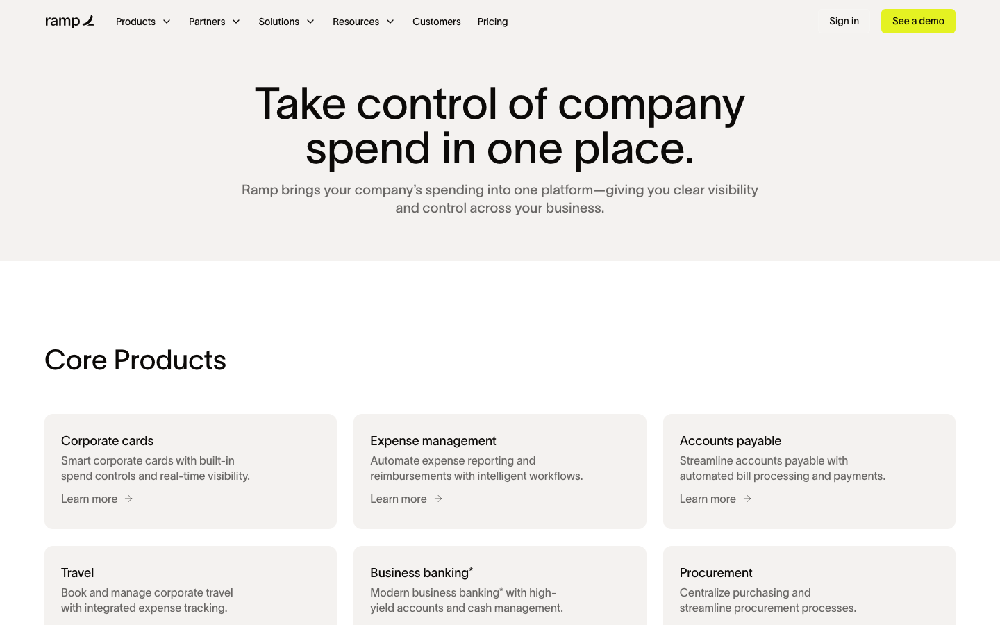

**观察：**

- ✅ 页面清晰呈现了"全栈企业支出管理平台"的产品全景:6 大核心模块(公司卡 / 费用管理 / 应付账款 / 差旅 / 商业银行 / 采购)基本覆盖了"刷卡支出 → 报销 → 付供应商 → 差旅 → 资金管理 → 采购"的完整支出生命周期,有力印证了"把公司所有支出集中到一个平台"的核心定位。用户读完能快速建立"这是一个一站式支出中枢、而非单点工具"的认知。
- ✅ 工作机制用具体动作而非空泛形容词描述,信息密度高:每笔交易自动编码与对账(Corporate Cards)、收据自动捕获 + 匹配 + 一键提交(Receipt automation)、里程自动套用正确费率并"in days"完成报销(Mileage tracking)、内置政策强制执行 + 多级审批(Expense management)。这些点明了产品的核心价值是"消除手工录入与对账",让用户理解"它替我省掉了什么工作"。
- P2 集成能力只有抽象承诺、无具体清单:多处提到"sync card transactions directly with your accounting software""seamless reconciliation"(Card Integrations),但全页未列出任何具体会计 / ERP 系统(如 QuickBooks、NetSuite、Xero、Sage)。集成范围是采购此类产品的决策关键,用户无法判断现有财务系统能否对接,这是明显功能信息缺口。
- P2 "Business banking*" 带星号脚注但本页未给出解释:商业银行类产品通常涉及"由合作银行提供而非 Ramp 自营"的合规声明,关系到账户性质、谁是发卡 / 存款机构、是否有存款保险等关键事实。脚注缺失会让用户对"这究竟是不是一个真正的银行账户、由谁托管"产生疑问,属功能定性层面的关键信息不明。
- P3 6 个模块并列罗列,但未说明模块间如何联动形成闭环:平台型产品最大卖点往往是"打通"(如 采购审批 → 自动生成应付账款 → 公司卡付款 → 自动对账 的端到端数据流),而本页仅做能力清单展示,没有演示任何跨模块的端到端工作流,削弱了"一个平台"相比"多个工具拼凑"的差异化说服力。

#### E7: 探索: Corporate cards

**URL:** https://ramp.com/corporate-cards


**观察：**

- ✅ 虚拟卡的"预算+品类管控"工作流演示得很具体**：页面用 Conference virtual card（$2500/$3000）、Marketing virtual card（$1120/$10000）等实例，配合 Taxi/Fuel/Entertainment 允许、Alcohol/Casinos 拦截（block）的品类清单，把"花钱前就把规则写进卡里"这一核心能力讲清楚了——读者能直接理解产品在为谁、按什么维度（团队/全公司、按品类/商户）限额管控。
- ✅ 费用自动化（无报销单）的输入与机制说明到位**：明确了报销提交入口（SMS、移动 App、Gmail/Lyft/Amazon 等集成自动路由）和自动化动作（把交易自动归到对应限额、自动生成收据、保存周期性备注、自动催缺失项与代发还款请求）。用户能明确知道"刷卡—提交—对账"这条链路产品替我做了哪些事。
- P2 "最高 5% 节省"和"实时省钱"只给结论不给机制**：页面反复强调 "up to 5%¹ savings""pays off immediately"，但未说明返现/节省是如何实现的（按品类返现？按供应商谈判折扣？预付折扣？），脚注¹也未在节选中展开。用户无法判断这个数字对自己业务是否成立。
- P2 集成清单与会计系统对接缺失**：仅以 Gmail、Lyft、Amazon 作举例，未给出完整集成列表，尤其没有提到企业卡最关心的会计/ERP 对接（如 QuickBooks、NetSuite、Xero）。"自动对账、加快关账"是页面主张的价值，但缺少与账务系统打通的关键功能信息，削弱可信度。
- P2 "可疑供应商自动标记审批"的判定机制未交代**：页面称 "Questionable vendors are always automatically flagged for approval"，但没说明系统如何判定"可疑"（是规则引擎、商户类别码 MCC，还是 AI/风险模型？），用户无法评估这套自动审批的准确性与可控性。

#### E8: 探索: Expense management

**URL:** https://ramp.com/expense-management

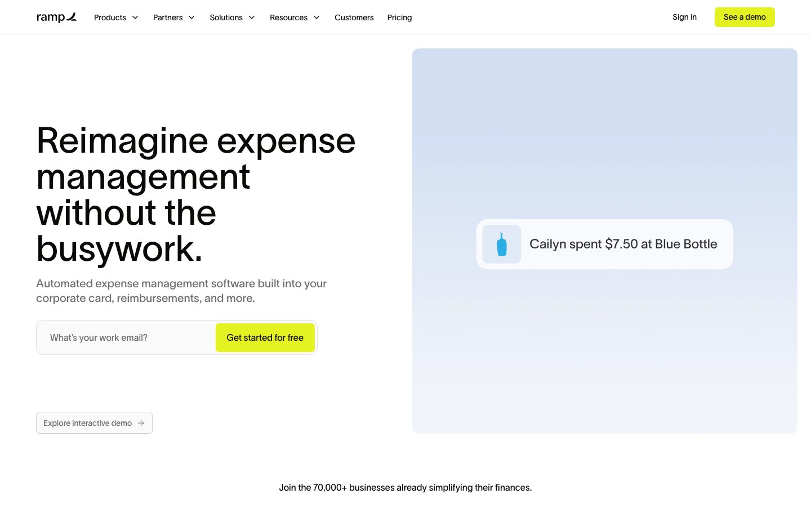

**观察：**

- ✅ 页面清晰揭示了核心工作流：**刷卡即触发自动化**——交易发生后 Ramp 自动抓取收据、填写备注(memo)与费用类别，员工只需在 SMS/Slack/Microsoft Teams 内确认或编辑后提交。这把"事后报销填表"压缩成"事中一键确认"，解决了费用报告手工录入的核心痛点，输入(刷卡交易)→输出(已编码的费用条目)链路说明到位。
- ✅ 突出了**事前管控(prevent before spend)**这一差异化能力：发卡时即内置政策(提交要求、消费限额、屏蔽高风险商户/品类)，并通过"可复用 spend templates"按政策预填限额/审批/管控、一键发卡。这把传统"事后审计"前移为"事前拦截+模板化发卡",场景指向有复杂报销政策的规模化团队。
- ✅ 展示了两类 **AI agent 能力**:①面向员工的对话式财务助手(自然语言查政策、申请资金、解决卡问题);②面向 finance 的 policy agent 自动审查 100% 费用、放行合规项、仅上报需人工处理的异常。同时审批请求附带"基于政策/预算/资金的推荐动作",定位为帮 finance 团队减负、放大审批吞吐。
- P1 — 产品与"卡"的捆绑边界未说清**：页面反复强调"built into your corporate card",但未说明费用管理能否脱离 Ramp 卡独立使用(例如仅做现金/第三方卡的 reimbursement)。读者无法判断"不换卡能否用这套报销自动化",这是采购决策的关键前提。
- P2 — 会计/ERP 集成清单缺失**：客户证言提到"预硬编码会计字段→自动编码到正确部门",暗示有会计系统对接,但全页只列出提交渠道(SMS/Slack/Teams),没有任何会计软件(QuickBooks/NetSuite/Sage 等)或 ERP 的集成名单与同步机制说明,无法评估能否接入现有财务栈。


### ⚠️ 未找到的测点（2 个测点）

**该模块覆盖页面**:

- `https://ramp.com/`

#### C4: Login page

**URL:** https://ramp.com/
**观察：**

- [Link not found] 该模板期望的链接（log in|login|sign in|登录|登入）在 https://ramp.com/ 上未找到 — 可能产品用了不同的措辞或这个功能不存在。 已跳过截图与 LLM 解读以避免重复首页快照。

#### S5: Case studies / Testimonials

**URL:** https://ramp.com/
**观察：**

- [Link not found] 该模板期望的链接（case stud|testimonials|stories|案例|客户故事）在 https://ramp.com/ 上未找到 — 可能产品用了不同的措辞或这个功能不存在。 已跳过截图与 LLM 解读以避免重复首页快照。


---

## 4. 第三方社区反馈

I have enough verified, linked material with verbatim quotes. Writing the section now.

#### 4.1 调研范围与方法

本节通过 WebSearch 对 `ramp.com` 进行域名锚定检索，覆盖 Reddit、Hacker News、Product Hunt、G2、Trustpilot、Capterra 六个非官方平台，定位到可追溯链接的讨论与评价若干，并优先深读其中信号较强的 2–3 个 thread（重点是 Hacker News 关于 Ramp AI 功能的安全争议、Product Hunt 用户实名评价）。讨论时间跨度约为 **2020 年（早期融资讨论）至 2026 年 6 月**，其中实质性用户反馈集中在 2025–2026 年。

- **Reddit**：检索到围绕 Ramp 公司卡/费用管理的讨论被聚合站（NerdWallet、The Points Guy）引用，但未稳定定位到可直接引用的单帖永久链接，故本节不直接引用 Reddit 单帖原话，仅作背景印证。
- **Hacker News**：多条可追溯 thread，含融资讨论及一条 2026 年关于 Ramp「Sheets AI」自动执行/数据外泄的高热度争议。
- **Product Hunt**：产品页含 13 条实名用户评价，综合评分 4.6/5。
- **评分聚合站**：G2 4.8/5（2,452 条）、Capterra 4.9/5、Trustpilot 3.5/5（自 3.7 下滑）。

#### 4.2 核心议题（按讨论热度）

| 议题 | 讨论方向 | 出现频次 | 主要来源平台 |
|---|---|---|---|
| 使用体验顺畅、收据/记账自动化省时 | 正面 | 高 | Product Hunt / G2 / Capterra |
| AI 自动执行（Ask Ramp / Sheets AI）的安全与信任 | 负面/担忧 | 高（单 thread 高热度） | Hacker News |
| 客服响应慢、人工支持难触达 | 负面 | 高 | Trustpilot / Reddit（聚合引用） |
| 开户/身份验证（KYC）被拒或摩擦大 | 负面 | 中 | Product Hunt / Trustpilot |
| 奖励/返现条款变动（"bait-and-switch"、信用额度突降） | 负面 | 中 | Reddit（聚合引用）/ Trustpilot |
| 从 Brex 等竞品迁移后的对比体验 | 正面为主 | 中 | Product Hunt / TeamBlind |

#### 4.3 正面评价 / 用户喜欢的点

- **来源**: [Ramp Reviews | Product Hunt](https://www.producthunt.com/products/ramp/reviews) — `Jake Liebersohn`, 约 3 年前
  - **原话引用**:
    > Ramp has saved our team 8 hours on time in our close process since switching from a competitor.
  - **关键词**: 月结提速、迁移自竞品、省时

- **来源**: [Ramp Reviews | Product Hunt](https://www.producthunt.com/products/ramp/reviews) — `Tuneer Biswas`, 约 9 个月前
  - **原话引用**:
    > Nothing makes life easier than having a Ramp card. We use it everyday, thank it everyday!
  - **关键词**: 日常高频使用、体验顺手

- **来源**: [Ramp Financial Products — 2,452 Reviews on G2](https://www.g2.com/products/ramp-financial-ramp/reviews)（综合评分 4.8/5） — 聚合评价
  - **原话引用**（平台高频提及点，非单条评论）:
    > 易上手、移动端拍传收据方便；可按员工/部门实时发卡、设限额、限制品类、甚至屏蔽特定商户。
  - **关键词**: 易用性、卡片管控、数字收据管理（该项评分 9.6）

#### 4.4 负面 / 批评 / 担忧

- **来源**: [Ramp's Sheets AI Exfiltrates Financials | Hacker News](https://news.ycombinator.com/item?id=47951786) — `Mr-Frog`, 约 2026 年 4 月
  - **原话引用**:
    > It's kinda awesome that after decades of software and hardware advancements to prevent computers from arbitrarily executing data as instructions, we've decided to let agents arbitrarily execute data as instructions.
  - **关键词**: AI agent 安全、任意指令执行、架构隐忧

- **来源**: [Ramp's Sheets AI Exfiltrates Financials | Hacker News](https://news.ycombinator.com/item?id=47951786) — `Ekaros`, 约 2026 年 4 月
  - **原话引用**:
    > You gave it capability to delete emails. Why did you expect it not to do that at least some of the time?
  - **关键词**: 自动化权限过大、概率性误操作、财务数据风险

- **来源**: [Ramp Reviews | Product Hunt](https://www.producthunt.com/products/ramp/reviews) — `Cornwallis Bottomsworth`, 约 1 年前
  - **原话引用**:
    > Took all my personal info, denied me for no reason because they couldn't verify my identity.
  - **关键词**: 开户被拒、身份验证（KYC）摩擦、信息已采集却被拒

- **来源**: [Ramp Reviews | Product Hunt](https://www.producthunt.com/products/ramp/reviews) — `Benjamin VanEvery`, 约 2 个月前（评价偏中性偏批评）
  - **原话引用**:
    > Ramp significantly improves how we manage vendor spending. It simplifies receipt tracking and categorization.
  - 但同时指出界面「拥挤、偏会计视角」，对企业主不够友好。
  - **关键词**: 信息密度高、面向会计而非业主、上手心智负担

- **支撑信号（评分聚合，非单条实名）**: [Ramp Reviews | Trustpilot](https://www.trustpilot.com/review/ramp.com)（3.5/5，自 3.7 下滑）。复现性最高的抱怨是**客服响应**：用户被反复引导至 App 内验证与工单提交才能联系到人工，被描述为冗长、低效、令人沮丧；中端市场客户对 onboarding「白手套」支持的预期落空。

#### 4.5 与官方说法的差异

**一致之处**：官网（见 §3.1）核心叙事是「用更少的钱办更多的事」「省时」「核心卡片与费用管理软件免费」，并把发卡、收据/记账自动化作为卖点。这一点与第三方反馈基本吻合——Product Hunt、G2、Capterra 的高评分与「月结省 8 小时」「日常高频使用」等实名评价，正面印证了官方主打的**省时与自动化**价值主张并非空话。

**明显反差有两处**。其一是 **AI 自动化**：官网把「Ask Ramp — Get answers or have Ramp handle it for you」包装为让 AI 代为处理事务的能力卖点，叙事是信任与省心；而 Hacker News 上围绕 Ramp「Sheets AI」的高热度讨论恰恰反向——技术社区担忧的正是「让 agent 任意把数据当指令执行」「赋予删除权限后必然会误删」这类自动化失控与财务数据外泄风险。官方视为差异化亮点的特性，在社区被当作主要风险点审视。其二是**服务体验**：官方对企业/中端市场隐含「白手套」式定位，但 Trustpilot 评分下滑与「人工客服难触达」的复现性抱怨、以及 Product Hunt 上的 KYC 被拒案例，说明在**支持响应与开户体验**上，真实口碑与官方塑造的高端服务形象存在落差。

#### ⚠️ 信息来源声明

本节所有内容来自**非官方的第三方平台**（Reddit / Product Hunt / Hacker News / G2 / Trustpilot 等）。内容可能带有主观偏见、过时信息或个别用户的极端观点。决策时建议结合公司官方信息（§2.5）+ 实测观察（§3）综合判断。

---

## 5. 从访客到注册的转化路径

#### 转化路径示意

```
第 1 步：看到品牌定位落地页（被"花得更少、成就更多"叙事 + 规模背书击中）
    ↓ 关键触点：[B2] "a financial operations platform that helps companies achieve more by spending less" + 3万客户/省20亿美元/2000万小时；[B1] 定位 spend management platform
第 2 步：建立"这是一个平台，不是单一工具"的全局认知（功能矩阵）
    ↓ 关键触点：[C2] 功能矩阵覆盖企业卡/差旅报销/应付账款/资金管理/会计自动化；[B2] 一个平台覆盖支付·发卡·采购·差旅·记账
第 3 步：评估定价与套餐（确认"核心免费"、看升级门槛）
    ↓ 关键触点：[B3] "core card and expense management software is free"、unlimited users and cards；[C2] Free → Plus $15/user 增量叠加
第 4 步：选择转化入口（自助免费注册 / 联系销售预约演示）
    ↓ 关键触点：[B5] Enterprise 需 contact Sales Team、按年订阅；[B3][C2] 免费核心 → 指向自助注册路径
第 5 步：完成转化（注册免费版开始试用 / 提交 Enterprise 演示申请）
    ↓ 关键触点：[B4] Plus "at any time… switch back to the free version"（可逆，降低注册心理负担）
```

#### 各步骤详解

**第 1 步：看到品牌定位落地页**
- 页面写了什么：Ramp 被定义为"帮企业花得更少、成就更多"的财务运营 / 支出管理平台，并用"3 万+ 客户、累计省 20 亿美元 / 2000 万小时、美国史上增长最快初创之一"背书 [B1][B2]。
- 我的推断：第一屏的工作是**用一句价值主张 + 大数字社会证明建立信任**，把访客从"这是张公司卡"拉高到"这是帮我省钱省时的系统"。客群跨度被刻意拉宽（"from family farms to space startups"）以让各类访客都觉得"说的是我" [B2]。
- 可能流失的原因：定位偏抽象（"intelligence / automate" 反复出现却不解释做什么 [B2]），不在"费控/公司卡"痛点里的访客会觉得"和我无关"而离开。

**第 2 步：建立"全平台"认知（功能矩阵）**
- 页面写了什么：定价页以功能矩阵罗列企业卡、差旅报销、应付账款（OCR/审批/多种付款）、资金管理、会计自动化、预算报表、供应商管理 [C2]；overview 也归纳为支付·发卡·采购·差旅·记账一站式 [B2]。
- 我的推断：这一步是**把单点需求转化为平台需求**——让来找"一张卡"的人意识到"它能替我管钱的方方面面"，从而提高后续付费/扩量的想象空间。
- 可能流失的原因：功能太多反而稀释焦点；想"接入我现有 ERP/HRIS/银行/API"的人在此找不到答案（集成清单只给会计软件 + "and more" [C2]），评估受阻而搁置。

**第 3 步：评估定价与套餐**
- 页面写了什么："核心卡片与费用管理软件免费"、用户与卡片数量不限、无补卡费/滞纳金/利息 [B3]；套餐以"All the features of Free, and:"增量叠加，Free→Plus 标价 $15/user，采购为 Plus/Enterprise 的付费 Add-on [C2]。
- 我的推断：**"核心免费 + 反积分诱导"是主要的心动钩子**——把决策从"值不值得花钱"变成"先免费用起来没有损失"，付费被包装成"规模/全球化/复杂需求时再升级"。
- 可能流失的原因：Plus/Enterprise 的真实总价不透明（Enterprise 要联系销售 [B5]、Bill Pay 按笔收费 ACH $0.59 / 电汇 $15 / SWIFT $20 [B3]），想精算总成本的访客算不清账，倾向"再看看"。

**第 4 步：选择转化入口**
- 页面写了什么：Enterprise 按年订阅、按用户计费、需联系 Sales Team / account manager 开通 [B5]；免费核心产品对外宣传为自助、免费 [B3]。
- 我的推断：这是一个**双入口漏斗**——SMB 走"自助注册免费版"，中大型 / 全球化客户走"预约演示 + 销售跟进"（Enterprise 的 contact-sales 性质强烈暗示存在 demo/sales 通道）。注意：官网具体的"Get Started / Book a Demo"按钮未在所给测点中直接出现，此为基于套餐结构的推断。
- 可能流失的原因：需要联系销售的人若嫌"还要被 sales 跟"而犹豫；自助注册的人若担心"免费版能做什么、会不会被诱导升级"也会停在这里。

**第 5 步：完成转化**
- 页面写了什么：Plus 是"可选升级、随时可切回免费版" [B4]；免费核心无最低门槛叙事 [B3]。
- 我的推断："**随时可逆 + 免费起步**"是临门一脚的降风险设计，把"注册"这个动作的心理成本压到接近零。
- 可能流失的原因：注册前需要的资料（企业资质 / 银行验证等）若过重，会在表单环节流失——但这属于注册流内部，公开页无法判断。

#### 转化设计观察

- **入口设计**：呈现为**自助免费注册**与**销售驱动演示**两条腿。免费、不限用户/卡、可随时切回免费 [B3][B4] 指向低门槛自助注册是主漏斗；Enterprise 的"contact Sales / 按年订阅" [B5] 则是面向大客户的演示+销售通道。Plus 被定位成自助、可逆的升级而非新的销售环节 [B4]——即"先让你进来，再让你长大"。
- **价格预期**：访客读完会形成"**$0 起步**"的第一印象（核心免费 [B3]）；进一步会预期"要用全功能大概 $15/人/月起"（Free→Plus $15/user [C2]）；但对 Enterprise 与 Bill Pay 的总账会**心里没底**（Enterprise 价缺失需问销售 [B5]、Plus 完整价在 support 页才有 [B3]、Bill Pay 按笔收费 [B3]）。净效果：起步预期极低，但"全量到底多少钱"模糊。
- **公开承诺**：官网承诺的"用了会发生什么"集中在——**省钱省时**（"spend less / save time and money"、累计省 20 亿美元 [B1][B2]）、**AI 替你做繁琐工作**（AI 编码/审批建议/费用审查 [C2]）、**不被收费/不被诱导消费**（无补卡费/滞纳金/利息、反积分 [B3]）、**钱还能生息**（资金账户 4.24% [C2]）。注意这些是公开话术承诺，非登录后实测体验。

#### 转化设计的强弱（仅公开页面）

- ✅ **注册门槛极低**：核心免费 + 不限用户/卡 + 随时可切回免费 [B3][B4]，"先用起来零损失"几乎消除了注册的决策成本。
- ✅ **认知与信任建立到位**：功能矩阵把"单点工具"升维成"全平台" [C2]，叠加 3 万客户 / 省 20 亿美元的规模背书 [B1][B2]，对企业决策者说服力强。
- ⚠️ **最大心动点恰是最模糊处**：AI 自动化是 Free→Plus 升级的主要理由，却没说准确率、是否需人工复核、"审批建议"是建议还是自动执行 [C2]——访客会心动但难下付费决心。
- ⚠️ **总价算不清**：Plus/Enterprise 真实价格散落或缺失，Bill Pay 又按笔计费 [B3][B5]，精打细算型访客无法在定价页一次算清总成本，容易"再看看"。
- ⚠️ **集成信息不足拖累评估**：只列会计软件 + "and more"，未明示 ERP/HRIS/API/银行直连 [C2]，"能否接入我现有财务/IT 栈"这个关键评估问题在公开页得不到答案。
- ❌ **资金管理卖点悬空**：4.24% 收益很抓眼球，但无托管方式 / 流动性 / 资格地区限制说明 [C2]，访客无法判断是否适用于自己，难以把它当作转化理由。
