# sandstone.com 产品深度体验报告

## 报告信息

| 项 | 内容 |
|---|---|
| 产品名称 | sandstone.com |
| 产品 URL | https://sandstone.com/ |
| 体验时间 | 2026-06-20T02:09:35.388574 |

---

## 目录

- [1. 核心结论](#1-核心结论)
  - [1.1 一句话判定](#11-一句话判定)
  - [1.2 主要风险](#12-主要风险)
  - [1.3 主要亮点](#13-主要亮点)
  - [1.4 综合评分](#14-综合评分)
- [2. 产品概览](#2-产品概览)
  - [2.1 基础信息](#21-基础信息)
  - [2.2 测点速览](#22-测点速览)
  - [2.3 产品 / 公司背景信息](#23-产品--公司背景信息)
  - [2.4 产品定位与策略](#24-产品定位与策略)
  - [2.5 公司基本信息](#25-公司基本信息)
- [3. 体验流程记录](#3-体验流程记录)
  - [3.1 官网叙事分析](#31-官网叙事分析)
  - [3.2 测点流程详情](#32-测点流程详情)
- [4. 第三方社区反馈](#4-第三方社区反馈)
- [5. 从访客到注册的转化路径](#5-从访客到注册的转化路径)

---

## 1. 核心结论

### 1.1 一句话判定

目标产品 **https://sandstone.com/** 在本次深度体验中：存在显著的功能信息缺口。详见 §3 体验流程记录。

### 1.2 主要风险

1. **[C1]** P1 核心新品类"Legal Relationship Management"缺少与 CLM 的功能边界说明**：页面把 LRM 当作全新品类强推（"不只是又一个文件柜"），但没有讲清它在功能上具体比传统 CLM/合同管理多做了什么——"关系"如何被建模、Context Map 由哪些数据源自动构建、用户需要手动维护还是系统自动抽取。读完仍难判断"这和我现在用的合同系统到底差在哪"。
2. **[C7]** P1 缺少真正的产品文档/帮助中心**：测点为 Help / Documentation，但页面 Resources 菜单下只有 Blog（行业洞察）、Customers（客户故事）、Security（信任合规）、Guides & Ebooks（战略框架）四类——全是营销/内容资产，**没有任何用户手册、操作指南、知识库、API 文档、onboarding 教程或 FAQ**。用户想知道"功能怎么用、怎么配置 agent、怎么接入系统"时，这一页无法提供答案。
3. **[M1]** P1 AI agent 的接入与触发机制完全缺失**:页面用 #dualbridge-legal 的 Slack 消息、Mutual NDA 卡片暗示请求来自 Slack/邮件,且底部 PDF/DOCX/XLSX/MAIL/SLACK/CAL 图标暗示集成,但**从未说明 agent 如何接入这些系统、请求从哪入口产生、如何"理解 intent 并路由到正确 owner"**。读者无法判断这是 Slack App、邮箱集成还是独立门户,集成是只读还是可写,这是评估可用性的关键功能点。

### 1.3 主要亮点

1. **[C1]** ✅ 产品功能定位清晰**：页面通过导航和分块内容明确揭示了 5 大能力模块——文档/知识库管理（CLM+）、智能 Intake & Triage、Agentic Workflows、Context Map（法律关系图谱）、Reporting & Insights。读者能快速建立"这是给法务部门的法律关系管理平台"的整体认知，核心价值主张"把每份文档连接到背后的关系（公司、人、过往决策与行动）"也表达得具体可感。
2. **[C1]** ✅ Reporting 模块的功能产出说清了**：明确列出了输出指标——cycle times（周期时长）、risk exposure（风险敞口）、capacity（产能）、deviation rates（偏离率），并强调"主动聚合 + 主动呈现"，把"法务从成本中心变成战略资产"的用户价值落到了可量化的具体指标上，而非空泛口号。
3. **[C5]** ✅ **页脚导航完整暴露了产品的功能模块分类法**，等于一张"能力地图"：Product 下分 5 大功能支柱——Repository & Knowledge Management（标注 **CLM+**）、Intake & Triage、Agentic Workflows、Context Map（即 Legal Relationship Management 核心）、Reporting & Insights。用户仅看页脚即可快速判断"这个产品由哪几块能力组成"，且 **CLM+** 标签明确传递了"不止于传统合同生命周期管理"的定位（呼应正文"legal doesn't need another filing cabinet"）。

### 1.4 综合评分

| 维度 | 评分 | 1-2 句话说明（引用具体 [测点ID]） |
|---|---:|---|
| 产品方向清晰度 | 4.5 / 5 | 五大能力支柱与"法律关系管理（LRM）平台、不是又一个文件柜"的定位在首页、页脚、甚至 404 页都一致清晰呈现 [C1][C5][C8][M1]；仅 LRM 与传统 CLM 的功能边界稍欠交代 [C1]。 |
| 价值主张表达力 | 4.0 / 5 | "把每份文档连接到背后的关系"+ 可量化指标（cycle times/risk exposure/capacity）+ "法务从成本中心变战略资产"表达具体有力 [C1][M1]，但 "agentic / 自主学习" 等核心卖点偏口号、力强而可信稍弱 [C8][M1]。 |
| 信息架构 | 3.0 / 5 | 顶层导航/页脚把产品拆成 5 大支柱、形成清晰"能力地图" [C5][C7]；但 pricing/sign-up/login 链接均未找到 [C2][C3][C4]，且无真正帮助文档与模块下钻入口 [C7]，关键页面缺失明显。 |
| 功能广度与深度 | 3.5 / 5 | 覆盖 Intake→Triage→Context→Workflows→Repository→Reporting 的端到端闭环，广度足 [M1]，MSA 红线场景做了 8 段式深度演示 [M3]；但多数模块仅有标题、STORE&LEARN/INSIGHTS 等环节零展开，深度严重不均 [C5][M3]。 |
| 核心能力可信度 | 2.5 / 5 | MSA 演示给出 Salesforce/Slack/Ironclad→风险洞察的可信链路 [M3]；但 playbook 如何录入、agent 自动化边界、"自主学习"机制、"50+ 集成"仅点名 8 个等关键证据普遍缺失 [C1][C5][M2][M3]。 |
| 商业化清晰度 | 1.0 / 5 | 定价页链接未找到、被跳过 [C2]，全程无任何定价、套餐分层或计费单位信息，商业化几乎完全不可见。 |
| **综合平均** | **3.0 / 5** | **产品方向与价值叙事强、顶层信息架构清晰，但能力可信度证据不足、且定价/注册/文档等关键页面缺失，是拉低整体的硬伤。** |

---

## 2. 产品概览

### 2.1 基础信息

- **URL**: https://sandstone.com/
- **首屏标题**: Sandstone announces $30M Series A from Lightspeed to bring legal relationship ma

### 2.2 测点速览

本次共体验 27 个测点。

> ⚠️ **登录后内容未覆盖**——用户选择不登录，本报告仅为公开页范围；产品登录后的工作台 / 实际操作未在本报告内。

### 2.3 产品 / 公司背景信息

_本次未发现产品 / 公司的官方介绍页面。_

### 2.4 产品定位与策略

### 1. 自创「法律关系管理」品类，用关系而不是文档当组织核心
**核心判断**: 产品不甘心被归为合同管理工具，而是把"文档背后的关系（公司、人、过往决策）"作为组织一切的中心，另立门户。
**支撑证据**:
- [C1] 核心主张是"把每份文档连接到背后的关系"，并强调"不只是又一个文件柜"
- [C5] Repository 模块打上 "CLM+" 标签，明确传递"不止于传统合同生命周期管理"
- [M1] 定位写作"Legal Relationship Management 而非又一个文件柜"，Context Map 把十余类实体统一成一个行动中枢
**对用户的含义**: 用户要接受一套以"关系图谱"为中心的新思路，而不是把它当现有合同库的平替来评估。

### 2. 把目标用户主动收窄到企业法务部门
**核心判断**: 所有能力都围绕法务职能的日常运转设计，不做泛用型协作或文档工具。
**支撑证据**:
- [C1] 整体认知是"给法务部门的法律关系管理平台"，输出指标按风险敞口、产能等法务关切组织
- [M1] 五大模块构成"覆盖法务部门日常运转"的链路，痛点直指手动分流、请求漏掉
- [C8] 核心场景是 NDA／法务请求的自动带出对手方历史并分派
**对用户的含义**: 非法务团队基本不在射程内，法务买家则能看到高度贴合自己流程的设计。

### 3. 用一条端到端工作流把功能串成闭环，而不是堆零散模块
**核心判断**: 五大能力被组织成"进件→上下文→执行→沉淀→报表"的连贯链路，主打全程打通而非单点工具。
**支撑证据**:
- [M1] Intake & Triage → Context Map → Agentic Workflows → Repository → Reporting 构成端到端闭环
- [M3] 用一个 MSA 加急审查场景把 8 段式工作流（INTAKE 到 INSIGHTS）逐段走通
- [C5] 页脚像一张"能力地图"把产品拆成五大支柱，呈现为成体系的平台
**对用户的含义**: 价值依赖把法务流程整体搬上平台，只买某一块模块可能发挥不出设计意图。

### 4. 把 AI 定位为「照你的规则干活的执行者」，关键决策仍交人审批
**核心判断**: agent 强调基于机构知识而非通用提示词执行具体合同动作，同时保留资深律师的人工审批环节。
**支撑证据**:
- [M2] 列出精准红线、回复批注、接受／拒绝修订、起草、多源引用等具名动作，强调"基于你的 playbook 和上下文"
- [M3] REVIEW 阶段标注"Reviewed by Sarah Chen, Senior Counsel"做最终 APPROVED／MODIFIED 决策
- [M5] 技能清单把 AI 能干哪些动作讲得相当具体，而非泛泛的"AI 助手"
**对用户的含义**: 用户得到的是"准备好、待审批"的助手而非全自动黑箱，但需先把规则与机构知识喂进去才有价值。

### 5. 把卖点落在「让法务从成本中心变战略资产」的量化指标上
**核心判断**: 用可量化的运营指标而非空泛 AI 口号来承载价值主张。
**支撑证据**:
- [C1] Reporting 列出周期时长、风险敞口、产能、偏离率，并明说要"把法务从成本中心变成战略资产"
- [C8] 指标按业务单元拆分，并强调"主动聚合 + 主动呈现"
**对用户的含义**: 它面向法务负责人和管理层讲 ROI 与运营度量，而不仅是给一线办事员的提效工具。

### 6. 走企业销售驱动路线，没有自助试用和公开定价
**核心判断**: 整站是面向企业买家的营销资产，靠演示和销售对接成交，而非自助注册付费。
**支撑证据**:
- [C2] 找不到定价页
- [C3] 找不到注册／免费试用入口；[C4] 找不到登录入口
- [C7] Resources 下只有博客／客户故事／Security／Guides，没有产品文档、操作指南、API 文档或 FAQ
**对用户的含义**: 用户无法自己上手试用或查价，必须经过销售与演示流程，决策与落地成本偏重。

### 2.5 公司基本信息

#### ✅ 实体身份已确认

基于域名 + 产品描述 + LinkedIn/Sequoia/TechCrunch 的交叉核对，目标产品 `sandstone.com` 对应：
**Sandstone**（AI-native 法务平台公司，面向企业内部法务团队 / in-house legal）

交叉验证信号：
- ✅ 融资公告直接发布在本域名上（[$10M Seed 公告](https://sandstone.com/blog/sandstone-launches-with-usd10m-seed-led-by-sequoia-to-usher-in-the-era-of-ai-native-legal)、[$30M Series A 公告](https://sandstone.com/blog/sandstone-raises-series-a)）
- ✅ 官网 footer 链接到 [linkedin.com/company/sandstone-ai](https://www.linkedin.com/company/sandstone-ai) 与 [x.com/sandstonehq](https://x.com/sandstonehq)
- ✅ [TechCrunch 报道](https://techcrunch.com/2026/06/09/sandstone-raises-30m-to-bring-ai-to-in-house-legal-teams/) 与 [Sequoia 官方文章](https://sequoiacap.com/article/partnering-with-sandstone-an-ai-native-platform-for-in-house-legal-teams/) 均引用 sandstone.com
- ⚠️ 注意排除同名无关实体：Sandstone Capital, Inc.（洛杉矶房地产私贷）、SandstoneLA（venture studio）、CB Insights 上 $22.97M 的 "Sandstone" — 均非本目标域名公司，已剔除

#### 公司基础事实表

| 项 | 内容 | 置信度 | 来源 |
|---|---|---|---|
| 公司名称 | Sandstone | ✅ 直接 | [sandstone.com](https://sandstone.com/) |
| 成立年份 | 约 2025 年组建（Sequoia 同时领投 pre-seed 与 seed），2026-01-13 公开亮相 | ⚠️ 官方未明示注册年份 | [Sequoia](https://sequoiacap.com/article/partnering-with-sandstone-an-ai-native-platform-for-in-house-legal-teams/) |
| 总部地点 | 美国纽约（Brooklyn 办公室） | ✅ | [Seed 公告](https://sandstone.com/blog/sandstone-launches-with-usd10m-seed-led-by-sequoia-to-usher-in-the-era-of-ai-native-legal) / [Sequoia](https://sequoiacap.com/article/partnering-with-sandstone-an-ai-native-platform-for-in-house-legal-teams/) |
| 产品上线 | 2026-01-13 结束 stealth 公开发布 | ✅ | [Seed 公告](https://sandstone.com/blog/sandstone-launches-with-usd10m-seed-led-by-sequoia-to-usher-in-the-era-of-ai-native-legal) |
| 当前阶段 | Series A | ✅ | [Series A 公告](https://sandstone.com/blog/sandstone-raises-series-a) |
| 融资总额 | $40M+（$10M Seed + $30M Series A，另有未披露金额 pre-seed） | ✅ | [TechCrunch](https://techcrunch.com/2026/06/09/sandstone-raises-30m-to-bring-ai-to-in-house-legal-teams/) |
| 团队规模 | 未公开（仅描述为「outstanding founding team」） | ⚠️ 官方未披露具体人数 | [Sequoia](https://sequoiacap.com/article/partnering-with-sandstone-an-ai-native-platform-for-in-house-legal-teams/) |
| 行业类别 | 法律科技 / AI-native in-house 法务工作流（Legal Relationship Management） | ✅ | [sandstone.com](https://sandstone.com/) |

#### 融资历史

| 轮次 | 时间 | 金额 | 领投 + 主要参与方 | 来源指向本域名? |
|---|---|---|---|---|
| Pre-seed | 未公开 | 未披露 | Sequoia | ⚠️（仅 Sequoia 文章提及，金额未披露） |
| Seed | 2026-01-13 | $10M | 领投 **Sequoia**；另有 20+ 位 GC / 法务负责人跟投 | ✅（公告发布于 sandstone.com） |
| Series A | 2026-06-09 | $30M | 领投 **Lightspeed Venture Partners**；参与方 Mantis VC、SV Angel、Operator Partners、Kearny Jackson、Daybreak Ventures、Litquidity Ventures 等 | ✅（公告发布于 sandstone.com，TechCrunch 印证） |

#### 创始人 / 核心团队背景

- **Nick Fleisher**（CEO & 联合创始人）— 前 McKinsey 顾问，18 个月晋升至 engagement manager；在 McKinsey 期间专注服务 general counsel 与中端市场内部法务团队，为大型律所及 Fortune 100 构建法律科技。[来源](https://sequoiacap.com/article/partnering-with-sandstone-an-ai-native-platform-for-in-house-legal-teams/)
  - 验证：被官网博客与 TechCrunch（含 sandstone.com 链接）直接引用为 CEO ✅
- **Jarryd Strydom**（联合创始人 & COO）— McKinsey 校友、执业律师，曾在一家高速增长的 B2B 软件公司任 in-house counsel，并在 McKinsey 主导大型组织的法律运营转型；被描述为「attorney + builder 的稀有组合」。[来源](https://sequoiacap.com/founder/jarryd-strydom/)
  - 验证：拥有 Sequoia 官方创始人页，本人 LinkedIn 发布 Sandstone 启动公告 ✅
- **Liam Germain**（联合创始人）— TechCrunch 在 Series A 报道中列为第三位联合创始人，背景未详述。[来源](https://techcrunch.com/2026/06/09/sandstone-raises-30m-to-bring-ai-to-in-house-legal-teams/)
  - 验证：仅 TechCrunch 单一来源提及，背景待补 ⚠️
- **Bo Xiang**（创始团队 / 工程）— 前 Paul Hastings 律师，「GC 转工程师」。[来源](https://sandstone.com/blog/sandstone-launches-with-usd10m-seed-led-by-sequoia-to-usher-in-the-era-of-ai-native-legal)
  - 验证：见官网 Seed 公告 ✅
- **Devon Willitts**（创始团队 / 法律工程）— 前 Davis Polk 律师，曾任 Robin 的 Lead Legal Engineer。[来源](https://sandstone.com/blog/sandstone-launches-with-usd10m-seed-led-by-sequoia-to-usher-in-the-era-of-ai-native-legal)
  - 验证：见官网 Seed 公告 ✅

#### 近期重大动态（最近 6-12 个月）

- 2026-01-13：结束 stealth 正式亮相，宣布 **$10M Seed**（Sequoia 领投），定位「首个为内部法务团队打造、与业务方同步的 AI-native 平台」[来源](https://www.artificiallawyer.com/2026/01/13/sandstone-raises-10m-seed-led-by-sequoia-for-inhouse-ai-agents/)（验证：Artificial Lawyer 报道引用 Sandstone 官方 ✅）
- 2026-06-09：宣布 **$30M Series A**（Lightspeed 领投），距 Seed 仅约 5 个月 [来源](https://techcrunch.com/2026/06/09/sandstone-raises-30m-to-bring-ai-to-in-house-legal-teams/)（验证：TechCrunch 含 sandstone.com 链接 ✅）
- 2026 上半年：官方称过去 90 天营收增长 40x，签下 Wayfair、Hypertherm、Grindr、Mercury、MasterClass、Cox Media、ElevenLabs 等客户 [来源](https://sandstone.com/blog/sandstone-raises-series-a)（验证：发布于本域名 ✅）
- 已与 50+ 业务工具集成（Slack、Salesforce、Jira、G-Suite、Microsoft Word 等）[来源](https://sandstone.com/blog/sandstone-raises-series-a)（验证：本域名 ✅）

#### 综合判断

Sandstone 是一家 2026 年初才公开亮相的早期法律科技公司，定位「AI-native 内部法务工作流引擎」，主打把分散在 Slack / 邮件 / Jira 等渠道的法务请求统一为带上下文的 agentic 工作流。资本侧信号极强：5 个月内连续完成 Sequoia 领投的 $10M Seed 与 Lightspeed 领投的 $30M Series A，累计 $40M+，且创始团队兼具 McKinsey 法律科技咨询（Fleisher）与一线 in-house 法务 + 顶级律所（Strydom、Bo Xiang、Devon Willitts）的复合背景，叠加官方宣称的 90 天 40x 营收增速与 ElevenLabs、Wayfair 等较有辨识度的早期客户，属于典型的「高速度、强背书」种子期项目。

短板与待观察点：成立时间极短，团队规模、留存与真实 ARR 等关键经营数据均未公开；第三位联合创始人 Liam Germain 仅见单一来源、背景待核实；融资节奏快但产品成熟度与可持续性尚未经过完整市场周期验证。值得关注的方向是其与 50+ 业务系统的集成深度，以及在 Harvey、CoCounsel 等通用法律 AI 之外，能否守住「in-house 法务关系管理」这一垂直定位。

---

## 3. 体验流程记录

### 3.1 官网叙事分析

#### 高频关键词

| 关键词 / 短语 | 出现频次或权重 | 在哪类页面出现 | 想建立的印象 |
|---|---|---|---|
| Legal Relationship Management（LRM） | 最高（几乎每页都作为定位锚点） | 首页、页脚、404、Agent 总览页 | 「我们不是工具，而是一个全新品类的开创者」 |
| Agentic Workflows / AI agents | 极高 | 首页、页脚、帮助页、工作流详情页 | 「AI 能真正替你执行法务动作，不只是聊天」 |
| CLM+（带"+"号） | 高（作为固定标签反复出现） | 页脚、帮助页、Agent 总览页 | 「比你现在用的合同系统多一截」 |
| 基于"你的 playbook / 机构知识"，而非通用 prompt | 高 | 页脚、帮助页、Agent profile | 「懂你公司规矩的专属 AI，不是泛泛的大模型」 |
| Context Map / system of action | 中高 | 首页、页脚、Agent profile | 「把散落各处的关系与上下文统一成一张可行动的中枢图」 |
| Intake & Triage / no manual triage / no requests fall through the cracks | 中高 | 404、Agent 总览页、工作流详情页 | 「再不用人工分流，请求不会漏掉」 |
| 具体指标：cycle times / risk exposure / capacity / deviation rates | 中 | 首页、404、Agent 总览页 | 「价值可量化，法务从成本中心变战略资产」 |
| not just another filing cabinet（不只是又一个文件柜） | 中 | 首页、页脚 | 「先把同类产品贬为低维，再衬托自己」 |
| The full picture, before you ask | 中 | Agent 总览页 | 「请求一到就自带全部背景，省掉来回追问」 |

#### 说服手法分析

**1. 先贬低同类品类，再自封新品类**
- 具体表现：「legal doesn't need another filing cabinet」「Repository & Knowledge Management (**CLM+**)」「Legal Relationship Management」[C1][C5]
- 想达到的效果：把传统 CLM/合同库框定为"低维文件柜"，让自己跳出比价竞争，占据一个无人竞争的新名词高地。

**2. 用一个有名有姓、有金额的真实场景走完整条链路**
- 具体表现：「VP Sales 提交 Apex Corp $2.4M 的 MSA 加急审查」，CONTEXT 阶段从 Salesforce、Slack、Ironclad 三系统取证，REVIEW 阶段标注「REVIEWED BY Sarah Chen, Senior Counsel」[M3]
- 想达到的效果：用具体公司名、真实金额、真人角色把抽象的"agentic 工作流"演成可信的实景，让读者代入"这就是我每天的活"。

**3. 拒绝"泛 AI"，强调专属与边界感**
- 具体表现：agent 基于「your playbook 和上下文、而非通用 prompt」工作且「respecting permissions（尊重权限）」[C5][M2]
- 想达到的效果：针对法务对合规与可控的天然警惕，暗示"这套 AI 懂你公司规矩、且不会越权"，降低决策者的信任门槛。

**4. 把能力拆成可执行动词清单，而非形容词**
- 具体表现：列出 Redline Surgically、Reply to Comments、Accept & Reject Changes、Draft from Best Practices、Multi-Source Citations 五个动作 [C5][M2]
- 想达到的效果：用动词而非"智能助手"这类空话，让法务读者立刻看清"它到底能替我点哪几下鼠标"，制造"具体到可信"的实感。

**5. 用痛点反话 + 量化指标做价值背书**
- 具体表现：「no manual triage」「no requests that fall through the cracks」「The full picture, before you ask」，并以 cycle times / risk exposure / capacity / deviation rates 收尾，主张法务「从成本中心变成战略资产」[C8][M1][C1]
- 想达到的效果：先用"反话"精准戳中法务运营的日常痛，再用一组可量化指标把情绪价值落到 ROI，打动管理层而非仅打动使用者。

#### 整体评价

它想让用户感觉自己面对的不是"又一个合同管理软件"，而是一个能像团队成员一样自动处理法务全流程、且懂你公司规矩的"法务关系中枢"——愿景叙事完整、场景演绎扎实，可信度在"它想做什么"层面较高。但落地机制（agent 如何接入系统、playbook 怎么录入、AI 与人的自动化分工、关系图谱是自动还是人工构建）几乎全程缺位，使这套说法目前更像一份有说服力的愿景蓝图，而非可验证的能力承诺。

### 3.2 测点流程详情

### 🏠 首页（2 个测点）

**该模块覆盖页面**:

- `https://sandstone.com/`

#### C1: Homepage 5-second test

**URL:** https://sandstone.com/

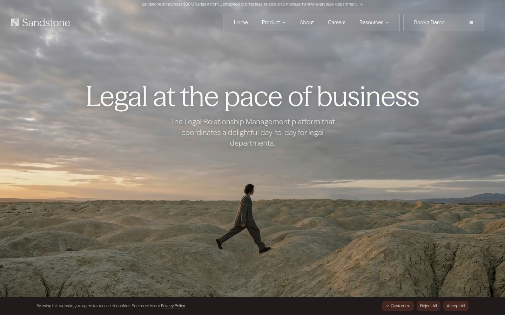

**观察：**

- ✅ 产品功能定位清晰**：页面通过导航和分块内容明确揭示了 5 大能力模块——文档/知识库管理（CLM+）、智能 Intake & Triage、Agentic Workflows、Context Map（法律关系图谱）、Reporting & Insights。读者能快速建立"这是给法务部门的法律关系管理平台"的整体认知，核心价值主张"把每份文档连接到背后的关系（公司、人、过往决策与行动）"也表达得具体可感。
- ✅ Reporting 模块的功能产出说清了**：明确列出了输出指标——cycle times（周期时长）、risk exposure（风险敞口）、capacity（产能）、deviation rates（偏离率），并强调"主动聚合 + 主动呈现"，把"法务从成本中心变成战略资产"的用户价值落到了可量化的具体指标上，而非空泛口号。
- P1 核心新品类"Legal Relationship Management"缺少与 CLM 的功能边界说明**：页面把 LRM 当作全新品类强推（"不只是又一个文件柜"），但没有讲清它在功能上具体比传统 CLM/合同管理多做了什么——"关系"如何被建模、Context Map 由哪些数据源自动构建、用户需要手动维护还是系统自动抽取。读完仍难判断"这和我现在用的合同系统到底差在哪"。
- P2 AI Agent 的工作机制与集成方式交代不完整**：Workflows 段落称 agents 能"redline、draft、处理评论"且基于"你的 playbook 和机构知识"而非通用 prompt，但没说明：playbook 如何录入/训练、agent 接入哪些系统、是否需人工审核（human-in-the-loop）。Intake 部分主打"无需人工分流、无门户"，却未解释请求从何处进入、如何自动路由到正确负责人。
- P2 集成清单仅以图标暗示，缺乏明确支持范围**：页面出现 PDF / DOCX / XLSX / MAIL / SLACK / CAL 等标识，并在演示中提到 Slack 频道消息和 NDA 场景，暗示了文件类型与协作工具集成，但没有正式的集成列表（CRM、合同库、邮箱、日历的具体对接方式与深度），用户无法判断它能否嵌入自己现有的工具链。

#### C5: Footer audit

**URL:** https://sandstone.com/

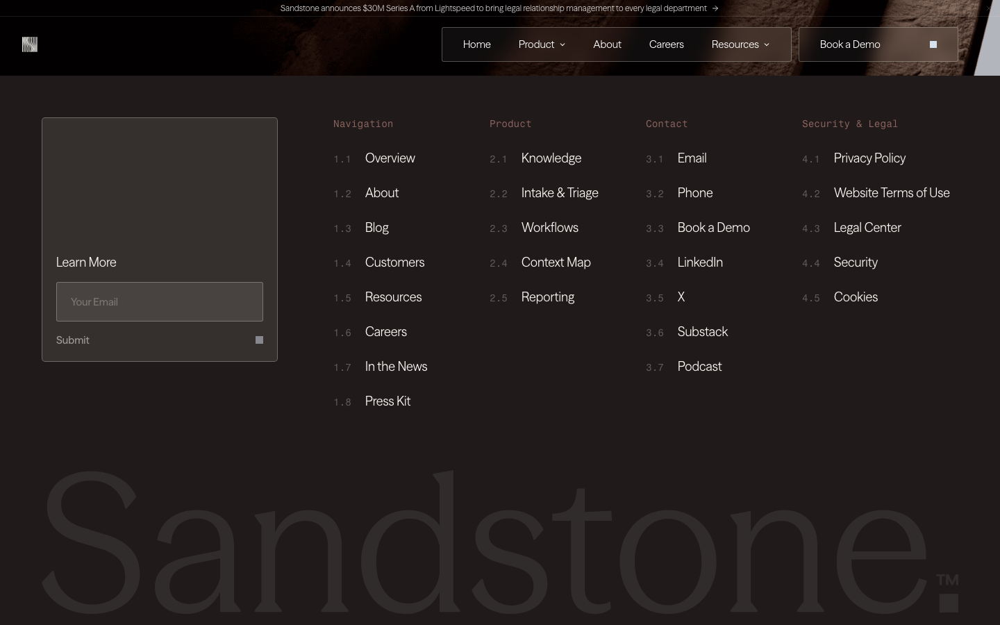

**观察：**

- ✅ **页脚导航完整暴露了产品的功能模块分类法**，等于一张"能力地图"：Product 下分 5 大功能支柱——Repository & Knowledge Management（标注 **CLM+**）、Intake & Triage、Agentic Workflows、Context Map（即 Legal Relationship Management 核心）、Reporting & Insights。用户仅看页脚即可快速判断"这个产品由哪几块能力组成"，且 **CLM+** 标签明确传递了"不止于传统合同生命周期管理"的定位（呼应正文"legal doesn't need another filing cabinet"）。
- ✅ **Agentic Workflows 支柱把"AI 能做什么"讲得很具体**：列出 Redline Surgically、Reply to Comments、Accept & Reject Changes、Draft from Best Practices、Multi-Source Citations 五项可操作能力，并强调 agent 基于"你的 playbook 与上下文、而非通用 prompt"工作且"尊重权限"。这比泛泛的"AI 助手"表述信息量高，能让法务读者理解输出形态（红线/批注/起草）。
- P2 集成信息不完整**：宣称"50+ instant integrations"但页面只点名 8 个（Google Docs/Word/Dropbox/OneDrive/SharePoint/Google Drive/Zendesk/HubSpot），且页脚无指向完整集成目录的入口。更关键的是未说明各集成的**功能用途**——例如 Zendesk(工单)、HubSpot(CRM/营销) 与法务工作流如何打通、触发什么动作，读者无法判断集成是"读取上下文"还是"双向写回"。
- P2 Intake & Triage 与 Reporting 两大支柱在本页只有标题、无任何功能说明**：看不到 Intake 的受理渠道（邮件/表单/Slack?）、分流/路由机制，也看不到 Reporting 度量什么指标（周期、SLA、工作量?）。页脚作为导航虽可接受细节外置，但这两块是法务运营的核心诉求，仅靠标签无法回答"它具体怎么帮我处理进件/出报表"。
- P2 Context Map（LRM 核心概念）的工作机制缺口**：正文展示它把 Customers、Email threads、Vendors、Counsel、Clause library、Contracts、Templates、Playbooks、Approvals、Messages & meetings 等十余类实体"统一成 system of action",但未说明这张关系图谱是**自动构建还是人工维护**、上下文从何处抓取、如何驱动"action"。用户能感知"它想做关系中枢",但难以理解落地机制。

### 🤖 AI 能力 / Agent（2 个测点）

**该模块覆盖页面**:

- `https://sandstone.com/`

#### M1: Agent inventory / team page

**URL:** https://sandstone.com/

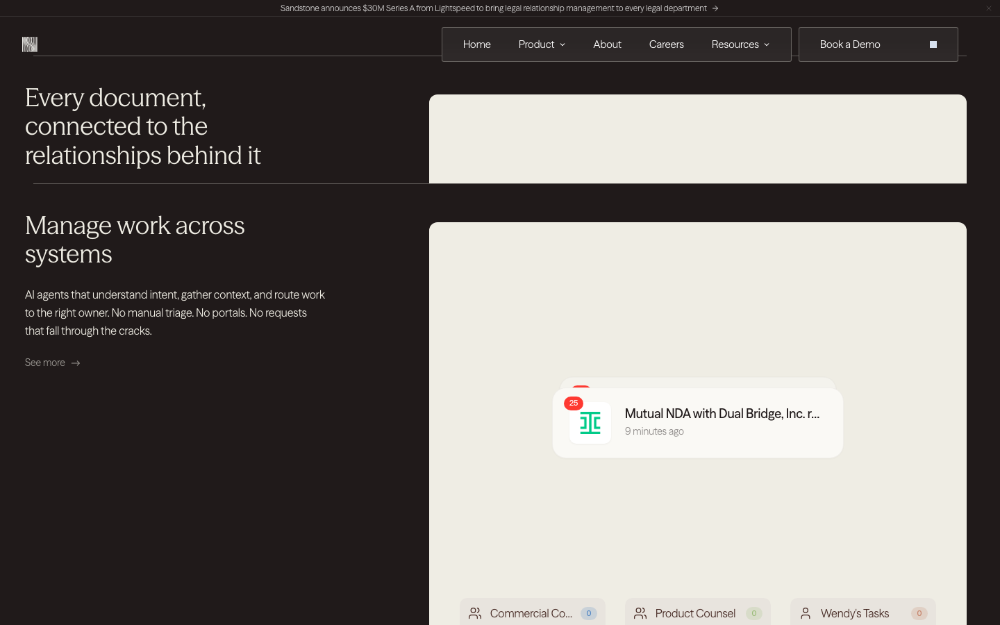

**观察：**

- ✅ 页面清晰勾勒出产品的**端到端法务工作流闭环**:Intake & Triage(请求接入/分流)→ Context Map(关系与上下文聚合)→ Agentic Workflows(redline/起草/处理批注)→ Repository(CLM+ 知识库)→ Reporting(指标聚合)。五大模块构成连贯链路,读者能理解这是"覆盖法务部门日常运转"的平台而非单点工具,定位("Legal Relationship Management"而非"又一个文件柜")表达有力。
- ✅ **解决的核心痛点说得具体**:手动分流、请求在流程中"漏掉"(no requests that fall through the cracks)、处理请求时缺乏上下文。"The full picture, before you ask"配合典型场景(请求到达时自带 counterparty history、过往对话、关系、business signals),让"减少来回追问、加速响应"的价值场景成立。
- P1 AI agent 的接入与触发机制完全缺失**:页面用 #dualbridge-legal 的 Slack 消息、Mutual NDA 卡片暗示请求来自 Slack/邮件,且底部 PDF/DOCX/XLSX/MAIL/SLACK/CAL 图标暗示集成,但**从未说明 agent 如何接入这些系统、请求从哪入口产生、如何"理解 intent 并路由到正确 owner"**。读者无法判断这是 Slack App、邮箱集成还是独立门户,集成是只读还是可写,这是评估可用性的关键功能点。
- P2 "Build Your Knowledge"自主学习的输入/输出/机制不透明**:"autonomously learn how you work, as you work""extracting situational preferences""adjusting positions for companies like this"措辞抽象,**未说明它学习什么数据源、产出什么(模板?立场库?playbook?)、人是否可审阅修正**。同样,Agentic Workflows 声称能 redline/draft/handle comments,但未交代支持的文档格式、是否需人工 review、准确性边界——这类"AI 自动执行"功能恰恰最需要机制说明来建立信任。
- P2 "CLM+"的差异化与 Reporting 的数据来源未交代**:模块标为"Repository & Knowledge Management (CLM+)",但**"+"相对传统 CLM 多了什么没有说明**;Reporting 列出 cycle times / risk exposure / capacity / deviation rates 四类指标,听起来强,但未说明这些指标如何从 request/workflow/playbook 自动算出、是否可自定义。读完此页用户能理解"产品大致能为我做什么",但**难以判断每项能力的深度与落地方式**,功能信息停留在愿景层。

#### M2: Agent profile (sample)

**URL:** https://sandstone.com/

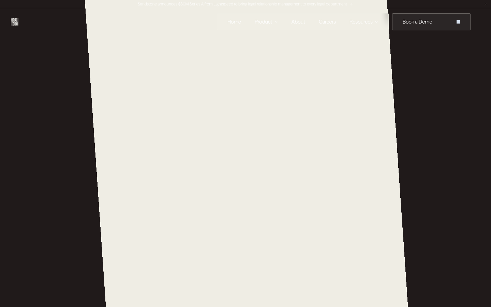

**观察：**

- ✅ 页面清晰列出了 agent 的具体能力清单——精准 redline、回复评论、接受/拒绝修订、基于最佳实践起草、多来源引用——并强调"基于你的 playbook 和上下文，而非通用 prompt"，让用户能直观理解"这个 AI 能在合同上替我做哪些动作"，功能定位有力。
- P1 未说明 agent **如何接入/摄取**用户的 playbook 与机构知识：是手动上传文档、连接知识库、还是从历史合同自动学习？"工作于你的知识"是核心卖点，但输入机制完全缺失，用户无法判断落地成本与可行性。
- P1 未交代 agent 的**运行载体与工作流触发方式**：redline/起草是发生在 Word/Google Docs 插件内、独立编辑器、还是后台批处理？由用户主动调用还是规则自动触发？仅展示了一段赔偿条款的输出结果，但输入→触发→输出的链路没有说明。
- P2 "respecting permissions（尊重权限）"一笔带过，未说明权限模型——谁来配置 agent 可见/可操作的范围、是否区分角色与文档敏感级别。对法务这类强合规场景，权限机制是关键决策因素却未展开。
- P2 "Context Map / system of action"把 Customers、邮件线程、Vendors、Counsel、Clause library、Approvals 等触点罗列出来，但未解释产品**对这些上下文究竟做什么**：是建立关系图谱、自动关联到合同、还是供 agent 检索引用？"统一上下文"停留在概念，缺少功能机制说明。

### ✨ 产品功能 / 介绍（4 个测点）

**该模块覆盖页面**:

- `https://sandstone.com/product/agentic-workflows`
- `https://sandstone.com/product/intake-triage`
- `https://sandstone.com/product/context`
- `https://sandstone.com/product/reporting`

#### M3: Use cases / Workflows

**URL:** https://sandstone.com/product/agentic-workflows

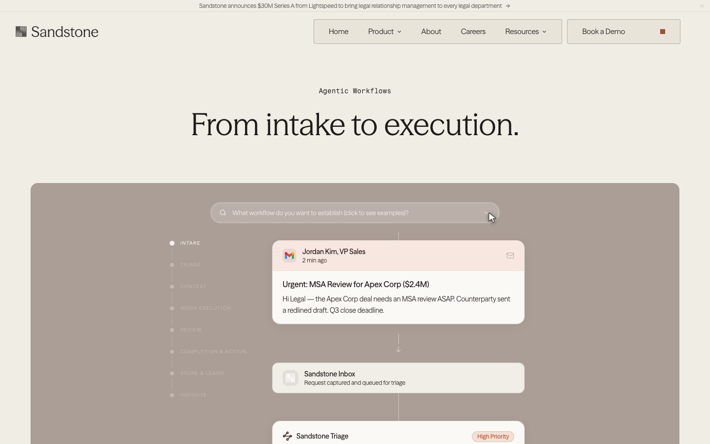

**观察：**

- ✅ **完整端到端工作流演示清晰有力**：页面用一个真实场景（VP Sales 提交 Apex Corp $2.4M 的 MSA 加急审查）把产品的 8 段式 agentic 工作流——INTAKE→TRIAGE→CONTEXT→WORK EXECUTION→REVIEW→COMPLETION→STORE & LEARN→INSIGHTS——逐段走通，每段都有具体动作（捕获请求、按交易额阈值判优先级、跨系统取证、按 playbook 审红线、发签署）。读者能清楚理解"这个产品把法务请求从进件到签署全程自动串起来"这一核心能力。
- ✅ **跨系统取证 + 机构记忆是展示得最扎实的差异化能力**：CONTEXT 阶段明确演示了从 Salesforce（交易记录）、Slack（3 条历史谈判线程）、Ironclad（2024 年旧 MSA）三个系统聚合上下文，并产出一条具体风险洞察——"对方此前在责任上限和赔偿条款上有过反对"。输入（CRM/IM/CLM 数据）→ 输出（风险标记）的链路具体可信，把"调取历史语境辅助审查"的价值讲清楚了。
- P1 "Agentic" 的自动化边界没说清**：产品名为 Agentic Workflows，但 REVIEW 阶段标的是"REVIEWED BY Sarah Chen, Senior Counsel"，由人做 APPROVED/MODIFIED/FLAGGED 决策。页面没说明哪些步骤是 AI agent 自主完成、哪些只是把信息备好交人决策——例如取证、playbook 比对、红线建议到底是 AI 生成还是人工。对一个主打"agentic"的产品，AI 与人的分工是最关键的功能点，却最模糊。
- P1/P2 "STORE & LEARN" 与 "INSIGHTS" 两个阶段只有标签、没有功能内容**：节选里这两段完全没有展开。所谓"学习"是回写优化 playbook、沉淀知识库、还是改进后续 triage？"洞察"产出什么报表/指标？"学习闭环"是 agentic 价值主张的核心，却零解释，是明显的功能信息缺口。
- P2 工作流的可配置性与"谁来设定规则"未交代**：标题"What workflow do you want to establish (click to see examples)?"和多个阶段标签暗示可建立多种工作流，但节选只展示了 MSA 红线审查这一个预置例子。用户无法判断：工作流是模板还是可自定义搭建、triage 的"deal size threshold"和 Enterprise MSA Playbook 由谁配置/能否自改、self-service 适用哪些请求类型；同时集成（Salesforce/Slack/Ironclad/DocuSign/SandSign）只是举例，缺完整清单与接入方式，买家难以评估与自身技术栈的契合度。

#### E1: 探索: Intake & Triage

**URL:** https://sandstone.com/product/intake-triage

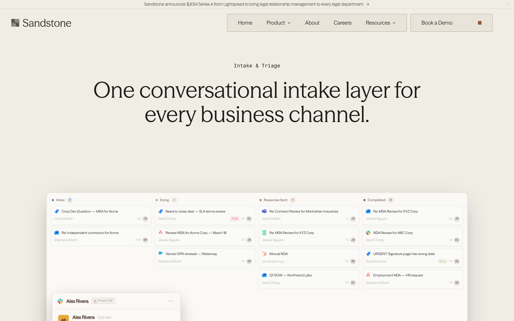

**观察：**

- ✅ 页面清楚揭示了核心工作流：把分散在各渠道的法务请求**聚合成单一会话式收件箱**，并按 Inbox → Doing → Response Sent → Completed 的状态推进。LEGAL-482 示例（"$12K SaaS 合同要不要法务审？" → AI 回复"超过 $10K 须审核，已开工单并通知对口律师"，附 Approve/Edit/Cancel）把**输入→AI 判断→输出动作（建单+指派+回复草稿）+人工把关**这条链路演示得相当具体，读者能立刻理解"产品替我做了什么"。
- P1 缺失：产品的**核心卖点是 AI 自动 triage（"$10K 阈值""通知对口律师"），但完全没说明这套判断规则/路由逻辑从何而来**——是用户预先配置策略库、阈值和负责人映射，还是 AI 从历史自动学习？"谁是 assigned attorney"如何决定？这是决定产品能否落地的关键机制，页面用"AI handles and clarifies"一笔带过。
- P2 集成深度不清：列出 Slack/Teams/Gmail/Jira/Asana/IronClad/SharePoint/ClickUp/Trello/Outlook，并称"可直接从 Sandstone 回复对话/评论/工单"，暗示**双向集成**，但每个集成的能力边界未说明——是仅读取消息、还是能回写状态、是否需装 bot/授权？尤其 IronClad、SharePoint 属于 CLM/文档系统而非"会话渠道"，它们在 intake 场景里扮演什么角色未解释。
- P2 信息缺口：宣称"Nothing falls through the cracks. Nothing requires a nudge."（不遗漏、不用催），界面也有 High 优先级标签和时效（9m/2h/1d），暗示有 **SLA 追踪/自动跟进/升级**能力，但**自动催办、超时升级、优先级判定**的工作机制完全没讲，无法判断这是真功能还是文案。
- P3 待补：DM 里通过 `@Sandstone can you handle this?` 触发，说明可在聊天中被@唤起——但**触发方式的覆盖面（哪些渠道支持@、是否支持邮件转发、表单提交等多种 intake 入口）**未系统说明，用户难以预判自己团队现有的请求渠道能否全部接入。

#### E2: 探索: Context Map

**URL:** https://sandstone.com/product/context

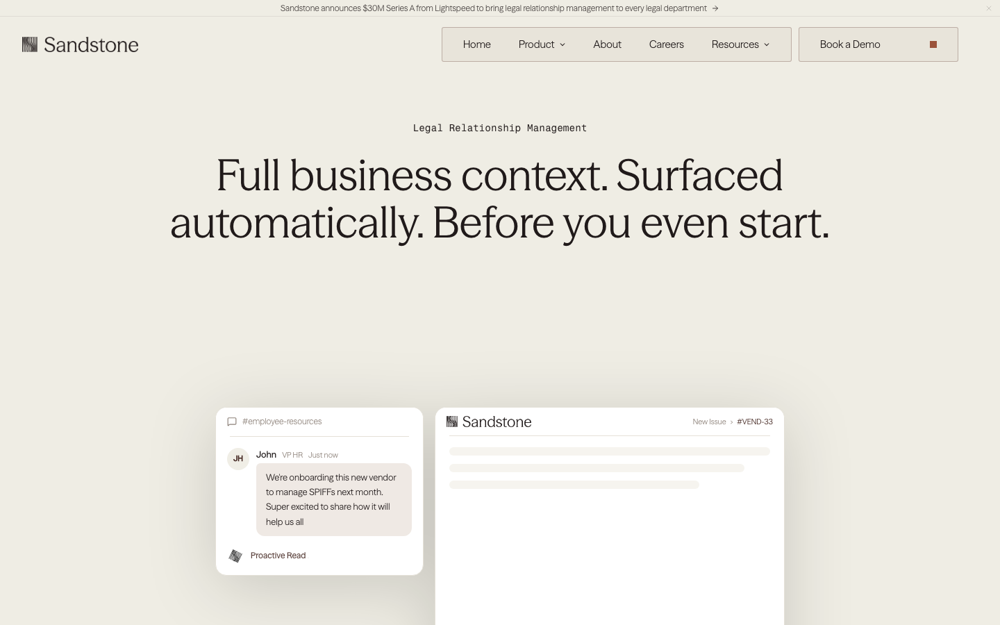

**观察：**

- ✅ **核心能力清晰**：页面明确展示了产品的差异化能力——当一个法务请求（如"上线 SPIFF 供应商"）进来时，自动从 Slack(Company Messaging)、Drive、HRIS、ERP、邮件等多个企业系统**主动聚合**相关上下文（历史合同、财务审批状态、合规触发、干系人谈判记录），并以"5 sources · auto-syncing"标注来源与同步状态。用 COMM-122 / VEND-33 这种带实体卡片（公司 $2.4M ACV、Pilot Agreement、Tina S. 3 次谈判史）的具体案例演示，让人一眼理解"它替我把分散的业务背景拼齐了"。
- ✅ **解决的问题与场景具体**：直击法务"接到请求后要跨系统翻找背景"的痛点。典型场景——新供应商/协议进入评审时，立即看到上一版协议条款（标准 DPA、12 个月、自动续约）、Finance 是否在审批权限内、是否触发 Data Processing Addendum（340 人 PII，按 policy v4.1）。"Before you even start"传达出**前置/主动式**而非检索式的工作机制。
- ✅ **风险面监控是第二条功能线**：RISK SURFACE 展示了持续风险探测（责任上限敞口 3 份合同、15 天后自动续约、Section 7.2 偏离 playbook、EU 数据留存 42 天到期），并提到"sentence-level risk · cited deviations"，暗示是**逐句条款分析 + 引用定位**的合同审查能力，不止是仪表盘聚合。
- P1 未说明上下文的"关联/相关性"如何生成**：全程强调"automatically surfaces everything relevant"，但完全没解释**靠什么判定相关**——是 AI 实体识别、关键词匹配，还是人工挂接？也没说明各源系统（Slack/Drive/HRIS/ERP/邮件）如何接入、如何把一封邮件/一份合同绑定到某个请求实体。这是最影响"能不能信任它"的功能黑盒。
- P2 集成清单与权限模型不完整**：演示里只出现 5 类系统，但没有完整的支持系统列表（具体哪些 CLM/CRM/ticketing），也没说明部署/配置成本。同时"1 access-restricted · Request access"暗示它**继承源系统权限**，但请求访问的流程、是否会泄露受限内容的元数据、风险检测（playbook、policy 版本）从何配置，均未交代。读完能理解"产品能为我做什么"，但难以判断"接入我的环境要付出什么、风险检测规则谁来定"。

#### E3: 探索: Reporting

**URL:** https://sandstone.com/product/reporting

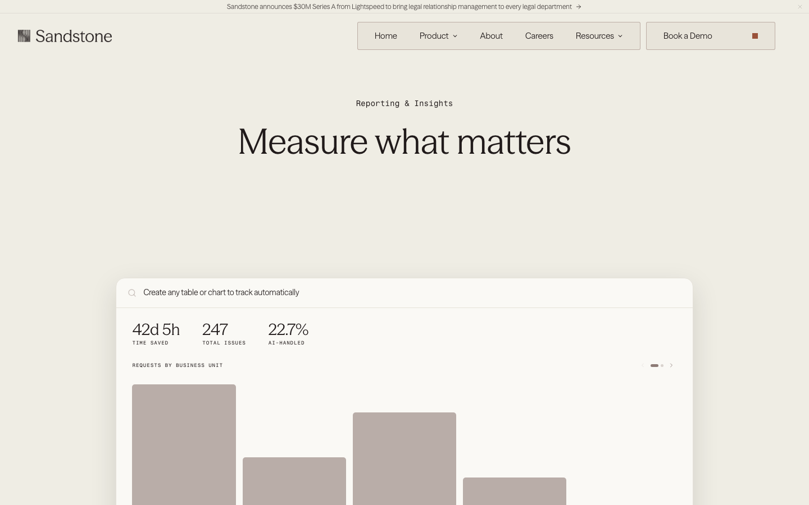

**观察：**

- ✅ 功能能力一目了然：本页揭示 Reporting 模块覆盖三类能力——自定义报表（任意 table/chart 自动追踪）、外部对标（Benchmark 六维：Speed/Success Rate/Coverage/Risk Mitigation/Compliance/Efficiency）、工作量与产能预测（Workload Analysis），并用"自然语言 prompt 生成报表、无需 BI 团队"点明差异化。典型场景清晰：法务负责人想看"按业务部门的合同续约分布"，一句话即可出图，把法务运营分析门槛降到非技术用户可用。
- P1** 数据来源 / 集成是最大缺口：核心叙事是"多数法务数据散落在互不相通的系统、从不流向需要的人，Sandstone 改变这点"，把 agreement / matter / workflow 变成可用数据——但通篇未说它如何接入这些系统（CLM、合同库、工单、邮件、CRM、ticketing？），是原生采集还是连接器同步。报表、对标、产能预测全部依赖这个数据底座，"数据从哪来、怎么进来"这一关键环节缺失，直接动摇整页功能的可信度。
- P2** Benchmark 口径与基准来源不明：宣称可对标"全球运转最高效的法务部门"，却没说基准数据来自何处（跨客户匿名聚合？行业调研？），样本量、可比口径、六个维度各自如何量化均未交代。对标功能若无可信数据来源说明，易被读成营销话术而非可落地的能力。
- P2** 工作量预测的工作机制只有结论没有依据："在工作到来之前预估工作量、基于今明两天理解团队产能"是强卖点，且区分了 Team vs AI 的分担（Commercial 42% / Employment 28% / Compliance 18% / Litigation 12%，各列 AI 承担比例，呼应顶部 22.7% AI-Handled）。但未说明预测依据（基于 intake 管道？历史 matter 速率？）、"22% capacity"如何计算、AI 自动承担的究竟是哪类任务，使该能力停留在演示截图层面。
- P2** "Prompt 生成报表"的输入输出边界未界定：输入自然语言、输出 table/chart 的意图清楚，但未说明可查询的数据维度范围（能 cut 哪些字段：matter / 合同 / cycle time / 风险敞口？），也没说生成后能否编辑、保存、定时刷新、导出或共享给业务方——而"surfaced in the format the business actually uses"正是其卖点，落地细节缺失会让用户难以判断它替代现有 BI 的程度。

### ⭐ 客户案例（2 个测点）

**该模块覆盖页面**:

- `https://sandstone.com/customers`
- `https://sandstone.com/`

#### S4: Customer / logo wall

**URL:** https://sandstone.com/customers

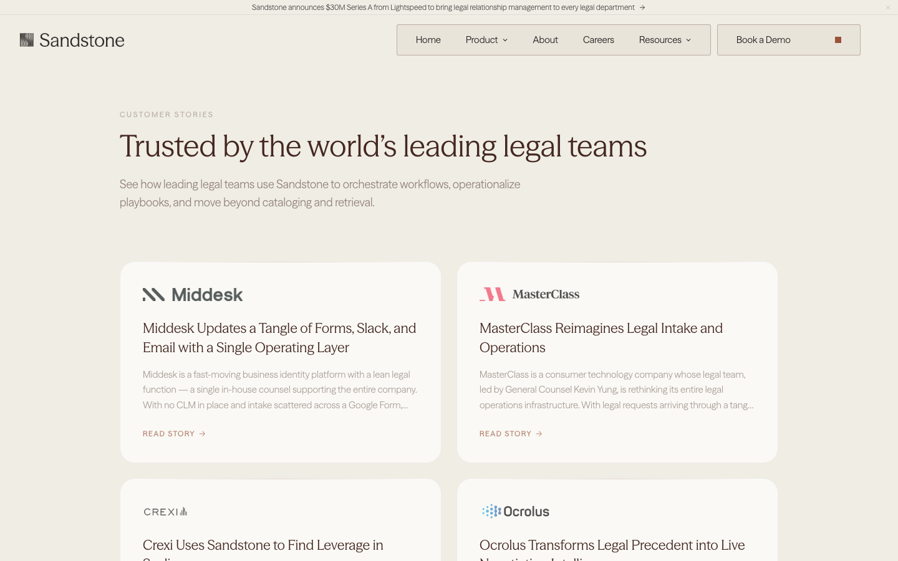

**观察：**

- ✅ 页面通过两个客户故事把产品的**功能边界**讲清楚了：Sandstone 是一个"legal operating layer / 法务操作层"，核心能力是把**合同审查（contract review）、需求受理（intake）、政策问答（policy Q&A）**收拢到单一工作流；配合顶部导航暴露的五大模块（CLM+ 仓储与知识管理、Intake & Triage 受理与分流、Agentic Workflows 智能体工作流、Context Map 法务关系图谱、Reporting & Insights），读者能拼出一张较完整的产品能力地图。
- ✅ **目标问题与场景非常具体**：Middesk（单人 in-house counsel、无 CLM、intake 散落在 Google Form / Slack / email）、MasterClass（多个 NDA 渠道、并行审批、未追踪的 Slack 线程、邮件营销审查）——用"碎片化受理渠道 + 用 ChatGPT 改红线导致幻觉"这类真实痛点，清楚回答了"这个产品替我解决什么"。隐含目标客户画像也清晰：精简型科技公司 in-house 法务团队。
- P2 **核心功能的"工作机制"基本没说明**：页面反复用"orchestrate workflows / operationalize playbooks / move beyond cataloging and retrieval"这类抽象动词，但没有解释 agentic workflow 具体怎么跑、playbook 如何配置与执行、AI 改红线相比 ChatGPT 为何不幻觉（是否接合同库/检索增强）。读者知道"能做什么"，但不知道"怎么做到的"。
- P2 **集成清单缺失**：故事里频繁提到 Slack、email、Google Form、Word/ChatGPT，但没说明哪些是 Sandstone 的**原生集成**、哪些只是被替代的旧工具。对评估"能否接入我现有栈"的买家来说，关键信息空缺。
- P2 **缺少量化成果，且时态偏"进行中"**：两段都用"is consolidating / is working to eliminate"等未完成时态描述，没有任何节省工时、周转时间、处理量等指标，也无可点击的完整案例数据（仅 READ STORY 链接）。功能价值的"证据强度"偏弱，难以判断产出效果。

#### S14: Customer support channels

**URL:** https://sandstone.com/

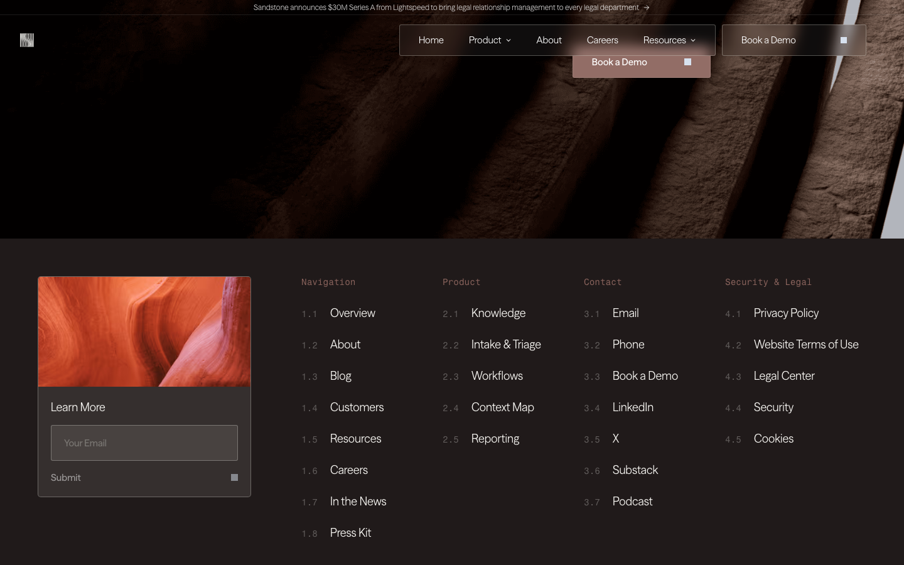

**观察：**

- P1** 整页未暴露任何面向已购用户的**客户支持渠道**——没有帮助中心/知识库、在线客服、支持邮箱、社区论坛或工单入口。唯一反复出现的联系方式是 "Book a Demo",属于售前销售触点而非售后支持,用户无法判断"用出问题后找谁、走哪个渠道"。
- P2** "Resources" 下只有 Blog(行业洞察)、Customers(客户故事)、Security(信任合规)、Guides & Ebooks(策略框架)四类,全是市场/教育内容,既无产品操作文档,也无 FAQ 或 onboarding 指南——读者拿不到"如何使用产品"层面的自助支持入口。
- P2** 集成清单里出现 Zendesk(客服工单系统)与 HubSpot(CRM),暗示产品能接入客户支持/沟通数据,但页面完全没说这种集成"能为法务做什么"(例如把客服工单里的合同/法律问题自动路由给法务?),输入/输出与工作机制全部留白。
- P3(关联功能)** 产品的 "Intake & Triage"(法务请求受理与分流)实质上就是法务版的"支持渠道",但页面没说明业务方通过什么入口提交请求(Slack / 邮件 / 表单 / Teams?),也没说明分流后的响应或 SLA 机制,使这一最接近"支持渠道"的能力无法评估。
- P2** 页面未提供任何**实施支持、客户成功、技术支持响应时效或服务等级(SLA)**信息。对面向法务部门、强调"层叠在现有系统之上 + 50+ 集成"的 B2B 平台,买方通常高度关心"上线后由谁支持、响应多快、集成出故障找谁",这一关键决策信息缺失。

### 🔌 集成 / API（2 个测点）

**该模块覆盖页面**:

- `https://sandstone.com/`

#### S3: Integrations page

**URL:** https://sandstone.com/

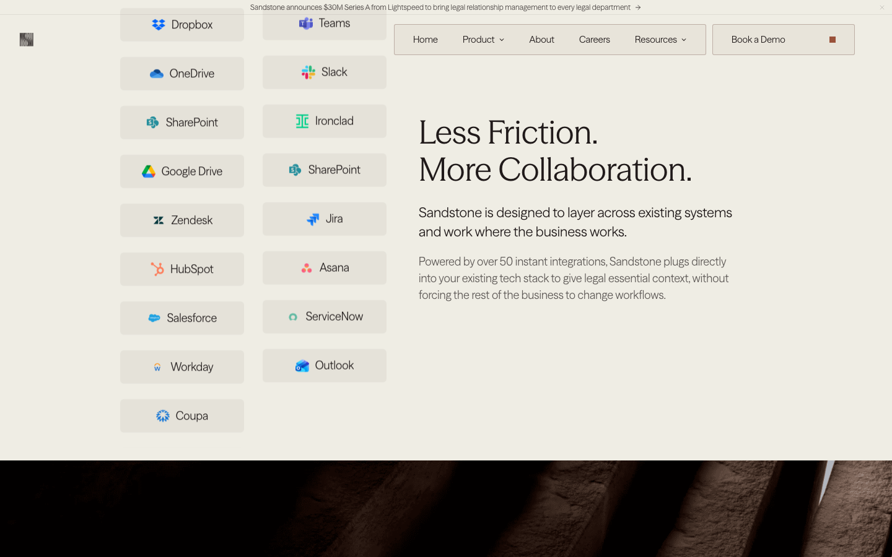

**观察：**

- ✅ **集成核心价值主张清晰**：页面明确传达"layer across existing systems / 50+ instant integrations / 插入现有技术栈而不强迫业务改变工作流"——这精准解决了法务工具的典型痛点（法务软件往往要求全公司迁移到新系统）。从展示的 8 个 logo 能推断出覆盖的系统类别：文档（Google Docs / Word）、存储（Dropbox / OneDrive / SharePoint / Google Drive）、客服（Zendesk）、CRM（HubSpot），说明产品定位是"嵌入业务系统、为法务抽取上下文"，而非独立的资料库。
- P2 「50+ 集成」只展示 8 个 logo，无完整目录或可检索清单**：用户无法验证宣称的集成广度，也无法确认自己正在用的具体工具（如 Slack、Salesforce、Notion、DocuSign、Ironclad 等常见法务/协作系统）是否被支持。对一个以"集成"为卖点的页面，缺少集成目录/筛选/详情页是关键功能信息缺口。
- P1 未说明集成与 AI agent 的连接机制（输入→动作链路不明）**：页面同时展示了 agent 能力（Redline / Reply to Comments / Accept & Reject Changes / Draft from Best Practices / Multi-Source Citations）和集成清单，但没有解释二者如何打通——agent 是直接在 Google Docs / Word 里就地修订（in-context redline），还是只读取数据后在 Sandstone 内操作？HubSpot / Zendesk 的数据以何种形式喂给 agent？这是用户判断"产品能否在我的工具里替我干活"的决定性信息，却完全缺失。
- P2 "上下文来源"清单与"集成"清单脱节**：页面列出 10+ 项上下文来源（Email threads、Vendors、Counsel、Clause library、Contracts、Templates、Playbooks、Approvals、Messages & meetings 等），但这些是概念性条目，未映射到具体集成——例如 "Messages & meetings" 对应哪个集成？"Approvals / Vendors" 从何系统同步？用户无法判断这些上下文是靠集成自动汇聚，还是需手动录入。
- P3 集成的工作机制细节缺失**："instant integrations"的"instant"含义未定义（OAuth 一键授权？预置连接器？无代码？），也未说明同步方向（单向读取 vs 双向写回）、实时/批量、各集成拉取哪些数据、以及"respecting permissions"具体如何与源系统权限对齐。这些细节决定了 IT/安全评估能否通过，目前需读者自行假设。

#### S9: API / Developer docs

**URL:** https://sandstone.com/

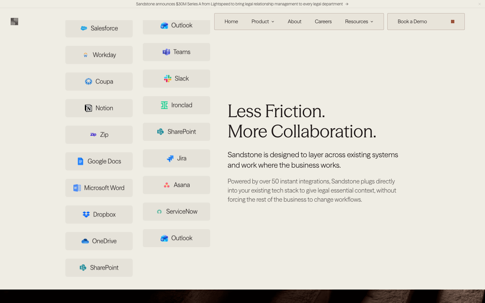

**观察：**

- P1 测点定位与内容严重不符**：该节点标记为 "API / Developer docs"，但抓取到的页面是产品营销首页，**完全没有任何面向开发者的内容**——无 API 端点、无认证方式（API key/OAuth）、无 SDK、无 Webhook、无速率限制、无 API 参考文档。对于想评估"能否程序化对接 Sandstone"的技术买家/开发者，这一页给不出任何答案，等同于开发者文档缺失。
- P1 "50+ 即时集成"是核心卖点却无任何接入机制说明**：页面强调"Powered by over 50 instant integrations，plugs directly into your existing tech stack"，并列出 Google Docs / Word / SharePoint / OneDrive / Dropbox / Google Drive / Zendesk / HubSpot 等，但**未说明集成是单向读取还是双向同步、是否实时、是否需要管理员授权、剩余 40 多个集成是哪些**。更关键的是：50+ 是官方预置集成，还是说存在一个开放 API/平台允许自建集成？这正是开发者文档本该回答的，却完全空白。
- ✅ Agentic Workflows 的能力边界描述较具体**：明确点出 AI agent 能做的动作——精准红线修订（Redline, Surgically）、回复批注（Reply to Comments）、接受/拒绝修订（Accept & Reject Changes）、基于最佳实践起草（Draft from Best Practices）、多来源引用（Multi-Source Citations），并强调"work from your playbooks and context, not generic prompts"且"respecting permissions"。读者能大致理解这是一个嵌入合同审阅流程、基于企业自有知识库工作的法务 AI 助手。
- P2 AI agent 的工作机制（输入/输出/接入）未说明**：虽然说 agent 基于"your playbooks and context"工作，但**没有解释 playbook 如何录入、agent 如何读取institutional knowledge、"respecting permissions"的权限模型怎么定义、红线/起草的产出落到哪（Word？Google Docs？平台内？）**。从合同条款示例（Indemnity 8.1/8.2）可看出处理对象是合同文本，但输入输出链路和触发方式仍是黑盒。
- P2 五大模块只有名称、缺少功能颗粒度**：页面罗列了 Repository & Knowledge Management (CLM+)、Intake & Triage、Workflows、Context Map、Reporting 五大能力，但除 Workflows 外其余几乎只有标题。**"Context Map"如何把 Customers/Vendors/Counsel/Contracts/Templates/Approvals 等统一成"system of action"、Intake & Triage 接收什么类型的请求、Reporting 报什么指标**都未展开——读者能感知产品覆盖面，但说不清每个模块具体替我做什么。

### 🔒 安全 / 信任（1 个测点）

**该模块覆盖页面**:

- `https://sandstone.com/security`

#### S12: Trust / Security page

**URL:** https://sandstone.com/security

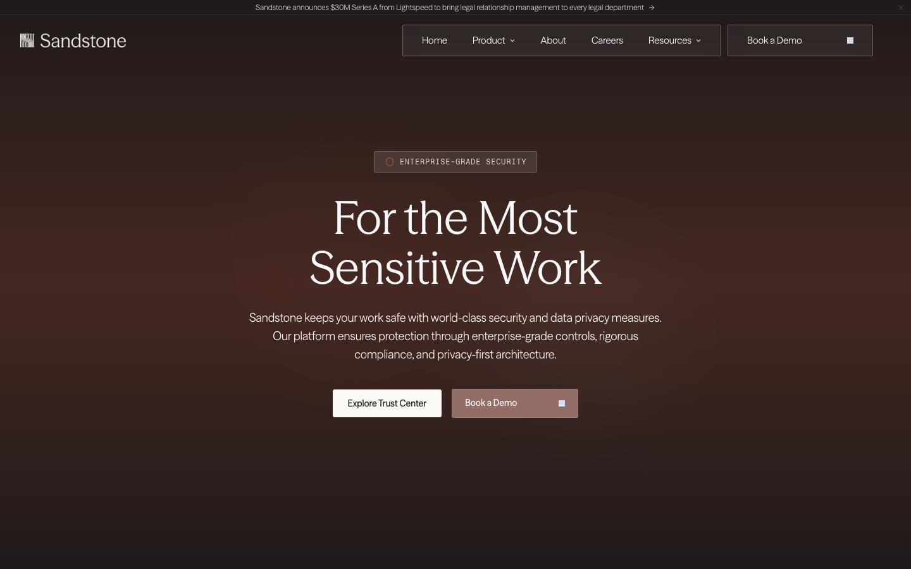

**观察：**

- ✅ 暴露了一组真实的企业级产品能力（而非纯安全话术）**："SAML SSO、comprehensive audit logs、role-based access control、full user lifecycle management" 这几项实际上是产品的管理/治理功能，能让企业买家判断该产品可接入其 IdP / 权限体系 / 用户生命周期管理流程——对法务部门 IT 评估有直接价值。
- ✅ "No Model Training on Your Data" 反向印证了产品的 AI/agent 属性**：结合导航里的 "Agentic Workflows"，这条契约性承诺说明产品核心是基于 AI/大模型处理法务数据的，并明确"数据不进训练"。对一个处理敏感法律事务的 AI 产品，这是关键且清晰的功能边界说明，回应了法务部门最核心的顾虑。
- P1 SOC 2 只说"aligned"而非"certified"，对合规敏感买家是误导性表述**：页面用 "binding security addendum aligned with SOC 2 standards"，全程未声称已获 SOC 2 Type II 报告或任何正式认证（无 ISO 27001 / GDPR / HIPAA）。面向"every legal department"这类极度看重合规凭证的客户，"对齐标准"与"通过认证"是实质性差异，可能让买家误判其合规成熟度。
- P2 数据驻留仅限美国，与"服务每个法务部门"的定位存在功能性矛盾**："All data is hosted securely in the United States" 意味着对欧盟 / 受数据驻留法规约束的国际客户缺少落地方案，页面未提供 EU 托管或数据驻留选项——这是面向跨国法务团队的明确功能缺口。
- P2 关键功能细节停留在标题级，输入/输出/集成机制未说清**："customizable retention policies" 未说明可定制到何种粒度；audit logs 未说明记录范围、是否可导出 / 对接 SIEM；未提及静态/传输加密的具体方案。实质参数被推给 "Explore Trust Center" 链接，仅看本页无法评估这些治理功能能否满足自身合规审计流程。

### 🏢 公司 / 团队（1 个测点）

**该模块覆盖页面**:

- `https://sandstone.com/about`

#### S7: About / Company

**URL:** https://sandstone.com/about

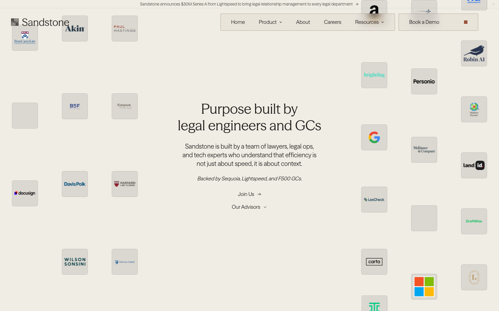

**观察：**

- About 页通过导航揭示了产品的 5 大功能模块：CLM+ 合同/知识库（Repository & Knowledge Management）、意图分流（Intake & Triage）、Agentic Workflows、法律关系管理（Context Map）、报告与洞察（Reporting）——这是判断产品能力边界的有效线索。✅ 功能矩阵成形，但模块仅以名称出现，本页无任何功能解释。
- 产品核心定位是 "Legal Relationship Management"，差异化能力命名为 "Context Map"，相对传统 CLM 的卖点是从"管合同"升级到"管法律关系/上下文"。**P1**：这一核心差异化功能全程只有名词，页面从未说明 Context Map 映射什么、吃哪些数据、产出什么——用户无法判断它和现有 CLM 的实质区别。
- "Agentic Workflows" 暗示产品内置 AI agent 自动化法务工作流，但没有任何关于 agent 执行什么任务、如何触发、接入哪些系统（邮件 / 合同 / 工单 / Slack）的说明。**P2**：AI 自动化是当前最强卖点，却在能体现产品力的页面上完全留白。
- 理念句 "efficiency is not just about speed, it is about context" 传达了"上下文驱动"的功能哲学，暗示产品价值在于把分散的法律上下文（合同、关系、历史）集中关联。定位方向清晰，但停留在抽象层，未落到任何具体输入 / 输出或使用场景。
- 功能信息缺口：读完本页用户能理解"谁在做、谁在背书"（团队为 lawyers + legal ops + tech，投资方 Sequoia / Lightspeed，GC/CISO 顾问团），信任感建立得很到位；但仍回答不了"这个产品具体能为我的法务部做什么"——缺典型场景、输入输出、集成清单、与传统 CLM 的功能对比。**P2**：About 页以信任为主可接受，但至少应给一句话功能概述或锚向 Product 页的功能入口。

### 👥 招聘（1 个测点）

**该模块覆盖页面**:

- `https://sandstone.com/careers`

#### E4: 探索: Careers

**URL:** https://sandstone.com/careers

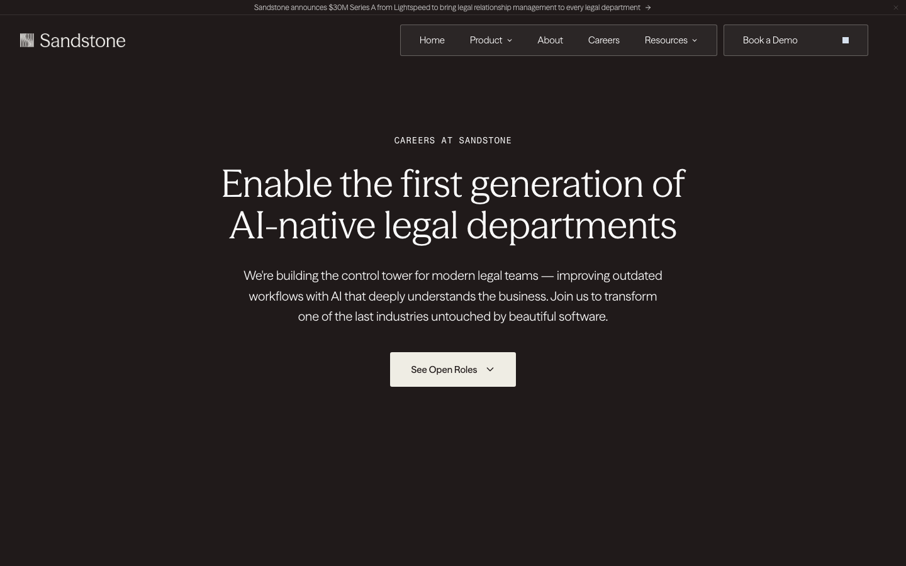

**观察：**

- ✅ 页面顶部导航虽是 Careers 页，却完整暴露了产品的**功能模块架构**：Repository & Knowledge Management（CLM+ 合同库与知识管理）、Intake & Triage（法务需求受理与分流）、Agentic Workflows（智能体工作流）、Context Map（法律关系管理）、Reporting（报表洞察）。读者能据此拼出产品全景——一个面向企业内部法务团队的"control tower（控制塔）"，覆盖从需求进入→合同/知识沉淀→自动化处理→关系映射→数据回报的闭环。
- ✅ "Our Story" 段落把**目标用户的具体痛点**讲得很实：信息分散、反复回答相同问题、反复起草相同条款、关注流程而非进展；创始人引述更点名了 Slack 催办、采购工单、redline 评审、以及"藏在某人脑子里或过期文档中的机构知识"。这些是清晰的功能性使用场景描述，能让 in-house counsel 一眼对号入座。
- P1** 该页对最具差异化的两项能力——"Agentic Workflows"与"AI that deeply understands the business / Context Map"——**只给名称不给机制**：AI agent 接什么输入（合同？工单？邮件？）、产出什么（草拟条款？路由决策？答案？）、如何"理解业务上下文"、Context Map 到底映射的是人/合同/义务的哪种关系，全部缺失。读者无法判断这是真自动化还是仅检索增强。
- P1** 页面 banner 提出全新品类定位"**legal relationship management**（法律关系管理）",但全篇未对该术语做**功能性定义**——它与传统 CLM、法务工单系统、知识库的边界差异是什么没有说明。新造品类若不在功能层解释清楚，用户难以理解"它到底比现有工具多做了什么"。
- P2** 缺**集成清单与数据来源说明**：故事里提到 Slack、采购工单、redline 等外部触点，强烈暗示产品需要与这些系统打通，但页面未列出任何具体集成（Slack/合同存储/采购/邮件/IM 等），也未说明数据如何进入"知识管理"模块。作为功能信息这是关键缺口。

### 📰 博客 / 内容（1 个测点）

**该模块覆盖页面**:

- `https://sandstone.com/blog`

#### E5: 探索: Blog

**URL:** https://sandstone.com/blog

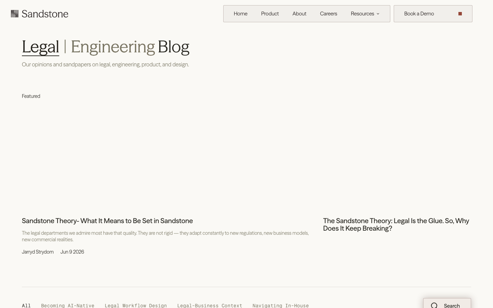

**观察：**

- ✅ 页脚导航首次完整暴露产品能力地图**：Knowledge（知识）/ Intake & Triage（受理与分流）/ Workflows（工作流）/ Context Map（上下文图谱）/ Reporting（报告）五大模块，配合博客分类"Becoming AI-Native""Legal Workflow Design",可推断这是一款面向**企业内部法务团队 / 总法律顾问（GC）**的 AI 法务运营平台——这是本页对"产品能做什么"最有信息量的功能线索。
- P1 关键功能描述完全缺失于正文**：博客页正文（"Sandstone Theory""Legal Is the Glue"）是纯思想领导力/理念内容，全程用"砂岩/砂纸"隐喻谈法务定位，**没有任何一句说明产品实际做什么**。读者读完两篇 featured 文章，仍无法回答"这个产品能为我做什么"——内容与产品能力之间缺少桥接型 CTA 或"对应功能"链接。
- P2 五大模块只有名称、无功能解释**：Intake & Triage、Context Map、Workflows 这类术语在本页（及页脚）仅以标签出现，**输入/输出/工作机制/集成对象一概未说明**。例如"Context Map"是法律风险图谱、合同关系图谱还是组织上下文映射，读者无从判断;"Intake & Triage"受理什么（合同?法律咨询工单?）、如何自动分流也无线索。
- P2 问题域定义清晰但停留在抽象层**：featured 文章把痛点框定为"法务是连接所有重大决策的胶水，却不断断裂"——这准确点出了**跨职能法务协调摩擦**这一目标问题。但页面没有把该问题映射到具体功能（哪个模块解决"断裂"、用什么机制），导致问题描述有力、解决方案落地性弱。
- P3 缺少内容→产品的转化路径**：博客分类（AI-Native / Workflow Design / In-House 导航等）已暗示典型用户与场景，但每篇文章未关联"延伸阅读对应产品功能"或案例链接，错失了从行业洞察自然引导到 Knowledge/Workflows 等具体能力演示的机会。

### 📖 文档 / 帮助（2 个测点）

**该模块覆盖页面**:

- `https://sandstone.com/`
- `https://sandstone.com/product/knowledge-management`

#### C7: Help / Documentation

**URL:** https://sandstone.com/

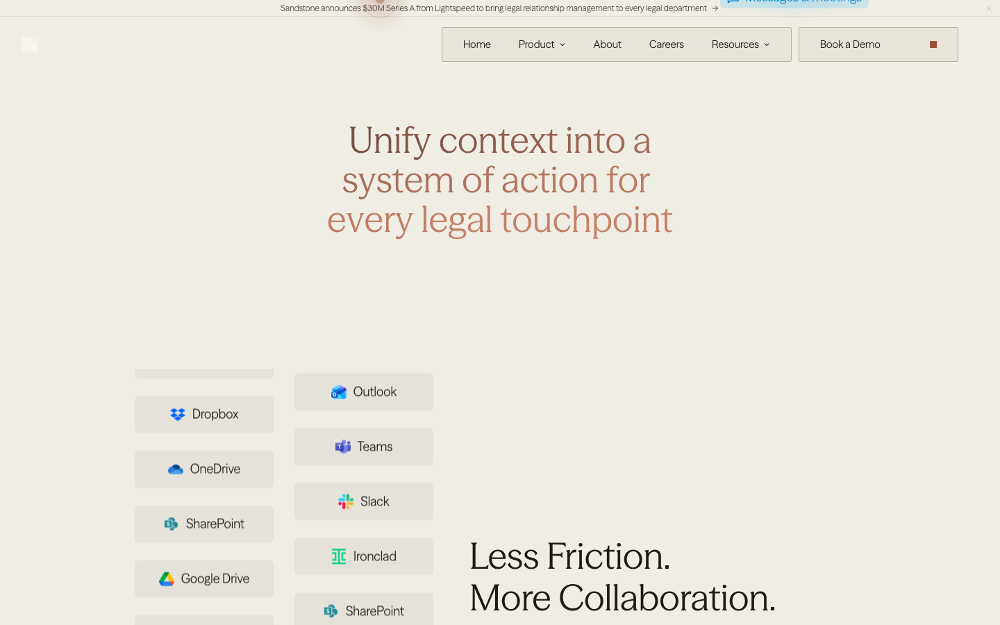

**观察：**

- P1 缺少真正的产品文档/帮助中心**：测点为 Help / Documentation，但页面 Resources 菜单下只有 Blog（行业洞察）、Customers（客户故事）、Security（信任合规）、Guides & Ebooks（战略框架）四类——全是营销/内容资产，**没有任何用户手册、操作指南、知识库、API 文档、onboarding 教程或 FAQ**。用户想知道"功能怎么用、怎么配置 agent、怎么接入系统"时，这一页无法提供答案。
- ✅ 清晰揭示了产品的五大能力支柱**：导航把产品拆成 Repository & Knowledge Management (CLM+)、Intake & Triage、Agentic Workflows、Context Map (Legal Relationship Management)、Reporting & Insights 五块，配上分类标签（如"REPOSITORY & KNOWLEDGE MANAGEMENT""INTAKE & TRIAGE"），读者能快速建立"这个产品由哪些功能模块组成"的心智地图。
- ✅ Agentic 工作流的能力点列举具体**：明确说明 agent 基于"你的 playbook 和企业上下文"而非通用 prompt 工作，并列出 5 个可执行动作——Redline Surgically（精准红线修改）、Reply to Comments（回复批注）、Accept & Reject Changes（接受/拒绝修订）、Draft from Best Practices（按最佳实践起草）、Multi-Source Citations（多源引用），且强调"尊重权限"。对"agent 到底能替我做什么"回答得比较到位。
- P2 集成能力只给了数量没给清单**：宣称"50+ 即时集成"并列出 Google Docs、Word、Dropbox、OneDrive、SharePoint、Google Drive、Zendesk、HubSpot 等约 8 个，但缺少**完整集成目录、集成方式（API/插件/原生）、各集成支持哪些功能**。Intake & Triage、Reporting 等模块分别能对接哪些系统，文档层完全没有说明。
- P2 五大模块的功能细节缺乏可深入的入口**：导航虽列出了 Intake & Triage、Context Map、Reporting 等模块名，但本页只给名称和一句营销标签，**没有说明每个模块的输入/输出、工作机制、典型使用场景**（如 Intake & Triage 如何分流请求、Context Map 如何构建关系图、Reporting 出哪些指标）。读者读完只知道"有这些功能"，无法判断"它具体怎么解决我的问题"。

#### S1: Features / Product page

**URL:** https://sandstone.com/product/knowledge-management

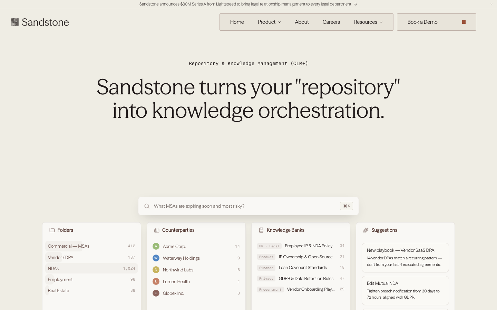

**观察：**

- ✅ 核心功能定位清晰且差异化强**：页面用一句对比把产品能力讲透——"A repository stores documents. Sandstone connects them"。它揭示的核心能力是把合同库从"存储"升级为"知识图谱"：每份文档自动关联到交易对手、deal、相关人员及历史交互（示例 Waterway DPA 挂着 4 Addendums / 2 Same Deal Docs / 5 Slack Threads / 4 Emails / 2 Counterparties / 2 People）。读者能立刻理解"它不是又一个文件夹工具"。
- ✅ 用具体场景演示了 AI 主动建议（Suggestions）工作流**：四个示例把"AI 能为我做什么"讲得非常具体——基于 14 份同模式 DPA 自动起草新 playbook、把 breach notification 从 30 天收紧到 72 小时以对齐 GDPR、根据 6 次 escalation 推断出"$500k 以上走 Finance+GC 审批"、把 38 份含 Art.28 条款的协议归为续约文件夹。带数字、带条款、带触发依据，远胜空泛的"AI 赋能"表述。
- P1 AI 建议的生成机制与可控性完全缺失**：页面只展示"建议结果"，却未说明这些建议是如何产生的（条款解析？模式匹配？是否需要训练/喂数据）、准确性如何保证、用户是接受/拒绝/编辑后才生效还是自动执行。对一个面向法务的产品，"AI 自动改条款 / 自动建审批流"若不讲清人工复核与控制权，会让目标用户对功能边界和风险产生疑虑。
- P1 文档"如何进入系统"这一关键入口未交代**：折叠夹里有精确计数（MSAs 412、NDAs 1024 等），文档还被解析到条款级（DEFINITIONS / DATA RETENTION）、表格还自动抽取了 COUNTERPARTY / GOV. LAW 等元数据——但页面完全没说**输入端**：是靠批量导入、邮件/Slack 自动抓取、还是对接现有 DMS？是否自动分类归夹、OCR、元数据自动抽取的精度如何？这是用户判断"能否落地用"的前置问题。
- P2 集成能力被暗示却没有清单**：界面里出现 Slack Threads、Emails 作为关联实体，强烈暗示与 Slack/邮件集成，但既无集成机制说明，也无完整集成目录（如 Salesforce/CRM、iManage/NetDocuments、e-signature、ERP）。"connects them"是核心卖点，连接的数据源范围直接决定价值上限，却留白。

### ❌ 404 错误处理（1 个测点）

**该模块覆盖页面**:

- `https://sandstone.com/`

#### C8: 404 error handling

**URL:** https://sandstone.com/

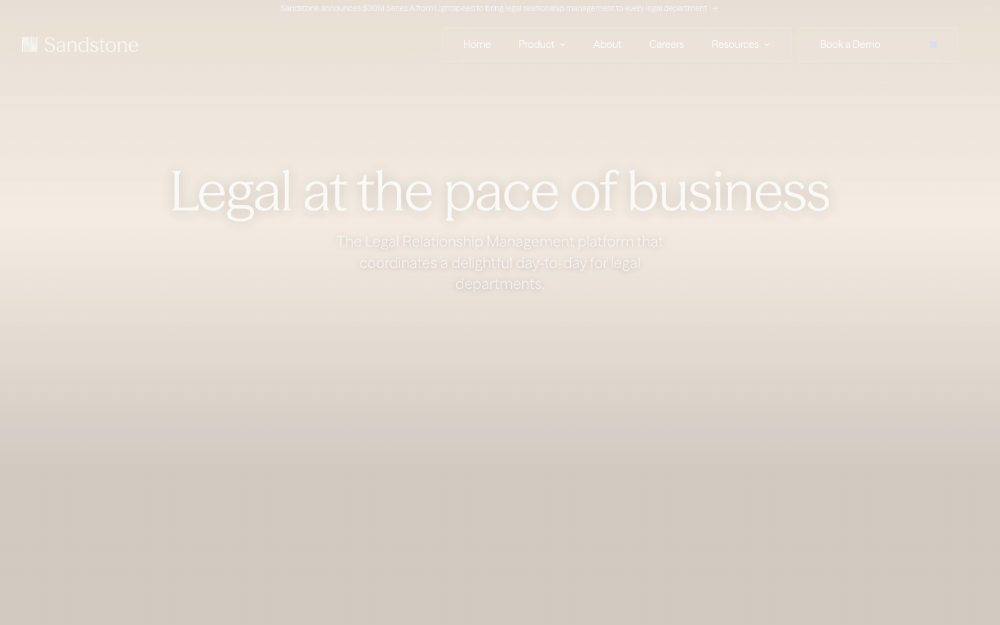

**观察：**

- ✅ **404/异常页仍保留完整产品导航，功能可发现性不受影响**：捕获文本里完整出现了 Product 菜单下的全部能力分类——Repository & Knowledge Management (CLM+)、Intake & Triage、Agentic Workflows、Context Map (Legal Relationship Management)、Reporting & Insights。即便落到错误页，用户也能从导航直接看清"这个产品由哪几块能力组成"并跳转，没有变成功能死胡同。
- ✅ **页面清晰传达了核心工作流与所解决的问题**：产品定位为 Legal Relationship Management 平台，核心能力是"AI agents 理解意图、收集上下文、把工作路由给正确负责人",明确指向法务部门的痛点——免去人工分流(no manual triage)、请求不再漏掉(no requests that fall through the cracks)。Intake & Triage + Agentic Workflows 的典型场景(如收到 NDA 请求自动带出对手方历史并分派)表达得比较具体。
- P2 集成能力只给了图标清单，未说明接入与工作机制**：页面用 PDF / DOCX / XLSX / MAIL / SLACK / CAL 暗示了数据源/集成面,但没有任何关于"如何连接、是只读摄取还是双向同步、Slack 是接收请求还是回写"的说明。读者只能猜测它能吃这些数据,无法判断实际集成深度和配置方式。
- P2 "Build Your Knowledge / 自主学习"机制不透明**:宣称 agent 能"autonomously learn how you work, as you work",并展示"Extracting situational preferences / Adjusting positions for companies like this"等字样,揭示了一个偏好学习/知识沉淀能力,但输入是什么、学习结果存到哪里(是否就是 CLM+ repository)、用户能否审阅或纠正,均未交代,属关键功能细节缺口。
- P2 Reporting 列举了指标但未说明数据来源与可操作性**:点明会"主动"聚合 cycle times、risk exposure、capacity、deviation rates,并按 business unit 拆分。能力描述到位,但这些指标是基于平台内请求自动算出、还是需要人工录入/外部 BI 对接没有说明,用户难以判断"开箱即得"还是"需先把全部法务流程搬上平台"才有数据。

### 📌 其他（5 个测点）

**该模块覆盖页面**:

- `https://sandstone.com/`
- `https://sandstone.com/resources`
- `https://sandstone.com/book-demo`
- `https://sandstone.com/newsroom`

#### M5: Skills / Capabilities

**URL:** https://sandstone.com/

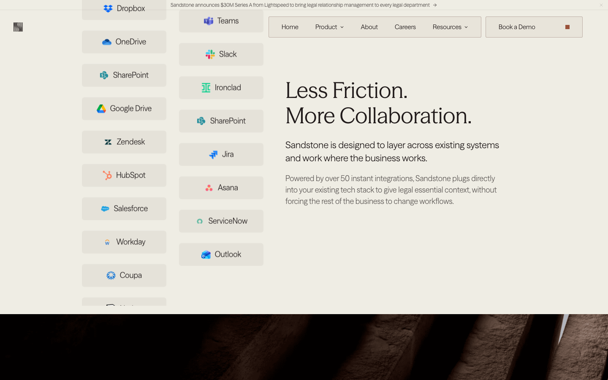

**观察：**

- ✅ 页面把 AI agent 的能力边界讲得相当具体：5 个具名技能——精准红线修订（Redline Surgically）、回复批注（Reply to Comments）、接受/拒绝修订（Accept & Reject Changes）、基于最佳实践起草（Draft from Best Practices）、多源引用（Multi-Source Citations）——将"agent 能做什么"落到了合同审阅的实际动作层，并配了一段 indemnity 条款红线示例佐证。最有信息量的差异化主张是"work from your playbooks and context, not generic prompts… while respecting permissions"：agent 基于客户自有 playbook / 机构知识工作并遵守权限，精准回应了法务对通用 LLM 不可控、不合规的核心顾虑。
- P1** 招牌概念"Legal Relationship Management / Context Map"功能完全未落地。融资新闻、slogan、导航都在主推 LRM，但本页只用"coordinates a delightful day-to-day""unify context into a system of action"这类抽象话术描述，从未说明 Context Map 是什么形态（关系图谱？仪表盘？时间线？）、输入什么、输出什么、用户在里面具体做什么操作。读者面对产品最被强调的能力，反而最读不懂"它到底是什么、能为我做什么"。
- P1** agent 的工作机制与运行位置缺失。示例展示了在文档里做红线，但没说明 agent 是嵌在 MS Word / Google Docs 插件内运行，还是在 Sandstone 自有界面；动作是用户手动触发还是自动执行；最关键的——playbook / 机构知识如何录入与"喂"给 agent（上传文档？配置规则？训练？）也只字未提。"输入 → 处理 → 输出"链路断裂，使用者无法判断实操可行性与接入成本。
- P2** 完整的产品模块全貌只藏在导航里、本页未展开。导航揭示了 5 大能力模块（Repository & Knowledge Management/CLM+、Intake & Triage 受理分流、Agentic Workflows、Context Map、Reporting & Insights），但首页只深入讲了 Agentic Workflows 一块；Intake & Triage（智能受理/分流）与 Reporting（报表洞察）这两项能为法务带来什么，本页几乎零信息。用户读完只会认为它是"合同红线工具"，看不到产品的能力广度。
- ✅ / P3** 集成与嵌入策略交代较实：明确"50+ instant integrations"、强调"layer across existing systems"不强迫业务方改流程，并具名列出 Word / Google Docs / Dropbox / OneDrive / SharePoint / Google Drive 等文档系统及 Zendesk / HubSpot 等业务系统，足以判断它如何插入现有技术栈。P3 不足：仅展示 8 个集成，完整清单未给出；且各集成接入后 agent 究竟能读写什么（如接 HubSpot 后能拿到哪些上下文、能否回写）未作说明。

#### M6: Channel deployment (Telegram/WhatsApp/Slack)

**URL:** https://sandstone.com/

**观察：**

- P1 关键功能缺失：页面完全未提及向 Telegram / WhatsApp / Slack 等聊天渠道部署 agent 的能力。** 文本所列的 50+ 集成全部是文档/存储/CRM 类工具（Google Docs、Word、Dropbox、OneDrive、SharePoint、Google Drive、Zendesk、HubSpot），没有任何一项是即时通讯/聊天渠道。就 M6 这个测点而言，读者无法判断该产品是否支持"把 agent 部署成可在 IM 渠道里对话的机器人"。
- P1 概念混淆风险："Messages & meetings" 只出现在「Unify context into a system of action」的上下文来源列表里。** 这说明产品把消息/会议作为**汇入的上下文数据源**，而非**对外部署的对话触点**。页面没有区分"读取消息作为上下文"与"在某渠道里以 agent 身份回复消息"——对想了解渠道部署的用户来说，这是两种本质不同的能力，极易被误读。
- P2 集成机制说明不足：仅写「Powered by over 50 instant integrations… plugs directly into your existing tech stack」，但未说明集成的形态。** 是浏览器插件 / 文档侧边栏（从 Google Docs、Word 的出现可推测偏向文档内嵌），还是 API、还是聊天 bot？没有给出任何渠道接入方式、配置流程或鉴权/权限机制（仅提到 agent "respecting permissions"，但未展开）。
- P2 适用场景偏向文档协作而非渠道触达。** 页面突出的能力（Redline / Reply to Comments / Accept & Reject Changes / Draft from Best Practices / Multi-Source Citations）全部围绕**合同文档审阅与起草**展开，工作发生在文档系统内（"layer across existing systems and work where the business works"）。这间接暗示该产品的"work where the business works"指的是文档/邮件场景，而非 IM 渠道——但缺乏明确陈述，留下歧义。
- P3 功能信息缺口：用户读完本页无法回答"我能否在 Slack/Teams 里直接向法务 agent 发起 intake 请求或获得回复"。** 鉴于产品定位为"每个法务触点的 system of action"且强调 Intake & Triage，IM 渠道理应是高价值入口之一，但页面既未确认也未否认，建议补充明确的渠道/部署能力清单。

#### E6: 探索: Guides & Ebooks

**URL:** https://sandstone.com/resources

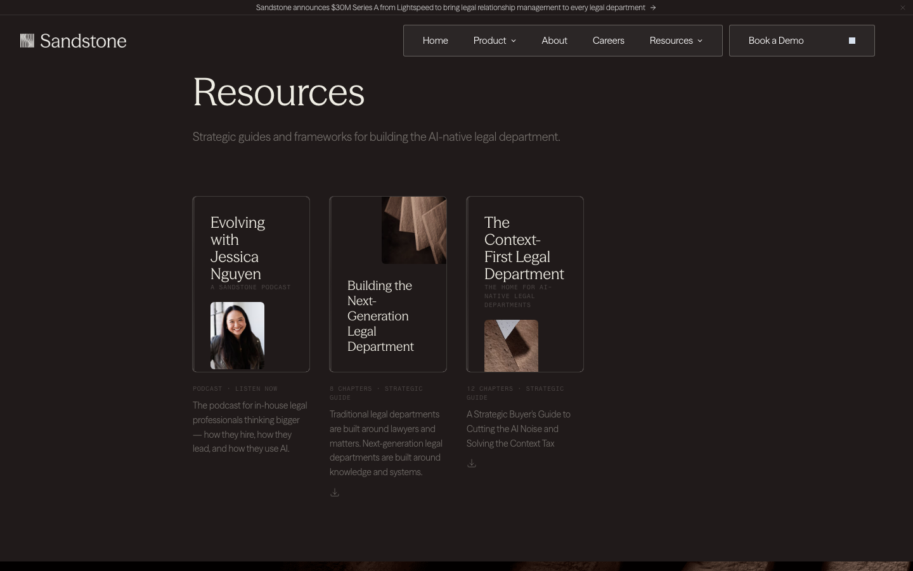

**观察：**

- ✅ 导航区是本页唯一成体系的产品能力信号,揭示了产品的功能骨架:仓库与知识管理 (CLM+)、意图接收与分流 (Intake & Triage)、智能体工作流 (Agentic Workflows)、法律关系管理 (Context Map)、报表与洞察 (Reporting) 五大模块,整体定位为"以知识与系统为中心"而非"以律师与案件为中心"的法务平台。
- P2: 本页本质是"战略指南/电子书 + 播客"的内容营销页(《Building the Next-Generation Legal Department》8 章、知识成熟度模型、播客《Evolving with Jessica Nguyen》),通篇围绕理念框架展开,几乎不落到具体功能;读者无法从中判断哪些是已交付能力、哪些只是行业愿景。
- P1: "Agentic Workflows(智能体工作流)"与"Context Map(法律关系管理)"作为差异化能力被反复点名,但本页未说明其工作机制——智能体接收什么输入、自动完成哪类法律任务、与哪些系统(合同库/邮箱/工单)集成、产出什么结果。读者只见概念,不见功能。
- P2: 多次出现的核心抽象"Legal Knowledge Layer / The Missing Layer(法律知识层 / 缺失的一层)"疑为产品底层能力,却未解释它在产品中具体表现为什么功能(知识如何被采集、结构化、复用、调用),理念与功能之间存在断层。
- P3: "The Context Tax / 碎片化工作的隐性成本"较清晰地点出了目标用户痛点(法务上下文分散、重复劳动)及场景(in-house 法务团队"用更少做更多"),是少数把"解决什么问题"讲明白的部分;但仍停留在问题陈述,未演示产品如何具体解决,功能闭环缺失。

#### E7: 探索: Book a Demo

**URL:** https://sandstone.com/book-demo

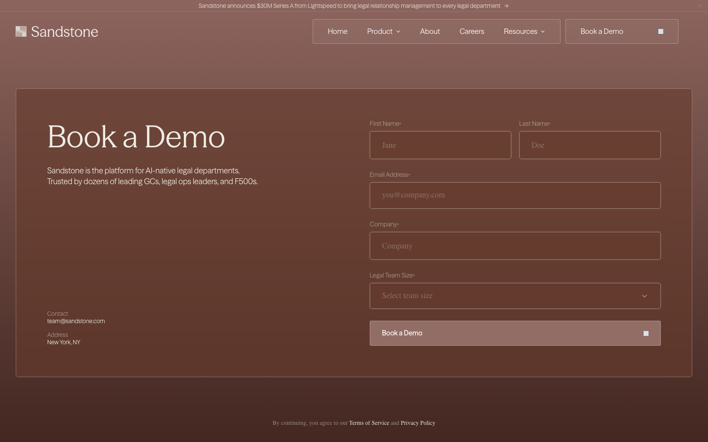

**观察：**

- ✅ 页面顶部导航与页脚的"Product"菜单系统性暴露了产品的五大功能模块：Repository & Knowledge Management（标注为 **CLM+**，暗示是"超越传统合同生命周期管理"的合同/知识库）、Intake & Triage（法务需求的接入与分诊）、Agentic Workflows（智能体工作流）、Context Map（归在"Legal Relationship Management"下）、Reporting & Insights。配合"the platform for AI-native legal departments"这句定位，读者能快速建立"这是一套面向企业法务部门的 AI 一体化套件"的整体认知。
- P1**：作为 Book a Demo 页面，正文本身几乎**零功能描述**——除了模块名称外，没有任何一句说明这些能力具体"做什么"。产品被完全锁在销售 Demo 之后（无自助试用、无产品演示视频、无截图/工作流示例），用户**仅凭本页无法判断"这个产品能为我做什么"**，必须跳转到其它页面才能理解价值。
- P1**：核心差异化概念 **Context Map / Legal Relationship Management（LRM）** 是该公司主打的新品类叙事（融资新闻也强调"bring legal relationship management to every legal department"），但页面对"LRM 是什么、Context Map 映射的是哪些关系/对象、与传统 CLM/CRM 有何不同"完全没有解释。最关键的卖点恰恰最不清晰。
- P2**：表单将 **Legal Team Size** 设为必填且提供分档选择，清楚地传递出"这是 sales-led 的企业级产品、按法务团队规模做分层/分级"的信号；但页面**未说明不同规模团队对应的功能差异、套餐或部署方式**，也无任何价格/版本线索。
- P2**：对一个强调 "Agentic Workflows" 和 "Intake & Triage" 的产品，页面**完全没有集成信息**——智能体如何接入邮件、Slack/Teams、合同库/DMS（如 iManage）、CRM 或工单系统？输入输出是什么？工作机制如何？这些决定实际可用性的关键功能细节在转化页上缺失（安全合规仅在导航 Security 中出现、本页未触及）。

#### E8: 探索: In the News

**URL:** https://sandstone.com/newsroom

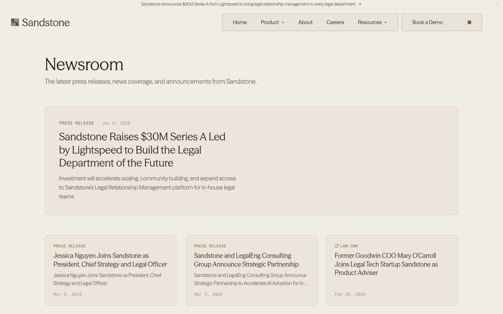

**观察：**

- ✅ **导航区比新闻正文更能揭示产品能力图谱**：页面侧栏清晰列出 5 大功能模块——Repository & Knowledge Management（标注 CLM+，即合同全生命周期管理+知识库）、Intake & Triage（需求受理与分流）、Agentic Workflows（智能体工作流）、Context Map（即其主打的 Legal Relationship Management）、Reporting & Insights（报表洞察）。这套分类传递出明确信号：产品是面向企业内部法务部的"一体化运营平台"，而非单点工具。
- P1 自造品类"Legal Relationship Management (LRM)"全页无功能定义**：页面反复用 LRM、"AI-Native Legal Department"作为核心定位词，但 Newsroom 正文（融资、人事、合作新闻）从不解释 LRM 到底"做什么、和传统 CLM/法务工单系统有何不同"。用户看完无法判断这是一个新功能范式还是营销包装。
- P1 "Agentic Workflows / AI-native"提了能力却没说接入对象与机制**：页面强调用 AI agent 自动化法务流程，但完全没有说明 agent 的输入输出、能执行哪些具体法务动作、是否接入合同库/邮件/CRM/工单系统。这是该产品最关键的差异化卖点，却在本页只有概念、没有工作机制。
- P2 目标用户清晰、典型场景信息不足**：从"in-house legal teams""legal department""bring LRM to every legal department"及与 LegalEng、Mary O'Carroll（法务运营专家、前 Goodwin COO）的合作新闻，可确认服务对象是企业内部法务/法务运营团队（非律所）。但页面只给出"谁用"，没给出"在什么具体场景下解决什么任务"（如合同审查、法务需求受理、知识检索）的示例。
- P3 新闻页作为功能信息源天然受限，应做好向功能页的引导**：本页主体是 Press Release / 媒体报道，承载的是融资（Sequoia 种子轮 $10M → Lightspeed A 轮 $30M）、人事、品类叙事，几乎不含输入/输出/集成清单等功能细节。这本属正常，但意味着用户要理解"产品能为我做什么"必须跳转到导航中的各功能模块页——本页对这些功能页的引导偏弱。

### ⚠️ 未找到的测点（3 个测点）

**该模块覆盖页面**:

- `https://sandstone.com/`

#### C2: Pricing page

**URL:** https://sandstone.com/
**观察：**

- [Link not found] 该模板期望的链接（pricing|定价|價格）在 https://sandstone.com/ 上未找到 — 可能产品用了不同的措辞或这个功能不存在。 已跳过截图与 LLM 解读以避免重复首页快照。

#### C3: Sign-up flow (no submit)

**URL:** https://sandstone.com/
**观察：**

- [Link not found] 该模板期望的链接（sign up|signup|get started|start free|注册|免费试用|开始）在 https://sandstone.com/ 上未找到 — 可能产品用了不同的措辞或这个功能不存在。 已跳过截图与 LLM 解读以避免重复首页快照。

#### C4: Login page

**URL:** https://sandstone.com/
**观察：**

- [Link not found] 该模板期望的链接（log in|login|sign in|登录|登入）在 https://sandstone.com/ 上未找到 — 可能产品用了不同的措辞或这个功能不存在。 已跳过截图与 LLM 解读以避免重复首页快照。

---

## 4. 第三方社区反馈

#### ⚠️ 未找到显著社区讨论

WebSearch 在 Reddit / Product Hunt / Hacker News / G2 等平台未找到 `sandstone.com` 的显著用户讨论。本节内容为空——不代表产品好或差，仅说明社区讨论数据稀缺。

---

## 5. 从访客到注册的转化路径

_本次在公开页面未找到定价页、注册页、预约演示或引导填表等转化相关页面，无法据此推断「从访客到注册」的转化路径。该产品可能将注册 / 定价信息放在登录后或邀请制入口内，未对未注册访客公开。_
